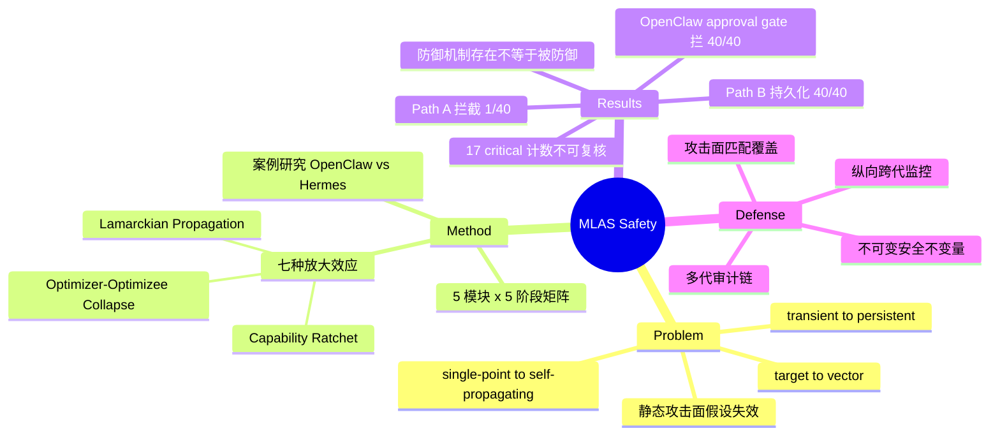

## Summary

提出 Module–Lifecycle Attack Surface (MLAS) 矩阵——把 self-evolving agent 的攻击面分解为 5 功能模块（Brain / Cognitive Resource / Execution / Self-Design / Collective）× 5 生命周期阶段（Bootstrap / Propose / Evaluate / Commit / Serve）共 25 格，逐格给出暴露接口与代表性攻击，并提炼七种跨模块放大效应。核心论断是 self-evolution 把所有已知攻击从 session-bounded 变成 lineage-persistent，并使"安全机制本身也在优化范围内"（optimizer–optimizee collapse）成为新的结构性威胁。用 OpenClaw 与 Hermes 两个开源框架做对比案例研究提供实证锚点：自主演化通道上 40/40 payload 全部持久化，而扫描通道只拦下 1/40。

## Problem & Motivation

传统 LLM agent 安全分析默认攻击面是静态的——prompt injection、backdoor、tool exploit 都在"参数/记忆/工具集在两次部署之间不变"的前提下讨论。一旦 agent 能改自己，这个前提失效。作者把这一转变归纳为三条轴：transient → persistent（一次注入可被写进长期记忆、蒸馏进权重、编码成新工具，攻击者不需要保持访问）；single-point → self-propagating（被污染的记忆可以腐蚀用于微调的选择信号，进而降低检测未来投毒的能力，形成正反馈）；target → vector（agent 同时是攻击目标和攻击传播机制）。

对既有工作的定位：OWASP LLM Top 10 等不含演化维度；Misevolution（Shao et al., ICLR 2026）给出了首个"agent 会自发偏航"的实证，但论文认为它 "focuses on a single evolutionary paradigm (experience-driven context evolution)"、不系统覆盖全部模块与阶段。缺的是一张同时沿"模块架构"和"演化生命周期"两维铺开的完整攻击面图。

## Method

**Scope 定义（三条必要条件同时成立）**：directed optimization（更新受显式或隐式 fitness 信号引导）、cross-session persistence、autonomous control。据此把 RAG/MemGPT（非 directed）、InstructGPT（非 autonomous）排除，把 Self-Rewarding LM、Reflexion/ExpeL、Voyager/CREATOR、Gödel Agent/AFlow、GPTSwarm 纳入。状态形式化为四元组（模型参数、非参数认知资源、工具/技能库、架构配置），演化函数 f 本身可以是状态的一部分（自指）。

**五个功能模块**（按被修改的组件划分，前四个体层、第五群体层）：

| 模块 | 演化对象 | 代表系统 |
|:--|:--|:--|
| Brain | 模型参数（更新需对参数做梯度计算） | Self-Rewarding LM、self-play RL |
| Cognitive Resource | system prompt、长期记忆、few-shot 池、workflow 模板（声明式文本 artifact） | Reflexion、ExpeL |
| Execution | 工具/技能库（可执行代码 artifact，扩展 action space） | Voyager、CREATOR |
| Self-Design | 可执行 workflow graph、模块组合、meta-objective、变异算子本身 | Gödel Agent、AFlow |
| Collective | agent 间关系与群体动力学（知识传播、信任拓扑） | GPTSwarm、EvoAgentX |

模块边界比一般 survey 细：cognitive resource 的 workflow 模板（被动文本配方）与 self-design 的 workflow graph（可执行控制流）显式切开；model evolution 的自指是"评估性自指"，self-design 的自指是"结构性自指"（变异与选择逻辑本身可被变异）——后者是 optimizer–optimizee collapse 的来源。

**五个生命周期阶段**：Bootstrap（信任锚若可变则无固定参照检测漂移）、Propose（对抗影响主要入口）、Evaluate（fitness 可被操纵即间接控制演化轨迹；纯任务性能评估系统性丢弃安全变体，即 safety tax）、Commit（局部妥协变系统性妥协；跨 agent commit 使单点感染扩散）、Serve（危害显现处，且与 Observe 重叠——服务期对抗交互直接喂给下一轮 Propose，闭合攻击环）。

**威胁模型**：攻击者能影响至少一条进入演化环的输入通道，无权直接访问权重或训练基建；五级 access tier（T1 用户界面 / T2 外部数据 / T3 评估信号 / T4 供应链 / T5 peer agent）。关键分析透镜是 **tier compression**——演化把瞬时输入转成持久状态，T1 权限的攻击者只要一次投毒通过选择，就能达到传统上需 T4 供应链渗透才有的持久破坏。

**七种跨模块放大效应**（§9）：Generational Accumulation（微小退化复利成系统性失效）、Selective Amplification（安全没写进 fitness 时优化必然偏好能力）、Deceptive Evolution（"骗过评估器"这一能力本身被优化）、Lamarckian Propagation（获得性经验直接遗传）、Capability Ratchet（危险能力一旦入库永不撤销）、Emergent Unpredictability（组合空间指数增长，预部署穷举验证不可能）、Optimizer–Optimizee Collapse（安全机制落在优化范围内即可被优化掉——放大其余六者的元效应）。

**Case study 设计**（§8）：OpenClaw v2026.6.2（evolution-augmented：持久化前显式 gate + 学到的内容存为非可执行数据 + 扫描一视同仁）vs Hermes v0.15.1（evolution-native：每次交互自动学习无 gate + 存为可执行代码 + 内部 artifact 豁免扫描；Path A hub install 经静态扫描 / Path B Background Review Agent 自主演化默认不过扫描器）。backbone GPT-5，40 场景（CIA+P 各 10）× 2 pathway × 2 framework = 160 runs，每场景 3 次重复。

**提出的缓解方向**：evolution-aware monitoring（纵向跨代监控替代时点评测）、immutable safety invariants（关键安全约束架构性置于优化范围之外）、multi-generational audit trails、attack-surface-matched defense（护住一条通道留着别条等于没护）。

## Key Results

**矩阵严重度分布**：25 格中 17 critical（无有效防御）、7 high（防御不足）、1 可部分缓解；Self-Design 行整行最高档。**注意（verifier 实锤的内部不一致）**：这组数字只在 abstract 与 §1 出现、指向 Figure 1 热力图，正文无逐格评级表与 rubric；且 Figure 1 图例是五档（catastrophic/critical/high/moderate/low）并称 Self-Design 行 "uniformly catastrophic"，与 abstract 三档计数（17+7+1=25）无法自洽。引用本文时只应引矩阵结构，不应引这组计数。

**架构映射与攻击面倍数**：Hermes 额外激活 4 格、OpenClaw 2 格（Table 9 自书 "2× active attack surface"，§10 RQ1 写 "twice as many"）；§8.8 案例覆盖口径则是 Hermes 7 格 vs OpenClaw 2 格（3.5×）。**abstract 取 3.5× 未标口径，与 §10 的 2× 直接冲突**（内部不一致之二）。

**运行时攻击**：Hermes Path B 上 40/40 payload 全部持久化为可执行技能文件（100% attack persistence rate，Tables 10–13 每格 3/3）。Path A 的 LLM 扫描器只拦下 1/40（2.5%）。**abstract 把 2.5% 表述为 "on the evolution pathway"，但正文明确演化通道（Path B）拦截率是 0/40，2.5% 属于被扫描的 Path A**（内部不一致之三）。对照组 OpenClaw 把 40 个 payload 全部排进需用户显式同意的 approval queue（100% block rate，不依赖任何检测启发式）。

**群体层结论**（§7，全部为分析与外部文献转引，无本文实验）：contagion dynamics（单点攻陷经知识共享感染 population；转引 ClawWorm ref [110]：1800 trials 上 64.5% 自主跨 agent 感染成功率）；**Simpson's paradox of safety**（个体各自达标而群体竞争选出不安全集体行为，个体级评测原理上看不到）；founder effect、evolved steganography、Byzantine 共谋等均为推演或转引。

**Generational Accumulation 量化**：每代 1% 安全合规下降 50 代累计约 40%（0.99⁵⁰≈0.605）——原文自称 "arithmetic"，是复利推演而非实测。

## Evidence Ledger

| Claim ID | Claim | Type | Source locator | Evidence excerpt | Status |
|:--|:--|:--|:--|:--|:--|
| C1 | MLAS = 5 模块 × 5 阶段 25 格矩阵 | benchmark-setting | §2.3.3, Table 6 | "five functional modules... × five lifecycle stages" | source-verified |
| C2 | 17 critical / 7 high / 1 partial mitigation | number | Abstract; §1; Figure 1 | "17 are critical (no effective defense exists), 7 are high... only 1 admits partial mitigation" | source-verified |
| C3 | 内部不一致①：abstract 三档计数 vs Figure 1 五档图例；Self-Design 行 critical vs catastrophic | comparison | Abstract vs Figure 1 caption | "The Self-Design row is uniformly catastrophic... five levels" | source-verified |
| C4 | Case study：OpenClaw v2026.6.2 vs Hermes v0.15.1，GPT-5，40×2×2=160 runs，每场景 3 次 | benchmark-setting | §8, Table 8 | "40 scenarios × 2 pathways × 2 frameworks = 160 runs" | source-verified |
| C5 | 内部不一致②：3.5×（abstract，§8.8 的 7 vs 2）与 2×（Table 9 的 4 vs 2、§10 "twice as many"）并存；4 vs 2 是 static baseline 外新增激活格、7 vs 2 是案例覆盖 distinct cells，论文未调和 | number | Abstract vs Table 9 vs §8.8 vs §10 | "7 distinct MLAS cells... versus OpenClaw's 2" / "2× active attack surface" | source-verified |
| C6 | Hermes Path B 100% attack persistence（40/40，全 CIA+P，每格 3/3；全文恰 40 处 "3/3"） | number | §8.2, Obs 8.1, Tables 10-13 | "the evolution pathway (Path B) achieves a 100% attack persistence rate (40/40)" | source-verified |
| C7 | 内部不一致③：2.5%（1/40）属被扫描 Path A；Path B 拦截 0/40；abstract 把 2.5% 错置到 "evolution pathway" | number | Abstract vs §8.2/§8.8 | "Path B bypasses scanning entirely (0/40)... Path A... blocks only 1/40" | source-verified |
| C8 | OpenClaw approval queue 拦截 40/40（100% block rate，无检测启发式） | number | §8.2, Figure 10 | "100% block rate without relying on any detection heuristic" | source-verified |
| C9 | 群体层 contagion；ClawWorm 64.5%/1800 trials 为转引（ref [110]），非本文实验 | causal-mechanism | §7.2, Obs 7.2 | "a single compromised agent can infect the entire population" | source-verified |
| C10 | Simpson's paradox of safety（"analogous to"，概念性论断非实测） | causal-mechanism | §7.3, Obs 7.3 | "Individual agents may satisfy safety requirements while the population collectively evolves toward unsafe behavior" | source-verified |
| C11 | 每代 1% × 50 代 ≈ 40%——复利算术推演非实测 | number | §9.1 | "This arithmetic of compound degradation" | source-verified |
| C12 | 称 Misevolution 仅覆盖 experience-driven context evolution 单一范式 | comparison | §1 | "does not systematically cover all evolutionary modules or lifecycle stages" | source-verified |
| C13 | 全文无 "retrieval-mediated" 一词（grep 0 命中）；§4.3 指认 retrieval ranking scorer 为直接攻击目标、纯性能记忆选择系统性淘汰安全记忆；§4.2 描述污染记忆自增强正反馈；自陈"记忆整合策略的直接攻击仍相对未被探索" | causal-mechanism | §4.2 Obs 4.2; §4.3 Obs 4.3 | "this scorer is the direct target"; "Direct attacks on memory consolidation policies remain relatively underexplored" | source-verified |

## Strengths & Weaknesses

**优点**

把"演化"提升为安全分析的一等维度是对的，而且两维分解真的产出了静态 agent 安全 taxonomy 里不存在的格子——Evaluate 列（fitness 可被操纵即等于间接控制演化方向）与 Commit 列（局部妥协转为 lineage 级持久）在既有工作里几乎没有对应概念。Optimizer–optimizee collapse 是本文最有价值的抽象：它给出一个可操作的判据——安全机制是否落在系统自身的优化范围内——比"self-modifying 系统很危险"这类泛论有用得多，而且直接可用来审查现有 gate 类工作。

案例研究不是装饰。它把矩阵从分类学降格为可被证伪的架构预测（哪些格被激活），并得出反直觉、有直接工程含义的结论：**安全机制存在不等于被防御，因为自主演化通道根本不经过它**——问题在架构覆盖而非检测能力。§9.9 归纳的三条失效假设（static system / immutable trust anchor / session scope）也比罗列攻击更有信息量。

**局限**

最被引用的数字恰好最不可核查。17/7/1 的严重度分级只存在于 Figure 1 色块中，无逐格评级表、无可复算 rubric，且与五档图例矛盾；"3.5×" 是同一比较两个算法中较大的那个且 abstract 未标口径；2.5% 被 abstract 错置到演化通道（演化通道实为 0/40）。三处内部不一致均经独立核验实锤。

因果归因过强是更根本的问题。两个框架不是同一代码基上的变量操纵（不同语言、团队、默认安全姿态）。OpenClaw 拦下 40/40 靠的是 human approval queue 而非 "evolution-augmented" 属性本身——同样的 gate 加到 Hermes 上多半也能得到接近 100% 拦截。实验真正支持的是"人审关口在这批 payload 上有效"，而论文写成"evolution-native 设计更不安全"——两者政策含义完全不同。

攻击成功判定偏宽（payload 持久化 = "能力存在"而非"损害发生"）；单 backbone、每场景 3 次；25 格中绝大多数威胁是推演（证据来自 AgentPoison、MINJA、ClawWorm、Morris II 等外部工作），本文自证只覆盖 20 格；§7 群体层整节无本文实验，行文却常用 "demonstrate"、"validates"——阅读时须把"论文测过的"和"论文引用别人测过的"分开。

**对领域的影响**：作为 checklist 和词汇表价值很高——optimizer–optimizee collapse、Lamarckian propagation、capability ratchet、tier compression 是好用且精确的概念。但把它当作"25 格中 17 格无防御"的定量结论去引用是不安全的。

## Mind Map

## Connections

- [[Papers/2509-Misevolution]] — 最重要的对照，也是本文明确的比较对象。分工：Misevolution 是实证工作（四路径实测），本文是攻击面分类学 + 框架级案例研究。本文增量在 (a) lifecycle 维度显式化——Misevolution 只有"演化对象"一维；(b) 从"无攻击者的自发偏航"扩展到"有攻击者的威胁模型"（T1–T5 + tier compression）。反向差距：实证强度远弱于 Misevolution。
- [[Ideas/RetrievalMediated-MemoryMisevolution]] — 该 idea 的 07-21 检索记录称本文"独立命名了 retrieval-mediated 机制"，**核实为不成立**：全文无该词；Selective Amplification（§9.2）是跨模块一般效应、echo trap（§3.2）是 RL 训练不稳定性，均非该机制专名。真正对应内容在 §4.2（自增强正反馈）与 §4.3（retrieval ranking scorer 为直接攻击目标），是**被描述但未被命名**，且论文自陈该方向"仍相对未被探索"——idea 的概念首发权判断应放宽，检索记录待修订。
- [[Topics/SelfEvolvingAgents-Survey]] — 并入安全实证浪潮一节；defense-gap 三假设框架（static system / immutable trust anchor / session scope）可直接用于 Open Problem。
- [[Papers/2512-ASGSI]] / [[Papers/2605-GRASP]] / [[Papers/2606-SkillNb]] — gating 家族正是本文防御原则 2（immutable safety invariants）与 3（audit trails）的具体实现；本文补上该家族缺的威胁模型论证：gate 逻辑必须置于优化范围之外，否则 optimizer–optimizee collapse 会把 gate 本身优化掉。反过来本文未引用 ASG-SI 式 evidence bundle——分类学与工程实践两侧尚未对上。
- [[Papers/2604-ExperienceSafetyRisks]] — 同批 digest：其 memory/experience 路径的机制实证（剂量效应、length-matched 对照）正是本文 §4 推演的实测版本。
- [[Papers/2510-AlignmentTipping]] — 本文 §9.1 Generational Accumulation 的复利推演与 ATP 的级联实测、[[Papers/2606-RiseAndCollapse]] 的实测 cliff 对读，可判断"相变"是观察还是修辞。
- [[Papers/2607-ABotAgentOS]] — provenance-carrying memory node 是防御原则 3 的工业侧现成实现。

## Notes

**值得追问的两点**

1. 防御原则 2（immutable safety invariants）与 self-design 演化的价值主张直接冲突：承认某些东西不可演化，等于承认"完全自演化"不可取。论文没讨论这条线该划在哪、以及"不可变"如何在 agent 可重写自己代码的前提下真正强制（类比硬件内存保护，但没说 agent 系统的等价物是什么）。这恰是 gate 家族的实际战场，本文框架给出了判断标准——gate 逻辑本身是否在优化范围内。
2. 案例研究的真正因变量可能是"有没有人审关口"而非"是否 evolution-native"。正确设计是在同一框架上开关 approval gate 与扫描覆盖做 2×2；现有跨框架比较无法排除实现差异。这个实验便宜，值得作为复现时的第一优先。
