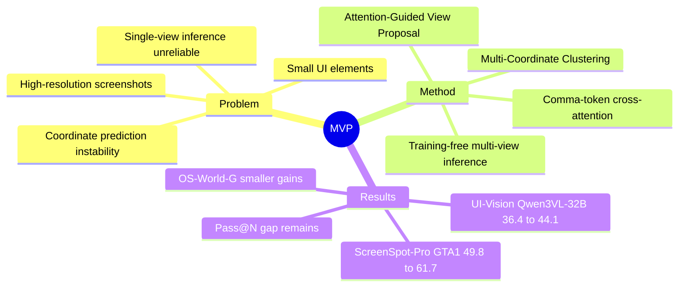

## Summary
MVP 关注 GUI grounding 中的 coordinate prediction instability：轻微视觉扰动会让同一模型的坐标预测在正确和错误之间翻转。论文提出 training-free 的 Multi-View Prediction，通过 attention-guided cropping 生成多视图，再用 spatial clustering 聚合多次坐标预测，在 ScreenSpot-Pro、UI-Vision 和 OS-World-G 上提升多种 GUI grounding 模型。核心价值不是新的大模型训练 recipe，而是把一部分 grounding error 解释为 single-view inference 不稳定，并用简单的 test-time aggregation 释放已有模型能力。

## Problem & Motivation
GUI agent 需要把自然语言指令映射到 GUI screenshot 中可点击的 pixel coordinates，但现有 LVLM-style grounding model 通常把坐标作为文本 token 生成，这个视觉元素到离散坐标 token 的映射并不稳定。作者在 GTA1-7B + ScreenSpot-Pro 上观察到：仅给截图加 28-pixel border，就会让 7.3% 原本正确的预测变错、7.8% 原本错误的预测变对，平均 coordinate shift 达到 193 pixels；而把两次预测中至少一次正确视为成功时，准确率为 57.5%，高于 single-prediction 的 49.8%。这说明部分错误不是模型完全找不到目标，而是单次 full-screenshot inference 没有稳定利用已有能力。

不稳定性在高分辨率截图和小 UI elements 上更严重。作者的解释包含两层：架构上，language head 要把高维 visual patches 映射到离散 coordinate tokens，本身对局部空间扰动敏感；数据上，训练集中高分辨率截图和小目标样本不足，导致测试时泛化不足。这个问题重要，因为 ScreenSpot-Pro 这类 professional software 场景正是高分辨率、小控件密集的 GUI agent 硬场景。

## Method
MVP 是 training-free inference framework，由两个模块组成。

**Attention-Guided View Proposal**：给定系统 prompt、截图和用户指令，模型先做一次推理并从 decoder 中取 text-to-vision attention。论文默认使用坐标格式中的 comma token 作为 query，因为附录显示它在定位目标区域上最好；然后选 top-k visual tokens，在原图中围绕这些 token center 裁出候选 sub-regions。候选区域按内部包含多少 top-k tokens 排序，选择 top-m regions，再把 crop view 放大，以提高小 UI elements 的可见性。实验默认 view size 为 1280 x 720，再 resize 到 2560 x 1440；GTA1-7B 和 UI-TARS-1.5-7B 用 4 views，Qwen3VL-8B/32B-Instruct 用 2 views；top-k 为 100，clustering threshold 为 14 pixels。

**Multi-Coordinate Clustering**：对原图和 m 个 cropped views 分别推理，得到 m+1 个坐标预测。然后按 Euclidean distance 聚类，选择点数最多的 cluster，并输出该 cluster 的 centroid 作为 final prediction；若多个 cluster size 相同，则用对应 view 的 attention-based rank 做 tie-break。直觉是错误坐标更容易随机散开，而正确坐标应在目标 bounding box 附近形成空间一致性。

## Key Results
**ScreenSpot-Pro**：MVP 在高分辨率 GUI grounding benchmark 上提升最明显。UI-TARS-1.5-7B Overall 从 41.9 提升到 56.1（+14.2），GTA1-7B 从 49.8 到 61.7（+11.9），Qwen3VL-8B-Instruct 从 55.0 到 65.3（+10.3），Qwen3VL-32B-Instruct 从 55.3 到 74.0（+18.7）。其中 Qwen3VL-32B-Instruct + MVP 超过表中所有 closed-source 和 open-source baseline。

**OS-World-G**：MVP 仍然提升平均分，但幅度较小。UI-TARS-1.5-7B 从 61.9 到 66.8（+4.9），GTA1-7B 从 67.5 到 68.7（+1.2），Qwen3VL-8B-Instruct 从 68.8 到 72.7（+3.9），Qwen3VL-32B-Instruct 从 71.7 到 72.0（+0.3）。论文将较小提升归因于 OS-World-G 分辨率较低（720P/1080P），本身 instability 较弱。

**UI-Vision**：UI-TARS-1.5-7B Average 从 22.2 到 25.6（+3.4），GTA1-7B 从 26.5 到 30.5（+4.0），Qwen3VL-8B-Instruct 从 27.2 到 31.9（+4.7），Qwen3VL-32B-Instruct 从 36.4 到 44.1（+7.7）。Qwen3VL-32B-Instruct + MVP 的 44.1 超过 UI-Venus-Ground-72B 的 36.8，差值为 +7.3 points。

**Ablations**：在 GTA1-7B + ScreenSpot-Pro 上，Attention-Guided View Proposal 从 baseline 49.8 提升到 61.7，优于 Border Padding 的 57.3。聚合策略中，Average of Coordinates 为 46.6、Random Selection 为 55.7、Multi-Coordinate Clustering 为 61.7，说明 naive averaging 会被 outliers 拉偏。view resizing 也有效：without resizing 为 59.1，with resizing 为 61.7（+2.6）。附录中 comma token query 的 target-bbox containing ratio 为 83.4%、SS-Pro Avg. 为 61.7，优于 instruction tokens（79.5%、60.5）、`<im start>`（73.1%、52.2）和 `<im end>`（50.9%、33.3）。

## Strengths & Weaknesses
**已知的 strengths**：
1. 问题诊断清楚：论文不是只报告 benchmark gain，而是先用 28-pixel border perturbation、resolution grouping、target area grouping 说明 GUI grounding 的失败与 input sensitivity 相关。
2. 方法简单且可插拔：不需要 SFT/RL，能接到 UI-TARS-1.5-7B、GTA1-7B、Qwen3VL-8B/32B-Instruct 这几类模型上。
3. ablation 有信息量：view proposal、clustering、resizing、query token、view number、trained selector 都被单独检查，支持作者关于“正确坐标形成空间一致性、错误坐标更分散”的解释。

**已知的 weaknesses / limitations**：
1. MVP 增加 test-time cost：每个样本需要原图加多个 views 的多次 forward。论文明确指出更多 views 会增加 time cost，且 Figure 4 显示 view number 增加并不会稳定提升性能，但没有给出 latency 表。
2. clustering 不是 oracle selector。Table 8 中 4 views 时 clustering accuracy 为 61.7，而 Pass@N accuracy 为 70.2；10 views 时 clustering 甚至为 60.6，而 Pass@N 为 73.0，说明“存在正确 view”和“能选出正确坐标”之间仍有明显 gap。
3. gains 与场景属性强相关：ScreenSpot-Pro 提升大，OS-World-G 提升小；这支持方法主要缓解高分辨率和小目标引起的 instability，但也意味着低分辨率或目标较大的 GUI 场景收益可能有限。
4. 训练 selector 的替代方案没有稳定胜过 clustering：Table 9 中 trained Qwen3VL-4B-Instruct selector 有时提升，但在 Qwen3VL-8B-Instruct base model 上不如 clustering，作者据此认为额外训练成本不划算。

**推测 / 不知道**：
1. 推测：由于 Attention-Guided View Proposal 依赖内部 attention scores，black-box closed-source LVLM API 很难直接复现该 pipeline；论文没有展示在 GPT-4o、Claude Computer Use 等 closed-source models 上套 MVP 的结果。
2. 不知道：grounding accuracy 的提升能转化成多少 end-to-end GUI agent task success。OS-World-G 来自 OS-World 截图，但这里评估的是 grounding benchmark，不是完整交互任务成功率。
3. 不知道：view size、layer choice、threshold 14 pixels 和不同模型的 view number 是否能跨 benchmark 稳定迁移；论文给出了默认设置和若干 ablation，但没有系统报告这些 hyperparameters 的全局敏感性。

## Mind Map

## Notes
- 对 GUI grounding 的 mental model 更新：一部分坐标错误可能不是 semantic understanding failure，而是 coordinate decoding 对图像扰动过敏；因此 test-time scaling / ensembling 可能比继续堆 SFT 数据更直接。
- MVP 与 iterative zoom-in 的关键差异是 parallel multi-view + clustering，而不是 sequential narrowing；这避免了早期 zoom-in 错误传播，但代价是多次 forward。
- 后续需要重点看：能否设计不依赖 internal attention 的 view proposal，或者把 clustering 的 Pass@N gap 缩小，同时不引入额外训练和明显 latency。
