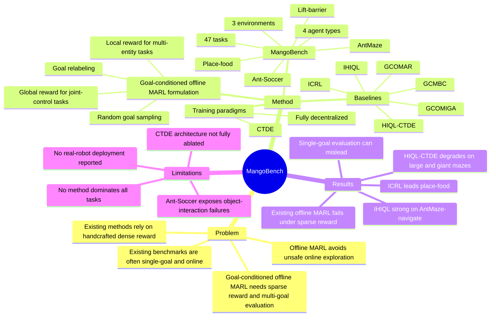

## Summary
MangoBench 提出 goal-conditioned offline MARL 设定，并构建一个覆盖 locomotion 与 cooperative manipulation 的 multi-goal benchmark，用 sparse goal reward 评估多智能体策略是否能在无在线交互、无手工 dense reward 的条件下泛化到多个目标。论文的核心贡献是 benchmark 和 baseline formulation：把 OGCRL 扩展到 fully decentralized 与 CTDE 两种 MARL 训练范式，并系统暴露 sparse reward、多目标评估、长时程协作和外部物体交互带来的困难。

## Problem & Motivation
Offline MARL 的现实动机很清楚：真实机器人、自动驾驶、协作系统中在线探索昂贵且不安全，因此需要从预收集数据中学习多智能体策略。但现有 offline MARL 依赖 task-specific handcrafted reward，作者认为这会带来 reward sensitivity，并限制新目标或新环境的泛化。

OGCRL 在单智能体中通过 goal relabeling 和 random goal sampling，把 rollout 转成 state-goal learning instance，并常用 “到达目标为 0，否则为 -1” 的 sparse reward，减少 reward engineering。论文要回答的问题是：能否把这种 goal-conditioned offline RL 扩展到 multi-agent setting，让多智能体也能在 sparse goal reward 下学习泛化策略。缺口在于现有 MARL benchmark 多数是 online、dense reward、single-goal evaluation，不适合检验 goal-conditioned offline MARL。

## Method
论文定义了 goal-conditioned offline MARL：在 partially observable Markov game 中，多智能体只使用固定 offline dataset 学习，每个 episode 条件化在 goal 上；multi-entity task 使用 local reward `r(oi, gi)`，joint-control task 使用 global reward `r(o, g)`，典型取值为到达 goal 时 `0`、否则 `-1`。

训练范式分两类。Fully decentralized setting 中，每个 agent 只基于自己的 local observation、local action、local goal 学习 `πi(ai | oi, gi)`，不依赖训练或执行阶段的 inter-agent communication。CTDE setting 中，actor 执行时仍只看 local observation 和 local goal，但 centralized critic 训练时使用 joint observation、joint action 和 global/shared goal。

MangoBench 的 benchmark 设计包括：
- **任务规模**：3 个 environments、4 类 agent configurations、47 个 tasks，其中 45 个 locomotion tasks、2 个 manipulation tasks。
- **Locomotion**：基于 OGBench，包含 AntMaze 与 Ant-Soccer；agent partition 有 `2x4`、`2x4d`、`4x2`，分别对应不同 ant joint 分割方式。AntMaze 覆盖 medium、large、giant、teleport 四种 maze 复杂度，以及 Navigate、Stitch、Explore 三类 dataset；Ant-Soccer 覆盖 Arena 与 Maze。
- **Manipulation**：基于 RoboFactory，把原本偏 imitation learning 的数据转成 goal-conditioned offline RL tuple。任务包括同步协作的 lift-barrier 与异步协作的 place-food；每个 robotic arm 的 local visual observation 可作为 local goal，global visual observation 作为 global goal。
- **Evaluation**：locomotion 使用 5 个 predefined goals，结果在 5 seeds 和 5 goals 上平均；manipulation 也使用 5 个 sequential goals，并在 100 random seeds 上平均。视觉输入实验将图像下采样到 `64 x 64`。

Baseline 包括 6 个主要算法：GCMBC、ICRL、IHIQL、HIQL-CTDE、GCOMIGA、GCOMAR。前四个来自 goal-conditioned offline RL 的多智能体扩展或变体，后两个是 OMIGA / OMAR 经 goal relabeling 和 random goal sampling 后得到的 goal-conditioned offline MARL variant。额外分析中还比较了 IGCIVL 与 GCIVL-CTDE，用来判断 CTDE 退化是否来自 paradigm 本身还是 hierarchical architecture 复杂度。

## Key Results
- **Benchmark coverage**：MangoBench 在论文 Table 1 中是唯一标注为 Cooperative、Multi-Goal=Yes、Stochasticity=Yes 的多智能体环境，并包含 47 tasks；对比中 VMAS 为 27 tasks 但 Multi-Goal=No，SMACv2 为 15 tasks 且 Multi-Goal=No，MA-MUJOCO 为 14 tasks 且 Multi-Goal=No。
- **AntMaze-navigate fully decentralized vs CTDE**：Table 4 显示 IHIQL 在所有列出的 AntMaze-navigate setting 上超过 HIQL-CTDE。例如 medium(2x4d) 上 IHIQL 为 `95.9 ± 1.1`，HIQL-CTDE 为 `79.8 ± 4.2`；large(2x4d) 上 IHIQL 为 `92.2 ± 2.1`，HIQL-CTDE 为 `51.2 ± 1.7`；giant(2x4) 上 IHIQL 为 `57.3 ± 2.1`，HIQL-CTDE 只有 `1.4 ± 0.8`。
- **CTDE complexity failure**：在 giant(4x2) AntMaze-navigate 上，IHIQL 为 `35.5 ± 8.6`，HIQL-CTDE 为 `1.6 ± 0.6`；同时 IGCIVL / GCIVL-CTDE 在 giant tasks 上多为 `0.0` 或接近 `0.0`。作者将 HIQL-CTDE 的退化主要归因于 global goal representation network 与 decentralized heterogeneous actors 之间的优化不稳定，而不是简单否定 CTDE paradigm。
- **Multi-goal evaluation 必要性**：在 antmaze-medium-explore `2x4d` 的 5-goal evaluation 中，如果只看 task 4，所有 baseline success rate 都为 `0`；如果只看 task 5，IHIQL `2x4d` 可达到 perfect score `1`，但其 multi-goal average 是 `49.6`。这说明 single-goal evaluation 会低估或高估 goal-conditioned offline MARL。
- **Manipulation multi-goal vs single-goal**：在 lift-barrier task 的 Table 3 中，multi-goal evaluation 下 IHIQL / GCMBC / ICRL 分别为 `82% / 47% / 56%`，single-goal evaluation 下分别为 `78% / 22% / 37%`。论文还报告 lift-barrier 上 IHIQL 比 DP 高 `41.4%`，且只需要 DP `5%` 的训练时间；place-food 上 ICRL 比 DP 高 `75%`，训练快 `93%`。
- **Sparse reward 是现有 offline MARL 的主要失败点**：GCOMIGA 和 GCOMAR 在大多数任务中失败。作者在 antmaze-medium-navigate 上比较 GCOMIGA with goal-conditioned sparse reward、OMIGA with sparse reward、OMIGA with shaped rewards，结论是 OMIGA 在 sparse reward 下学不好，而 reward 更 dense 时性能显著更稳定；作者认为 OMAR 也有类似限制。

## Strengths & Weaknesses
**已知 Strengths.**
MangoBench 的问题 formulation 有价值：它把 multi-agent coordination、offline learning、goal conditioning 和 sparse reward 放在同一评估框架里，比只在 dense reward / single-goal MARL benchmark 上报告结果更接近真实机器人任务中的 reward-design 困难。benchmark 设计也比较系统，覆盖 joint-control locomotion、多实体 manipulation、同步协作、异步协作、stochastic transition 和 high-dimensional visual input。

论文没有只给平均分，而是用几类诊断实验暴露方法边界：single-goal vs multi-goal 说明 evaluation protocol 会改变结论；IHIQL vs HIQL-CTDE 说明 centralized training 的额外表示网络可能带来训练不稳定；sparse vs shaped reward 说明现有 offline MARL 方法在 sparse reward 下并不稳健。这些比“提出一个新 benchmark”本身更有信息量。

**已知 Weaknesses / failure cases.**
没有一个方法在所有任务上 dominate。IHIQL 在许多 locomotion task 上最强，但 ICRL 在 place-food 上最好；GCMBC 不能充分利用 low-quality / failure trajectory 中的信息；GCOMIGA 和 GCOMAR 在 sparse reward 下大面积失败。Ant-Soccer 是一个明确 failure case：rendered videos 显示 agents 难以同时保持稳定 locomotion 和操控球，球会滚走、卡在 maze corner，或者 limbs 之间产生 conflicting torques；作者认为这是因为 ball 这个 external object 引入了 agents intrinsic state 中没有表示的外部依赖。

**推测.**
这篇论文对 embodied agent / robotic learning 的启发大于对 GUI-agent 或 VLM 的直接启发：它关注的是多智能体在目标条件下如何从离线轨迹中学习协调，而不是视觉语言 grounding 或 computer-use。真正值得借鉴的可能是 evaluation philosophy：对于 goal-conditioned policy，用单个 fixed goal 评估很容易得到错误结论；GUI / web agent 如果也声称能泛化到多目标任务，可能需要类似 multi-goal、多状态分布的 evaluation protocol。

**不知道 / 未报告.**
论文正文没有报告 code link、DOI 或 MangoBench 自身的 arXiv id。实验主要基于 OGBench 与 RoboFactory 的 converted datasets，未报告真实机器人部署结果，也未说明 benchmark 数据和评测脚本是否已公开。对 CTDE 的结论仍然有限：作者认为 HIQL-CTDE 的差主要来自 hierarchical goal representation 复杂度，但没有系统 ablation 分别移除 global goal encoder、hierarchical actor 或不同 critic 设计来完全隔离原因。

## Mind Map

## Notes
这篇论文不是提出一个可直接迁移到 GUI/VLM agent 的新模型，而是给“goal-conditioned multi-agent offline learning”补了一个 evaluation surface。对后续研究更有价值的是它的问题拆法：如果一个 agent policy 声称具有 goal generalization，evaluation 就不应该只抽一个 fixed goal，而应该覆盖多个目标、多个数据质量层级、多个协作结构。

一个值得跟进的问题是：sparse reward 下现有 offline MARL collapse，本质是 value learning 的 signal-to-noise 问题，还是 offline dataset 中 successful goal-reaching transitions 太稀疏导致 coverage 不够。MangoBench 的 reward-shaping 对照说明 dense reward 能救 OMIGA，但还不能回答更根本的问题：在不引入 dense handcrafted reward 的前提下，什么表示学习或 temporal abstraction 能稳定提取可用的 goal-reaching signal。
