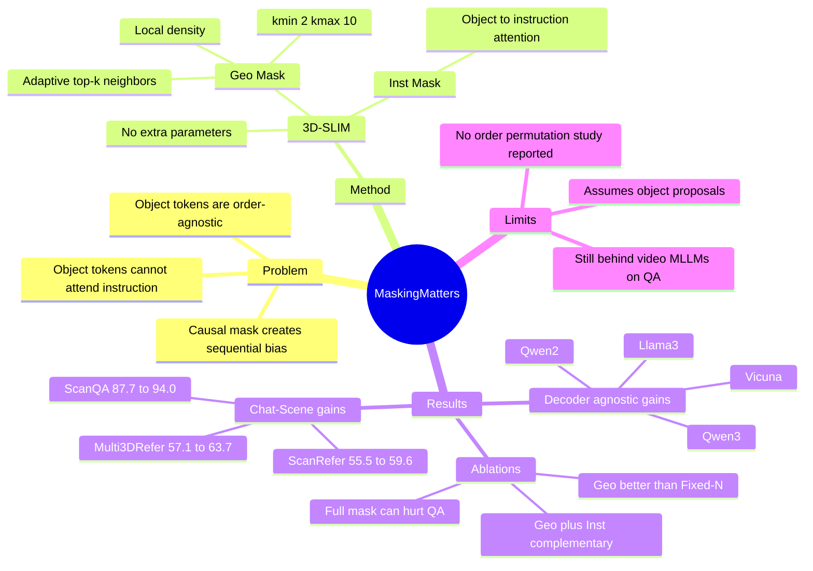

## Summary
3D-SLIM 解决 object-centric 3D LLM 直接沿用 causal decoder mask 时产生的两个错配：3D objects 被人为序列化，且 object tokens 不能直接访问 instruction tokens。方法只替换 self-attention mask，不改模型结构、不加参数，用 Geo Mask 建模基于空间密度的局部 object-object attention，用 Inst Mask 恢复 object-to-instruction attention。实验证据显示它在 Chat-Scene、3DGraphLLM 和多个 LLM decoder 上提升 3D grounding / captioning / QA，但在视频式 MLLM QA baselines 面前仍有明显差距。

## Problem & Motivation
已知：3D scene-language understanding 要把 3D perception 和自然语言 instruction 结合起来，覆盖 3D visual grounding、dense captioning、question answering 等任务。近期 object-centric 3D LLM（如 Chat-Scene、Inst3D-LMM、3DGraphLLM）通常把场景分解为 object proposals，再用 `<OBJxxx>` identifiers 和 object features 交给 LLM decoder 做推理。

论文指出现有工作主要优化 input representation，较少质疑 decoder mask 本身。标准 causal mask 对语言 token 合理，因为 token order 承载语义；但 3D object tokens 本质上是 order-agnostic，序列顺序多半是输入构造的人为产物。这个 mask 还会阻断 object tokens 对 instruction tokens 的直接 attention，使模型先按完整场景编码对象，再在后续文本 token 中结合任务需求，形成低效的跨模态推理路径。

核心问题可以表述为：如果 3D scene 的结构由 spatial proximity 和 task instruction 决定，而不是由 token order 决定，那么 decoder attention mask 是否应该显式反映这一点？

## Method
3D-SLIM 是一个替代 causal mask 的 decoder masking strategy，面向 object-centric 3D LLM。它不改变 backbone、训练目标或输入模块，而是在 self-attention 中重写 object-object 与 object-instruction 两类 attention block。

**Geometry-adaptive Mask (Geo Mask).** 已知：作者认为 full attention 去掉了序列约束，但会把所有 object pair 一视同仁，无法提供局部空间结构先验。Geo Mask 先根据 object center 距离计算每个 object 的 local density：平均距离越小，归一化密度越高。随后用
`k_i = round((kmax - kmin) * rho_i + kmin)` 为每个 object 自适应选择邻居数量，并只允许它 attend 到自身和 top-k nearest neighbors。论文默认 `kmin = 2, kmax = 10`，直觉是 dense regions 需要更宽的局部上下文，sparse regions 应避免 attend 到远处无关对象。

**Instruction-aware Mask (Inst Mask).** Inst Mask 把 object-to-instruction block 中原本由 causal mask 置为 `-inf` 的位置改为 0，使 object tokens 能直接 attend 到 instruction tokens。这个设计的目标不是让所有 token full attention，而是让 object representation 在编码阶段就受到 task words 约束，例如问题中的 "chairs"、"table"、"above" 等关键词。

**Training / integration.** 训练目标沿用 Chat-Scene 的 unified input-output formulation，只用 text generation cross-entropy。实验把 3D-SLIM 接入 Chat-Scene 和 3DGraphLLM；所有模型用 LoRA fine-tuning、AdamW、NMS mask IoU threshold 0.9；Chat-Scene batch size 32、learning rate 5e-6，3DGraphLLM batch size 8、learning rate 2e-5；实验在 2 张 NVIDIA RTX Pro6000 上进行。论文强调该方法 no architectural modifications、no extra parameters。

## Key Results
**State-of-the-art comparison.** 在 Chat-Scene + Vicuna-7B-v1.5 上，加入 3D-SLIM 后 ScanRefer val 从 55.5 / 50.2 提升到 59.6 / 54.1（Acc@0.25 / Acc@0.5），Multi3DRefer val 从 57.1 / 52.4 提升到 63.7 / 58.7（F1@0.25 / F1@0.5），Scan2Cap val 从 77.1 / 36.3 提升到 84.2 / 38.0（CIDEr@0.5 / BLEU-4@0.5），ScanQA val 从 87.7 / 14.3 提升到 94.0 / 15.2（CIDEr / BLEU-4），SQA3D val 从 53.2 / 56.1 提升到 55.9 / 58.9（EM / EM-R）。

**与更强 baselines 的关系。** 在 object-based 3D LLM 内部，3D-SLIM 对 Chat-Scene 的提升很稳定；接到 3DGraphLLM 时，ScanRefer val 从 62.4 / 56.6 到 64.1 / 57.7，Multi3DRefer val 从 64.7 / 59.9 到 67.3 / 62.0，Scan2Cap val 从 81.0 / 36.5 到 82.2 / 37.3。但它不是所有指标都提升：3DGraphLLM 的 ScanQA val 从 88.8 / 15.9 小幅降到 88.2 / 15.8。相对 video-based methods，作者也承认 object-based 方法在 QA 上较弱：Ross3D 的 ScanQA val 为 107.0 / 17.9、SQA3D test 为 63.0 / 65.7，而 Chat-Scene + 3D-SLIM 对应为 94.0 / 15.2、55.5 / 58.2。

**不同 LLM decoder.** 在 Chat-Scene framework 下，3D-SLIM 对多个 decoder 都有增益：Vicuna-7B-v1.5 的 ScanRefer Acc@0.5 从 49.5 到 54.1、ScanQA C 从 88.3 到 94.0；Qwen2-7B-Instruct 的 ScanRefer Acc@0.25 从 56.9 到 61.0、ScanQA C 从 84.4 到 88.5；Qwen3-8B-Instruct 的 Multi3DRefer F1@0.5 从 56.5 到 59.6、Scan2Cap C@0.5 从 78.8 到 83.6。

**Mask ablation.** 在 Chat-Scene + Vicuna-7B 上，单纯 full attention 并不可靠：Full Mask on all tokens 使 Scan2Cap C@0.5 从 78.1 降到 76.5、ScanQA C 从 88.3 降到 87.9、SQA3D EM 从 53.7 降到 53.2。只修改 object-object block 时，Full Mask 与 Diagonal Mask 接近（ScanRefer Acc@0.5 50.5 vs 50.6），说明去掉 causal order 还不够；Fixed-N Mask 达到 57.5 / 51.7（ScanRefer Acc@0.25 / Acc@0.5），Geo Mask 进一步到 58.6 / 53.1，并在 ScanQA C 上到 94.2。

**Component ablation.** Geo Mask 单独使用把 ScanRefer Acc@0.5 从 49.5 提到 53.1，Inst Mask 单独使用提到 51.8；两者合用达到 54.1。Multi3DRefer F1@0.25 / F1@0.5 从 59.6 / 54.8 分别到 Geo-only 62.0 / 57.3、Inst-only 62.0 / 57.0、full 63.7 / 58.7。注意 full 不是每个单项都严格最高：Geo-only 的 ScanQA C 为 94.2，full 为 94.0。

**Attention range ablation.** Geo Mask 的 `kmin, kmax` 在 `[2, 10]` 时被作者选为默认，结果为 ScanRefer 58.6 / 53.1、Multi3DRefer 62.0 / 57.3、ScanQA 94.2 / 15.0、SQA3D 55.9 / 58.6。过窄的 `[0, 5]` 限制信息交换（ScanQA C 89.3），过宽的 `[2, 20]` 虽然部分 grounding 指标略高（ScanRefer Acc@0.25 58.8），但 ScanQA C 降到 92.4，作者解释为 attention spread too widely。

## Strengths & Weaknesses
**已知 Strengths.** 这篇的核心 taste 是把问题从 "3D representation 怎么更强" 转向 "LLM decoder 的默认 inductive bias 是否适合 3D object sets"。方法足够简单：只改 attention mask，不加参数，不引入新的 3D backbone；但 ablation 明确显示 full attention、diagonal attention、fixed-N locality 都不如 density-adaptive locality，说明增益不是简单来自去掉 causal mask。

**已知 Strengths.** 实验覆盖 5 个 3D scene-language benchmarks（ScanRefer、Multi3DRefer、Scan2Cap、ScanQA、SQA3D）、两个 object-centric frameworks（Chat-Scene、3DGraphLLM）和多个 LLM decoders（Vicuna、Llama3、Qwen2、Qwen3）。这让 claim "masking matters" 比单一模型上的 trick 更有说服力。

**已知 failure / boundary.** 论文自己的比较显示，3D-SLIM 主要强化 object-based 3D LLM，在 QA 上仍落后于 video-based MLLM methods。作者给出的解释是 video-based models 使用进一步训练在 image/video QA 上的 MLLMs，而 object-based approaches 依赖主要在 text 上训练的 LLM；这是合理推测，但论文没有做 controlled backbone-matched experiment 来隔离 representation 与 pretraining 的贡献。

**已知 limitation.** 方法假设已有 object-centric scene representation，包括 pretrained detector 产生的 object proposals、object identifiers 和 object-level features；因此它没有解决 object proposal 错误、开放词汇检测错误或非 object-centric dense geometry 的问题。所有 benchmark 都建立在 ScanNet indoor scenes 上，论文没有报告室外、动态场景、机器人闭环执行或真实 embodied task success。

**已知 limitation.** 作者把 causal mask 的问题归因于 arbitrary object order，但正文没有看到显式的 object order permutation robustness 实验。也没有看到 3D-SLIM 自身失败案例的系统分类；qualitative figures 主要展示它相对 Chat-Scene 的成功例子，例如把 "next to the table beneath the tv" 解析到 trash can，或把 "left of a white cabinet" grounding 到正确 black cabinet。

**推测.** 对 GUI-agent 也有启发：screen elements 和 3D objects 一样，常被序列化后交给 LLM，但真实结构更像 layout graph / interaction graph，而不是自然语言顺序。一个值得追问的方向是：GUI element tokens 是否也需要 layout-adaptive mask 或 instruction-aware element encoding，而不是让 causal decoder 从任意 DOM / OCR / detection order 中学习伪相关。

**不知道.** 论文没有报告 mask computation 的实际 latency、memory overhead，虽然它强调 no extra parameters。也不知道在更强 3D foundation model、oracle object proposals、或 end-to-end VLM decoder 上，Geo Mask 与 Inst Mask 的边际收益是否仍然同样大。

## Mind Map

## Notes
- 我最看重的点：这篇不是再堆一个 3D encoder，而是指出 LLM decoder mask 本身把 3D object set 错当成 language sequence。这个问题 formulation 很干净，且与 embodied / GUI 里的 structured tokens 都有关。
- 结果要谨慎读：3D-SLIM 在 object-based baselines 内部很有效，但不能概括为整体 3D scene-language QA SOTA；Ross3D 等 video-based baselines 在 ScanQA / SQA3D 上仍明显更强。
- 后续值得看两个实验：第一，随机打乱 object token order，测 causal mask、fixed-N、Geo Mask 的稳定性；第二，给 object-based pipeline 换成 video-trained MLLM decoder，检验 QA gap 到底来自 mask、representation 还是 pretraining data。
