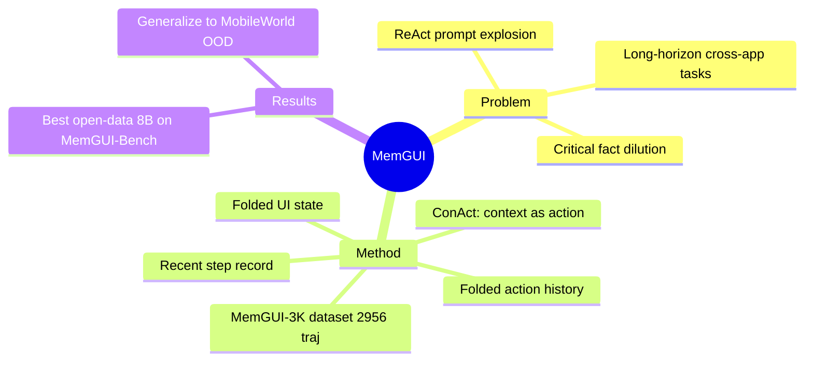

## Summary

> [未获取全文，仅基于 abstract]

MemGUI-Agent 通过将上下文管理建模为与 UI 操作同策略的"first-class actions"（Context-as-Action，ConAct），解决了 MLLM-based mobile GUI agent 在 long-horizon 任务中因 ReAct 式历史被动堆积而导致的 prompt 爆炸问题，在 MemGUI-Bench 和 MobileWorld 上取得当前 open-data 8B 模型最优性能。

## Problem & Motivation

> [未获取全文，仅基于 abstract]

MLLM-based mobile GUI agent 在 short-horizon 任务上已有明显进步，但 long-horizon 跨 app 任务仍然不可靠。作者将根源归结为 ReAct-style prompting 的被动记录机制：每步追加历史，导致 prompt 随步骤线性膨胀（prompt explosion），同时关键跨 app 事实被大量低信息量条目稀释（critical fact dilution）。这两个问题共同导致 agent 在长序列中丢失关键中间状态，任务成功率崩溃。现有方法（如 MobileAgent-V3、ChainMemory 等）通常在推理阶段引入外部记忆模块，未从模型策略层面解决这一问题。

## Method

> [未获取全文，仅基于 abstract]

**Context-as-Action (ConAct)**：核心设计是将上下文管理视为与 UI 操作（点击、滑动等）同质的 action，由同一 policy model 统一生成。agent 在每步既可输出 UI action，也可输出 context management action，主动更新以下三个结构化 context 字段：

1. **Folded action history**：折叠压缩的历史操作记录，保留关键里程碑而丢弃冗余
2. **Folded UI state**：折叠压缩的 UI 状态快照，仅保留跨步骤相关的界面事实
3. **Recent step record**：当前步骤的完整记录（作为工作记忆）

这种设计使 context 保持 compact 同时不丢失 critical facts，区别于被动追加式历史的线性增长。

**MemGUI-3K 数据集**：构建包含 2,956 条轨迹的监督训练数据，每条轨迹带有完整的 ConAct 标注（含 context management action 序列）。数据用于 SFT 训练和 offline 分析，使 proactive context management 在不同规模的模型上均可学习。

**MemGUI-8B-SFT**：在 MemGUI-3K 上对 8B 模型 fine-tune 得到，作为 open-data 8B baseline。

**MemGUI-Bench**：配套评测基准（具体 benchmark 细节未在 abstract 中披露）。

## Key Results

> [未获取全文，仅基于 abstract]

- **MemGUI-Bench**：MemGUI-8B-SFT 在 open-data 8B 模型中取得最优性能
- **MobileWorld（OOD）**：模型泛化到分布外的 MobileWorld benchmark，验证了 ConAct 方法的跨任务泛化能力
- 具体数值指标未在 abstract 中披露，需阅读全文

## Strengths & Weaknesses

> [未获取全文，仅基于 abstract]

**亮点**：
- ConAct 的"context management as action"理念简洁，将上下文压缩的决策内化到 policy 本身，而非外挂模块，在架构层面比 prompt engineering 或外部记忆更 end-to-end
- 配套数据集 MemGUI-3K + benchmark MemGUI-Bench 有利于社区复现和比较
- 同时在 in-distribution（MemGUI-Bench）和 OOD（MobileWorld）上验证

**局限**：
- ConAct 的三个 context 字段（folded action history / folded UI state / recent step record）仍需人工设计，"什么值得保留"的判断标准未知，折叠粒度如何控制也不清楚
- 仅 SFT 训练，未引入 RL 或 online learning；long-horizon task 中 reward 稀疏问题如何处理待考察
- 8B 模型规模下的 prompt explosion 问题是否真正消除，还是只是推迟，需要定量上下文长度对比
- MemGUI-Bench 是论文自建 benchmark，community-accepted 度有限

**影响**：这一方向（将记忆/上下文压缩内化为可学习的 action）与近期 [[2603-HybridMemory]] 和 [[2500-ChainMemoryEnhancingGui]] 等工作构成互补关系，是 long-horizon GUI agent 的有价值补充。

## Mind Map

## Notes

- 核心观察值得记住：ReAct 的 passiveness 是 long-horizon 失败的结构性原因，而非 capacity 不足。这个 framing 清晰，但需要看 ablation 才能确认 ConAct 的增益来自"主动"还是仅仅来自"更好的格式化压缩"
- 与 [[2500-MobileAgentV3Fundamental]]、[[2500-ChainMemoryEnhancingGui]]、[[2605-MobileWorldModelGUI]] 对比阅读
- MemGUI-Bench 的难度设计（任务 horizon、跨 app 数量）是评估可信度的关键，需关注
