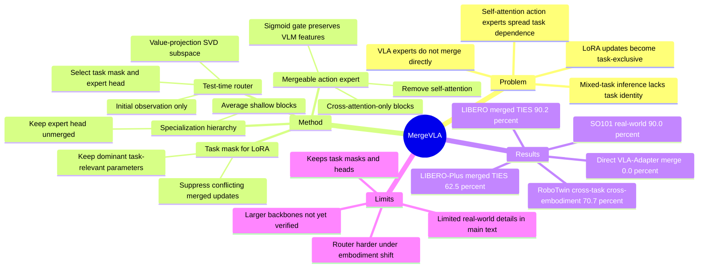

## Summary

MergeVLA 研究一个很实际但此前少被系统处理的问题：多个单任务 VLA expert 直接 model merging 后几乎失效，为什么会这样，以及怎样让 VLA 从架构上保持可合并。它的答案是把冲突分成 VLM LoRA 的 task-specific parameter interference 和 action expert 的 self-attention coupling，再用 task mask、cross-attention-only action expert、保留少量 expert head、test-time task router 组合成一个 cross-skill merged VLA。

## Problem & Motivation

现有 VLA 通常通过大量 robot demonstration fine-tuning，把 VLM 改造成能输出 action 的 policy；这在单任务或单 embodiment 上有效，但现实中的 generalist agent 需要同时覆盖多个 skills、embodiments 和 environments。自然做法是把多个单任务 VLA expert 合并成一个模型，避免重新 joint training 或访问原始数据，但论文发现标准 model merging 方法迁移到 VLA 时会出现 near-zero success rate。

作者把核心问题表述为：VLA fine-tuning 到底产生了什么结构性变化，使得普通 LLM/VLM 场景可行的 merging 在这里失败？他们的实证诊断给出两个原因：第一，VLM backbone 中 LoRA updates 在不同任务上激活高度互斥的 channel，4 个 LIBERO task 合并时 selfish parameters 比例已达到约 75%；第二，train-from-scratch action expert 里的 self-attention 会把 task-specific dependency 沿 block 深度传播，导致深层 action blocks 参数距离爆炸，不能简单平均。

这个问题对 embodied generalist 很重要，因为它绕开了“每次扩展技能都重新多任务训练”的成本瓶颈。如果 model merging 可行，单任务 skill expert 可以作为可复用资产逐步积累；如果不可行，就必须理解哪些参数/结构阻止了复用。

## Method

**Merge-oriented VLA architecture.** MergeVLA 基于 VLA-Adapter 风格的小型 dual-system VLA，但对可合并性做了结构改造。论文强调它不是单纯套用更强 merging algorithm，而是先修改 VLA 架构，使主干 VLM 和 action expert 的 specialization 更局部、更可组合。

**Task-specific mask for LoRA merging.** 对每个任务 m，作者先从 LoRA-finetuned weights 得到 task vector `tau_m = Theta_m - Theta_0`，再通过 Task Arithmetic / TIES / WUDI 等方法得到 merged update `tau_merge`。由于全局 merged update 会混入互相冲突的任务参数，MergeVLA 为每个任务构造 binary mask `S_m`：当某个参数的 task-specific update 足够显著，并且相对 residual difference 占优时才保留。推理时使用 `Theta_0 + S_m * tau_merge`，目的是激活对当前任务有用的 merged LoRA 参数，同时压制会误导其他任务的参数。

**Cross-attention-only action expert.** 论文认为 VLA-Adapter 的 action expert 不可合并，关键在于 self-attention 从 scratch 训练后会形成强 task bias，并把差异沿层传播。因此 MergeVLA 移除 action expert block 中的 self-attention，只保留从 task hidden states 和 action hidden states 读取信息的 cross-attention path，强迫 expert 依赖更稳健的 VLM features。它还把原来的 `tanh` gate 替换成 `sigmoid` gate，避免负激活抑制 VLM 信号。

**Specialization hierarchy and expert head.** 即使去掉 self-attention，深层 action blocks 仍更 task-specific。MergeVLA 对浅层 action expert 做 simple weight averaging，但把后几层作为 unmerged expert head `H_{l->L}` 保留；多数 LIBERO 设置下只保留 final block `L`，RoboTwin cross-embodiment cross-task 设置中需要保留 `H_{L-2->L}` 才能处理更强的 embodiment/action-space conflict。这个设计不是“完全单模型参数合并”，而是共享大部分参数、保留少量任务头。

**Training-free test-time task router.** 当 task identity 已知时，可以手动选择对应 task mask 和 expert head；但 mixed-task evaluation 中任务未知。MergeVLA 的 router 在 episode 初始观测 `t=0` 上，分别运行每个 masked VLM variant，取 action expert value projection matrix 的 top singular vectors 形成 subspace，把 hidden states 投影进去得到 task relevance score，再用 softmax 选择 task mask 和 expert head。论文的 ablation 显示 value-based subspace 比 key-based subspace 更可靠。

## Key Results

**LIBERO mixed-task merging.** 在 LIBERO Spatial/Object/Goal/Long 四个 task suites 上，single-task finetuned MergeVLA 平均 **96.7%** success rate，VLA-Adapter 为 **98.5%**，OpenVLA 为 **76.5%**。直接把 OpenVLA 全部参数用 TA 合并得到 **0.0% Avg.**；OpenVLA 只合并 vision backbone 为 **44.2% Avg.**，加 task mask 合并全部参数为 **62.4% Avg.**。VLA-Adapter 用 TA 合并全部参数为 **0.0% Avg.**，加 mask 仍为 **0.0% Avg.**，即使排除 final expert head 也只有 **23.1% Avg.**。MergeVLA 在同一设置下显著更稳：`MergeVLATIES` 达到 **90.2% Avg.**（Spatial **94.8** / Object **94.6** / Goal **91.8** / Long **79.4**），`MergeVLAWUDI` 为 **89.9% Avg.**，`MergeVLATA` 为 **89.7% Avg.**。

**LIBERO-Plus OOD robustness.** LIBERO-Plus 包含 background textures、camera viewpoints、language instructions、lighting、object layout、robot states、sensor noise 七类 shift。single-task setting 下，MergeVLA 平均 **72.4%**，高于 OpenVLA **16.3%**、π0 **56.3%**、VLA-Adapter **59.0%**；论文正文称 cross-attention-only + sigmoid gate 设计带来相对 VLA-Adapter **+13.4%** 的 OOD success rate。merged setting 下，VLA-Adapter merged model 只有 **10.8% Avg.**，而 `MergeVLATIES` 为 **62.5% Avg.**，`MergeVLATA` 为 **61.6% Avg.**，`MergeVLATSV` 为 **53.5% Avg.**。

**RoboTwin 2.0 cross-embodiment.** Setting A 中三个 dual-arm embodiments 执行同一任务 PLACE CONTAINER PLATE，single-task finetuned 平均 **88.0%**，`MergeVLATIES,H(L-1)->L` 为 **88.7% Avg.**，`MergeVLATA,H(L-1)->L` 为 **78.7% Avg.**。Setting B 中三个 embodiments 执行不同任务，single-task finetuned 平均 **76.0%**；`MergeVLATIES,H(L-2)->L` 达到 **70.7% Avg.**，而只保留 `H(L-1)->L` 时 HAN DOVER BLOCK 为 **0.0%**、平均 **59.3%**，说明跨 embodiment + 跨 task 时 expert head 需要更深。

**Real-world SO101.** 摘要报告 MergeVLA 在 SO101 robotic arm 的 multi-task real-world experiments 上达到 **90.0%** success rate。主文把 real-world details 放在 Appendix，因此正文可确认的数字是这个总成功率，不能从主文进一步拆分任务级结果。

**Ablations.** mask ratio `lambda` 从 **0.2** 到 **0.9** 变化时，LIBERO-Long 上低 `lambda` 会激活过多参数并导致 severe task interference，甚至 complete failure；当 `lambda` 在 **0.6-0.9** 之间时 success rate 超过 **70%**。router subspace ablation 中，Only K 在 LIBERO 上平均 **53.6%**，K&V 为 **65.1%**，Only V 为 **89.7%**；其中 Object task 在 Only K 和 K&V 下都是 **0.0%**，支持作者“value projection 更适合任务路由”的设计判断。

## Strengths & Weaknesses

**已知 Strengths.** 这篇论文的价值主要在 problem decomposition，而不只是多报一个 VLA benchmark 数字。它明确展示了直接 merging 的失败边界：OpenVLA 全参数 TA 合并 **0.0%**，VLA-Adapter 全参数 TA/TA+mask 合并也 **0.0%**；然后把失败拆到 LoRA 参数冲突和 action expert 架构耦合两个层面，给出相对清晰的机制解释。

**已知 Strengths.** 方法选择克制：task mask 解决 LoRA 冲突，移除 self-attention 解决 action expert 中 task-specific signal 扩散，expert head 承认深层动作分布仍不可合并，router 处理 unknown task identity。它没有声称一个纯 weight-averaged model 能覆盖所有技能，而是把可共享和必须保留 task-specific 的部分分开，这比盲目追求完全合并更诚实。

**已知 Strengths.** 实验覆盖了 LIBERO cross-skill、LIBERO-Plus OOD robustness、RoboTwin cross-embodiment 和真实 SO101 机器人，总体支持“mergeability must be designed into VLA architecture”的 claim。尤其 LIBERO-Plus 上 merged `MergeVLATIES` **62.5%** vs merged VLA-Adapter **10.8%**，说明改架构后合并模型在 distribution shift 下没有完全崩掉。

**已知 Weaknesses / boundary.** MergeVLA 仍需要每个任务的 task mask 和 expert head，论文也承认 inference 时要维护 M 个 masks 和对应 action heads，只是参数和计算 overhead 较小。因此它更像 parameter-sharing + routed specialization，而不是把所有技能压成一个无条件单一权重空间。

**已知 Weaknesses / boundary.** test-time router 在更难的 RoboTwin cross-embodiment setting 中压力明显更大：只保留 final expert block 不够，HAN DOVER BLOCK 在若干 merged variants 中为 **0.0%**。这说明 task identity inference 和 action-space conflict 在多 embodiment 情况下仍是脆弱点。

**已知 Weaknesses / boundary.** 主文没有给出详细 failure case taxonomy，也没有展开 real-world SO101 的任务级表格；真实机器人部分在主文只给摘要中的 **90.0%** 总结果。论文结论也把 larger VLM backbones 是否兼容、diverse robot datasets pretraining 是否进一步增强 merging 作为 future work，而不是已验证事实。

**推测.** 对 GUI agent / computer-use agent 的启发是：如果不同 GUI skill fine-tune 也把共享 VLM/LLM 表示推向互斥子空间，那么“把多个 GUI specialist adapter 平均起来”可能同样会失败；需要显式区分可共享 perception/language substrate 和 task-specific action policy head。这个外推没有在论文中验证，因为实验对象都是 robot manipulation VLA。

**不知道.** 正文没有出现 arXiv id、DOI 或 GitHub/code URL；只在摘要给出 project page `https://mergevla.github.io/`。也不知道 MergeVLA 在更多真实机器人、更多任务数 M、非 LIBERO 风格语言指令、或更大 VLM backbone 上是否仍保持同样的 routing/merging scaling。

## Mind Map

## Notes

- 这篇的核心 insight 是“mergeability is an architectural property”。对 VLA 来说，单纯选更复杂的 merging algorithm 不够；如果 action expert 本身通过 self-attention 把任务差异扩散到深层，参数空间就不会自然可合并。
- expert head 设计值得和 MoE / adapter routing 区分：这里不是训练一个 gating network，也不是 joint multi-task training，而是在已有单任务 experts 上用 training-free router 选择少量保留头。它的优点是轻量，代价是任务数增加时仍要保留 per-task components。
- `lambda` ablation 的含义很实用：mask 太宽等于把冲突一起打开，太窄则更多依赖 pretrained weights；论文给出的有效区间 **0.6-0.9** 暗示 VLA merging 需要相当强的 sparsity。
- 对后续研究，最值得追问的是 scaling law：任务数 M 继续增加时 selfish ratio、router accuracy、expert-head storage 是否线性恶化？论文展示 4 个 LIBERO suites 和 RoboTwin 三 embodiment/三任务，但还不足以回答 large skill library 的问题。
