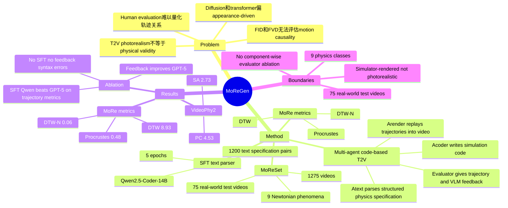

## Summary

MoReGen 研究 Newtonian motion-controlled text-to-video：不用 diffusion 直接生成像素，而是让 multi-agent LLM 把文本转成 physics simulation code，再由 simulator / renderer 产生可复现的轨迹和视频。论文同时提出 MoReSet（1,275 个带轨迹标注的视频，覆盖 9 类 Newtonian phenomena）和 trajectory-centric MoRe metrics，用来暴露 Sora2、Veo3、Grok Imagine 等 T2V 模型在物理运动一致性上的缺口。

## Problem & Motivation

现有 T2V 模型在 photorealism 和 prompt alignment 上进步很快，但仍容易生成违反 motion、dynamics、causality 的视频；作者在 Figure 1 中展示了 Sora2、Veo3、Grok Imagine 在 object counting、momentum conservation、Newtonian forces、velocity / pressure computation 上的失败。论文认为核心问题是当前 transformer / diffusion 生成范式偏向 appearance-driven pattern memorization，而不是显式建模物理因果。

评估侧也有缺口：FID、FVD、PSNR、LPIPS 等像素或分布相似度指标不能判断视频是否遵守物理规律；human evaluation 又难以精确评估轨迹和数值关系。已有 physics-aware benchmark / metric 往往依赖 LLM/VLM captioning 或 data encoder，作者认为这会带来 hallucination、bias 和 OOD failure，因此需要直接面向 object trajectory 的评估。

## Method

**MoReGen pipeline.** 给定自然语言 prompt，MoReGen 通过四个模块生成视频：`Atext` 把文本解析成 structured Newtonian specification；`Acoder` 把 specification 转成可执行 physics simulation code；`Arender` 在 sandbox 中运行代码并根据场景配置和轨迹渲染视频；multi-component evaluator `E` 根据轨迹、物理规则和 prompt fidelity 给 `Acoder` 反馈。作者强调这是 code-domain T2V：视频来自显式 physics engine 和 renderer，而不是 diffusion denoising。

**Text-parser agent.** `Atext` 使用 Qwen2.5-Coder-14B，在 1,200 个人工验证的 text-specification pairs 上做 SFT，训练 5 epochs，AdamW learning rate 为 `1e-5`。训练数据来自 phenomenon-specific structured schema，schema 约束 valid parameter ranges、physical units、objects / anchors / constraints、geometric and mechanical consistency、initial conditions。目标是让一个 general instruction 就能从欠规范的自然语言中补全物理参数，同时避免 hallucinated values。

**Code-writer / renderer.** `Acoder` 使用统一 Python class framework 生成 simulation code，覆盖 space initialization、object creation、constraint setup、simulation loop，并记录每个 simulation step 的 position、velocity、orientation。论文列举可用 physics engines 包括 Pymunk、Blender、Manim；渲染侧使用与 Pymunk 集成的 pygame，重建 scene geometry 并 replay object states。这个 trajectory generation / video rendering 解耦设计的已知好处是可复现、可检查，也为未来接入 Unreal Engine、Blender、Unity 等更 photorealistic renderer 留接口。

**Evaluator.** Evaluator 先用 `Atext` 提取的 object descriptors 指导 GroundedDINO 检测对象，再用 CoTracker3 估计 normalized object trajectories；随后用 Qwen 比较估计轨迹 `Test` 和 simulation trajectory `T` 的相似与偏差。Qwen2.5-VL 从 physical plausibility 和 prompt alignment 两个角度评估视频，最后由 LLM 汇总 trajectory alignment、physical correctness、prompt fidelity，形成下一轮 code refinement 的 feedback。

**MoReSet and MoRe metrics.** MoReSet 包含 1,275 个视频，覆盖 gravity、acceleration、collision、oscillation、momentum、buoyancy、inertia、pendular motion、pulley mechanics 9 类 Newtonian physics。训练集有 1,200 个 Blender-generated simulations，每个配 free-form description 和 structured JSON specification；测试集有 75 个 real-world laboratory videos，带人类标注的自然语言描述、object labels、environment attributes、camera perspective，并用 CoTracker3 提取后由人工校正 key-object pixel trajectories。MoRe metrics 包括 DTW、normalized DTW (DTW-N) 和 Procrustes Analysis，直接比较生成视频中的关键物体轨迹与 ground truth trajectory。

## Key Results

**MoReSet / MoRe metrics（Table 2）.** 在 MoReSet test prompts 上，MoReGen 的 trajectory 指标最好：**DTW 8.93 ± 9.61 / DTW-N 0.06 ± 0.07 / Procrustes 0.48 ± 0.30**（三者越低越好）。对比商业模型，Sora2 为 **11.21 ± 12.76 / 0.08 ± 0.07 / 0.55 ± 0.30**，Veo3 为 **13.35 ± 12.96 / 0.07 ± 0.06 / 0.57 ± 0.27**，Grok 为 **13.00 ± 11.58 / 0.08 ± 0.08 / 0.55 ± 0.31**；对比 open-source / physics-aware baselines，CogVideoX-5B 为 **12.94 ± 13.56 / 0.09 ± 0.08 / 0.62 ± 0.26**，WISA 为 **12.67 ± 9.22 / 0.09 ± 0.08 / 0.68 ± 0.27**，NewtonGen 为 **17.88 ± 14.04 / 0.11 ± 0.09 / 0.62 ± 0.34**。这个结果支持作者的主张：商业 T2V 的视觉质量优势没有直接转化成 object trajectory accuracy。

**Data-driven physics metrics（Table 3）.** 在 Trajan / VideoPhy2 上，MoReGen 的 VideoPhy2 physical commonsense (PC) 最高，为 **4.53 ± 0.69**，高于 NewtonGen **4.21 ± 0.52**、WISA **4.01 ± 0.66**、Sora2 **3.91 ± 0.52**。但同一表中 MoReGen 的 Trajan AJ / OA 只有 **0.10 ± 0.03 / 0.64 ± 0.05**，低于 LTXV 的 **0.79 ± 0.03 / 0.99 ± 0.02**；VideoPhy2 SA 也只有 **2.73 ± 0.44**。作者据此指出这些 data-driven evaluator 会偏向训练分布和 visual aesthetics，不能稳健衡量 simulator-rendered but physically correct videos。

**Dataset comparison（Table 1）.** MoReSet 与 PISABench、HQ-Phy、PhyWorld、VideoPhy、T2VPhysBench、WISA、PhyGenBench 相比，同时具备 released video dataset、manually collected source、real-world experiment、physics-based prompts、object trajectories，并覆盖 **9** 类 physics phenomenon；例如 PhyWorld 只有 **3** 类 phenomenon，PISABench 只有 **1** 类，VideoPhy / T2VPhysBench / PhyGenBench 没有 released video dataset 或 object trajectories。需要注意，WISA 覆盖 **17** 类 phenomenon，多于 MoReSet，但缺少 real-world experiment 和 object trajectories。

**Qualitative Newton's cradle（Figure 4）.** 对同一个 five-ball Newton's cradle prompt，LTX Video、Sora2、Veo3、NewtonGen、WISA 一开始生成了 4 个球；Wan2.2 一开始球数正确但中途引入第 6 个球；CogVideoX 球数正确但视频基本静止。论文还报告 Wan2.2 出现 ball merge / split，Sora2 在第一次撞击后停止，Veo3 中球被抬起且绳子不自然右倾；MoReGen 生成了球数正确、momentum transfer 合理，并包含中间球细微振荡的 Newton's cradle。

**Ablation（Table 4）.** Qwen2.5-Coder-14B 在没有 SFT、没有 feedback 时多数 case 因 syntax error 无法生成可运行代码；加入一轮 feedback 后可运行，但指标为 **DTW 18.01 ± 16.53 / DTW-N 0.08 ± 0.15 / Procrustes 0.70 ± 0.52**。加入 SFT 后的 Qwen2.5-Coder-14B 达到 **8.93 ± 9.61 / 0.06 ± 0.07 / 0.48 ± 0.30**，优于无 feedback 的 GPT-5（**15.47 ± 14.60 / 0.07 ± 0.07 / 0.58 ± 0.29**）；GPT-5 加 feedback 后提升到 **14.13 ± 14.20 / 0.07 ± 0.07 / 0.51 ± 0.28**，说明 evaluator feedback 对 GPT-5 也有一致收益，但仍不如 SFT 后的 domain-specific 14B pipeline。

## Strengths & Weaknesses

**已知 Strengths.** 这篇论文的 formulation 比常规 T2V scaling 更清楚：如果目标是物理一致的视频，显式生成 simulation code 和 object trajectories 比只优化 pixel distribution 更容易检查、复现和量化。MoRe metrics 也抓住了一个关键点：物理有效性不是“看起来像视频”，而是关键物体的运动轨迹是否符合 prompt 和 Newtonian dynamics。

**已知 Strengths.** MoReSet 的价值不只在规模，而在标注类型：75 个 real-world laboratory test videos 有 scene description、spatiotemporal relations 和 corrected pixel-level trajectories，可以把 T2V evaluation 从 aesthetic / semantic alignment 推到 trajectory fidelity。消融也有信息量：没有 SFT 的 14B coder 会大量 syntax error；只靠更大 GPT-5 也没有超过 SFT 后的 specialized parser / coder pipeline。

**已知 Weaknesses / boundary.** MoReGen 当前生成的是 simulator-rendered video，不是 photorealistic T2V；作者在 conclusion 中明确把扩展到 photorealistic generation 作为未来工作。MoReSet 只覆盖 9 类 Newtonian phenomena，测试集只有 75 个 real-world videos，因此不能推出它已经解决开放世界物理视频生成。Table 2 的初始 object detection 还需要 human annotator supervise；对于视频中不存在的对象，评估会随机选择 pixel，这说明当前 trajectory evaluation 仍有工程假设。

**已知 evaluator caveat.** 虽然论文批评 LLM/VLM-based metrics 容易 hallucinate 或受 OOD 影响，MoReGen 自身的 refinement evaluator 仍使用 GroundedDINO、CoTracker3、Qwen 和 Qwen2.5-VL。已知的是 MoRe metrics 的最终表格直接比较轨迹；不知道的是 evaluator feedback 中各组件错误传播对最终视频的影响有多大，因为论文没有给出 evaluator component-wise ablation。

**推测.** 对 GUI agent / embodied agent 的启发主要在“code + simulator + trajectory feedback”这个接口层，而不是 T2V 分数本身：如果 GUI 或机器人任务能把动作后果转成可执行 simulator / verifier，agent 可能比纯 VLM caption feedback 更容易学到可检查的 causal constraints。这个迁移需要任务有可靠状态轨迹或可执行环境；在开放 Web/GUI 中，状态变量和奖励通常比 Newtonian simulation 更难定义。

**不知道.** 论文没有报告 human preference、runtime / cost、multi-iteration feedback 的最优次数、不同 physics engine 的稳定性比较，也没有系统列出 MoReGen 自身失败案例。也不知道 MoReSet 是否足以覆盖真实视频中更复杂的 contact、deformation、fluid、camera motion 或 multi-object occlusion；这些超出本文 9 类 Newtonian benchmark 的证据范围。

## Mind Map

## Notes

- 这篇最值得复用的是 evaluation taste：trajectory fidelity 比 “visual realism + semantic score” 更接近物理推理本质。类似思想可以迁移到 embodied / GUI agent：不要只评估最终文本答案或截图相似度，而要评估关键状态变量的时序轨迹。
- MoReGen 和 CodeDance 形成一条有趣的 code-as-interface 线索：CodeDance 用 Python code 作为 visual reasoning tool medium，MoReGen 用 simulation code 作为 physical generation medium。二者共同点是把模型中间推理转成可执行、可检查的 artifact。
- 引用这篇时需要避免 overclaim：它证明了 simulator-grounded code generation 在 Newtonian benchmark 上比 T2V baselines 更物理一致，但没有证明开放世界 T2V、photorealistic video generation 或 embodied policy learning 已被解决。
