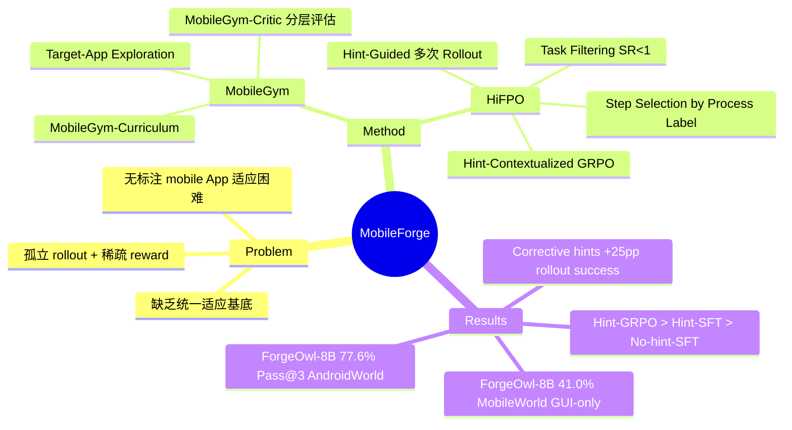

## Summary

MobileForge 是一个免标注的移动端 GUI Agent 自适应系统，通过 MobileGym（真实 App 交互的探索与分层评估基底）和 HiFPO（Hierarchical Feedback-Guided Policy Optimization，利用纠错 hint 和步骤级 GRPO）实现对目标 App 的自动适应，无需人工写任务、演示或 reward label。ForgeOwl-8B 在 AndroidWorld 上达到 77.6% Pass@3，是当前最强的 open-data 移动 GUI Agent。

## Problem & Motivation

MLLM-based 移动 GUI Agent 在 UI 理解和动作执行上已有长足进步，但实际部署时需要适应大量频繁更新的目标 App，人工写任务/演示/reward 标签代价极高。现有 annotation-free 方法虽然减少了人工监督，但存在两个瓶颈：（1）缺乏统一的移动 App 探索、课程挖掘、rollout 执行和反馈评估一体化基底，导致生成任务 grounding 弱、评估与策略学习脱节；（2）策略优化将 rollout 视为孤立经验，只用稀疏 reward，难以把 failure 转化为可靠的提升信号。

## Method

MobileForge 由两个核心组件构成：

**MobileGym — 交互与评估基底**
- **Target-App Exploration**：借鉴 GUI-explorer 的 function-aware 策略，用 APK 中声明的 activity 作为结构锚点，结合当前截图生成目标导向的探索任务，通过深度优先遍历采集 before/after 截图、动作、元素和自然语言摘要，形成探索证据池 Z。
- **MobileGym-Curriculum**：将探索证据转化为可执行任务，每个任务包含 instruction、step budget、core functionality、variation type 和 prerequisites 五要素，确保任务 grounded in 真实 App 状态。
- **MobileGym-Critic（分层评估器）**：对完成的 rollout 返回三层反馈：(a) trajectory-level outcome label z ∈ {0,1}；(b) step-level process label（每步 reasonable/unreasonable + rationale）；(c) corrective hint（失败总结、应规避的行为、建议替代路径）。实现为 agentic hierarchical evaluator：先用 VLM 生成每步的 action-centered 描述，再由决策模型综合输出 JSON verdict。

**HiFPO — 反馈驱动策略优化**
- **Hint-Guided Multi-Attempt Rollout**：同一任务跑 K 次，后续 attempt 的 prompt 中注入前序 attempt 生成的 corrective hint context，使策略能从错误中自我修正。
- **Task Filtering**：移除所有 attempt 均成功（SR=1）的任务（已掌握），保留全失败和部分成功的任务（仍有提升空间）。
- **Trajectory & Step Selection**：对每个保留任务，优先选取成功 attempt 中 reasonable step 比例最高的，若全部失败则选局部质量最高的。只抽取被标记为 reasonable 的步骤加入训练集 D，避免对错误动作做强化。
- **Hint-Contextualized Step-Level GRPO**：每个训练样本是一个含 corrective hint context 的单步决策。对每步在相同 hint-conditioned 状态下采样 G 个候选动作，用自适应 GUI 动作奖励（分离 action type 和 argument 评分）做 group-relative normalization，最终用 clipped GRPO + KL 正则更新策略。关键区别于标准 step-level GRPO：组间比较是在相同的 feedback-aware 状态下进行的，而非仅凭截图+历史。

## Key Results

**AndroidWorld（in-domain，116 tasks）**
- Qwen3-VL-8B (base) → ForgeQwen3-8B：Pass@3 从 55.2% → 67.2%（+21.9pp），接近有闭源数据的 GUI-Owl-1.5-8B base（69.0%）。
- GUI-Owl-1.5-8B (base) → ForgeOwl-8B：Pass@3 从 69.0% → 77.6%（+12.5pp），Pass@1 从 56.0% → 67.2%（+20.0pp），Hard 任务从 19.3% → 29.8%（+54.4%）。
- 任务量 scaling：200→400→900 生成任务均有提升，900 任务效果最强。

**MobileWorld GUI-only（out-of-domain，117 tasks，零 MobileWorld 数据）**
- ForgeOwl-8B：41.0% success rate，超越所有 open-data 移动 GUI Agent（次优 OpenMobile-8B 17.7%），接近 GUI-Owl-1.5-32B（43.9%）。
- ForgeQwen3-8B：10.3%（+35.5% vs. base 7.6%），跨域迁移有限，说明 base model 能力仍是关键。

**关键消融**
- Corrective hints：整体 rollout 成功率从 52.0% → 77.0%（+25pp），验证了 hint 而非仅多次采样带来提升。
- Hint-contextualized GRPO vs. SFT：GRPO 在 200/900 任务下均优于 hint SFT，no-hint SFT 甚至低于 base（34.5% < 40.5%），说明 hint context 和 group-relative optimization 缺一不可。
- Task filtering：保留 all-fail + mixed 任务（SR range [0.0, 0.9]）效果最好，移除掌握任务而非移除失败任务是正确策略。
- Curriculum grounding：对比仅从首屏生成任务，MobileGym-Curriculum 覆盖更广泛的功能（如 shopping list、cooking assistant、meal planner 等），避免过度集中于少数可见功能。

## Strengths & Weaknesses

**亮点**
1. **系统闭环设计**：MobileGym + HiFPO 形成完整的 explore → mine → rollout → evaluate → optimize 闭环，区别于只解决数据构建或只解决 RL 优化的孤立方法。
2. **分层反馈利用彻底**：同一 rollout 的 outcome、step-level process label 和 corrective hint 分别服务于不同阶段（任务过滤、步骤选择、GRPO 状态条件化），设计细腻。
3. **消融充分**：对 hint 有无、训练目标、过滤策略、评估模型、课程 grounding 均有清晰 ablation，insight 可信度较高。
4. **跨域泛化惊喜**：仅用 AndroidWorld 侧数据，ForgeOwl-8B 在 MobileWorld 上达到 41.0%，说明学到了可迁移的 mobile GUI 操作模式。
5. **评估模型可替换**：用开源 Qwen3-VL-8B 作评估器仍有改进，系统不强依赖 Gemini 等专有模型。

**局限与疑问**
1. **计算成本高**：主实验用 8×A100 80GB 跑约 80 小时，且需要大量 App 交互（3249 任务候选），实际工程成本不菲；论文未报告完整 rollout 成本。
2. **评估依赖专有模型**：主实验用 Gemini 2.5 Pro 作 critic 决策模型，这在研究可复现性上是隐患（切换到开源模型性能下降明显）。
3. **Hard 任务提升有限**：即使是最强的 ForgeOwl-8B，Hard 任务 Pass@1 只有 29.8%，game-playing、multi-app、memorization/counting 任务完全没有改善，说明核心能力瓶颈未被 annotation-free adaptation 解决。
4. **ForgeQwen3-8B 跨域泛化弱**：10.3% vs. ForgeOwl-8B 41.0%，说明 annotation-free adaptation 对 base model 强度有很强依赖，方法本身无法 bootstrap 一个弱基础模型。
5. **Corrective hint 质量评估缺失**：整个系统高度依赖 MobileGym-Critic 生成的 hint 质量，但论文没有单独分析 hint 准确率或 hint 质量对最终结果的敏感性。

## Mind Map

## Notes

- 这篇工作和 [[2412-AgentTrek]] 有互补关系：AgentTrek 侧重从 web 教程挖掘 GUI 轨迹，MobileForge 侧重从 App 内真实交互自主探索+优化。
- HiFPO 的核心创新点其实是把 corrective hint 做成 GRPO 的状态条件，而非额外 reward 项——这个 framing 很干净，但 hint 生成质量是关键假设。
- 值得关注后续 release：code、data、models 承诺公开（https://mobile-forge.github.io/），若数据质量好可用于训练 baseline。
- 评估指标选 Pass@k（k=1/2/3）而非单次 success rate，更能体现 agent 的 consistency；但 k>1 的结果对比 inference-time 不公平，需注意。
