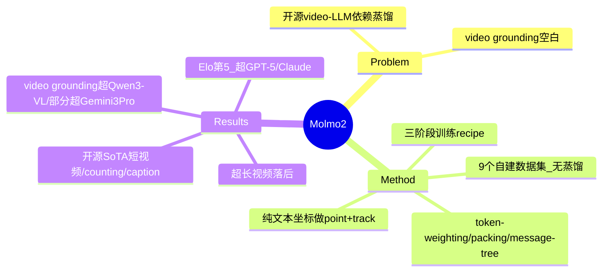

## Summary
开源界缺乏不依赖蒸馏的强 video-LLM，Molmo2 通过 9 个全新自建数据集（无任何 proprietary VLM 蒸馏）+ 三阶段训练 recipe，做出在开源模型中 SoTA 的视频/图像 VLM，并把 image grounding 扩展到视频时空维度（pointing + tracking），部分指标超过 Gemini 3 Pro。

## Problem & Motivation
当前最强的 video-LLM 全是闭源的；而开源 open-weight 模型大多依赖 proprietary VLM 生成的合成数据、且不公开训练数据与 recipe，导致开源社区缺乏在 SoTA video/image LM 上继续改进的「地基」。更关键的是，许多下游应用需要 **grounding**——在像素层面 pointing 或 tracking——而这一能力即便在 proprietary 模型里也很弱、甚至缺失（image grounding 已较成熟，video grounding 几乎空白）。作者要解决的是：能否用**完全公开、不蒸馏**的方式造出兼具理解与时空 grounding 的 VLM。

## Method
Molmo2（Multimodal Open Language Model）是一族 fully-open VLM，三个层面贡献：

1. **数据（9 个新数据集，全部 human + LLM 协作，无 proprietary 蒸馏）**：
   - *Molmo2-Cap*（human）：104k 视频级 + 431k clip 级 dense caption；两阶段流程——标注者口述描述（Whisper-1 转写）→ 用早期 Molmo2 生成 frame/clip caption → LLM 合并成单条长 caption，平均 924 词/视频（远超 LLaVA-Video-178K 的 547 词）。
   - *Molmo2-AskModelAnything*（human）：140k 视频 QA，视频聚成 31 类均衡采样，避免 counting 类（counting 交给 pointing 处理）。
   - *Molmo2-VideoPoint / VideoTrack*（human）：650k+ video pointing query（280k 视频，时空定位）；3.6k clip + 15k tracking query。引入像素级时空 grounding。
   - *Molmo2-CapQA / SubtitleQA*（synthetic，用自家 caption 模型而非 proprietary）：200k + 300k QA。
   - 多图：*MultiImageQA*（human，45k 图集）、*MultiImagePoint / SynMultiImageQA*。
2. **训练 recipe（三阶段）**：(1) image-caption + image-pointing 预训练（32k steps，~4 epochs）；(2) images/videos/multi-image 联合 SFT（30k steps，seq len 16,384）；(3) 短 long-context SFT（2k steps，F=384 帧，Ulysses/CP 8-GPU 并行）。关键技巧：**novel token-weighting scheme**（长 caption 4000+ token 会主导 loss → 固定权重 0.1 给 video caption、0.2 给 pointing 平衡）、**sequence packing**（on-the-fly 打包，15× 训练效率）、**message-tree schedule**（一个视频多标注编码成树，自定义 attention mask 防跨分支 attend）、**visual token 间 bi-directional attention**（消融显示显著提升）。
3. **架构**：标准 ViT + connector + LLM。图像 K=8（训练）/ K=24（推理）overlapping crops；视频 2 fps 采样、最多 F=128/384 帧。Pointing/tracking 用**压缩的纯文本坐标格式**（归一化 x,y + timestamp/image index + 每个 object 唯一整数 ID）表示，使 counting/tracking 可学。发布 4B/8B（Qwen3 LLM）与 7B（OLMo，完全开放）三个版本。

## Key Results
- **开源 SoTA**：短视频理解、counting、captioning 上为 open-weight + open-data 类最强。Video benchmark 平均（Table 2）Molmo2-8B 63.1，Elo 1057 排名第 5（在 GPT-5、Claude Sonnet 4.5 之上）。
- **Video grounding 领先**：video counting close-acc 35.5 vs Qwen3-VL 29.6；video object tracking 56.2 vs 41.1 J&F。video pointing 上 Molmo2-8B 在部分任务超 Gemini 3 Pro（38.4 vs 20.0 F1）。Molmo2-Track 在 ReasonVOS / 自建 Molmo2-Track 上超过包括专用分割模型在内的所有 baseline。
- **human preference**：105k ratings、Bradley-Terry Elo，Molmo2 与现有 open-weight 持平或更好，并领先少数 proprietary。
- **诚实的短板**：在 10 分钟以上 **ultra-long video** 上落后于最佳 open-weight 模型，作者归因于缺乏开源长视频训练数据 + 算力限制，无法做超长 context 训练。

## Strengths & Weaknesses
**Strengths**
- **真·可复现**：data + weights + code + recipe 全开，且明确「不蒸馏 proprietary VLM」——这是与多数 open-weight VLM（偷偷蒸 GPT/Gemini）的本质区别，对社区是稀缺的干净地基。
- **video grounding 是真创新**：把 2D pointing 范式扩到时空，pointing/tracking 用统一纯文本坐标格式接入 LLM，部分指标超 proprietary，填补了 video grounding 的空白。
- 扎实的数据工程（口述+Whisper+Molmo 自迭代生成 caption）和训练系统优化（packing、message-tree、token-weighting），消融充分。

**Weaknesses / Caveats**
- **联合训练有 tradeoff**：消融显示专用模型（Point-Only / Tracking-Only）在各自任务上优于联合模型（如 VideoPoint 任务联合训练即便上采样仍更难学），「一个模型全包」是有代价的。
- **超长视频是硬伤**，受限于开源长视频数据与算力，这恰是真实应用（长录像、监控）的关键场景。
- 作者自陈 **grounding 评测的 setup（帧数/prompt）并非全公开**，跨模型对比需谨慎——这点值得肯定其诚实，但也意味着「超 Gemini」的数字有 setup 依赖。
- tracking 依赖外部 SAM-2 把 point 转 mask 来算 J&F，端到端 grounding 仍是 point 而非 mask。

**潜在影响**：很可能成为开源多模态社区做 video 理解与 grounding 的新基线/起点，尤其对需要像素级定位的 agent/embodied 下游（与 [[2605-MolmoAct2]] 的 action reasoning 同源团队，技术栈可互通）。

## Mind Map

## Notes
- 与 [[2606-VISTAGym]] 形成对照：Molmo2 走「更好的数据+grounding 能力」，VISTA 走「RL 让 VLM 学会调工具做视觉推理」——一个把能力**内化**进模型，一个把能力**外接**成工具。哪条路在 fine-grained 视觉推理上更 scalable，是值得追的 first-principles 问题。
- 待确认：date_publish 取 CVPR 2026（June）；OpenAlex/CVF listing 未给逐篇日期，月份按 CVPR 惯例（6 月）填。
