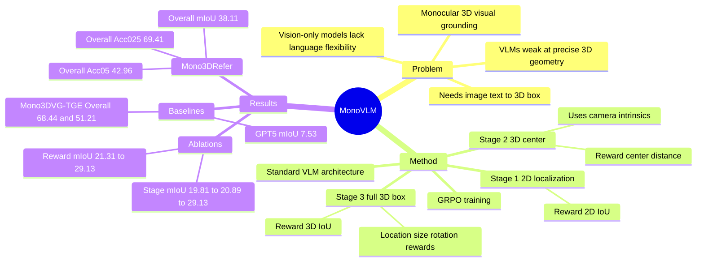

## Summary
MonoVLM 把 monocular 3D visual grounding 重新表述为一个可分阶段强化学习的 VLM adaptation 问题：先学 2D grounding，再学 3D center，最后预测完整 3D bounding box。论文的关键发现是，直接用 3D IoU 做 GRPO reward 太稀疏，而 coarse-to-fine 的三阶段 GRPO curriculum 能把 7B VLM 从近乎失效的 3D grounding 提升到接近甚至部分超过专用 vision-only 模型的水平。

## Problem & Motivation
Monocular 3D visual grounding 要求模型根据单张 RGB 图像和自然语言描述，在 camera coordinate system 中预测目标物体的 3D bounding box `(x, y, z, l, w, h, theta)`。这个任务对 robotics、3D scene understanding、autonomous driving 都重要，因为它同时要求 semantic disambiguation、2D localization、depth / geometry reasoning。

作者指出，现有 specialized vision-only models 在该任务上有效，但语义理解和语言泛化能力受限；相反，现代 VLM 在 instruction following 和 2D visual understanding 上强，但在 Mono3DRefer 这类 precise 3D grounding 上几乎失效。论文把失败来源拆成三类：2D grounding 不够精确、3D geometry 理解不足、即便给定 camera intrinsics 也不能有效利用 projection / unprojection 的几何约束。

## Method
MonoVLM 使用标准 VLM 架构，不改模型结构，而是用 Group Relative Policy Optimization (GRPO) 做三阶段 instruction tuning。所有实验采用 compact 3D box parameterization：center `(x, y, z)`、dimensions `(l, w, h)` 和 yaw `theta`；方法假设 training 和 inference 都可获得 camera intrinsics。

1. **Stage 1: 2D Localization**  
   第一阶段让模型根据文本描述输出目标物体的 2D bounding box，用 predicted box 和 ground-truth box 的 2D IoU 作为 GRPO reward。这个设计来自 pilot study：直接优化 3D IoU 时，模型的 depth `z` 误差相对小，但 lateral / vertical 的 `x, y` 误差很大，说明瓶颈首先是 2D image plane localization。

2. **Stage 2: 3D Center Prediction**  
   第二阶段让模型预测 3D box center，reward 是 `exp(-beta * ||c_hat - c||_2)`。论文强调这里没有额外 depth supervision；模型需要从 2D localization、camera intrinsics 和 2D-to-3D unprojection 关系中学习 3D center。Figure 3 显示，在只优化 3D center reward 时，2D grounding reward 也同步提升，作者将其解释为 2D/3D localization 之间存在 geometric synergy。

3. **Stage 3: Full 3D Grounding**  
   第三阶段预测完整 3D bounding box。主 reward 是 3D IoU，但为了避免 sparse reward，额外加入 location、size、rotation 三个 component-wise rewards：location 用 center Euclidean distance，size 用 normalized L1 distance，rotation 用 yaw angle 的 cosine similarity。默认把 3D IoU 与三个 component rewards 等权相加。

实验把该 recipe 应用于 Qwen2.5-VL-7B 和 MiMo-VL-7B，得到 MonoVLM-Qwen 与 MonoVLM-MiMo。训练实现使用 EasyR1，论文报告所有 GRPO 阶段在 4x H100 GPU 上用 default hyperparameters 运行。

## Key Results
**Benchmark: Mono3DRefer.** 论文遵循 Mono3DRefer 官方 split：train 29,990、validation 5,735、test 5,415，并按 Unique / Multiple、Near / Medium / Far、Easy / Moderate / Hard 做细分评估；指标包括 Acc@0.25、Acc@0.5 和 mIoU。

**VLM baselines 几乎失效。** 在 Mono3DRefer Overall 上，未训练的强 VLM Acc@0.25 / Acc@0.5 很低：MiMo-VL-7B 为 1.11 / 0.05，Qwen2.5-VL-72B 为 0.20 / 0.00，Gemini-2.5-Pro 为 1.81 / 0.07，GPT-5 为 5.98 / 0.23。对应 Overall mIoU 也低：GPT-5 最高但只有 7.53，GPT-o3 为 5.93，Gemini-2.5-Pro 为 2.37。

**MonoVLM 显著提升 VLM 的 3D grounding。** MonoVLM-Qwen 在 Overall Acc@0.25 / Acc@0.5 达到 61.89 / 38.13，MonoVLM-MiMo 达到 69.41 / 42.96；mIoU 分别为 29.13 和 38.11。相对最强 VLM baseline GPT-5 的 7.53 Overall mIoU，MonoVLM-MiMo 是约 5x 提升。

**与 specialized vision-only models 的比较是 mixed but strong。** 在 Overall Acc@0.25 上，MonoVLM-MiMo 69.41 略高于 Mono3DVG-TGE 68.44；但在 Overall Acc@0.5 上，MonoVLM-MiMo 42.96 低于 Mono3DVG-TGE 51.21。细分结果中，Multiple 场景 Acc@0.25 为 71.23，高于 Mono3DVG-TGE 的 69.83；Far/Hard 设置下，MonoVLM-MiMo 的 Acc@0.25 / Acc@0.5 为 58.82 / 31.86 和 67.18 / 43.75，均高于 Mono3DVG-TGE 的 52.99 / 27.29 和 52.13 / 33.99。

**Ablation 支持三阶段 curriculum。** 对 MonoVLM-Qwen，三阶段后 mIoU 单调提升：Stage 1 为 19.81，Stage 2 为 20.89，Stage 3 为 29.13。Stage 3 reward ablation 显示，仅用 3D IoU reward 得到 21.31 mIoU，加入 location 后为 25.92，继续加入 size 后为 28.73，最后加入 rotation 达到 29.13。Minimal variant comparison 中，SFT 为 33.07 mIoU / 60.74 Acc@0.25 / 35.79 Acc@0.5，仅用 Stage-3 reward 为 32.59 / 62.33 / 33.01，完整 MonoVLM 为 38.11 / 69.41 / 42.96。

## Strengths & Weaknesses
**已知亮点。** 论文的问题拆解很清楚：不是简单说 VLM 缺少 3D 能力，而是用 pilot study 定位到直接 3D IoU reward 下 `x, y` error 明显大于 `z` error，从而导出先补 2D localization 的必要性。方法也足够简单：不引入 task-specific architecture，只用标准 VLM 加三阶段 GRPO reward curriculum。实验覆盖 open-source / closed-source VLM、vision-only baselines、object uniqueness、distance、occlusion / truncation、多组 ablation，证据链比只报主表更完整。

**已知局限。** 方法显式假设 camera intrinsics 在训练和推理时可用；如果实际 agent 环境没有可靠相机标定，论文没有给出替代路径。主实验只在 Mono3DRefer 上报告，没有跨 dataset 或真实机器人 / 自动驾驶闭环验证。与 Mono3DVG-TGE 的比较也不是全面胜出：MonoVLM-MiMo 在 Overall Acc@0.25 略高，但 Overall Acc@0.5 明显低于 Mono3DVG-TGE，说明高 IoU 精度下仍有差距。论文没有提供系统 failure taxonomy，也没有在正文中给出 MonoVLM 自身代码链接。

**推测。** 对 GUI-agent / computer-use grounding 的启发在于：如果最终目标 reward 太稀疏，可以先训练更可验证的低维定位子任务，再逐步加入结构化参数 reward；这与 GUI grounding 中先 element localization、再 action argument prediction 的 curriculum 有相似性。但论文只验证了 monocular 3D scene，不等价于已经证明该 recipe 可迁移到 GUI。

**不知道。** 论文没有报告 cross-domain generalization、不同 camera intrinsics 噪声下的鲁棒性、训练成本随数据量和 model size 的 scaling、以及是否能在没有 ground-truth 3D box 的弱监督场景中成立。GPT-5 / GPT-o3 等 closed-source baseline 的 prompt 细节和输出解析失败分布也没有展开。

## Mind Map

## Notes
- 这篇论文最有价值的不是“VLM 也能做 3D grounding”这个结论本身，而是把失败拆成可训练的中间能力：2D localization、3D center、完整 3D box。这个 decomposition 比直接堆更大 VLM 更符合 simple, scalable, generalizable 的 taste。
- 结果解读要避免 overclaim：作者确实展示了 MonoVLM 在 Acc@0.25 和部分 Far / Hard 细分上超过 specialized vision-only models，但 Acc@0.5 仍落后于 Mono3DVG-TGE。更准确的说法是 MonoVLM 显著缩小 VLM 与 specialist 之间的 gap，并在部分指标上超过 specialist。
- 一个值得追的问题：Stage 1 的 2D grounding reward 是否可以用更便宜的数据大规模预训练，然后只在小规模 3D-labeled data 上做 Stage 2/3？如果可以，这会让 monocular 3D grounding 的数据依赖更接近 GUI grounding / robotics 中的 mixed supervision 设置。
- 另一个问题是 camera intrinsics 的现实性。GUI-agent 不需要相机标定，但 embodied agent 往往有内参或可估计内参；这决定了 MonoVLM 更像 embodied spatial perception recipe，而不是通用 VLM spatial reasoning 解法。
