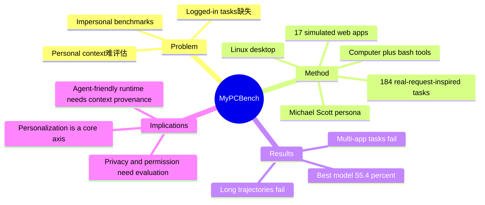

## Summary

> [未获取全文，仅基于 arXiv abstract]

MyPCBench 把 computer-use agent 从通用、无个人上下文的 benchmark 推向 personal assistant 场景：一个带 17 个模拟真实 web apps 和 Linux desktop stack 的 persona 环境，覆盖 184 个来自真实社区请求的任务。它的重要性不在于又多了一个 benchmark，而在于指出 logged-in accounts、历史数据、跨应用个人上下文才是真实 CUA 的难点。

## Problem & Motivation

> [未获取全文，仅基于 arXiv abstract]

现有 computer-use benchmarks 多在 impersonal environment 中评估 agent，避免登录态、个人信息和跨 app 生活上下文。这让评估和实际部署之间存在明显断层：真实个人助理必须能在用户邮件、日程、文件、web account、历史偏好之间切换。Live web benchmark 通常无法安全、可复现地处理需要登录或个人数据的网站，而这些正是 personal assistant 的核心任务。

MyPCBench 的问题 formulation 更接近真实产品：不是“agent 能否操作一个网页”，而是“agent 能否在一个具有个人历史和多应用状态的桌面中完成用户请求”。这会把隐私、权限、上下文引用、长轨迹恢复都推成 first-class challenge。

## Method

> [未获取全文，仅基于 arXiv abstract]

MyPCBench 构建了一个 canonical persona，使用《The Office》中的 Michael Scott 作为种子人物，将 Linux desktop 与 17 个模拟真实 web applications 组合成统一环境。任务来自 OpenClaw community 中真实请求的启发，最终形成 184 个任务。

评测接口统一为 computer + bash tool surface，因此模型既能通过 GUI 操作，也能用 shell 辅助完成部分任务。作者比较了 6 个闭源和开源权重模型，重点观察模型在 personalized multi-app task、长轨迹和个人上下文引用上的表现。

这条路线与 [[Papers/2605-SaaSBench]]、[[Papers/2606-CUAGym]]、[[Papers/2600-WebHarbor]] 互补：SaaSBench 强调真实 SaaS workflow，CUA-Gym 强调 verified RLVR tuple 生成，WebHarbor 强调 local mirror 和 reset；MyPCBench 则把 personal context 和 logged-in-like state 纳入环境设计。

## Key Results

> [未获取全文，仅基于 arXiv abstract]

- Benchmark 包含 17 个 simulated real-world web applications、完整 Linux desktop stack 和 184 个任务。
- 最强模型 Claude Opus 4.6 fully solves 55.4% tasks，是唯一超过 50% 的模型。
- 失败主要集中在跨多应用任务和长轨迹任务；也就是说，personalization 不是背景设定，而是实际增加了组合复杂度。

## Strengths & Weaknesses

**Strengths**:

- **问题真实**：logged-in accounts、历史数据、personal context 是现有 live web / desktop benchmark 主动回避的难点。
- **环境可复现**：用 simulated web apps 代替真实个人账号，保留个人上下文结构，同时降低隐私和可复现性风险。
- **与 agent-friendly environment 方向强相关**：personal assistant 场景天然需要 permission、state visibility、sandbox、privacy-aware verifier。

**Weaknesses**:

- **persona 单一**：一个 canonical persona 有助于可复现，但不能代表多用户、多文化、多职业的 personal context 分布。
- **模拟应用的真实性边界未知**：abstract 未说明 17 个 app 与真实 SaaS 的功能复杂度差距。
- **安全/隐私 evaluation 可能不足**：benchmark 暴露 personal context，但 abstract 未说明是否系统评估 over-disclosure、permission violation 或无关信息泄漏。

**Impact**:

MyPCBench 提醒我们，agent-friendly environment 不能只关注 reset/verifier/RL throughput。真正部署 personal assistant 时，环境协议还必须支持 privacy-preserving state access、permission boundary 和 multi-app context provenance。

## Mind Map

## Notes

- 对 [[Ideas/AgentFacing-WebRuntime]] 的直接补充：agent-facing affordance 在 personal setting 中必须最小化暴露 state，否则 verifier / state API 本身会变成 privacy leak。
- 可以衍生一个 benchmark-independent metric：personalization leakage risk，即 agent 是否引用或泄漏与当前任务无关的 personal state。
