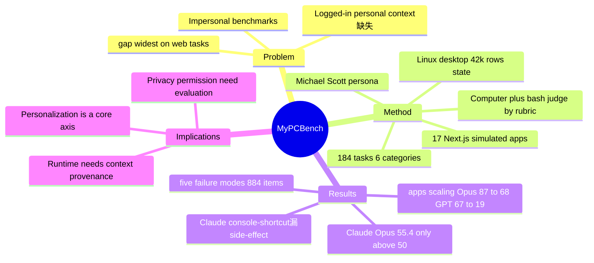

## Summary

MyPCBench 把 computer-use agent 从无个人上下文的 impersonal 评测推向 personal assistant 场景：以《The Office》Michael Scott 为 canonical persona，用一个含 17 个模拟真实 web app 的完整 Linux desktop（预登录账号、海量历史数据）+ 184 个源自真实社区请求的任务，评测 agent 能否在带个人历史和多应用状态的桌面里完成请求。最强的 Claude Opus 4.6 也仅 fully solve 55.4%，失败集中在 long-horizon、multi-app 任务。

## Problem & Motivation

现有 computer-use benchmark 多在 impersonal environment 中评测，刻意回避登录态、个人信息和跨 app 生活上下文。但真实部署要求 agent 在用户完整数字生活里工作——邮件、日程、文件、银行、餐厅都需要 logged-in account 与历史数据。作者指出 "a real personal assistant has to drive" 这些需要登录或个人信息的站点，而 live evaluation 通常排除这类功能，gap 在 web 任务上最宽（银行、餐厅、服务都需认证）。

MyPCBench 的 problem formulation 因此更接近真实产品：不是"agent 能否操作一个网页"，而是"agent 能否在一个有个人历史和多应用状态的桌面里完成用户请求"。这把隐私、权限、跨应用上下文引用、长轨迹恢复都推成 first-class challenge。

## Method

**Persona-based seeding**：以 Michael Scott 为 canonical persona，注入海量个人数据：1,812 笔银行交易、2,398 封邮件、679 个含每周循环的日历事件、2,526 条聊天/工作消息、126 次打车、402 单外卖、155 单零售、29 单生鲜、32 个餐厅预订。

**17 个模拟 web app**：用完整 Next.js 实现镜像真实服务，覆盖 6 个 SimilarWeb 品类——Finance（Gringotts/Chase、BatBucks/Robinhood、SpeedTax/TurboTax）、Travel（Dinoco/Delta、Cheskepdia/Airbnb、eTaxi/Uber）、Food（HangryDash/DoorDash、TableFind/OpenTable）、Ecommerce（HooliShop/Amazon、Kwik-E-Mart/Instacart）、Tech/Productivity（HooliMail/Gmail、HooliCalendar、HooliWork/Slack、HooliChat/WhatsApp、LockedIn/LinkedIn、SprintBoard/Jira）、Gambling（OddsMarket/Polymarket）。

**Linux desktop stack**：Ubuntu 24.04 VM + GNOME Shell，Firefox profile 含 10,746 条历史访问，预登录账号，226 张数据库表共 ~42,000 行 user-facing state；跨应用数据相互关联（一次出行会同时生成 Cheskepdia 预订、两笔 Gringotts 扣款、HooliCalendar 日程、两张 Dinoco 登机牌）。

**184 个任务（6 类）**：源自人工审阅 OpenClaw community 2,749 个匿名 use case 后的真实请求启发——Bounded Action（35%，64）、Multi-Step Orchestration（26%，48）、Cross-Source Reconciliation（14%，25）、Aggregation & Reporting（12%，23）、Personal Lookup（7%，13）、Pattern Inference（6%，11）。68% 为 multi-application、40% 跨多个 SimilarWeb 品类。

**评测接口（computer + bash）**：观测为 1280×800 screenshot + action history（保留最近 20 张）；动作为统一 pyautogui surface（click/type/key/scroll/drag/wait/screenshot/done/fail）。评分用 LLM-as-a-judge（Gemini 3.1 Flash-Lite）对整条轨迹按 rubric 打分（每任务 3–13 条、共 1,191 条加权），报告 Perfect Rate（全过，headline）、Rubric Score（加权部分分）、Trajectory Efficiency（rubric score / step）。

## Key Results

- **Model ranking（Perfect / Rubric Score）**：Claude Opus 4.6 **55.4% / 81.8**（avg 46.5 步，唯一过 50%，是次优的 1.4×）；Claude Sonnet 4.6 39.1 / 65.4；GPT-5.5 29.3 / 54.1；GPT-5.4 mini 19.0 / 48.8；Qwen 3.5 35B-A3B 7.6 / 42.5；Qwen 3.5 9B 2.7 / 7.0。
- **按任务类型**：Opus 单 app 任务强（bounded action rubric 85.3%），但 reasoning-heavy 类下滑；pattern inference 上 Opus 94.7% 而 GPT-5.5 仅 59.1%；aggregation & reporting 上 Qwen 系塌到 0–1%。
- **Scaling—apps 维度**：Perfect rate 随复杂度陡降。Opus 87.4%（1 app）→ 67.9%（7+ apps，−19.5）；GPT-5.5 67.3% → 19.5%（−47.8）；其余模型在 7+ apps 归零。
- **Scaling—steps 维度**：Opus 接近 100 步预算仍在爬升；GPT 在第 60 步附近平台化；Qwen 第 25 步即饱和。
- **失败五模式（共 884 条失败 rubric item）**：Premature DONE（354，GPT 主导 235）、Skipped Required App（323）、Surface Error Terminal（captcha/crash/modal，129）、Partial Artifact（表格开了没存，47）、Hallucinated Persona Data（编造数值，31，Qwen 主导）。
- **家族特征**：Claude 倾向"console-script shortcuts"——用 bash/API 调用代替 UI，满足知识类 rubric 却漏掉 user-visible side-effect；GPT 在多应用协调完成前早停；Qwen 9B 在双工具 schema 下崩溃（rubric 从 20.2% 降到 7.0%）。

## Strengths & Weaknesses

**Strengths**：
- **问题真实**：logged-in account、历史数据、personal context 是现有 live web/desktop benchmark 主动回避的难点，MyPCBench 把它做成核心轴。
- **环境可复现且数据互关联**：用 simulated app 替真实账号，保留个人上下文结构（跨 app 关联记录），同时降低隐私与可复现风险；Docker 化、rubric 公开。
- **评测拆解细致**：Perfect/Rubric/Efficiency 三指标 + 五类失败模式 + apps/steps 双维 scaling，能定位"在哪类复杂度上崩"，比单一 success rate 信息量大得多。
- **揭示家族级 failure**：Claude 的 console-shortcut（满足知识但漏 side-effect）是很有价值的诊断——提示 rubric 必须查 user-visible 效果而非 agent 自述。

**Weaknesses**：
- **persona 单一**：一个 canonical persona 利于复现，但不能代表多用户、多文化、多职业的 personal context 分布。
- **模拟应用真实性边界未知**：17 个 Next.js mock 与真实 SaaS 的功能复杂度差距未充分量化，可能低估真实站点的反爬/动态/边界 case。
- **judge 依赖单一 LLM**：用 Gemini 3.1 Flash-Lite 做 grader，rubric 评分本身可能有 judge bias，尤其对 partial credit。
- **隐私/over-disclosure 评测不足**：环境暴露大量 personal context，但评测重心在任务完成度，未系统评估 agent 是否泄漏与任务无关的个人状态。

**Impact**：提醒 agent-friendly environment 不能只关注 reset/verifier/RL throughput；部署 personal assistant 时，环境协议还须支持 privacy-preserving state access、permission boundary 和 multi-app context provenance。

## Mind Map

## Notes

- 对 [[Ideas/AgentFacing-WebRuntime]] 的直接补充：agent-facing affordance 在 personal setting 中必须最小化暴露 state，否则 verifier / state API 本身会变成 privacy leak。MyPCBench 的 226 表 / 42k 行 state 正是这种 runtime 的具体形态。
- 可衍生 benchmark-independent metric：**personalization leakage risk**——agent 是否引用或泄漏与当前任务无关的 personal state（论文未测，是明显空白）。
- "Claude console-script shortcuts 满足知识 rubric 却漏 user-visible side-effect" 是重要诊断：rubric/verifier 设计必须校验真实状态变更，而非 agent 的自述结论——这对 [[Ideas/HybridVerifier-GUIRuntime]] 的 verifier 设计有直接启示。
- 与 SaaSBench / CUA-Gym / WebHarbor 路线互补：它们强调 SaaS workflow / verified RLVR tuple / local mirror+reset，MyPCBench 独家把 personal context 与 logged-in-like state 纳入环境设计。
