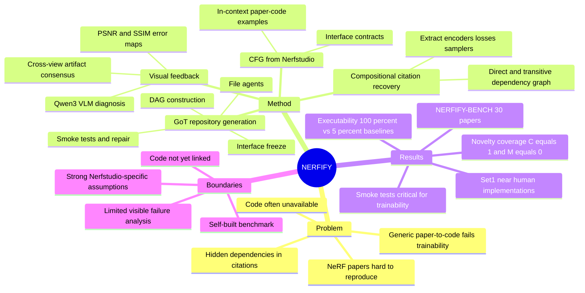

## Summary

NERFIFY 是一个面向 NeRF 论文复现的 multi-agent paper-to-code 框架，把 Nerfstudio 架构形式化为 CFG，并通过 compositional citation recovery、Graph-of-Thought repository generation 和 visual-driven feedback 生成可训练的 Nerfstudio plugin。论文的核心 claim 是：在 NERFIFY-BENCH 的 NeRF paper-to-code 场景中，domain-specific agent design 比通用 Paper2Code / AutoP2C / GPT-5 / R1 更能得到可执行、可收敛且接近 expert implementation 视觉质量的代码。

## Problem & Motivation

NeRF 领域从 2020 年以来有大量 follow-up，但作者指出许多论文缺少公开代码或标准化实现，后续研究者常需要花数周重新实现已有方法。NeRF 复现难点不只是把论文段落翻译成 Python：体渲染数学、scene geometry、proposal sampling、loss、encoder、训练稳定性和 Nerfstudio 多文件接口高度耦合，单个 activation、ray-sphere intersection 或 stop-gradient 写错都可能导致 NaN、退化解或 subtle visual artifacts。

通用 paper-to-code 系统的 failure mode 在这里更明显：论文举例说 Paper2Code / AutoP2C 等系统可能把 K-Planes 生成成普通 MLP，或者只产出 dataset loading code；对诸如 "we adopt the distortion loss from [3]" 这样的短句，系统必须沿 citation graph 找到 Mip-NeRF 360 的对应公式并翻译成可训练代码。作者的问题定义因此是：给定一篇 NeRF 论文，自动合成一个 faithful、executable、trainable 的 Nerfstudio repository。

## Method

NERFIFY 是四阶段 pipeline。

**Stage 1: CFG Formalization and In-Context Learning.** 系统用 MinerU 将 PDF 转成结构化 markdown，保留 equations、tables、figures、references 和 implementation details，再由 cleaning agent 删除冗余介绍、related work 等内容，同时验证 abstract 中的关键技术组件仍在 refined document 中。作者把 Nerfstudio 的 module composition 和 interface contracts 形式化为 context-free grammar，并把 curated NeRF paper-code pairs 存入 domain knowledge base，作为后续 synthesis 的 in-context examples。

**Stage 2: Compositional Dependency Resolution.** 论文认为 NeRF 方法通常是 compositional 的，target paper 的关键组件常分散在引用论文中。NERFIFY 构建 citation dependency graph，递归检索 direct 和 transitive dependencies，再抽取 target paper 显式或隐式需要的 architectural modules、loss functions 和 training protocols。K-Planes 是论文给出的代表例：实现它需要 7 个 direct dependencies，包括 Plenoxels、TensoRF、Instant-NGP、Mip-NeRF 360、DyNeRF、EG3D、NeRF-W；算上 transitive dependencies 共 12 篇论文。

**Stage 3: Grammar-Guided Repository Generation.** Master synthesis agent 用 Graph-of-Thought 组织 specialized file-agents，按 repository DAG 的 topological order 生成 Nerfstudio 多文件代码。流程包括 DAG construction、interface freeze、implementation、integration testing：先冻结 class names、constructors、method signatures 和 tensor shapes，再让各文件 agent 生成实现，随后运行 import、shape、gradient、finite-loss 和 smoke-train checks；失败时对 offending node 做 targeted patch。

**Stage 4: Visual-Driven Feedback.** 代码可训练后，系统先 smoke training 3k iterations，再从多个 camera viewpoints 渲染图像并交给 critique agent。metric branch 用 local-window PSNR / SSIM maps 找高误差区域；geometry branch 用 Cross-View Artifact Consensus 检测 floaters / ghosting 等跨视角不一致结构；semantics branch 用 Qwen3 VLM 对 artifact triplets 生成 structured diagnosis 和 candidate patches。循环终止条件是 critique agent 不再反馈、达到最大迭代次数，或达到原论文报告的 PSNR target。

## Key Results

**NERFIFY-BENCH.** 作者构建了 30 篇论文的 benchmark，分为 10 篇 never-implemented papers、5 篇 non-Nerfstudio papers、5 篇 Nerfstudio-integrated papers、10 篇 novelty-coverage papers。实验使用 NVIDIA A6000 48GB，标准训练设置为 100k iterations，benchmark 包含 Blender 和 DTU 等数据集。

**Set 1: never-implemented papers.** Table 1 比较了 paper-reported、human expert implementation 和 NERFIFY 的 PSNR / SSIM / LPIPS。KeyNeRF 上，human 为 25.70 / 0.89 / 0.12，NERFIFY 为 26.12 / 0.90 / 0.09；mi-MLP NeRF 上，human 为 22.64 / 0.87 / 0.15，NERFIFY 为 22.85 / 0.87 / 0.15；ERS 上，human 为 26.87 / 0.90 / 0.12，NERFIFY 为 27.02 / 0.90 / 0.12；TVNeRF 上，human 为 26.81 / 0.92 / 0.12，NERFIFY 为 27.30 / 0.92 / 0.10。正文 4.3.1 总结为平均 within 0.5 dB PSNR and 0.02 SSIM；abstract 中写作 "±0.5 dB PSNR, ±0.2 SSIM"，这里存在一个 SSIM 精度表述不一致。

**Executability baseline.** Table 2 在 trainable implementation 维度比较 Paper2Code、AutoP2C、GPT-5、R1 和 NERFIFY：Paper2Code / GPT-5 / R1 能 resolve imports，AutoP2C 不能；但 compiles/trainable、training stability、converges to paper results 三项只有 NERFIFY 为通过。正文还概括说 NERFIFY 的 executability 为 100%，generic baselines 为 5%，并称 generic baselines 在 95% cases 中不能产出 trainable code。

**Existing implementations.** Table 3 显示 NERFIFY 在 Vanilla NeRF 和 Nerfacto 上复现了 original repository 指标：Vanilla NeRF 31.36 / 0.95 / 0.04，Nerfacto 20.36 / 0.82 / 0.22。对非标准 author repo，L0 Sampler original 为 29.21 PSNR、0.04 LPIPS，NERFIFY 为 30.13 PSNR、0.97 SSIM、0.03 LPIPS；InfoNeRF original 为 18.27 / 0.81 / 0.23，NERFIFY 为 17.87 / 0.69 / 0.44，说明并非每个已有实现都被完全匹配，InfoNeRF 上 perceptual metrics 明显变差。

**Novelty coverage.** Table 4 在 10 篇 novelty-coverage papers 上度量 C(correct implementation rate)、I(partial/incorrect)、M(missing)、W(hyperparameter match) 和 LLM semantic score。NERFIFY 在所有列出的 paper 上 C=1.00、M=0.00，Score 在 0.95-1.00；例如 TensoRF 上 NERFIFY Score=0.98，而 Paper2Code / AutoP2C / R1 / GPT-5 分别为 0.12 / 0.28 / 0.65 / 0.72；MCNeRF 上 NERFIFY Score=0.95，而四个 baseline 分别为 0.15 / 0.08 / 0.74 / 0.95，其中 GPT-5 在该例接近 NERFIFY 但 C=0.75、M=0.00，不是完全正确实现。

**Ablation.** Table 5 显示 full NERFIFY 的 Score=0.98、Trainable=100%、Correct Novelties C=1.00。去掉 in-context examples 后 Score=0.71、Trainable=90%、C=1.00；去掉 citation recovery 后 Score=0.68、Trainable=100%、C=0.65；两者都去掉时 Score=0.58、Trainable=90%、C=0.65。去掉 smoke tests 时 Trainable 从 100% 降到 60%、Score=0.69、C=0.85；one-shot/no-GoT 时 Score=0.45、Trainable=70%、C=1.00。一个值得注意的结果是，w/o VLM Feedback 的 Score=0.99、Trainable=100%、C=1.00，略高于 full 的 0.98；论文解释为 full system 会为了实际 convergence 调整 hyperparameters，降低严格 paper fidelity 指标。

## Strengths & Weaknesses

**已知 Strengths.**

1. 问题 formulation 很具体：不是泛化地做 "paper to code"，而是限制在 NeRF + Nerfstudio 这一有强架构约束、强 benchmark 可验证性的 domain，这让 CFG、interface contracts 和 visual feedback 都有明确落点。
2. Compositional citation recovery 抓住了 NeRF 复现的真实难点。很多论文贡献不是完整系统，而是复用 proposal network、hash encoder、distortion loss、factorization 等已有组件；只读 target paper 的方法很容易漏掉关键实现。
3. Ablation 结果对设计选择有支撑：citation recovery 主要影响 novelty correctness，smoke tests 主要影响 trainability，GoT 主要影响 repository abstraction 和 module boundaries。这比只报告最终 PSNR 更有信息量。
4. Visual feedback 的设计是 domain-aware 的：PSNR minima、cross-view artifact consensus、VLM artifact parsing 都直接面向 NeRF rendering failure，而不是通用 textual self-reflection。

**已知 Weaknesses / boundary.**

1. 论文主文没有给出可访问的 code URL，只说 code、data 和 implementations will be publicly released；因此从论文文本本身还不能验证系统实现、prompt、agent orchestration、NERFIFY-BENCH 数据和 generated repositories。
2. NERFIFY-BENCH 是作者自建 benchmark，完整结果、cost analysis、CFG formalization 细节、更多 PSNR ablation 和 code-snippet comparison 都被放到 supplementary。主文足以判断方向，但不足以独立审计所有 claim。
3. Set 2 / Set 3 中作者承认 LLM 可能在 pretraining 中见过已有 codebases；这些实验能证明 Nerfstudio standardization，但不能像 Set 1 一样证明 from-paper synthesis。
4. VLM feedback 的 ablation 并不直接提升 Table 5 的 semantic score；主文称它服务于 practical convergence 和 visual quality，但缺少同表展示的 PSNR/SSIM ablation 来量化这部分收益。
5. 方法高度依赖 NeRF/Nerfstudio 的强结构化生态。作者在 conclusion 说未来会扩展到更多 NeRF variants、NeRF-based methods 和其他 CV research，但当前证据不能直接外推到任意 ML paper-to-code。

**推测.** 对 auto-research / coding agent 的启发不是 "更大的模型自动会复现论文"，而是相反：成功来自 domain grammar、citation-graph retrieval、typed multi-file contracts 和可执行 feedback 的组合。这个 pattern 可能迁移到 GUI-agent 或 embodied-agent 研究中的 benchmark reproduction：先把目标 domain 的 code skeleton、data contract、metric oracle 和 artifact-level verifier 固化，再让 LLM agent 在这些边界内合成和修复实现。

**不知道.** 论文没有系统展示 NERFIFY 自己失败在哪类 NeRF paper 上，也没有公开说明 max iteration count、实际 wall-clock cost、每个 agent 使用的模型配置、prompt 细节或 benchmark task release 形式。也不知道 code release 后 generic baselines 在更强 prompt engineering 或相同 citation-recovery工具支持下会缩小多少差距。

## Mind Map

## Notes

- **我的判断**：rating=4。它和 GUI-agent 不是直接同域，但对 agentic research automation 很相关；尤其是 "domain grammar + executable verifier + visual artifact feedback" 这一组合，比泛用多 agent coding 框架更有研究 taste。
- **和当前研究兴趣的连接**：对 auto-research 来说，NERFIFY 是一个把论文理解、citation traversal、代码生成、运行验证和 artifact-level critique 串起来的具体系统；对 embodied / 3D-representation 来说，它提供了如何把 NeRF paper contributions 转成 Nerfstudio-compatible implementations 的自动化路径。
- **需要后续跟踪**：code/data/benchmark release、supplementary 中的 CFG 细节和 cost analysis、NERFIFY 在非 NeRF CV paper 上的扩展实验、以及 GPT-5/R1 baseline 在同等 retrieval + smoke-test scaffold 下的表现。
