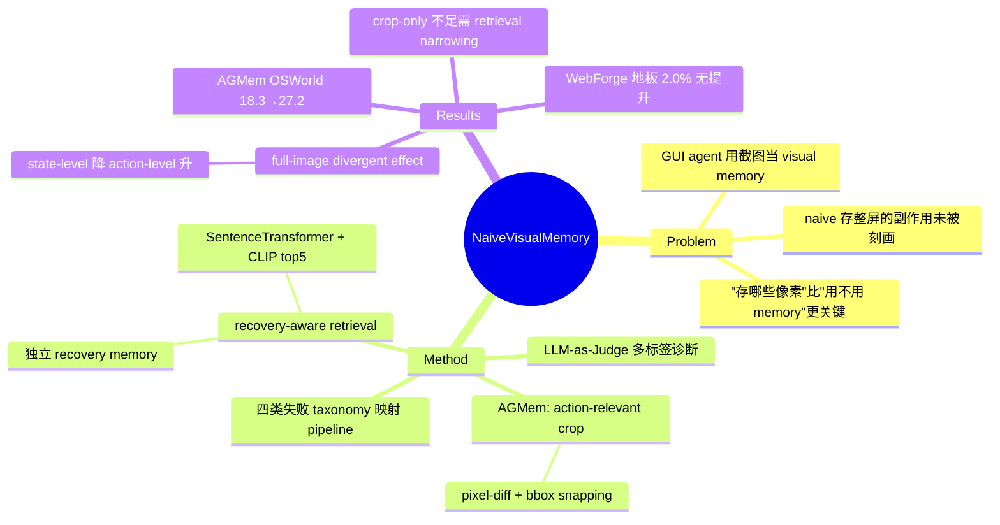

## Summary
系统解剖"把历史整屏截图直接当 visual memory prepend 给 GUI agent"这一 naive 做法：先提出四类失败 taxonomy（cognitive failure / visual state misunderstanding / hidden operation blindness / grounding error，对应 perception-reasoning-action 各阶段），实测发现 full-image memory 有 **divergent effect**——降低 state-level 失败但反而加重 action-level 失败。据此提出 AGMem（只存 action-relevant crop 而非整屏 + recovery-aware retrieval），OSWorld task success 从 18.3% 提到 27.2%（相对 full-image memory 基线 +33.3%）。

## Problem & Motivation
GUI agent 已普遍用 experiential memory：检索过去的 trajectory 来指导当前决策。近期工作进一步把历史**截图**作为 visual memory prepend 进 context，理由是图像比 text-only memory 携带更丰富的 icon / 布局 / 选中区域等线索。但作者指出：视觉记忆到底修好了哪些失败、又在哪里引入回退，从未被系统刻画。核心主张是——memory 有没有用是一回事，"存哪些像素"是另一回事；naive 地塞整屏截图可能得不偿失。这对 GUI agent 可靠性研究有直接意义：它把"加更多视觉历史"这一 convention 拿来做证据检验，而非默认其正确。

## Method
论文分两部分：先用 taxonomy 当"测量仪器"诊断 full-image memory 的副作用，再据此设计 AGMem 修复。

**（一）失败 taxonomy + 诊断协议**。四类失败各对应 VLM-based agent 每步 pipeline 的一个阶段：planning→cognitive failure，perception→visual state misunderstanding，action-space inference→hidden operation blindness，execution→grounding error（grounding error 只在 raw reasoning 表明 intended target 与 GT 一致时才判，否则归前两类）。用 Codex-based LLM-as-Judge 做多标签标注（per-mode rate 不必求和为 100%），benchmark 为 OSWorld（316 tasks，10 域，1920×1080）、WebForge（随机抽 50）、AgentNetBench（offline，per-action）。主实验模型 GPT-5.4-mini。Agent 沿标准 screenshot-based setup：策略 π 接收 instruction、近 3 步 screenshot-action history、当前 screenshot、检索到的 memory steps。

**（二）AGMem = Action-Grounded Visual Memory**，落实"更小 + 更选择性"两个方向：
1. **Action-relevant crop**：对相邻截图 (o_t, o_{t+1}) 取 pixel-wise difference + 形态学滤波 + 向 UI container 做 bounding-box snapping，裁出 action a_t 生效的局部区域 C_t。memory 的原子单元是 memory step m_t = (subtask label s_j, action a_t, crop C_t)；memory bank 从 AgentNet 数据里"正确、非冗余"的 trajectory 构建，并按 LLM 生成的 post-hoc subtask 标签切分 sub-trajectory。
2. **Recovery-aware two-stage retrieval**：trajectory-level 先用 Sentence-Transformer 在 subtask 语义空间贪心选 size-k pool；step-level 再用 CLIP encoder 对 agent self-reported subtask + 上一步 crop 算固定权重相似度，返回 top-5 作为 R_t。另设**独立 recovery memory** 应对 error propagation：LLM-based recovery-state detector 检出错误步后，检索"从错误态恢复"的 corrective 示例（由被主 bank 排除、但后来在同一 trajectory 内被纠正的 sub-trajectory 构成，按 failure mode 标注）。

## Key Results
- **失败分布 benchmark-specific**（Figure 2 / Sec 2.3，GPT-5.4-mini vanilla）：OSWorld 由 hidden operation blindness 67.1%（及 cognitive failure 82.6%）主导，WebForge 由 grounding error 70.0% 主导，AgentNetBench 由 visual state misunderstanding 45.1% 主导。
- **Full-image memory 的 divergent effect**（Table 2 / Sec 2.3，OSWorld）：降低 state-level——cognitive 82.6%→75.0%（-7.6pp）、visual state 73.1%→69.6%（-3.5pp）；但加重 action-level——hidden operation 67.1%→78.8%（+11.7pp）、grounding 27.5%→36.1%（+8.6pp）。整屏截图 accuracy 仅 18.3%→20.4%。
- **AGMem 全面下压四类失败**（Table 2，OSWorld）：Acc 18.3%→27.2%（+8.9pp，相对 20.4% 的 full-image 基线为 +33.3%）；visual state 73.1%→32.3%（-40.8pp）、hidden operation 67.1%→52.5%、grounding 27.5%→22.5%、cognitive 82.6%→67.1%。
- **Crop-only 不够**（Table 2）：+Crop 只到 Acc 25.8%、visual state 68.3%，明显逊于 AGMem（27.2% / 32.3%）；差距由 subtask-aligned retrieval narrowing 补上。
- **跨 benchmark**（Table 3）：AgentNet step acc 25.8%→28.8%（M.Acc 24.2→34.6）；但 **WebForge 三配置全为 2.0%**（地板效应，AGMem 无提升）。

## Evidence Ledger
| Claim ID | Claim | Type | Source locator | Evidence excerpt | Status |
|:--|:--|:--|:--|:--|:--|
| C1 | 四类失败 taxonomy 各映射 perception-reasoning-action 一个阶段 | taxonomy | Sec 2.1, Table 1 | "planning (cognitive failure), perception (visual state misunderstanding), action-space inference (hidden operation blindness), and execution (grounding error)" | source-verified |
| C2 | Full-image memory 降 state-level（-7.6/-3.5pp）、升 action-level（+11.7/+8.6pp） | number/causal | Sec 2.3, Fig 3, Table 2 | "cognitive failure drops from 82.6% to 75.0% (−7.6%p)... hidden operation blindness rises from 67.1% to 78.8% (+11.7%p) and grounding error rises... (+8.6%p)" | source-verified |
| C3 | AGMem OSWorld 18.3%→27.2%（+8.9pp；abstract "+33.3% over full-image memory"，基线 20.4%） | number | Abstract, Table 2/3, Sec 4.2 | "AGMem improves task success rates by 33.3% over full-image memory"; Table 2: 18.3 / 20.4 / 27.2 | source-verified |
| C4 | Dominant mode 各异：OSWorld hidden-op 67.1%（cog 82.6%）、WebForge grounding 70.0%、AgentNet visual-state 45.1% | number | Fig 2, Sec 2.3, Conclusion | "hidden operation blindness on OSWorld (67.1%), grounding error on WebForge (70.0%), and visual state misunderstanding on AgentNetBench (45.1%)" | source-verified |
| C5 | AGMem 降全部四类；visual-state -40.8pp；crop-only 不足（25.8%/68.3% vs 27.2%/32.3%） | comparison | Table 2, Sec 4.1 | "consistently reduces all four failure modes... visual state misunderstanding reduces by about -40.8%p"; "68.3% vs. 32.3%" | source-verified |
| C6 | 机制：整屏截图注入 task-irrelevant 像素，分散对 less-salient operation 的注意并劣化 grounding | causal-mechanism | Sec 2.3 | "full-screen retrieved screenshots substantially expand the visual context with task-irrelevant elements that distract the model from less salient operations" | source-verified |
| C7 | 方法=pixel-diff crop + Sentence-Transformer/CLIP 两阶段 top-5 检索 + 独立 recovery memory(LLM detector) | method | Sec 3.2-3.3, App B | "pixel-wise difference"; "Sentence-Transformer"; "CLIP encoders"; "top-5 memory steps"; "LLM-based recovery-state detector" | source-verified |
| C8 | WebForge 三配置均 2.0%，AGMem 无提升 | number | Table 3 | "Vanilla agent \| 2.0"; "+ visual memory \| 2.0"; "AGMem (Ours) \| 2.0" | source-verified |
| C9 | Setup：OSWorld 316 tasks/10 域/1920×1080；WebForge 抽 50；Codex LLM-as-Judge 多标签 | benchmark-setting | Sec 2.2 | "OSWorld contains 316 tasks across 10 application domains that use a 1920×1080 viewport"; "subset of 50 tasks"; "Codex-based LLM-as-Judge" | source-verified |

## Strengths & Weaknesses
**亮点**
- **Analysis-first，反直觉发现有价值**：把"用不用 memory"与"存什么像素"解耦，实证 full-image memory 是 state↔action 的 trade-off 而非一致改进。这个 divergent effect 直接反驳"截图记忆越多越好"的隐含 convention，是很好的 contradiction evidence。
- **Taxonomy 有区分力**：四类对应 pipeline 阶段，且三个 benchmark 各有不同 dominant mode（OSWorld hidden-op、WebForge grounding、AgentNet visual-state），说明分类不是摆设而是能刻画环境差异。
- **Crop-only ablation 干净**：分离出"裁剪"与"retrieval narrowing"各自贡献，避免把 AGMem 增益全归给裁剪。

**局限 / caveats（施加与对本文同等审视）**
- **规模小、单模型**：主分析几乎只用 GPT-5.4-mini；WebForge 仅抽 50 tasks，OSWorld 316 也不算大；ICML workshop paper，结论稳健性有限。
- **WebForge overclaim**：三配置全 2.0%（地板效应），AGMem 毫无提升，而 WebForge 主导失败恰是 grounding error（AGMem 帮助最弱的模式）；但 Sec 4.2 仍称"generalizes across web-based GUI tasks"——证据不支持。
- **正文数字自相矛盾**：Sec 4.2 写"AGMem reduces [hidden op] from 67.1% to 60.3%"，但 60.3 是 +Crop 行，Table 2 里 AGMem 的 hidden-op 是 52.5（张冠李戴）；Conclusion 写 +9.1%p 而 Table 是 +8.9pp。降低了对文本论断的可信度。
- **标注可信度无背书**：failure attribution 全靠 Codex LLM-as-Judge，未报 human agreement / inter-rater reliability——taxonomy 分布数字建立在一个未验证的 judge 上。
- **train/test 亲缘**：memory bank 从 AgentNet 数据构建，评测又含 AgentNetBench，存在同源风险。
- **机制解释是 correlational**：把 action-level 回退归因于"task-irrelevant 像素分散注意"合理但未做 attention 分析或直接因果消融验证。

## Mind Map

## Notes
- **反例证据定位**：对 thesis「action 必须可追溯到某个 belief source（pixels/structure/memory/prior）且留下可验证的状态改变；hybrid observation 会放大 stale evidence」——本文提供直接实证。full-image visual memory 正是 hybrid observation（当前 screenshot + 检索到的历史整屏），实测显示检索来的 stale/整屏证据挤占 live belief source，使 agent grounding 偏移、错过 hidden operation（action-level 失败 +8.6~+11.7pp）。AGMem 的修法恰好呼应 thesis：把 memory 收缩到 action-relevant、与当前 subtask 对齐的像素（让记忆证据可追溯、可对齐），并用 recovery memory 纠正 faulty premise（re-grounding 到可验证的状态改变）。
- **与 vault 内 GUI 记忆笔记的对话**：[[Papers/2500-ChainMemoryEnhancingGui]]、[[Papers/2603-HybridMemory]]、[[Papers/2606-MemGUI]]、[[Papers/2606-ViLoMem]]、[[Papers/2606-ProceduralMemoryAFTER]]、[[Papers/2409-AgentWorkflowMemory]] 多数主张"加/组织 memory 提升 agent"；本文是少见的 failure-mode 视角，指出**视觉记忆的表征粒度**（crop vs full-screen）比"是否有记忆"更决定成败，是这些工作共同的隐含假设的反例。ViLoMem 的"分类存 visual distraction / logical error"与本文"action-relevant crop + recovery memory 按 failure mode 标注"思路相近，可对照。
- **可追问**：(1) divergent effect 是否随更强模型（GPT-5.5 / Claude / Gemini）消失或反转？本文未系统跨模型验证。(2) crop 由 pixel-diff 构建，静态但语义关键的区域（无像素变化）会被漏掉吗？(3) recovery memory 依赖 LLM detector 的召回率，未报其 precision/recall。
- **GUI survey integration pending**：本笔记带 `gui-agent` umbrella tag，属 GUIAgent-Survey canonical，需下一轮优先 `survey-refresh GUIAgent-Survey` 整合。
