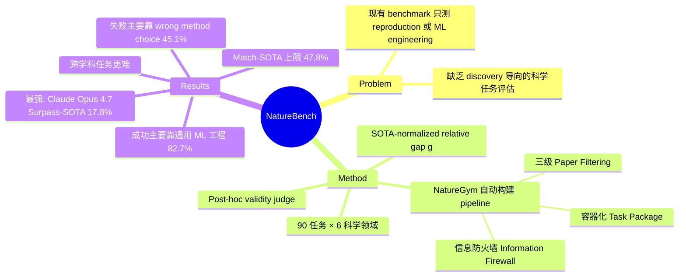

## Summary

NatureBench 是一个包含 90 个任务的 benchmark，从 Nature 系列期刊论文中构建，评估 AI coding agent 能否在自然科学领域超越已发表的 SOTA，而非仅仅复现论文。最强 agent（Claude Opus 4.7）仅在 17.8% 的任务上超越 SOTA，在 47.8% 上与其持平，主要成功路径是将科学任务转化为通用 ML pipeline 而非真正的科学发现。

## Problem & Motivation

现有 AI for Science 评估存在两类局限：paper-based benchmark（如 PaperBench）只测 reproduction，不测 discovery；engineering-optimization benchmark（如 MLE-bench）使用 Kaggle 竞赛任务，缺少真实自然科学所需的 domain reasoning 和跨学科知识。两类 benchmark 都无法回答 AI agent 是否能在真实科学问题上超越人类发表水平。NatureBench 填补这一空白，将评估目标从"是否能复现论文方法"升级为"是否能独立发现与论文持平甚至更好的方法"。

## Method

**NatureGym** 是 NatureBench 的自动化构建 pipeline，将一篇 Nature 系列论文转化为可执行的容器化任务包，包含三个阶段：

- **Paper Filtering**：三级过滤（任务可抽取性 → 评估自动化性 → 数据可获取性），从 ~5,500 篇候选论文筛至 ~200 篇；
- **Dataset Acquisition and Verification**：下载数据集，构建信息防火墙（information firewall）——agent 仅能看到论文核心算法 $A$ 的输入，无法获取 $A$ 本身的输出或操作；
- **Task Package Construction**：构建标准化任务包（task brief + data + hidden ground truth + automated evaluator），每个任务有 SOTA anchor score。

**评估协议**：使用 SOTA-normalized relative gap $g_i = \text{dir}_i \cdot (m_i - m_i^{\text{sota}}) / |m_i^{\text{sota}}|$ 作为主要指标，使不同任务的异质 metric 可以比较。$g \geq 0$ 表示 agent 达到或超越 SOTA。此外设有 post-hoc validity judge（Claude Sonnet 4.6）检测 shortcut 行为（output fabrication、feedback gaming 等）。

**Benchmark 构成**：90 个任务，覆盖 6 个科学领域（cellular omics、protein biology、biomedical modeling、physical modeling、molecular design、relational reasoning），来自 Nature Machine Intelligence、Nature Methods、Nature Computational Science 等期刊，2022–2025 年间发表。共 333 个 evaluation instance，平均每任务 3.7 个。

**校准过程**：在正式评测前用 Claude Opus 4.6 的 reproduce 模式审计每个任务包，丢弃 45 个存在系统性缺陷的任务，修复 17 个，最终固定在 90 个任务。

## Key Results

在 90 个任务、10 个 agent 的评测中（每 agent 独立运行全部 90 任务，共 900 个 runs）：

**主要结果**（按 Surpass-SOTA 排序）：

| Model | Harness | Surpass-SOTA (g>0.1) | Match-SOTA (g≥0) |
|-------|---------|----------------------|------------------|
| Claude Opus 4.7 | Claude Code | **17.8%** | **47.8%** |
| Gemini 3.5 Flash | Gemini CLI | 15.6% | 37.8% |
| GPT-5.5 | Codex CLI | 14.4% | 44.4% |
| Claude Opus 4.6 | Claude Code | 12.2% | 36.7% |
| Qwen 3.7 Max | Claude Code | 10.0% | 28.9% |
| MiniMax-M2.7 | Claude Code | 1.1% | 13.3% |

所有 agent 的整体 Match-SOTA 率仅为 32.2%（均值）。

**Domain 分布**：Relational Reasoning（60.0%）、Protein Biology（37.5%）较易；Molecular Design（18.2%）和 Biomedical Modeling（17.9%）最难。跨学科任务比单学科任务更难（Match-SOTA 从 33.1% 降至 28.0%）。

**成功机制分析**（900 runs）：
- 成功路径中，supervised proxy prediction 占 45.5%，优化/调参占 17.6%，工程 pipeline 占 11.0%；domain-reasoned alternatives 仅占 8.3%。82.7% 的成功依赖通用 ML 工程而非真正的科学发现。
- 失败分布：method-layer failures 占 61.1%（其中 wrong method choice 占 45.1%），execution-layer failures 占 28.7%（insufficient budget/time 占 24.4%），task understanding failures 仅 3.1%。

**Validity 结果**：GPT-5.5 有 13 次 invalid 提交（最多），两个 Claude Opus agent 均无 invalid 提交（100% CR/SR）。

## Strengths & Weaknesses

**亮点**：

1. **定位差异化**：NatureBench 是第一个同时满足"论文来源、真实科学问题、优化导向评估"三条的 benchmark，填补了 PaperBench（reproduction）和 MLE-bench（engineering）之间的空白。
2. **构建流程严谨**：三阶段 pipeline + 信息防火墙 + 多轮质量校准（calibration）的设计，认真对待了 benchmark 的可靠性问题。
3. **诊断价值高**：900 runs 的 failure mode 分析（method choice vs. execution depth vs. understanding）给出了 actionable 的 agent 改进方向。
4. **Metric 设计合理**：SOTA-normalized relative gap 解决了 90 个异质 metric 任务的跨任务可比性问题，同时 Surpass/Match 双指标避免了 mean g 被极端值拖累。

**局限**：

1. **90 个任务的代表性有限**：5,500 篇候选，只有 90 个通过，漏斗比例达 98.4%，主要因数据可获取性（公开、无需申请）过滤了大量论文。最终 benchmark 向 NMI/Nature Methods 倾斜（62 / 90 任务），且集中于可自动评估的 ML 型科学任务，对实验科学、理论科学代表性弱。
2. **90 任务数量仍偏少**：与 MLE-bench（75）、CORE-Bench（270）等相比，发现统计显著差异的 power 受限，特别是细粒度 domain 分析中某些 domain 只有 5–16 个任务。
3. **SOTA 分数的信效度存疑**：paper-reported SOTA 来自论文正文，但不同论文在数据划分、超参选择、random seed 上存在系统差异。"超越 SOTA"的阈值 g>0.1（10%）是拍板定的，没有充分论证这个阈值的统计合理性。
4. **Reproduction-mode 校准暗含循环性**：用 Claude Opus 4.6 来验证任务包是否可复现，再用同一系列模型测 benchmark——模型选择对 calibration 结果有直接影响，可能系统性地保留了"对 Claude 更友好"的任务包。
5. **4 小时 wall-clock budget 限制**：failure mode 分析显示 24.4% 的失败来自 insufficient compute，说明当前 budget 对部分任务不够，但如何设置"公平"的 compute budget 对 90 个复杂度差异巨大的任务本身就是个难题，未深入讨论。

## Mind Map

## Notes

- 这篇论文本身也是 auto-research / AI Scientist 方向的一篇 benchmark paper，和 AutoResearchBench（[[2604-AutoResearchBench]]）、PaperBench 路线有关联但定位不同：NatureBench 强调 discovery（超越 SOTA），而非 reproduction。
- 关键发现：agent 成功主要靠"将科学任务翻译成 supervised ML"而非"科学推理"——这和 GUI Agent 中 agent 依赖模式匹配而非真正理解的批评类似，是 agentic capability 的共性问题。
- 90 个任务的 funnel（5500→90）提示 benchmark 构建本身的瓶颈是"公开数据可获取性"，并非"科学问题难度"，这对如何解读 benchmark 覆盖的代表性有重要影响。
- 使用 Claude Code 作为主要 harness 进行评测，Claude Opus 4.7 排名第一，需要注意潜在的 harness-model 匹配偏差（Claude Code + Claude 模型 vs. Codex CLI + GPT 模型）。
