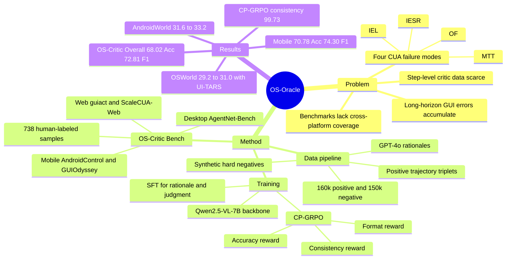

## Summary

OS-Oracle 针对 computer-using agents 的 step-level action correctness 判断，提出了跨 Mobile / Web / Desktop 的 GUI critic 数据合成、训练和评测框架。核心做法是从正轨迹构造四类 hard negative，训练 Qwen2.5-VL-7B-based OS-Oracle-7B，并用 SFT + CP-GRPO 缓解 reasoning 与 final judgment 不一致的问题。

## Problem & Motivation

论文关注的是 long-horizon GUI automation 中的局部错误累积问题：agent 每一步看似合理，但一次错点、错停、错滚动或错误恢复都可能让任务进入不可逆状态。作者把 CUA 的常见失败归为四类：Operation Failure (OF)、Inefficient Error State Recovery (IESR)、Mistimed Task Termination (MTT)、Inaccurate Element Localization (IEL)。前三类更偏 step-level planning / reasoning under partial observability，IEL 更偏 UI element perception / grounding。

已有方向一是直接对 native agent 做 RL post-training，但这依赖环境交互、reward 设计和长任务 rollout，成本高且不稳定；方向二是 critic model / verifier，在每一步执行前判断 action 是否正确，更适合作为可复用的外部监督层。但 GUI critic 的瓶颈是缺少跨平台、高质量、公开的 step-level feedback data，也缺少统一 benchmark，导致现有 GUI critic 多局限在移动端或单一数据分布。

## Method

OS-Oracle 是一个 full-stack framework，包含数据合成、两阶段训练和 OS-Critic Bench 评测。

**Data pipeline.** 作者从已有 GUI trajectory datasets 中提取正样本三元组 `<instruction, screenshot, action>`，再用规则化策略把 gold action 转成 type-specific erroneous action，构造 negative samples。四类 negative construction 对应四种失败模式：

- **OF**：在 click 前插入 type action、重复可点击操作、或在 scroll boundary 追加 redundant scroll，用来模拟 agent 没有感知细微状态变化。
- **IESR**：通过相似 observation 检索并注入错误 next state，除 `back` 之外的操作被视为 negative，用来模拟 agent 进入异常 UI state 后不恢复。
- **MTT**：在成功轨迹后追加冗余操作，或截断未完成轨迹并追加 terminate action，用来模拟 premature stop 或过晚终止。
- **IEL**：用 OmniParser V2 和可用的 metadata / accessibility tree 找 UI elements，通过 IoU > 0.7 对齐后在 2x2 grid 中采样错误元素，构造 action type 正确但目标元素错误的样本。

**Rationale annotation.** 正负样本确定后，作者用 GPT-4o 为 judgment 生成 concise rationales。对负样本，prompt 中显式提供 error category 和 cause；如果 GPT-4o 对 correctness 的判断与 ground-truth label 冲突，就丢弃该样本。最终训练集约为 160k positive samples + 150k negative samples。

**Training.** OS-Oracle-7B 基于 Qwen2.5-VL-7B-Instruct。第一阶段 SFT 同时学习 reason generation 和 judgment prediction；第二阶段使用 Consistency-Preserving GRPO (CP-GRPO)。CP-GRPO 的 reward 由 accuracy reward、format reward、consistency reward 组成，论文设置权重为 `alpha=0.9, beta=0.05, gamma=0.05`，KL regularization coefficient 为 `5e-3`，SFT 训练 1 epoch，CP-GRPO 训练 3 epochs，rollout batch size 512、group size 16。consistency reward 用 rule-based lexicon polarity，必要时 fallback 到 Qwen3-8B 对 rationale polarity 做 proxy judgment，目标是让 rationale polarity 与 final Yes/No judgment 对齐。

**OS-Critic Bench.** Benchmark 覆盖 Mobile、Web、Desktop。Mobile 来自 AndroidControl test set 和 GUIOdyssey test set；Web 来自 guiact test set 和 non-overlapping ScaleCUA-Web subset；Desktop 来自 AgentNet-Bench。作者对每个 screenshot 用 Qwen2.5-VL-7B-Instruct 生成一个 candidate action，再由 human experts 判断该 action 是否推进 task completion，而不是机械对比原轨迹 action。最终 OS-Critic Bench 包含 738 个 human-annotated samples，每个样本包含 task goal、memory、screenshot、待评估 action、critic prompt 和 binary label。

## Key Results

**OS-Critic Bench / Offline Evaluation.** OS-Oracle-7B 在 Overall 上达到 **68.02 Accuracy / 72.81 F1**，高于所有开源模型的 F1；它在 Mobile 上达到 **70.78 Accuracy / 74.30 F1**，超过 GPT-5 的 **69.18 / 69.53**、Gemini-2.5-Pro 的 **68.26 / 70.11**、Claude-4.5-Sonnet 的 **65.30 / 63.46**。需要注意，OS-Oracle-7B 不是所有维度都超过闭源模型：Desktop 上 Claude-4.5-Sonnet 为 **74.34 Accuracy / 77.46 F1**，高于 OS-Oracle-7B 的 **65.79 / 71.11**；Overall Accuracy 也略低于 GPT-5 的 **68.16**，但 Overall F1 更高。

**与开源 critic / CUA 对比.** 在 OS-Critic Bench Overall 上，Qwen2.5-VL-7B 为 **58.27 Accuracy / 66.23 F1**，UI-TARS-1.5-7B 为 **57.45 / 67.83**，GUI-Critic-R1 为 **59.49 / 68.76**，OS-Oracle-7B-SFT 为 **63.14 / 71.49**，OS-Oracle-7B 为 **68.02 / 72.81**。这说明收益既来自 task-specific critic data，也来自 CP-GRPO 后训练。

**Dynamic Evaluation.** 作为 pre-critic 辅助 UI-TARS-1.5-7B 时，OS-Oracle-7B 在 AndroidWorld 上把 success rate 从 **31.6%** 提到 **33.2%**，在 OSWorld 上从 **29.2%** 提到 **31.0%**。同一设置下 GPT-4o critic 反而把 AndroidWorld 降到 **30.2%**、OSWorld 降到 **28.5%**，作者将其归因于 GPT-4o 对 GUI operational elements 的相关知识不足，导致错误评估。

**Data Quality Control.** 用 OS-Oracle-7B 过滤 10k mobile operation samples 后再训练 Qwen2.5-VL-7B-Instruct，AndroidWorld performance 从 base **10.34** 提到 SFT **12.07**，进一步提升到 SFT w/ OS-Oracle-7B **15.52**。这支持 critic model 用作数据筛选器，但实验只报告了 AndroidWorld。

**Ablation.** Synthetic negative data 比 GPT-4o 直接标注 negative 更有效：Qwen2.5-VL-7B baseline 在 OS-Critic Bench Overall 为 **58.27 Accuracy / 66.23 F1**，加入 GPT-Annotated Negatives 后为 **55.42 / 67.33**，加入 OS-Oracle Synthetic Negatives 后为 **60.03 / 69.37**。CP-GRPO 的 consistency reward 也有效：SFT + GRPO 为 **66.53 Accuracy / 80.89 Consistency**，SFT + CP-GRPO 为 **68.02 Accuracy / 99.73 Consistency**。

## Strengths & Weaknesses

**已知的强点**：问题 formulation 很贴近真实 GUI agent 部署：不是只看最终任务成功，而是在每一步执行前判断 action 是否会推进目标。四类 negative construction 对应 CUA 中常见、可操作的 failure modes，比随机 negative 或 outcome-level label 更有监督密度。OS-Critic Bench 的 human annotation 也避免了 GUI 任务中“多个 action 都可行”时 rule-based ground-truth matching 过窄的问题。

**已知的训练设计价值**：CP-GRPO 把 rationale 和 judgment 的一致性显式进 reward，这一点对 critic model 很重要。一个 verifier 如果理由说 action 有助于完成任务，但 final judgment 却判 No，会直接伤害可解释性和可用性；Table 4 的 **80.89 -> 99.73 Consistency** 提供了明确证据。

**已知的边界 / 弱项**：OS-Critic Bench 只有 **738** 个样本，虽然有人类标注，但规模不大。Benchmark candidate action 由 Qwen2.5-VL-7B-Instruct 生成，评测分布可能更偏向这类模型会犯的错误。负样本主要覆盖 OF / IESR / MTT / IEL 四类，不能证明覆盖了所有真实部署中的 GUI failure，例如安全约束、隐私约束、账号状态、外部网页漂移或跨应用 side effect。Dynamic evaluation 的提升是正向但幅度有限，OSWorld **29.2% -> 31.0%**，AndroidWorld **31.6% -> 33.2%**，且只展示了 UI-TARS-1.5-7B + 最多三次 regenerate 的设置。

**推测**：这篇的主要价值可能不在“一个 7B critic 已经足够强”，而在提供了 GUI verifier 的数据构造和评测协议。Synthetic hard negative 的效果说明，critic 数据需要围绕真实 failure mode 设计，而不是简单让 LLM 离线判断轨迹中哪步错；但这种结论仍需要在更多 agent backbone、更多在线环境和更细的错误类型上验证。

**不知道**：论文主文没有系统报告 OS-Oracle-7B 自身的 failure-case taxonomy，也没有报告 latency / inference cost、critic false positive 对 agent 任务效率的影响、不同 human annotator agreement、或 benchmark 中 Mobile / Web / Desktop 的样本精确比例。论文也没有证明 OS-Oracle 对闭源 agents 或更大开源 CUA 的 online gains 是否稳定。

## Mind Map

## Notes

这篇适合作为 GUI verifier / pre-critic 方向的基准读物。它把“critic model 应该评什么”具体化为 `(goal, memory, screenshot, proposed action) -> reason + Yes/No judgment`，比只用 final trajectory outcome 更适合做 step-level intervention。

对后续研究最有启发的是两点：第一，hard negative 应该按 failure mode 设计，否则 LLM-annotated negative 可能带噪并拖累 accuracy；第二，critic 不只要答对，还要保持 rationale 和 judgment 一致，否则很难被 agent runtime 或人类监督者信任。

如果要沿着这篇继续做，关键问题不是再堆一个更大的 judge，而是验证 critic feedback 如何接入 action regeneration、rollback、ask-for-confirmation 或 uncertainty gating。论文只展示了“判错后最多 regenerate 三次”的简单策略，真实系统里 verifier 的 false positive / false negative 成本可能不同，需要单独建模。
