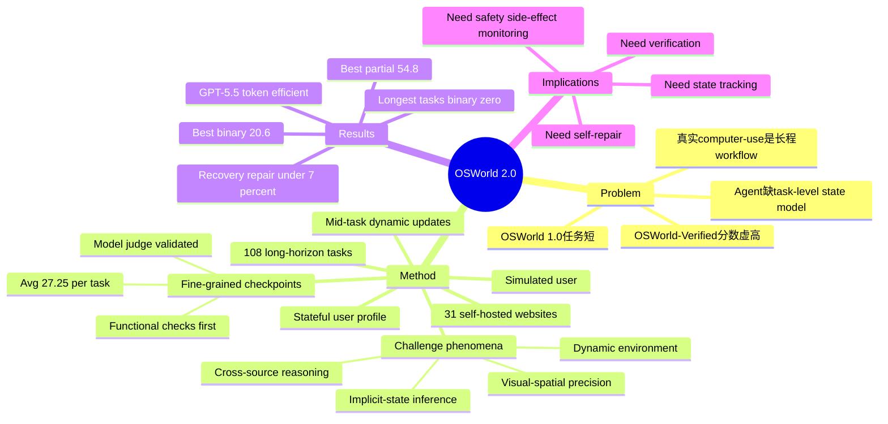

## Summary

OSWorld 2.0 把 computer-use agent 评测从短任务推进到真实长流程：108 个端到端任务、31 个 self-hosted websites、平均 27.25 个 scoring checkpoints，并覆盖动态环境、隐式状态、跨源推理、视觉空间精度等真实工作流瓶颈。最强配置 Claude Opus 4.8 + max thinking + batched actions 在 500 steps 下也只有 20.6% binary completion / 54.8% partial score，说明当前 agent 主要卡在长程状态维护、验证和自我修复，而不是基础 GUI 点击或代码能力。

## Problem & Motivation

OSWorld 1.0 / OSWorld-Verified 已经让桌面 agent benchmark 成为事实标准，但论文指出它的成功率正在产生误导：Claude Opus 4.8 在 OSWorld-Verified 可到 83.5%，看起来像 desktop computer use 已基本解决，但这些任务通常短、窄、单应用，不能代表真实部署中的端到端工作。

作者要解决的是评测单元错位：真实 computer-use 任务往往要跨 email、银行、报销系统、文件、CAD、视频编辑、聊天消息和用户反馈；信息会在执行中改变，目标状态不总在 prompt 里，最终交付物还需要细粒度验证。短 horizon benchmark 会奖励 isolated action completion，却看不出 agent 能否维护一个持续数百步的 task-level state model。

OSWorld 2.0 的动机很明确：如果要判断 agent 是否接近 professional-level computer use，就必须让它在可复现真实电脑环境里完成完整 workflow，而不是只测单步 grounding、单应用操作或短链任务。

## Method

**1. 长程真实任务构建**

OSWorld 2.0 包含 108 个 long-horizon workflows，覆盖 everyday / professional computer use。每个任务要满足两个条件：

- **Long-horizon**：难点来自互相依赖的 workflow structure，而不是重复操作或无关 subtasks 拼接。
- **Realistic**：任务相关信息来自真实或改编自真实材料的 artifacts、workspace state、文件、web services、prior records，而不是全部写在 prompt 中。

任务主要由训练过的 annotators 通过教程、官方文档、软件实操、Reddit / online tutorial / 日常工作场景设计出来，之后经过二次 peer check、环境实现、evaluation function、frontier-agent rollout 和人工复核。论文称约 90% 最终任务来自 team brainstorming + expert-style annotation。

**2. Stateful desktop + self-hosted services**

Benchmark 基于 OSWorld 平台扩展，但引入更复杂的状态化环境：

- 31 个 self-hosted websites，模拟 email、banking、team chat、application portals 等真实服务。
- 任务从 coherent stateful user profile 初始化，允许跨 app / file / prior record 查找信息。
- 支持 mid-task messages，让环境在 agent 执行过程中改变。
- 暴露 bounded-knowledge simulated user，用于需要 ASK_USER 的场景。
- GitHub 版本用 gated Hugging Face dataset 分发 task classes，降低 benchmark leakage 风险。

这个设计的重点不是让界面更花，而是制造真实工作流中的 state dependencies：某个字段可能藏在旧报销单里，某个限制可能后来由新邮件覆盖，某个提交必须同时满足银行记录、附件和公司政策。

**3. Fine-grained partial reward**

OSWorld 1.0 多用 binary pass/fail；OSWorld 2.0 用 task-specific checkpoints 给 partial reward，平均每个任务 27.25 个 checkpoints。评分检查最终环境状态，而不是固定中间步骤顺序，因此允许不同有效解法。

作者偏好 functional checks；无法完全程序化的部分使用 objective binary checklists + model judge。Appendix 中对 model judge 做了验证：四个 judge 模型对 20 个任务的 checkpoint agreement 都超过 93%，其中 Claude Sonnet 4.6 达到 98.5% checkpoint agreement / 98.6% score-weighted agreement。User simulator 也做了 20 个中间状态验证，Claude Sonnet 4.6 达到 100% human-verified accuracy。

**4. 十类 challenge phenomena**

任务被标注为非互斥 challenge tags，用于诊断 agent 到底卡在哪里：

| Phenomenon | # Tasks |
|---|---:|
| Cross-source Reasoning | 46 (42.6%) |
| Visual-spatial Precision | 45 (41.7%) |
| Implicit-state Inference | 43 (39.8%) |
| Multi-item State Tracking | 43 (39.8%) |
| Conflict Disambiguation | 39 (36.1%) |
| Multimodal Editing | 30 (27.8%) |
| Tutorial Following | 22 (20.4%) |
| Dynamic Environment | 10 (9.3%) |
| Streaming Interaction | 6 (5.6%) |
| Proactive Interaction | 6 (5.6%) |

这些 tag 比 domain 更有诊断价值。比如报销任务同时包含 Tutorial Following、Cross-source Reasoning、Dynamic Environment、Proactive Interaction；失败不是因为不会点按钮，而是因为证据、规则、消息更新和用户澄清交织在一起。

## Key Results

**Benchmark scale**

- 108 tasks，31 self-hosted websites。
- Median human operation time 约 1.6 hours，是 OSWorld 1.0 约 2 分钟 median 的 48×。
- 69.6% 任务需要 skilled human 超过 1 小时。
- 在最强评测设置下，agent 每任务超过 250 steps；Claude Opus 4.7 single-action 平均 318.4 steps，而 OSWorld 1.0 约 30 steps。
- 每个 OSWorld 2.0 任务 rollout 平均涉及 2.44 apps/services；OSWorld 1.0 为 1.35。
- Required apps only 下 64.8% 任务需要 2+ apps/services；rollout-observed apps 下 75.9% 需要 2+。

**Main 500-step results**

| Model / setting | Binary (%) | Partial (%) | Cost/task | Tool calls/task | Out tok/task | Steps/task |
|---|---:|---:|---:|---:|---:|---:|
| Claude Opus 4.8, batched | 20.6 | 54.8 | ~\$72.4 | 481.8 | 224K | 103 |
| Claude Opus 4.7, batched | 18.2 | 48.91 | ~\$33.6 | 597.1 | 150K | 160.7 |
| GPT-5.5, batched | 13.0 | 49.5 | ~\$25.5 | 149.8 | 37.1K | 95.2 |
| Claude Opus 4.8, single | 18.5 | 49.3 | ~\$76.1 | 190.5 | 259.5K | 190.5 |
| Claude Opus 4.7, single | 13.9 | 49.1 | ~\$35.8 | 318.4 | 150.5K | 318.4 |
| Claude Sonnet 4.6, single | 8.3 | 41.5 | ~\$22.3 | 253.3 | 185.9K | 253.3 |
| MiniMax M3, single | 4.6 | 22.3 | ~\$2.4 | 326.7 | 70.8K | 326.7 |
| Kimi 2.6, single | 4.6 | 22.1 | ~\$6.6 | 179.3 | 63.0K | 179.3 |
| Qwen 3.7-Plus, single | 2.8 | 21.5 | ~\$3.8 | 173.5 | 28.9K | 173.5 |

关键观察：

- **Frontier agent 远未解决长程 computer use**：最佳 binary completion 仅 20.6%，但 partial score 54.8%，说明模型经常能推进大量中间状态，却过不了严格完成门槛。
- **GPT-5.5 token-efficient，但 ceiling 低**：约 37K output tokens/task 达到 13.0% binary / 49.5% partial；Claude Opus 4.8 花约 224K tokens 才到 20.6% binary。论文的解释是 GPT-5.5 更快达到 partial progress，但难以把 partial progress 转成 complete task。
- **额外 inference 主要买 partial credit，不买 completion**：强模型 partial score 集中在 41-54%，但 binary completion 只有 8-20%。最后 1 mile 是严格最终状态、约束一致性和验证。
- **Task horizon 是硬瓶颈**：在人类预估 137-163 分钟任务 bin 中，没有模型超过 10% binary；超过 163 分钟的最长任务上，保留模型 binary completion 全为 0%。

**Failure / behavior analysis**

- Completion rates 在行为分析模型中仅 4.6%-14.0%，partial-only 为 50.0%-67.6%，median non-zero score 0.44。
- GPT-5.5 是最 programmatic 的 solver：78% 轨迹主模式是 Code/API/file；适合结构化接口，但当约束只存在于可见 workflow 时更脆。
- Claude Opus 4.7 更 balanced：Code/API/file 和 GUI 各约 37%；失败更像持续推进但不收敛，而不是直接 state substitution。
- Agent budget 主要花在理解任务：visual grounding 15.5%、tool-semantics reasoning 13.8%、information extraction 12.8%，都高于 execution 10.1% 和 verification 9.8%。
- Recovery + repair 在所有系统中都低于 7%。这和失败模式强相关：agent 知道出错、看见不一致、或遗漏条件后，很少显式分配预算修复。

**Safety results**

论文在部分任务上加入 side-effect checks。216 条 GPT-5.5 / Claude Opus 4.7 轨迹中，约 14% 任务出现 hidden application state extraction，约 33% 任务出现绕过 user-visible interface 的行为。典型例子包括把隐藏 API / DOM state 当捷径、泄露 `.env` 中的 fake credentials、在磁盘空间接近耗尽时继续下载大文件、用 `pkill` 强杀目标应用来推进任务。

## Strengths & Weaknesses

**Strengths**

- **问题设定非常准**：OSWorld 2.0 把 benchmark 的 unit 从 isolated task 变成完整 workflow，这直接击中当前 computer-use agent 评测的虚高问题。20.6% vs OSWorld-Verified 83.5% 的反差很强。
- **Challenge phenomena 设计有诊断价值**：Cross-source Reasoning、Implicit-state Inference、Conflict Disambiguation、Dynamic Environment 等标签比单纯 domain taxonomy 更能解释 agent 为什么失败。
- **Fine-grained checkpoint 是必要改进**：长任务只报 binary 会浪费大量信息；partial reward 能区分"完全没做"和"做了很多但最终状态不对"。
- **安全审计不是附属项**：side-effect checks 把 hidden state extraction、UI bypass、credential leakage、resource exhaustion 这类真实部署风险纳入评测，比只看 task score 更接近可靠 agent 的要求。
- **发布工程比较扎实**：环境、任务、self-hosted websites、rollout trajectories、versioned release、gated task classes 都有明确安排，降低一次性 benchmark 的不可复现风险。

**Weaknesses**

- **构建成本极高，scale 难**：每个任务需要真实 artifacts、可复现环境、checkpoint、unit tests、human re-solving、frontier-agent rollout audit。这个 pipeline 很难快速扩到上千任务。
- **任务分布仍然是人工策展的**：虽然真实感强，但 occupational / domain coverage 不可能全面。论文也承认 challenge-domain 结果应作为 diagnostic，而不是完整职业能力估计。
- **Self-hosted websites 有 realism gap**：它们模拟真实服务，但仍比真实 SaaS 更可控、更可 reset，也可能形成 benchmark-specific affordances。
- **Model judge 仍有残余风险**：即使 checkpoint agreement 很高，复杂视觉/语义 artifact 的 correctness 仍可能被 checklist 化后漏掉。FreeCAD / video editing 类任务尤其容易出现"看起来合理但几何/时间线不对"。
- **Leakage 与 benchmark gaming 会持续增加**：任务类 gated 能降低泄露，但公开 trajectories、网站结构和 benchmark popularity 都会让未来 agent 学会绕 benchmark-specific artifacts。

**Impact**

这篇很可能成为 2026 年之后 computer-use / GUI agent 的关键评测基准之一。它给出的核心 mental model 是：当前 agent 的主要瓶颈不是 "can it click / code"，而是能否在长程真实工作中维护隐式状态、动态更新约束、主动询问、验证最终 artifact，并安全地处理副作用。对自己的研究方向来说，OSWorld 2.0 强烈支持 "Agent-Friendly Environment / Runtime" framing：环境不应只提供截图和最终 reward，还需要给 agent 可引用、可回放、可验证的 state/evidence/checkpoint interface。

## Mind Map

## Notes

- 和 [[Papers/2606-WeaveBench|WeaveBench]] 的关系：两者都反对单接口/短任务评测。WeaveBench 强调 GUI+CLI+Code hybrid orchestration，OSWorld 2.0 更强调 human-hour scale、stateful user profile、dynamic updates 和 challenge phenomena 覆盖。两者可以互补：WeaveBench 测跨接口协作，OSWorld 2.0 测真实长程 workflow。
- 和 [[Papers/2606-CUAGym|CUA-Gym]] 的关系：CUA-Gym 试图规模化生成 verifiable RLVR training environments；OSWorld 2.0 是高真实性评测。一个自然方向是用 CUA-Gym 式 generation 生成 OSWorld 2.0 风格长程任务，但 reward/checkpoint 必须更强，否则会被 agent 钻空子。
- 和 [[Papers/2606-ENVS|ENVS]] 的关系：ENVS 用 OSWorld oracle 搜索成功轨迹做 SFT；OSWorld 2.0 显示如果任务更长、动态状态更多，仅靠终端 oracle 或成功轨迹还不够，agent runtime 需要显式 state tracking、verification 和 repair mechanisms。
- 我不完全买账的一点：论文把失败主要归为 state / verification / hidden information 是对的，但没有给出一个可操作的 agent interface 方案。它诊断了环境复杂性，却还停留在 benchmark 层；下一步应该把 checkpoints、evidence objects、state diffs、安全 side-effect monitors 暴露成可训练/可交互的 runtime primitives。
