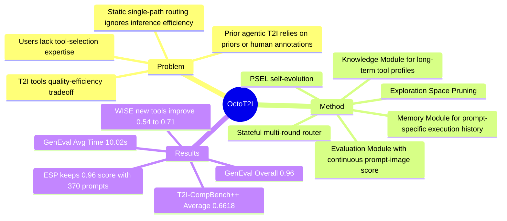

## Summary
OctoT2I 把 Text-to-Image 生成建模成“质量达标前提下最小化推理成本”的 tool routing 问题，用 self-evolving mechanism 自动构建各 T2I 工具的能力知识库，再由 stateful multi-round router 在推理时选择工具。论文的核心价值不是提出新的 T2I backbone，而是证明 agentic router 可以在 GenEval / T2I-CompBench++ 上接近或超过强 T2I 模型，同时显著降低平均推理时间、能耗与 CO2e。

## Problem & Motivation
T2I 领域同时存在大模型路线和轻量高效路线：前者质量强但计算成本高，后者快但复杂 prompt 上容易退化。用户通常不知道某个 prompt 应该交给哪个模型，固定使用单一工具会造成质量或成本上的 suboptimal choice。已有 agentic T2I 系统虽然会用 LLM 调度多个工具，但作者指出它们常依赖 handcrafted priors 或 human-annotated SFT，且多为 static / single-path decision，对 inference efficiency 关注不足。OctoT2I 的问题设定是：在用户可接受质量阈值 $\theta$ 下，选择满足质量要求且成本最低的 T2I tool。

## Method
OctoT2I 由 router agent、Knowledge Module、Memory Module 和 Evaluation Module 组成。给定 prompt $p$，每一轮 agent 基于长期知识 $K$ 和当前任务 memory $M_{r-1}$ 选择工具 $t_r=\pi(p,K,M_{r-1})$，生成图像 $I_r$，再用 evaluation function $q_{eval}(I_r,p)$ 得到分数 $s_r$；若 $s_r \ge \theta$ 或达到轮数上限 $R$，返回当前 best-so-far 图像，否则把本轮工具、图像和分数写入 memory 继续下一轮。

Decision Policy 被写成 LLM-driven 的 “filter-then-select”：先估计每个工具在当前 prompt 上是否能达到质量阈值，再在 feasible tools 中选择估计成本最低者。论文实现中 controller 是由 GPT-4.1 policy distillation 得到的 Qwen2-0.5B，默认 $R=4$、$\theta=0.8$。

Self-Evolving Mechanism 用来从零构建长期知识库，而不是依赖专家手写描述或人工标注数据。流程先让 LLM 定义 $N_D=7$ 个 fundamental conceptual dimensions，然后在维度组合空间中运行 Propose-Solve-Evaluate-Learn (PSEL) loop：Propose 为当前维度组合生成 $N_p=10$ 个 prompts；Solve 让每个候选工具独立生成 $N_{sol}=5$ 次；Evaluate 用 Pass@1 估计单次输出达到阈值的概率；Learn 把 prompt-level exploration records 和 high-level tool profiles 写入知识库。

为避免暴力探索所有维度组合，OctoT2I 使用 Exploration Space Pruning (ESP)：只有当工具已经掌握某个复杂组合的所有非空子组合时，才继续探索该复杂组合。这个策略把 self-evolution 聚焦在每个 tool 的 capability frontier，而不是做静态 benchmark 式的全量枚举。

## Key Results
- **GenEval**：OctoT2I Overall = **0.96**，高于 Flow-GRPO 的 0.93、BAGEL 的 0.82，以及 agentic baselines Idea2Img / GenArtist / ChatGen 的 0.67 / 0.49 / 0.44；子项上 Single Obj. = 1.00、Two Obj. = 0.99、Counting = 0.95、Colors = 0.94、Position = 1.00、Color Attri. = 0.86。
- **Efficiency on GenEval**：OctoT2I Avg. Time = **10.02s**，Flow-GRPO = 19.07s，Idea2Img = 453.22s，ChatGen = 37.20s，GenArtist = 117.29s；相对 Flow-GRPO，论文报告 90.3% inference speedup 和 56.6% energy-efficiency gain。CO2e 为 **559.50g**，低于 Flow-GRPO 的 878.72g；kWh·PUE 为 **1.29**，低于 Flow-GRPO 的 2.02。
- **T2I-CompBench++**：OctoT2I Average = **0.6618**，高于 Flow-GRPO 的 0.6332、SANA-1.5 的 0.5874、DALLE 3 的 0.5734，以及 agentic baselines Idea2Img / GenArtist / ChatGen 的 0.5060 / 0.4807 / 0.3954。Numeracy 子项提升尤其明显：OctoT2I = **0.7508**，Flow-GRPO = 0.6752。
- **Self-evolving ablation on GenEval**：GPT Internal Knowledge Overall = 0.85，Hand-Crafted Prior = 0.93，Self-Evolving Knowledge = **0.96**；说明自动构建的 knowledge base 在该设置下优于 GPT 内部知识和专家手写先验。
- **Decision policy ablation on T2I-CompBench++**：w/o DP Average = 0.5379，w/ DP = **0.6618**；论文称随机 tool selection 会导致 0.23 relative performance drop。
- **ESP ablation**：w/o ESP 与 w/ ESP 的 GenEval Overall 都是 **0.96**，但 explored prompts 从 1270 降到 **370**，平均探索时间从 6857.4s 降到 **2328.7s**。
- **WISE generalization / new tool learning**：OctoT2I 在 WISE Average = **0.54**，高于 BAGEL 的 0.52、SD3.5-L 的 0.46、SD3.5-M 的 0.45；加入 Flux1.dev 后用 60 个 explored prompts 提升到 **0.61**，再加入 gpt-image-1 并累计 130 个 explored prompts 后提升到 **0.71**。
- **User study**：在 30 个 DiffusionDB real-world prompts 和 30 名 researchers 的设置下，OctoT2I 获得 **634 votes / 70.4% voting rate**，ChatGen 为 266 votes / 29.6%；平均时间 OctoT2I = **18.45s**，ChatGen = 53.34s。

## Strengths & Weaknesses
**已知亮点**

- 论文把 T2I agent 的目标从“尽可能生成好图”改写为“达到质量阈值后尽量省成本”，这个 formulation 直接解释了为什么 router 不应总是选择最强模型。
- Self-evolving knowledge acquisition 避开了 handcrafted prior 和 human-annotated SFT 两条高成本路径；实验中它比 GPT Internal Knowledge 和 Hand-Crafted Prior 在 GenEval Overall 上分别高 0.11 和 0.03。
- ESP ablation 比较干净：总体分数不变，但 explored prompts 和 exploration time 明显下降，支持“能力边界搜索”比全量枚举更高效。
- 定量结果同时报告质量、latency、CO2e 和 kWh·PUE，比只报 image-alignment score 更贴近 interactive T2I deployment。

**已知局限 / 边界**

- 主实验 toolset 是 5 个 T2I models：Flow-GRPO、SDXL-Turbo、SD-Turbo、SANA1.5、SANA-Sprint；结论首先成立在这个工具库和评估设置上。
- Evaluation Module 依赖 NVILA-Lite-2B-Verifier 或 GPT-4o 对 prompt-image alignment 打分，router 的反馈质量受 evaluator 影响。论文报告了 user study，但没有把所有 benchmark 的 automatic evaluator 与人类偏好做系统校准。
- 作者明确把 extension to image editing and 3D generation 放在 future work，说明当前框架尚未验证在其他 generative domains 的泛化。

**推测**

- 这种 router 思路可能适合 GUI / computer-use agent 的 tool selection：不同视觉 grounding、OCR、planner 或 executor 可以像 T2I tools 一样被 profiling，然后按任务需求和成本路由。但这只是跨领域类比，论文没有在 GUI-agent 或 embodied tasks 上实验。
- PSEL 的收益可能依赖 conceptual dimensions 是否覆盖真实 prompt distribution；如果 LLM 定义的 dimensions 漏掉关键能力维度，knowledge base 可能在未探索区域做出过度自信的 routing。

**不知道**

- 原文没有给出所有 qualitative failure cases 的系统分类，也没有报告 OctoT2I 自身失败时通常是 router 选错工具、evaluator 误判，还是底层 T2I tool 无法满足 prompt。
- 原文没有给出 $\theta$、$R$、$N_D$、$N_p$、$N_{sol}$ 在不同 benchmark 上的完整 sensitivity table；Fig. 4 只展示了 $\theta$ 对 GenEval score 和 average time 的影响趋势。

## Mind Map

## Notes
这篇论文对 agent research 的启发主要在 formulation：不要把 tool-use agent 的目标简化为“调用最强工具”，而应显式建模质量阈值、成本与实时反馈。对 GUI-agent 方向，值得追问的是能否把类似 self-evolving profiling 用于 screen parser、grounding model、browser action model 等工具库，并用任务成功率而不是 evaluator score 更新 knowledge base。
