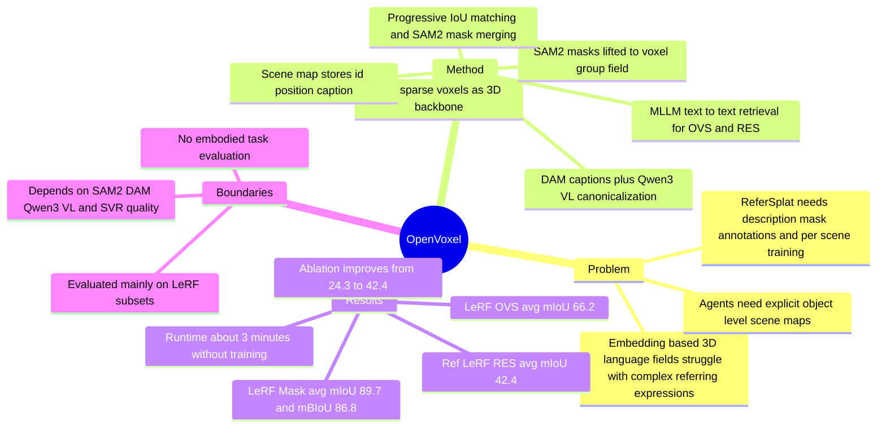

## Summary
OpenVoxel 解决的是 open-vocabulary 3D scene understanding 中“把语言能力放进 3D 表示”的成本和表达瓶颈：它不训练 CLIP/BERT-style 3D language field，而是把 SVR voxels 聚成 object-level groups，再用 VLM/MLLM 为每个 group 生成 canonical captions，形成可被 text-to-text retrieval 查询的 scene map。论文最强的实验证据来自 Ref-LeRF RES：training-free OpenVoxel 在 avg. mIoU 上达到 42.4，高于需要 description-mask annotation 的 ReferSplat 29.2。

## Problem & Motivation
现有 open-vocabulary 3D scene representation 通常把 CLIP、DINO、BERT 等 embedding 蒸馏或注册到 NeRF/3DGS/SVR primitives 上。这类方法适合 short words 或 tags，但面对复杂 referring expression 时受 embedding space 和训练数据约束；ReferSplat 虽然处理 sentence-level RES，但需要 human-annotated observable object masks 和对应自然语言描述来训练，并且每个 scene 还要额外训练 language field。

OpenVoxel 的 problem formulation 更直接：给定 multi-view images 训练好的 Sparse Voxel Rasterization (SVR) scene，能否在不做 per-scene gradient training、不引入固定 text encoder embedding 的情况下，把 sparse voxels 组织成可查询的 object-level semantic map。这个问题对 embodied / VLM 系统有价值，因为 agent 需要的是可解释、可组合、可被自然语言查询的 scene memory，而不只是 latent feature field。

## Method
**Training-Free Sparse Voxel Grouping.** 输入是已由 multi-view images 重建好的 SVR sparse voxels、相机位姿和每个 view 的 SAM2 segmentation masks。OpenVoxel 为每个 voxel 维护 3D group feature `F` 和 confidence weight `W`，其中 group feature 表示该 voxel 所属 object instance 的 centroid；同时维护一个 Group Dictionary `G`，记录每个 instance ID 的 centroid。

核心操作是把 2D instance mask lifting 到 3D group field：先用渲染得到的 point map 计算每个 2D mask instance 的 3D centroid，再根据 voxel 对 pixel 的 volume rendering weight，把这些 centroid 累积到各个 voxel 的 group feature 中。处理第一个 view 时直接初始化 group field；后续 view 中，OpenVoxel 先把已有 group field render 到当前 view，得到 projected instance mask，再和当前 view 的 SAM2 masks 按 IoU 匹配。匹配上的 mask 继承已有 ID，未匹配的 mask 作为新 instance 加入 Group Dictionary；对重叠较大的 masks 还会再次 prompt SAM2 做 merge，以减少同一物体被拆成多个 ID 的噪声。

**Canonical Scene Map Construction.** 完成 voxel grouping 后，方法为每个 group render binary masks 和对应原图，把这些 masked images 输入 Describe Anything Model (DAM) 得到详细 caption。因为 DAM 输出可能是自由格式且常用 “object” 这类泛称，OpenVoxel 再用 Qwen3-VL 做 canonicalization：通过 darken mask 外区域、在目标上加 red dot 的 visual prompt，引导 MLLM 把 caption 规范成 `<category noun>, <appearance details> <function/affordance or part-of> <placement/relation>`。最终 scene map `S` 为每个 group 存储 `id`、3D position 和 canonical caption。

**Referring Query Inference.** 对用户输入的 category token 或复杂 referring expression，OpenVoxel 先用 MLLM 把 query 改写成和 scene map caption 相同的 canonical format，再把整个 scene map 交给 MLLM 做 direct text-to-text retrieving，返回最匹配的 group ID。最后只 rasterize 这些 group，得到目标 view 下的 binary mask。这个设计的关键取舍是：把 open-vocabulary retrieval 从 embedding similarity 转成 explicit captions 上的语言推理，因此不需要额外训练或 calibration，但效果依赖 caption/query canonicalization 和 MLLM retrieval 质量。

## Key Results
- **Ref-LeRF RES**：OpenVoxel 在 ramen / figurines / teatime / kitchen 上的 mIoU 分别为 52.5 / 43.5 / 48.4 / 25.1，avg. mIoU 为 42.4；ReferSplat 报告值为 35.2 / 25.7 / 31.3 / 24.4，avg. 29.2；作者复现的 ReferSplat* avg. 为 24.5。OpenVoxel (Ours*) 使用所有 scene 共享来自 kitchen 的同一组 hyperparameters，avg. 仍有 41.0。
- **LeRF-OVS**：OpenVoxel 在 ramen / figurines / teatime 上的 mIoU 为 62.5 / 60.7 / 75.4，avg. 66.2；对比 CCL-LGS 65.1、3DVLGS 64.3、ReferSplat 57.6、LangSplat 53.7。这里 query 更接近 category/object name，论文认为整体任务比 Ref-LeRF RES 更简单。
- **LeRF-Mask**：OpenVoxel 的 avg. mIoU / mBIoU 为 89.7 / 86.8，高于 ObjectGS 的 88.3 / 84.4 和 Gaga 的 78.5 / 74.2。分 scene 看，OpenVoxel 在 figurines 达到 92.5 / 90.0，在 ramen 达到 87.7 / 83.6，在 teatime 达到 89.0 / 86.9；需要注意 ObjectGS 在 ramen mIoU 为 88.0，略高于 OpenVoxel 的 87.7，但 OpenVoxel 的平均 mIoU 和 mBIoU 更高。
- **Ablation on Ref-LeRF**：无 mask merging、无 canonical caption、无 canonical query 的 baseline A 为 24.3 mIoU；加入 mask merging 后 B 为 28.0；再加入 canonical caption 后 C 为 36.4；完整模型加入 canonical query 后达到 42.4。这个 ablation 支持三个组件都不是装饰性模块，尤其 canonical caption 带来最大单步增益。
- **Runtime**：在单张 RTX 5090 上，OpenVoxel 不需要 gradient-based training，grouping + canonical scene map construction 约 3 分钟，per-query inference 少于 1 秒；ReferSplat 需要训练且表中标为 >1 hr，ObjectGS 需要训练且约 40 min。正文还说明作者复现 ReferSplat 官方配置时，为获得最佳结果每个 scene 至少需要 2 小时。

## Strengths & Weaknesses
**已知的亮点。** OpenVoxel 把 3D language field 从 opaque embeddings 改成 explicit object captions 和 scene map，这让结果更可解释，也更自然地支持 attribute、affordance、relation 这类 referring expression。相比 ReferSplat，它不需要 description-mask pair annotation，也不需要 per-scene language-field training；在 Ref-LeRF RES 上的 42.4 avg. mIoU 是论文中最有说服力的结果，因为该 benchmark 正好测试复杂自然语言查询。

**已知的局限。** 实验范围主要是 LeRF 系列 iPhone Polycam scenes：OVS 是 LeRF-Mask 和 LeRF-OVS 的三个 scenes，RES 是 Ref-LeRF 的四个 scenes。论文没有展示更大规模室内/室外场景、动态场景、机器人真实任务或跨数据集泛化；也没有给出系统性的 failure-case taxonomy。方法链路依赖 SAM2、DAM、Qwen3-VL-8B-Instruct 和 SVR 重建质量，因此 segmentation、captioning 或 MLLM retrieval 任一环节出错都可能传递到最终 mask。

**推测但未被论文直接验证。** 这种 explicit scene map 对 embodied agent 很有吸引力，因为 agent 可以把 object ID、position、caption 作为 spatial memory 查询；但论文只评估 segmentation，不评估 navigation、manipulation 或 long-horizon task planning，所以不能把它直接当作 embodied policy improvement 的证据。另一个合理推测是：canonical caption template 会提升稳定性，但也可能压缩掉细粒度视觉差异；论文没有报告不同 caption template、不同 MLLM 或 prompt 的敏感性。

**不知道。** 正文只写 “The code will be open”，没有给出代码 URL；也没有在 paper text 中出现 DOI 或本文自身的 arXiv ID。论文说更多 implementation details、engineering tricks 和 system prompt 在 supplementary material 中，但当前正文没有展开这些细节，因此复现所需 prompt、threshold、SAM2 merge 策略细节仍需要补充材料或代码确认。

## Mind Map

## Notes
- **我的判断**：rating=4。它不是 GUI-agent paper，也没有 agentic decision-making，但对 VLM + embodied scene understanding 很相关：把 3D reconstruction、open-vocabulary segmentation、captioned semantic map 和 MLLM retrieval 接在一起，提供了一个简单且可解释的 scene memory construction recipe。
- **最值得保留的 insight**：不要急着把所有语义都压进一个 shared embedding field。对于 object-level 3D understanding，先做稳定 grouping，再把物体写成 human-readable canonical captions，可能比训练一个 latent language field 更适合复杂 query 和 agent memory。
- **对后续研究的启发**：可以把 OpenVoxel-style scene map 接到 embodied planning 中，测试 captioned object memory 是否真的改善 instruction following、object search、manipulation target selection。关键 evaluation 应该从 segmentation mIoU 扩展到 task success，并显式记录 caption hallucination、object split/merge、spatial relation retrieval 的失败模式。
- **需要进一步查证**：supplementary material 中的 system prompts、thresholds、DAM/Qwen3-VL 调用方式、不同 MLLM 的稳定性，以及代码开放后的复现实验。
