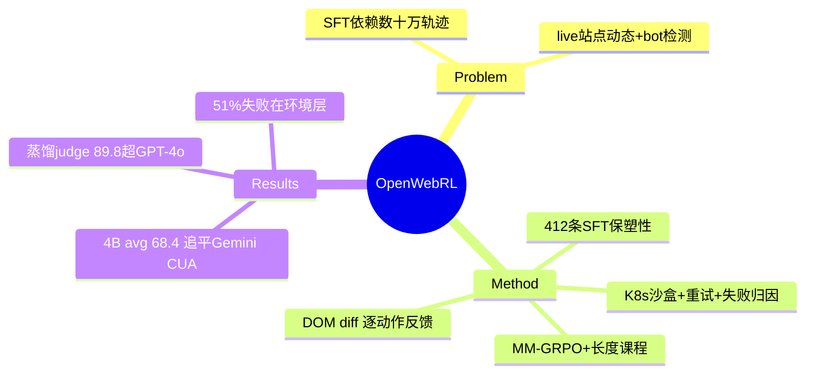

## Summary

OpenWebRL 证明**直接在 live 网站上做 online multi-turn RL 可行**并开源全配方：容错浏览器环境（K8s 沙盒隔离 + 分级超时重试 + 结构化失败归因 + 站点黑名单，80–100 并发）、少量精选 SFT 热身（412 条轨迹）+ MM-GRPO（轨迹级动态采样 + 15→30 步 rollout 课程），Qwen3-VL-4B 从 39.3% 平均提到 **68.4%**（WebVoyager 74.1 / Online-Mind2Web 67.0 / DeepShop 64.0），追平 Gemini CUA（69.3%）。蒸馏的 8B judge（89.8% acc）超过 GPT-4o judge（85.6%）且把评判成本降到近零。

## Problem & Motivation

开源视觉 web agent 依赖数十万条昂贵轨迹（MolmoWeb 278K）做 SFT，静态数据无法适应持续变化的开放网络；而 live 网站的动态页面、弹窗、重定向、bot 检测、封锁、瞬时网络故障使 online RL "largely underexplored"。

## Method

- **容错环境（live RL 的引擎需求清单）**：每 rollout 独立 K8s 沙盒（防 cookie 污染/内存泄漏/跨轨迹副作用，1 CPU + 4GiB/沙盒）；初始化/交互/截图分级超时（step 45s / 任务 600s），初始导航多次重试（HTTP/2 错误、连接重置、bot 检测）；**结构化失败归因**（完成/步数耗尽/生成上限/格式错/环境错/沙盒错/初始化错七类）+ 诊断记录（延迟/内存/uptime/traceback）；反复不可达或反自动化站点进**黑名单**。
- **Harness**：13 个原子浏览器工具，单步可链式多工具调用（focus→type→Enter 一步完成）；**从 DOM diff 提取逐动作文本反馈**（导航成功/输入不匹配/滚动失败），让 agent 区分成功与静默失败；只保留最近 K=1 张截图，但保留全部历史推理文本当"紧凑记忆"。
- **SFT 热身**：WebGym 292K 任务清洗到 2.2K RL 任务；teacher（Qwen3-VL-235B）每任务 4 轨迹、GPT-4.1 判成功、取最短成功轨迹，**仅 412 条 / 70 站**，3 epoch——小而精优于大而杂（1.9K 轨迹反而 −2pp），保"policy plasticity"。
- **MM-GRPO**：组相对优势 + 非对称裁剪（0.2/0.28）+ 轨迹级动态采样（丢弃全 0/全 1 组）+ rollout 长度课程（90 轮 15 步 → 50 轮 30 步）；reward = 格式检查 + 规则过滤（未 done 则 0）+ VLM judge 二值。~54K 在线轨迹 / ~300 B200 GPU 时。

## Key Results

- **OpenWebRL-4B 平均 68.4%**（WebVoyager 74.1 / OM2W 67.0 / DeepShop 64.0）：base 39.3 → SFT 52.0（+12.7）→ RL **68.4**（+16.4）；超 MolmoWeb-8B（51.9，用 278K 轨迹 SFT）、FARA-7B（44.6），追平 Gemini CUA（69.3）、超 OpenAI CUA（51.3）。
- **蒸馏 judge**：OpenWebRL-Judge-8B acc 89.8 / P 89.5 / R 94.8，超 GPT-4o（85.6/83.6/93.4）；训练期评判成本 $545.50 → 近零。
- 消融：去历史推理文本掉 −14.6/−23.7/−8.6（最大项）；去环境反馈 −5~−8；rollout 课程优于任一固定长度；PPO epochs=2 最优（3 过优化）。
- **失败归因：51% 来自访问与环境问题**（bot 检测/封锁/网络），27% 来自推理约束跟踪——live RL 的上限一半卡在环境接入层。

## Strengths & Weaknesses

**Strengths**：live-web online RL 的第一份完整开源配方；"容错 = 结构化归因 + 重试 + 黑名单"把 flakiness 从玄学变成工程清单；小 SFT 保塑性的发现反直觉且量化干净；蒸馏 judge 超 GPT-4o 说明 verifier 可专业化小型化。

**Weaknesses / 边界**：
- **51% 失败在环境层**且靠第三方付费 stealth browser 撑评测——live 路线的可复现性与责任边界（绕 bot 检测的伦理）都存疑。
- reward 仍是 VLM judge 二值（对照 [[Papers/2504-AgentRewardBench]]，judge 假阳性直接进梯度；其蒸馏 judge 89.8% acc 是进步但仍有 ~10% 噪声）。
- 无 reset/重放（live）：同一任务不同时间不可比，评测漂移未量化。
- ~300 B200 GPU 时对小组仍是门槛。

## Mind Map

## Notes

- **对 AFE / 环境引擎的证据价值**：live 训练路线的能力上界更新——比 [[Papers/2502-InSTA]]（read-only SFT 数据）更进一步做到了 online RL，但代价清单同样清晰：51% 失败在环境接入层、无 reset/重放、依赖付费 stealth browser。**容错层（重试/归因/黑名单）本质是给不可控环境补的"伪引擎"**，与 [[Papers/2510-WebServ]] 的可控引擎互为镜像。
- **逐动作 DOM-diff 反馈**是 observe affordance 的现成实证：环境侧廉价提取的状态变化文本让 agent 区分静默失败——与 [[Papers/2604-VeriGUI]] 的 action-effect 验证同构，但这里是环境提供而非 agent 自验。
- 蒸馏 judge 超 GPT-4o 给 [[Ideas/HybridVerifier-GUIRuntime]] 加一条路径：verifier 不必依赖 frontier 模型，领域特化小模型 + 结构化轨迹输入即可更准。
- 与 [[Papers/2606-WebGym]] 同用 WebGym 任务源但只留 2.2K——**任务质量清洗比任务数量更关键**的一个数据点（对照 InSTA 的 150k 粗任务）。
