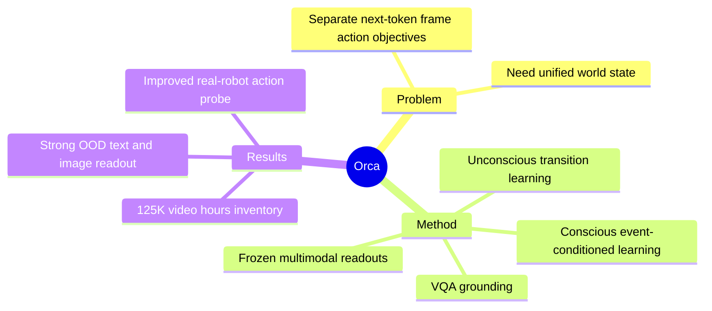

## Summary
Orca 提出以 Next-State-Prediction 为核心的 general world foundation model：从 video、event description 与 VQA 学习统一 world latent，再冻结 backbone，通过 language、image 和 action decoder 读出不同能力。其 4B model 在多项 OOD readout 上优于同量级专用 baseline，但训练只用了库存数据的约十分之一，模型与感知模态仍明显受限。

## Problem & Motivation
next-token、next-frame 与 next-action 模型分别优化局部输出接口，容易把“理解世界”分解成彼此孤立的任务。Orca 试图把 modeling target 上移到 world state transition：模型先从多模态信号抽象当前 state，学习显式条件或隐式动力学下的前后状态变化，再由轻量 decoder 把同一个 latent 映射为文本、图像或动作。核心假设是，若 pre-training 得到的 world latent 真正承载 state transition，冻结它以后，各种 readout 应随 latent 质量同步提升。

## Method
Orca 当前使用视觉与语言两类信号，并组合两种学习范式：

1. **Unconscious learning**：从连续视频的相邻 observation 学 dense natural transition。当前 frame 经过 VLM 与 learnable query/MLP 预测下一帧在 frozen vision encoder 中的 latent，学习 motion、occlusion、object interaction 与 natural dynamics。
2. **Conscious learning**：把视频按 event 分段，用下一/上一 event 的语言描述、task intention 或 causal premise 作为 condition，预测目标 event 中随机 frame 的 latent；另加 VQA next-token objective 强化语义与 commonsense grounding。
3. **Unified latent + readouts**：pre-training 联合 observation-only transition、event-conditioned transition 与 VQA loss。下游冻结 Orca backbone，仅训练 language head、vision decoder 或 Action Expert，分别测试 text generation、future image prediction 与 embodied action generation。
4. **Data inventory**：构建 125K 小时视频、160M event annotation 和 11.5M VQA，覆盖 egocentric interaction、exocentric manipulation、action-free robot execution 与 natural dynamics；当前版本实际只使用约 10% 视频库存。

## Key Results
- 4B Orca 在 MVBench、TemporalBench、3DSRBench、SWITCH 的平均分为 51.8，优于 4B Qwen3.5 的 46.7、4B Gemma 4 的 40.8，以及更大 Emu3/Emu3.5；Orca-0.8B 平均为 40.8。
- 在 real-world interaction image benchmark PRICE-V0.1 上，4B backbone + 2B vision decoder 的 Orca 平均 59.8，超过 FLUX.2 [klein] 的 56.1、FLUX.1-Kontext 的 40.9 与 OmniGen2 的 39.6。
- 五个双臂机器人任务的 OOD action readout 中，Orca overall rule-based score 为 32.4，V-JEPA 2.1 为 17.0、Qwen3.5 为 10.5；binary success 仍只有 6%，但从 scratch Action Expert 明显受益于 Orca latent。
- scaling 分析显示，随着 pre-training 数据增加，冻结 latent 的 text/image/action readout 整体提升；作者将其作为“更强 world latent 带来更强 readout”的证据。

## Strengths & Weaknesses
**亮点**：Orca 用 frozen-backbone readout probe 检查 latent，而非仅靠 future-frame realism 声称“理解世界”；text、image、real-robot action 三个出口让统一表示的主张具有可反驳性。unconscious/conscious 两路监督也在 dense physical transition 与 sparse semantic event 之间给出了清晰分工，且没有在 pre-training 使用 action label 仍能提升 action readout。

**局限**：当前 world signal 实际只有 vision + language，audio、tactile、force、proprioception 都缺失；视觉 transition target 来自 frozen ViT latent，可能把“world state”限制为单一语义表征而非真正多源物理 state。模型只有 0.8B/4B，且只消费数据库存约十分之一；4B 随训练推进仍出现 language/image/action readout trade-off。action 实验的 binary success 最高仅为个位数百分比，PRM-as-a-Judge 等 dense metric 不能替代真实 task success。统一 latent 优于 baseline 的相关性也尚不足以证明三个 downstream capability 共享同一因果结构。

## Mind Map

## Notes
Orca 的关键可检验问题是 unified latent 是否真的比“共享 backbone + 多任务 loss”多出结构性收益。可设计 intervention：对 latent 的 object state、contact、causality direction 做可控编辑，检查三个 readout 是否产生一致变化。
