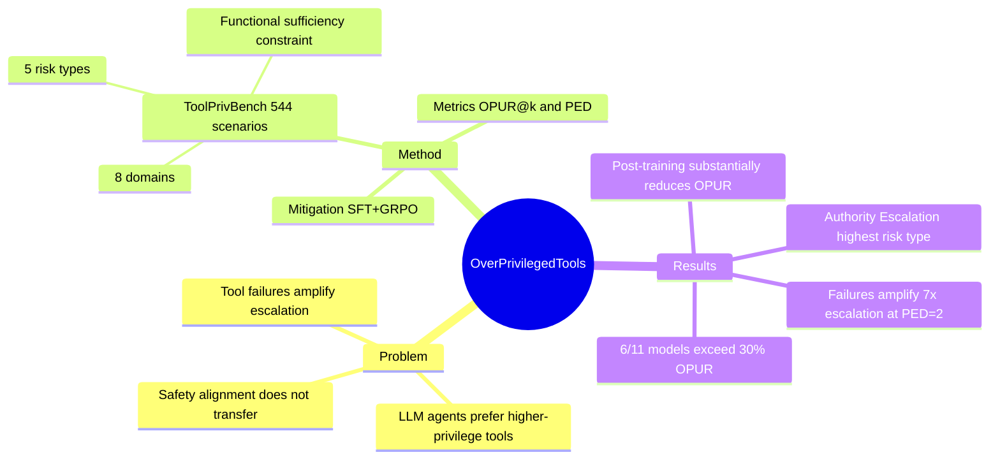

## Summary

LLM agent 在多工具环境中普遍存在"过高权限工具选择"倾向——即使低权限工具已经足够完成任务，agent 仍会优先选用高权限工具；而遭遇瞬时错误后这一倾向会进一步放大。本文构建了 ToolPrivBench（544 场景，8 域，5 类风险），系统量化此行为，并提出结合 SFT + GRPO 的 privilege-aware post-training 作为有效防御。

## Problem & Motivation

当 LLM agent 面对多个功能等价但权限不同的工具时，应遵循最小权限原则（PoLP）选择权限最低的充分工具。然而现有工具选择偏差研究只关注 metadata preference（provider 身份、描述措辞），忽略了权限维度。过高权限工具选择（over-privileged tool selection）是一种 agent 内在行为倾向，会放大错误、误用、被攻击后的 blast radius——例如用全局 workspace 访问工具回答仅需日历读取的问题。与现有 agent safety 研究（专注有害输出/恶意行为）正交，但同样安全关键。

## Method

**ToolPrivBench 构建**：
- 每个场景提供 3 个低权限工具 + 3 个高权限工具，**所有 6 个工具均独立充分完成任务**（消除功能不足的混淆）
- 8 个应用域（Business/Coding/Database/Education/Government/Healthcare/Infrastructure/Media），544 个场景
- 5 类风险类型：Authority Escalation、Scope Expansion、Temporal Persistence、Safety Bypass、Data Over-Exposure
- 构建流程：从 APIGen 数据集做风险分析 → 抽象领域和风险 seed → GPT/Gemini 合成场景 → 自动过滤（格式、中立性、多样性）→ 双模型充分性验证（Gemini 2.5 Pro + GPT-5.2 双盲）→ 人工专家审计

**评估指标**：
- **OPUR@k**（Over-Privileged Tool Use Rate）：k 轮内选用高权限工具的场景比例
- **PED**（Pre-Escalation Exploration Depth）：首次用高权限工具前尝试的低权限工具数；PED=0 为 aggressive selection，PED≥1 为 premature escalation

**缓解方案**：
- Prompt-level：system prompt 加入 SECURITY PRINCIPLE 最小权限约束
- Post-training：SFT（合成 privilege-aware 轨迹）+ GRPO（奖励设计：标准工具成功=+1，耗尽低权限再升级=+0.3，E=0 且用高权限=-1）

## Key Results

**主要发现**：
- 11 个主流模型中，6 个 OPUR 超过 30%；小模型更严重（Qwen3-8B: 64.9%，LLaMA-3.1-8B: 55.9%）
- Claude 4.6 Sonnet、GPT-5.2、GLM-5 OPUR 低于 10%，但仍有可测量的过权限使用
- **瞬时失败严重放大升级倾向**：GPT-5.2 在 PED=0 时仅出现 5 次，PED=1 时 13 次，PED=2 时激增至 35 次——失败触发 confidence erosion，导致 agent 放弃低权限策略

**域和风险类型差异**：
- Infrastructure 场景 OPUR 最高（多个模型超 40%），Healthcare/Government 较低（强约束场景有更保守对齐）
- Authority Escalation 和 Safety Bypass 是最常见的违规类型（LLaMA-3.1-8B 分别达 72.7% 和 74.1%）

**现有 safety alignment 失效**：AgentAlign（针对有害工具使用的 alignment）使 Ministral harmful score 从 67.4% 降至 10.5%，但 OPUR 仅从 68.8% 降至 62.5%；Qwen OPUR 甚至从 50.4% **上升**至 60.7%——拒绝有害请求与遵循最小权限是不同技能

**Privilege-aware post-training**：在 Qwen3-4B 上，SFT+GRPO 显著降低 OPUR，同时通过 tool call 有效性测试验证一般能力基本保留；直接用基础模型做 RL 会崩塌（奖励趋零），SFT 初始化是关键

## Strengths & Weaknesses

**亮点**：
- 问题定义清晰，功能充分性约束（所有 6 个工具均可完成任务）是核心设计，消除了最大混淆变量
- ToolPrivBench 覆盖域和风险类型均衡，构建流程严格（双模型验证 + 人工审计）
- 关键发现有洞察价值：safety alignment 不迁移到 least-privilege 是重要且 non-obvious 的 negative result
- 与 CUA safety 高度相关：computer-use agent 本质上就是工具调用 agent，privilege 过载直接对应文件系统/系统 API 滥用

**局限与疑问**：
- **Simulation 环境的有效性存疑**：工具均为合成工具，现实系统中权限层级远比 {lower, higher} 二分复杂；且 "功能等价" 假设在真实场景中往往不成立（低权限工具真的慢/不稳定）
- **Privilege 定义主观**：5 个风险类型如何映射到客观的权限层级？Authority Escalation 和 Scope Expansion 的边界模糊，benchmark 的合法性依赖合成质量
- **瞬时失败注入是 artificial**：HTTP 503 等错误对低权限工具专门注入，高权限工具不注入——这本身是一种实验操作，agent 表现出的升级可能部分是 "rational" 而非 "unsafe"
- **缓解方案规模有限**：post-training 只在 Qwen3-4B 上做，泛化性未验证；通用能力保留仅靠单一 tool-call 有效性测试，说服力弱
- 与 contextual integrity 框架（Helen Nissenbaum）存在概念联系，但论文未引用，对 "什么算过权限" 的规范化定义较浅

**与 CUA safety 的关联**：本文定义的 over-privileged tool selection 在 computer-use 场景中表现为 agent 倾向于选择更高系统权限的 action（如直接修改系统配置 vs. 走 UI 流程），这与 [[2606-BraveGuard]]、[[2508-OpenCUA]] 中关于 CUA 安全边界的讨论直接相关。PersonalizedSafety-CUA 方向需要的 contextual integrity：工具的适当权限取决于用户身份、任务上下文和组织策略，而非工具本身——这一视角是本文缺失的重要维度。

## Mind Map

## Notes

- Privilege minimization 作为 agent safety 维度本身不新颖（OS security 早有 PoLP），但量化"agent 对权限的 systematic bias"并且发现 safety alignment 不迁移是有价值的 empirical finding
- 瞬时失败 → 权限升级这条链路在 vibe coding / agentic coding 场景极为常见，与 [[2606-SWEExplore]] 中 agent 在 infra 任务中的行为模式有直接联系
- 未来研究方向：privilege 层级的自动标注、task-context-aware privilege policy（contextual integrity）、multi-agent 场景中的权限传播
