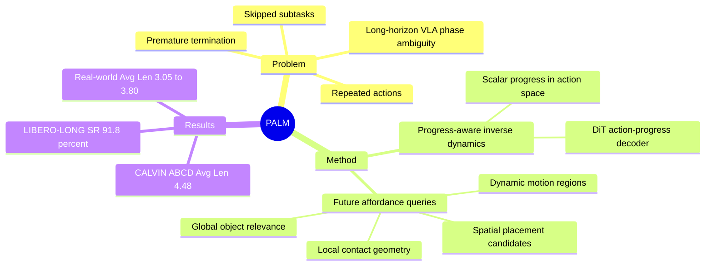

## Summary
PALM 针对 long-horizon robotic manipulation 中 VLA 容易重复动作、跳步和过早终止的问题，把 future affordance prediction 和 continuous progress estimation 放进同一个 policy loop。方法用四类 learnable affordance queries（Global/Local/Spatial/Dynamic）预测未来交互线索，再由 diffusion transformer 联合解码 action-progress sequence。实验在 CALVIN ABC→D、LIBERO 和 real-world 6-subtask pick-and-place 上显示比多类 baseline 更稳定，但在线 recovery 和标注/感知开销仍是明确限制。

## Problem & Motivation
已知：当前 VLA 能把视觉观察和语言指令映射到 robot actions，但论文指出它们在 long-horizon、multi-step manipulation 中容易在中途失败。核心问题不是单步抓取能力，而是缺少 task-relevant affordance cues 和 within-subtask progress tracking：模型不知道下一步应交互哪个物体、哪个部位、放到哪里、该继续还是切换阶段。作者明确列出的失败模式包括 repeated/unnecessary actions、skipped required subtasks、premature termination，以及在错误状态下声明成功。这个问题重要，因为长序列 manipulation 的误差会累积，前一子任务的终止状态经常偏离后一子任务的预期起点。

## Method
PALM 是一个 closed perception-action-progress loop。输入包括 language instruction、image observation 和 robot state；文本由 CLIP text encoder 编码，图像由 MAE encoder 加 Perceiver Resampler 压缩，robot state 由 lightweight MLP 投影，然后交给 GPT-2-style transformer 融合。

方法的第一部分是 fine-grained affordance prediction。PALM 引入四类 affordance subqueries：Global 预测 instruction-relevant object mask，用 Grounding DINO 和 SAM 生成训练目标；Local 预测 contact-likelihood heatmap，用 contact points 转成 Gaussian heatmaps；Spatial 预测 placement candidate points，训练目标来自 SpatialVLM 解析 spatial semantics 和 RoboPoint 采样 executable 2D coordinates；Dynamic 预测 gripper 或 movable objects 的未来 motion region，训练监督来自 CoTracker 的 grid-based tracking 和 displacement threshold。训练时这些 heads 对 t+n 的 future affordance 进行监督；推理时 supervised affordance heads 被移除，但 affordance latent 继续作为 policy 的结构化中间表示。

方法的第二部分是 progress-aware policy via inverse dynamics。PALM 在 action output 中追加 scalar progress value p_t ∈ [0, 1]，用来表示当前 subtask 的 completion，并由 DiT decoder 条件在当前 observation、instruction、state 和 affordance latent 上，联合生成 n-step action sequence 与 progress sequence。训练分为 pre-training 和 fine-tuning：pre-training 使用 DROID、BridgeData V2、EPIC-KITCHENS、RoboCerebra；fine-tuning 使用 942 条带 affordance 和 continuous progress label 的 robot trajectories。Supplement 中还说明模型有 68M trainable parameters，推理使用 10 个 DiT diffusion steps、7 个 observation steps、3 个 future prediction steps，decision cycle 小于 80 ms，closed-loop frequency 为 10-15 Hz。

## Key Results
- CALVIN ABC→D：PALM 在 1 到 5 个连续任务上的 success rate 分别为 96.9%、93.8%、89.3%、85.9%、82.0%，Avg. Len. 为 4.48；最强 prior baseline Seer 的 5-task success rate 为 64.3%、Avg. Len. 为 3.98，论文称 PALM 在 average length 上提升 12.5%。
- LIBERO：PALM 的 Average success rate 为 94.5 ± 1.0%，Spatial/Object/Goal/Long 分别为 95.2 ± 1.2%、96.7 ± 0.7%、94.3 ± 1.6%、91.8 ± 0.8%。在 LIBERO-LONG 上，PALM 91.8 ± 0.8%，高于 CoT-VLA 的 69.0 ± 0.8%。
- Real-world 6-subtask pick-and-place：Random Localization 下 PALM Avg. Len. 3.05，OpenVLA 0.95、Octo 0.65；Visual Distraction 下 PALM 3.80，OpenVLA 1.60、Octo 0.95；Unseen Lighting 下 PALM 3.55，OpenVLA 1.25、Octo 1.05。
- Ablation：去掉 progress prediction 后 CALVIN ABC→D Avg. Len. 从 4.48 降到 4.02；Table 3 中去掉 affordance foresight 在 fine-tuning 下从 4.48 降到 3.58，去掉 inverse dynamic prediction 降到 3.92。Table 4 中去掉 In-the-Wild Data 后 CALVIN Avg. Len. 3.90、LIBERO-LONG 73.5%，去掉 Human Annotated Data 后 3.58、76.5%。
- Prediction target ablation：Affordance foresight 在 CALVIN ABC→D 上 Avg. Len. 4.48、latency 约 70 ms；Image/Video foresight 为 4.17、约 90 ms；Auxiliary reconstruction 为 3.58、约 55 ms。
- Real-robot failure analysis：N=50 rollouts 下，PALM Avg. Len. 3.90，Repeat/Skip/Premature Stop 分别为 14%/8%/10%；OpenVLA 为 2.30 和 28%/16%/22%，Octo 为 1.85 和 34%/26%/18%。

## Strengths & Weaknesses
已知的强点：PALM 把 affordance reasoning 和 progress estimation 变成可监督的中间结构，而不是只做 direct action prediction；ablation 支持这两个信号对 long-horizon stability 都有贡献。四类 affordance 的设计也比较有信息密度：object relevance、contact geometry、placement candidates、motion dynamics 分别对应 long-horizon manipulation 中常见的阶段歧义来源。实验覆盖 simulation、real-world generalization、component ablation、data composition、prediction target、progress threshold 和 failure modes，证据链比只报 main benchmark 更完整。

已知的弱点：作者在 Limitations 中明确说 PALM 的 online recovery capability 在 execution drift 下仍有限，drift 来源包括 partial observability、contact uncertainty、occlusions 和 geometric deformations。论文也承认 affordance-oriented segmentation、state grounding 和 VLM-based semantic interpretation 会带来 annotation、perception、inference overhead。Ablation 中 Local affordance 加入后在 LIBERO-LONG 有轻微下降，作者解释为 viewpoint-induced geometric bias，这说明 fine-grained contact cue 不一定跨视角稳定。

推测：对 GUI-agent 或 web/mobile agent 来说，PALM 的启发不是具体 robot affordance，而是把 long-horizon execution 拆成「结构化下一步交互线索」和「连续阶段进度」两个可学习状态变量；这可能帮助减少重复点击、跳步骤和过早结束，但论文没有做 GUI 或 web 实验，不能把这个推测当作结果。

不知道：正文没有给出 DOI，也没有明确说明 GitHub code release。论文的 real-world 实验集中在 xArm6、双 RealSense D455 和一个 6-subtask pick-and-place 任务上，因此不能从本文直接判断它在更多 embodiments、更多 household/warehouse tasks 或更强干扰下的泛化边界。

## Mind Map

## Notes
这篇论文值得放在 VLA long-horizon execution 的参考组里：它的贡献更像是给 direct policy 加可监督的 intermediate state，而不是引入外部 symbolic planner。后续比较时应重点看它和 CoT-VLA、TraceVLA、CoA-VLA、Seer 的差异：PALM 不直接生成 dense future image，也不主要依赖 textual reasoning chain，而是用 structured future affordance latent 加 progress signal 来约束 action generation。需要保留一个问题：progress label 来自 functional keyframes 和 linear interpolation，这种监督在更开放的 task boundary 或失败后恢复场景中是否仍可靠，本文还没有给出充分证据。
