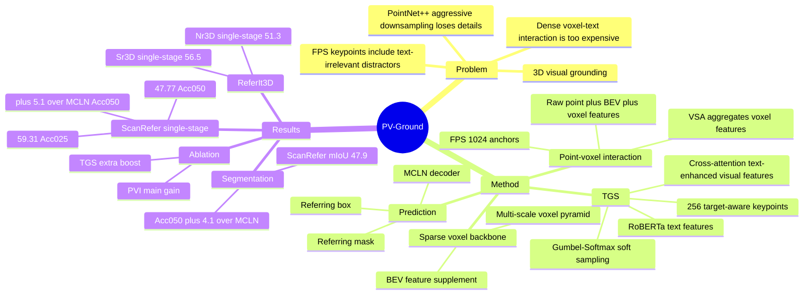

## Summary
PV-Ground 针对 3D visual grounding 中 point-based backbone 过度下采样导致细粒度空间信息丢失的问题，提出 text-guided point-voxel interaction framework。它用 sparse voxel convolution 保留高分辨率 3D scene features，再把 voxel feature pyramid 聚合到 text-guided keypoints 上做高效多模态交互，并在 ScanRefer、ReferIt3D 与 referring segmentation 上超过 MCLN 等 baseline。

## Problem & Motivation
3D visual grounding 的目标是根据自由文本描述在 3D scene 中定位目标物体，任务依赖细粒度 multi-modal perception、空间关系理解和语义推理，对 embodied intelligence、autonomous navigation、AR 等应用有直接价值。

作者指出，现有 3D VG 方法主要把精力放在 text-point cloud interaction module 上，而 scene feature representation 仍大量使用 PointNet++ 这类 point-based backbone。典型流程会把约 50,000 个输入点激进下采样到 2,048 个 keypoints，这虽然便于后续 attention-based fusion，却会丢失小物体、遮挡物体和细微几何线索。Sparse voxel convolution 在 3D detection/segmentation 中能保留更高分辨率空间细节，但标准 voxel decoder 的 upsampling 会产生大量 voxels，使得直接与文本做 dense interaction 计算上不可行。PV-Ground 的问题设定就是：能否同时保留 voxel representation 的细粒度感知能力，以及 keypoint representation 的高效 text interaction 能力。

## Method
PV-Ground 的主干是 point-voxel interaction。输入 point cloud `P in R^{N x 6}`，每个点包含 XYZ 和 RGB；模型先把点云 voxelize 成 3D voxel grid，并用 multi-layer sparse voxel convolutions 形成 voxel feature pyramid。8x downsampled feature maps 还会沿 Z 轴堆叠成 BEV feature map，补充高层上下文。

为了避免直接拿大规模 voxel pyramid 与文本做 cross-attention，PV-Ground 先用 FPS 从原始点云中采样 `N=1024` 个 keypoints 作为 aggregation anchors，再改造 Voxel Set Abstraction：每个 keypoint 在 voxel pyramid 的不同尺度上以半径 `r_l` 查询邻近 voxel features，把 voxel feature、相对位移等输入 PointNet/MLP/max pooling 得到多尺度 keypoint feature。实现细节中半径为 `[0.2m, 0.4m, 0.8m, 1.6m]`，最终把 point-voxel features、raw point features 和 BEV features concat 后经 MLP 得到紧凑 keypoint representation。

核心新增模块是 Text-Guided Keypoint Sampling (TGS)。作者认为 FPS 的空间均匀 keypoints 适合 object detection，但对 text-conditioned 3D VG 不够高效，因为很多 keypoints 落在文本无关区域，成为 distractors。TGS 先让 VSA 得到的 visual keypoint features `V` 与 RoBERTa 编码的 text features `T` 通过 cross-attention 交互，得到 text-enhanced visual features `V_t`；随后用 self-attention 和 FC layer 预测 sampling weights，并用 Gumbel-Softmax 做 differentiable soft sampling，把 1024 个 keypoints 软聚合成 `n=256` 个 target-aware keypoints，implementation 中 temperature `tau=1.0`。这样 gradients 可以通过 soft assignment 回传到所有潜在相关点，而不是像 hard Top-K selection 那样只保留少量被选点。

目标预测部分不是重新设计完整 decoder。论文主要采用 MCLN 的 multi-modal interaction module、decoder 和 multi-task prediction head，使模型同时输出 referring box 和 referring mask；作者也说明 point-voxel keypoint features 可以接入 BUTD-DETR、EDA 等其他 point-based 3D VG decoders，但正文把详细结果放到 Supplementary Material。

## Key Results
- **ScanRefer 3D visual grounding, single-stage**：PV-Ground overall Acc@0.25/Acc@0.5 为 **59.31/47.77**，高于 MCLN 的 **54.30/42.64**，提升 **+5.0/+5.1**；Multiple subset 为 **54.61/43.44**，高于 MCLN 的 **49.72/38.41**。相比 TSP3D，PV-Ground overall Acc@0.25 更高（**59.31 vs. 56.45**），Acc@0.5 也略高（**47.77 vs. 46.71**）。
- **ScanRefer 3D visual grounding, two-stage**：PV-Ground overall Acc@0.25/Acc@0.5 为 **59.87/47.56**，高于 MCLN 的 **57.17/45.53**，提升 **+2.7/+2.0**；Unique subset 为 **87.67/72.94**，Multiple subset 为 **54.99/43.11**。
- **ReferIt3D**：在 Nr3D/Sr3D 上，PV-Ground two-stage accuracy 为 **62.1/68.9**，高于 MCLN 的 **59.8/68.4**；single-stage accuracy 为 **51.3/56.5**，高于 MCLN 的 **45.7/53.4**，其中 Nr3D single-stage 提升 **+5.6**。但 Sr3D single-stage 上 PV-Ground **56.5** 低于 TSP3D 的 **57.1**，说明结果并非所有子集都全面领先。
- **ScanRefer referring expression segmentation**：PV-Ground overall Acc@0.25/Acc@0.5/mIoU 为 **62.2/54.8/47.9**，高于 MCLN 的 **58.7/50.7/44.7**，其中 Acc@0.5 提升 **+4.1**，mIoU 提升 **+3.2**。
- **Ablation on ScanRefer single-stage**：baseline 为 **54.30/42.64** grounding Acc@0.25/Acc@0.5 和 **56.78/49.28/43.49** segmentation Acc@0.25/Acc@0.5/mIoU；只加 TGS 为 **56.33/45.19** 和 **58.50/50.57/44.75**；只加 PVI 为 **58.15/47.23** 和 **60.07/53.34/46.72**；PVI+TGS 完整模型达到 **59.31/47.77** 和 **62.06/54.52/47.73**。这说明 PVI 是主要增益来源，TGS 在 PVI 上继续带来额外提升。

## Strengths & Weaknesses
**已知的强点**：PV-Ground 抓住了 3D VG 里容易被 fusion module 掩盖的 scene representation bottleneck。它不是简单替换成 dense voxel features，而是用 voxel backbone 保留细节，再通过 keypoints 把多尺度 voxel pyramid 压缩成可与文本深度交互的 representation，工程上比直接 voxel-text dense attention 更可行。TGS 的 soft sampling 也比 hard pruning / Top-K 更稳妥，因为它没有不可逆地丢弃未选点，且 qualitative visualization 显示 text-guided keypoints 会聚焦在 sofa、door、sink、toilet 等文本相关区域。

**已知的边界**：论文的主要 decoder/head 借用了 MCLN，因此结果应理解为 point-voxel keypoint representation 对现有 3D VG framework 的增强，而不是一个完全独立的新 prediction head。作者声称 keypoint features 可接入其他 decoders，但正文没有给出完整表格，只说 Supplementary Material 会展示更多结果；因此这部分泛化性在当前正文证据里还不完整。

**已知的 baseline / ablation 信息**：主比较对象是 MCLN，同时也和 ScanRefer、InstanceRefer、3DVG-Transformer、3D-SPS、BUTD-DETR、EDA、CORE-3DVG、VPP-Net、DDPA-3DVG、AugRefer、TSP3D 等方法比较。Ablation 显示 PVI 单独带来比 TGS 更大的提升，而 TGS 叠加在 PVI 上继续增加 performance；这支持论文关于 voxel high-resolution features 和 text-guided keypoint focusing 互补的 claim。

**已知的局限 / failure reporting**：论文正文没有系统报告失败案例，只给出了成功的 qualitative examples；因此无法从正文判断 PV-Ground 在严重遮挡、稀有类别、长距离关系、错误文本描述或动态场景下的 failure mode。实验也主要局限在 ScanNet-derived indoor datasets（ScanRefer、ReferIt3D），没有验证真实机器人 closed-loop navigation/manipulation，也没有报告端到端 latency、memory footprint 或与 TSP3D voxel pruning 的完整效率对比。

**推测**：这篇论文对 embodied agent 的启发在于，语言条件下的 3D scene representation 不一定要在全场景 dense token 上做推理；可以先用高保真 voxel perception 保存几何细节，再把和当前 instruction 相关的区域压成 compact target-aware keypoints。这个思路可能适用于 embodied navigation 或 mobile manipulation 的 language-conditioned perception module，但论文没有做 closed-loop embodied task，不能直接推出 agent success rate 会提升。

**不知道**：论文正文没有给出 arXiv id 或 DOI。它提到代码可用，但没有在正文说明训练总时长、推理 FPS、模型参数量、GPU memory consumption、random seed variance，也没有给出关于 TGS temperature 或 keypoint 数量变化的 ablation。

## Mind Map

## Notes
这篇论文把 3D VG 的瓶颈从“更复杂的 text-visual fusion”拉回到 scene representation：不是直接在全部 voxels 上做文本交互，也不是只保留 PointNet++ 下采样后的 sparse points，而是先用 voxel backbone 保留局部几何，再用 text-guided soft keypoints 聚焦当前描述相关区域。对后续研究最值得追问的是：这种 soft text-guided keypoint aggregation 是否能扩展到需要 active exploration 或连续观测更新的 embodied perception，而不只是静态 ScanNet-derived indoor scenes。
