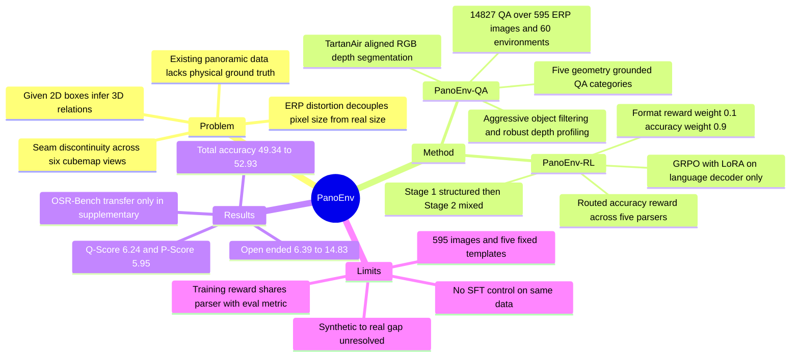

## Summary

PanoEnv 用 TartanAir 的 depth、semantic segmentation 与 3D bounding box，把 360° ERP panorama 的空间推理程序化地展开成五类共 14,827 条 QA，同一套几何 ground truth 同时充当 GRPO 的 rule-based reward。在 Qwen2.5-VL-7B-Instruct 上做 LoRA GRPO 并配 structured→mixed 两阶段 curriculum 后，PanoEnv-QA 的 total accuracy 从 49.34% 升到 52.93%，open-ended accuracy 从 6.39% 升到 14.83%。

## Problem & Motivation

ERP 把球面摊平到矩形，有两个后果直接进入 VLM 的输入：高纬度区域被横向拉伸，物体的像素尺寸与真实尺寸脱钩；一个场景横跨六个 cubemap view，接缝处出现不连续。作者据此判断，pinhole 图像上学到的 2D heuristic 迁移到 panorama 上会失效——"哪个物体更大"在 ERP 上不能靠 bounding box 面积回答。

已有的 panoramic 数据不适合当 RL 的监督源。作者在 supplementary 里给出对照：OSR-Bench 的 ground truth 是 cognitive map、核心是 2D topology，OmniVQA 的答案来自 MLLM 加人工。两者都无法提供 metric distance 或真实体积这类可程序化判对错的物理量，用它们做 reward 等于把生成模型的偏差再喂回去。

论文因此把任务定义为：给定单张 ERP panorama，以及以文本形式写在 prompt 里的物体 2D bounding box，恢复物体之间的 metric distance、3D 方位与真实体积/形状。这个 formulation 的边界值得写明——bounding box 是给定的（Supp. §3.1 的 base prompt 明确 "focus on the specific objects mentioned in bounding boxes"），模型不需要自己定位物体，要做的是从 2D 参照反推 3D 关系。作者称之为 "2D textual reference, 3D spatial query"。所以这里测的不是完整的 panoramic 感知，是给定 2D 观测后的几何反演。

## Method

**PanoEnv-QA 构建。** 六个 perspective cubemap view 合成一张高分辨率 ERP 图，RGB、depth、semantic segmentation 逐像素对齐。每个物体从 segmentation mask 抽出 2D bounding box、depth 统计量、可见相机列表，并采样 N=100 个点得到 point cloud 与紧致 3D bounding box；被多个 view 看到的物体标记为 seam object。

过滤相当激进（Supp. §2.1）：bounding box 面积 ≥900 px、宽高各 ≥25 px、aspect ratio <5，排除 sky/ground/wall 这类背景与 wire/rubble 这类不稳定语义，比较类问题还要求两个物体的 bounding box 重叠率不超过 0.90。深度也不是直接取中位数——当 IQR > max(0.6, 0.15·p50)，即物体沿相机射线方向足够"厚"时，改用近端分位 p50 之外的 p20 作为有效深度，避免中位数把可见表面推远。这些启发式决定了数据里到底留下哪些物体，也决定了 benchmark 的实际难度分布。

五类问题对应五种几何量：

1. **Camera View Source Identification** — 用 Eq. 1 把 ERP 像素映射回球面坐标，由主导轴判定物体来自 front/left/top 等哪个 cubemap view，或是否跨接缝。
2. **Object Distance Estimation** — 从 ERP depth map 取物体 mask 内的有效深度，生成定量（"about X meters"）与定性两种问法。
3. **Environment Identification** — 用 TartanAir 的 metadata 标签，组织成 Scene Attribute（indoor/outdoor）与 Scene Category（Urban/Nature）两级；MCQ 的干扰项按语义近邻挑选，例如给 "day" 场景配 "night"/"winter" 变体，而非随机采样。
4. **Relative Spatial Positioning** — 把 2D bounding box 中心加中位深度反投影到右手系 3D 坐标（+Y 上、+X 右、−Z 前，front view 对齐 λ=0），两物体的方向向量按阈值 τ_pos 转成 above/in front of 这类语言标签。
5. **Intrinsic Attribute Comparison** — 从 point cloud 的 3D bounding box 算真实体积，另定义 flatness score 为最小维与最大维之比，用来问"哪个更扁/更细长"。

最终 14,827 条 QA、595 张 ERP 图、60 个虚拟环境，平均每场景约 25 条；1,894 个唯一答案，平均长度 10.9 字符，二元题 Yes/No 比例 45.3% : 54.7%。

**PanoEnv-RL post-training。** 基座是 Qwen2.5-VL-7B-Instruct，GRPO 只更新 language decoder 的 LoRA 参数（r=16, α=32, dropout 0.05），vision encoder 冻结；group size K=4、2 epochs、peak lr 5e-6、global batch 32、KL 系数 β=0.01、max completion length 256，4 张 NVIDIA B200 上用 bf16 + DeepSpeed ZeRO-2 + Flash Attention 2 训练。

Reward 是 accuracy 与 format 的加权和，w_acc=0.9、w_fmt=0.1。Format reward 用正则严格检查输出是否为 `<Reasoning>...</Reasoning><Answer>...</Answer>`。Accuracy reward 按预标注的题型路由到五个 parser：yes_no 做大小写不敏感的严格匹配；mcq 先抽主语再归一化（去冠词、去标点、统一大小写）；distance 解析数值并统一换算到米，相对误差 ≤10% 给 1.0、≤20% 给 0.5、否则 0；spatial 在 front/back、left/right、up/down 三条轴上独立比对方向关键词及同义词，reward 是正确轴数占比（三轴中对两轴 = 0.67）；counting 要求整数精确匹配，同时支持 "3" 与 "three"。

**两阶段 curriculum。** Stage 1 只训 T/F 与 MCQ，用激进超参快速建立格式服从与低熵决策；Stage 2 从 Stage 1 初始化，在全部 OE 问题上混入等量 structured 问题，改用保守超参。训练曲线（Fig. 4）与这个设计吻合：Stage 1 的 format reward 很快逼近 1.0、accuracy 移动平均从约 0.5 升到 0.6 以上；Stage 2 的 format reward 一开始就饱和，accuracy 从更低起点缓慢爬升。

## Key Results

**Benchmark 侧。** 14 个 SOTA VLM 在 3,040 条测试样本上零样本评测，平均 total accuracy 只有 36.72%、平均 OE accuracy 4.26%。最强的 total 是 Qwen2.5-VL-7B 的 49.34%（T/F 65.19、MC 57.24、OE 6.39），最强的 OE 是 8.36%，由 DeepSeek-VL2-Base 与 Qwen2.5-VL-32B 取得。abstract 里的 "49.34% overall and 8.36% on open-ended" 是两个不同模型的分列最优值，不是同一个模型的联合表现，正文 §1 用 "best … best" 说清了，abstract 没有。OE 的普遍塌陷是这批数据最硬的观察：模型能应付选择题，一旦要自己生成 "about 4.2 meters" 或 "behind and to the right of and below" 这类复合表述就基本失效。

**RL 侧。** GRPO-Balanced（7B）达到 52.93% total、68.78% T/F、58.90% MC、14.83% OE、62.89% T/F+MCQ，Q-Score 6.24、P-Score 5.95（两者分别是 Qwen3 与 Prometheus 2 做 judge 的 0–10 语义分）。相对 base 的 49.34%，total 提升 3.59 个百分点（论文写作 "+3.59%"，实际是百分点差，相对增幅约 7.3%），OE 从 6.39% 到 14.83%，论文记为 +132% relative。

**Ablation 才是这篇的信息量所在。** 五个变体（total / OE）：OneStage 50.8 / 11.8，Structured-only 52.3 / 5.7，OE-only 48.6 / 13.2，Reverse 50.9 / 7.0，Balanced 52.9 / 14.8。两阶段的收益几乎全部落在 OE 上——Structured-only 的 total 只比 Balanced 低 0.6 个点，而且 T/F 69.5、MCQ 60.9 是全表最高，都高于 Balanced 的 68.8 与 58.9。换句话说 Stage 2 是用 −0.7 T/F 与 −2.0 MCQ 换来 +9.1 OE。abstract 说 "maintaining structured-task performance" 相对 base 成立（MC 57.24→58.90），相对 Structured-only 变体不成立。顺序也不能反：Reverse（OE→Mixed）的 OE 只有 7.0，说明先建立格式服从这一步是必要的。

**Sim-to-real 只在 supplementary。** OSR-Bench 零样本上，PanoEnv-RL 在 Object Counting / Relative Distance / Relative Direction 三项为 0.507 / 0.371 / 0.105，base 7B 为 0.477 / 0.321 / 0.089，Qwen2.5-VL-72B 为 0.498 / 0.325 / 0.181。前两项超过 72B，第三项显著落后。作者把 Relative Direction 的差距归因于 OSR-Bench 缺少垂直维度、只考察平面拓扑，因而惩罚了模型的三维球面预测——这是事后解释，没有配套 ablation。

**数据质量。** 随机子集的人工核验显示程序化生成答案的正确率为 96%（Supp. §2.3），核验规模与标注者人数未报告。

## Evidence Ledger

| Claim ID | Claim | Type | Source locator | Evidence excerpt | Status |
|:--|:--|:--|:--|:--|:--|
| C1 | PanoEnv-QA 含 14,827 条 QA，来自 595 张 ERP panoramic scene、60 个 TartanAir virtual environment，平均每场景约 25 条 | number | Sec 4.1 | "14,827 high-quality QA pairs derived from 595 panoramic scenes spanning 60 diverse virtual environments" | source-verified |
| C2 | 五类问题分布 2,975 / 2,975 / 2,975 / 2,965 / 2,937，合计 14,827，各占约 20% | number | Table 1 | "Attribute Comparison 2,975 20.1% … View Source Identification 2,937 19.8% Total 14,827 100%" | source-verified |
| C3 | 14 个 VLM 在 3,040 条测试样本上零样本评测，平均 total accuracy 36.72%、平均 OE accuracy 4.26% | benchmark-setting | Sec 4.2 + Table 2 "Average" 行 | "We evaluate 14 SOTA VLMs … on a 3,040-sample test set"; "Average 36.72 4.82 5.17 55.98 37.56 4.26" | source-verified |
| C4 | baseline 最高 total 为 Qwen2.5-VL-7B 49.34%（65.19 / 57.24 / 6.39）；最高 OE 为 8.36%，属 DeepSeek-VL2-Base 与 Qwen2.5-VL-32B | comparison | Table 2 | "Qwen2.5-VL-7B 49.34 5.60 5.48 65.19 57.24 6.39"; "DeepSeek-VL2-Base … 8.36" | source-verified |
| C5 | GRPO-Balanced（7B）52.93 total / 68.78 T/F / 58.90 MC / 14.83 OE / 62.89 T/F+MCQ，Q-Score 6.24、P-Score 5.95；+3.59 个百分点，OE +132% relative | number | Table 3；Abstract；Sec 4.3 | "GRPO-Balanced (Ours) 52.93 68.78 58.90 14.83 62.89 … 6.24 5.95"; "improves from 6.39% to 14.83% (+132% relative)" | source-verified |
| C6 | Table 4 中 GRPO-Structured 为 52.3 total / 5.7 OE，其 T/F 69.5 与 MCQ 60.9 为全表最高，高于 GRPO-Balanced 的 68.8 / 58.9 | number | Table 4 | "GRPO-Structured (Structured-only) 52.3 69.5 60.9 5.7"; "GRPO-Balanced 52.9 68.8 58.9 14.8" | source-verified |
| C7 | 只对 language decoder 加 LoRA（r=16, α=32），vision encoder 冻结；K=4、2 epochs、lr 5e-6、batch 32、β=0.01、4×B200 | benchmark-setting | Sec 4.3 + Supp. Table 1 | "group size K = 4, LoRA applied to the language decoder, and a frozen vision encoder" | source-verified |
| C8 | accuracy reward 按题型路由到五个 parser；distance 误差 ≤10% 给 1.0、≤20% 给 0.5；spatial 按正确轴占比给分，三轴中对两轴为 0.67 | causal-mechanism | Sec 3.2.2 | "1.0 for ≤10% error, 0.5 for ≤20% error, and 0.0 otherwise"; "matching 2 of 3 required axes … yields a reward of 0.67" | source-verified |
| C9 | 随机子集人工核验显示程序化生成答案正确率为 96% | number | Supp. Sec 2.3 | "The human verification yielded a 96% accuracy rate" | source-verified |
| C10 | OSR-Bench 零样本 0.507 / 0.371 / 0.105，base 7B 0.477 / 0.321 / 0.089，72B 0.498 / 0.325 / 0.181；该实验只见于 supplementary，正文无 | comparison | Supp. Sec 6 / Table 3（正文 pp.1–11 无对应实验） | "PanoEnv-RL (Ours) 0.507 0.371 0.105"; "Qwen2.5-VL-72B 0.498 0.325 0.181" | source-verified |
| C11 | 正文与 supplementary 都没有在 PanoEnv-QA 上做 SFT 的对照；Table 2/3/4 中所有非 GRPO 模型均为零样本 | benchmark-setting | Table 2/3/4；Supp. Sec 1、4–6 | 无对应正文可摘（否定性事实）；三表非 GRPO 行均为 14 个零样本 baseline | source-verified |
| C12 | Supp. Table 2 把 60 记为 Scenes、595 记为 Images，与正文 Sec 4.1 的 "595 panoramic scenes / 60 virtual environments" 命名相反 | number | Supp. Table 2 vs Sec 4.1 | Supp: "Scenes 60 (Indoor & Outdoor)" / "Images 595" | source-verified |
| C13 | 代码与数据地址为 github.com/7zk1014/PanoEnv，印在正文首页页眉 | license-code | 正文 p.1 页眉 | "Code & Dataset: https://github.com/7zk1014/PanoEnv." | source-verified |
| C14 | abstract 的 "49.34% overall and 8.36% OE" 是两个不同模型的分列最优值，非同一模型的联合表现 | comparison | Abstract / Sec 1 / Table 2 | "overall performance is low (best 49.34% accuracy) with a near collapse … (best 8.36%)" | source-verified |
| C15 | 作者自陈 synthetic-to-real gap 未解决，future work 为适配 noisy/incomplete GT 的真实 360° 数据与 temporal panoramic video | causal-mechanism | Sec 5 Limitations and Future Work | "the synthetic-to-real gap remains a challenge … extending … to temporal tasks in panoramic video" | source-verified |

## Strengths & Weaknesses

**已知。** 这篇最值得借鉴的是监督信号的来源：答案与 reward 都从仿真引擎的 3D 标注程序化推导，不经过 LLM judge，也不经过人工写 CoT。作者在 supplementary 里把这一点明确当作与 360-R1（reward 基于语义相似度）和 OmniVQA（答案来自 MLLM）的分界。routed reward 的粒度设计也有实用价值——distance 用相对误差容忍带、spatial 用轴级部分给分，都比"整题对错"提供更密的梯度。

Ablation 做得比 main result 有信息量。五个变体覆盖了顺序（Reverse）、混合方式（OneStage）与单一课程（Structured-only、OE-only）三种反事实，能支持"先 structured 再混合"的结论，也暴露了这个结论的实际尺度：收益集中在 OE，structured 指标反而略降。作者没有隐藏 Structured-only 在 T/F 和 MCQ 上更高这件事。

失败面同样写得清楚：14 个 baseline 在 OE 上集体塌陷（最高 8.36%）；OSR-Bench 的 Relative Direction 仍落后 72B（0.105 vs 0.181）；synthetic-to-real gap 被列为未解决。

**局限。** 最关键的缺口是没有 SFT 对照。Table 2/3/4 里所有非 GRPO 模型都是零样本，没有任何一个在 PanoEnv-QA 上训练过。这意味着 49.34% → 52.93% 这个增量无法拆分成"GRPO 的贡献"和"在同分布数据上训练过的贡献"，而论文的核心主张恰恰是前者。同理，"7B 超过 32B" 比较的是一个 in-domain 训练过的 7B 与一个零样本的 32B，不构成能力比较。

其次是训练 reward 与评测指标共用 parser。§4.2 明确评测 accuracy 是 "a strict rule-based score using specialized parsers"，而 accuracy reward 用的是同一套路由策略。OE 从 6.39% 到 14.83% 里有多少来自更好的 3D 推理、多少来自更会产出 parser 认可的措辞，现有表格区分不了。一个旁证是独立 LLM judge 的涨幅小得多：Q-Score 5.60→6.24、P-Score 5.48→5.95，约 +0.6 和 +0.5 分，与 OE accuracy 翻倍不成比例。

规模也窄。595 张 ERP 图、60 个 TartanAir 环境、5 个问题模板，作者自己的对照表显示 OSR-Bench 有 4,100 张图、约 153K QA。作者用 "reasoning depth over massive dataset scale" 解释这个取舍，理由成立，但代价是场景多样性有限、且五个模板固定，模板过拟合无法排除。跨域证据只有 supplementary 里三个数字，其中两项的领先幅度分别是 0.030 和 0.046。

再者，"3D spatial intelligence" 这个说法比实际测的宽。物体的 2D bounding box 是以文本给定的，模型不做检测也不做定位，只做几何反演；换成真实场景中需要自主发现物体的设定，结论是否保持未知。

**rating 定为 3（原 4 下调）。** 依据：核心机制（用仿真几何做 verifiable reward + GRPO）在 360-R1、VLN-R1、3D-R1 已有先例，本文的增量是 ERP 数据管线与 routed parser；主结果在自建 in-domain benchmark 上 +3.59 个百分点，且缺少能隔离 GRPO 贡献的 SFT 对照；唯一的域外证据是 supplementary 里的三行表。作为对照，vault 里评为 5 的 [[2606-SpatialScore]] 是 5,025 个人工验证样本 × 30 任务 × 49 个模型，[[2606-ScalingSpatialIntelligence]] 是 8M 量级的数据 scaling 系统研究。PanoEnv 有可复用的设计点，但证据强度不到"重要"。

**推测。** 对 embodied / agent 方向的启发在 reward 而非模型：当环境状态可程序化验证时，rule-based 的几何 reward 比 LLM judge 更可控，也不会把 judge 的偏差写进策略。但论文没有 navigation、manipulation 或任何闭环执行实验，不能据此声称能提升 agent 的任务成功率。

## Mind Map

## Notes

2026-09-07 依 CVF 正文（pp. 9647–9657）与 supplementary 全文核验，15 条高风险 claim 全部 source-verified；相对 2026-06-26 的批量 pass 版本未发现事实性错误，本次新增 Evidence Ledger、`content_scope`、`verification_status`，并补上两条原笔记未捕捉的批评（缺 SFT 对照、训练 reward 与评测 parser 共用），rating 由 4 下调为 3。

跨论文对照：

- [[2604-CoTDegradesSpatial]] 在 13 个 spatial benchmark 上发现 8 个 RL 训练的 multimodal reasoning model 有 7 个低于自己的 Qwen2.5-VL-7B backbone，且 CoT prompting 平均掉约 3%。PanoEnv 正好是"强制 CoT + RL 训练的 Qwen2.5-VL-7B"，但正向证据几乎全在自建 in-domain benchmark 上。两篇放一起，最该做的检验是把 PanoEnv-RL 丢进那 13 个 benchmark 跑一遍——如果掉点，说明学到的是模板；如果不掉，PanoEnv 的 reward 设计就有了真正的支撑。
- [[2606-ScalingSpatialIntelligence]] 的结论是 spatial data scaling 有效但趋于饱和，且 text CoT 与 RL 不是直接解法，样本量在 8M 级。PanoEnv 用 14.8K 条数据加 RL 拿到 +3.59 个百分点，两者不冲突，但差三个数量级；PanoEnv 真正的贡献点应该记在"reward 可程序化验证"上，而不是记在数据或规模上。
- [[2606-G2VLM]] 把几何能力做进模型内部（geometric perception expert 加 3D reconstruction），PanoEnv 把几何留在环境侧、只通过 reward 传递。两条路线在同一批 spatial 任务上的对照实验目前没有。
- [[2606-ExploringSpatialIntelligen]] 同为 CVPR 2026，也用 synthetic 数据训练并主张迁移到 spatial understanding。两篇的共同缺口一样：没有把 gain 追到真实 navigation 或 manipulation 成功率上。

值得追问的问题：把 reward 从 answer-level 字符串匹配推进到 coordinate-level 或 object-level 验证（例如直接监督反投影出的 3D 坐标而非它的语言标签），能否切断训练 reward 与评测 parser 的耦合，同时减少模板过拟合？这也是把这套监督接到 embodied action 上的必要一步——动作空间里没有字符串可匹配。
