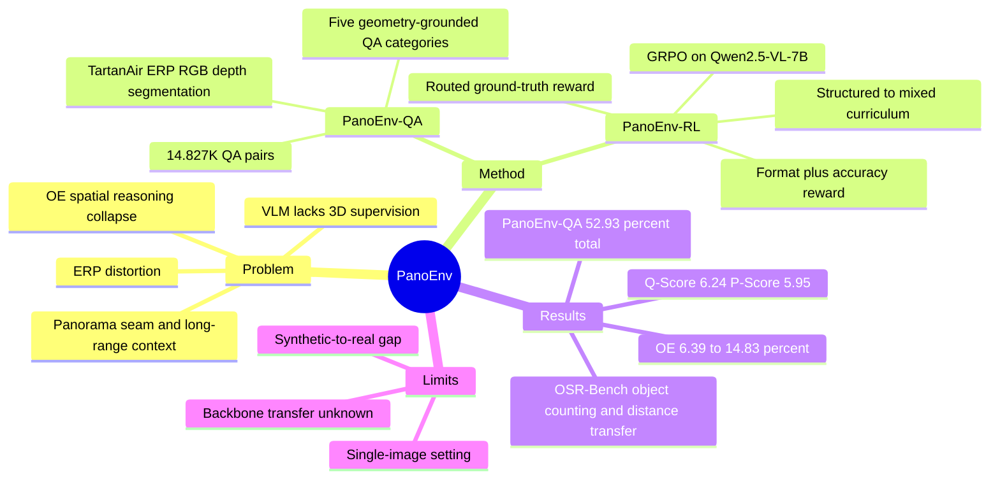

## Summary

PanoEnv 提出一个面向 360° ERP panoramic images 的 3D spatial reasoning VQA benchmark，并用 TartanAir 的 depth、segmentation、3D geometry 生成可验证 QA 与 reward。作者在 Qwen2.5-VL-7B-Instruct 上用 GRPO、geometry-aware routed reward 和两阶段 curriculum 做 post-training，使 PanoEnv-QA 总准确率从 49.34% 提升到 52.93%，OE accuracy 从 6.39% 提升到 14.83%。

## Problem & Motivation

当前 VLM 在普通 perspective image 上表现强，但 360° ERP panorama 会带来几何畸变、seam discontinuity 和 long-range context 依赖，导致 2D heuristic 很难直接迁移到真实 3D spatial reasoning。已有 panoramic VQA / omnidirectional reasoning benchmark 有价值，但作者认为它们仍缺少 panoramic coverage、dense geometry 和可用于 RL 的 fine-grained physical ground truth。本文关注的问题不是单纯识别图像内容，而是从 monocular panorama 中恢复距离、相对方位、真实体积/形状等 3D physical relationships。

## Method

**PanoEnv-QA benchmark**：数据来自 TartanAir synthetic 3D environments。作者把 six perspective cubemap views 合成为 high-resolution ERP image，并保持 RGB、depth、semantic segmentation 对齐；每个 object 从 segmentation mask 中提取 2D bounding box、depth statistics、camera source、3D point cloud 和 volume。最终数据包含 595 个 panoramic scenes、60 个 virtual environments 和 14,827 个 QA pairs。

**五类问题**：
1. **Camera View Source Identification**：判断 object 来自 front / left / top 等 cubemap source view，或是否跨 seam。
2. **Object Distance Estimation**：基于 ERP depth map 生成 quantitative / qualitative depth QA。
3. **Environment Identification**：用 TartanAir metadata 生成 indoor/outdoor、scene category 等环境识别问题。
4. **Relative Spatial Positioning**：将 ERP pixel + median depth 反投影到 3D Cartesian coordinate，再比较 front/back、left/right、up/down 关系。
5. **Intrinsic Attribute Comparison**：从 object point cloud 的 3D bounding box 计算 volume 和 flatness，用于真实大小与形状比较。

**PanoEnv-RL post-training**：作者基于 Qwen2.5-VL-7B-Instruct，用 GRPO fine-tune language decoder 的 LoRA 参数，vision encoder frozen。Reward 由 accuracy reward 和 format reward 组成，权重为 `w_acc=0.9`、`w_fmt=0.1`；format 要求输出严格包含 `<Reasoning>` 和 `<Answer>`。Accuracy reward 按 question type 路由到五种策略：yes/no strict match、MCQ subject extraction + normalization、distance relative-error tolerance、spatial axis-wise keyword matching、counting exact match。

**Two-stage curriculum**：Stage 1 只训练 T/F 和 MCQ 等 structured questions，让模型先学会格式与低熵决策；Stage 2 再混入 balanced OE questions，以恢复/增强 open-ended generation，同时缓解 catastrophic forgetting。该设计直接对应 ablation：structured-only 对 T/F/MCQ 有益但 OE collapse，而 OE-only 会损伤 structured performance。

## Key Results

- **PanoEnv-QA dataset**：14,827 QA pairs，五个 major categories 基本均衡：Attribute Comparison 2,975、Distance Estimation 2,975、Relative Spatial Positioning 2,975、Environment Identification 2,965、View Source Identification 2,937。补充材料报告了随机子集 human verification 的 generated-answer accuracy 为 96%。
- **Baseline on PanoEnv-QA test set**：作者评测 14 个 SOTA VLMs，3,040-sample test set 上平均 total accuracy 为 36.72%、平均 OE accuracy 为 4.26%。最强 total baseline 是 Qwen2.5-VL-7B，49.34% total accuracy、65.19% T/F、57.24% MC、6.39% OE；best OE baseline 为 8.36%（DeepSeek-VL2-Base / Qwen2.5-VL-32B）。
- **PanoEnv-RL main result on PanoEnv-QA**：GRPO-Balanced (Ours, 7B) 达到 52.93% total accuracy、68.78% T/F、58.90% MC、14.83% OE、62.89% T/F+MCQ accuracy，Q-Score 6.24、P-Score 5.95。相对 Qwen2.5-VL-7B base，total accuracy 提升 +3.59 pp，OE accuracy 从 6.39% 到 14.83%（论文报告 +132% relative）。
- **Ablation on curriculum**：GRPO-Balanced 为 52.9% total / 14.8% OE，高于 GRPO-OneStage 的 50.8% / 11.8% 和 GRPO-Reverse 的 50.9% / 7.0%。GRPO-Structured 达到 52.3% total、69.5% T/F、60.9% MC，但 OE 只有 5.7%；GRPO-OE 的 OE 为 13.2%，但 total 降到 48.6%、MCQ 降到 52.3%。
- **Zero-shot sim-to-real on OSR-Bench**：PanoEnv-RL 在 Object Counting / Relative Distance / Relative Direction 上为 0.507 / 0.371 / 0.105，高于 Qwen2.5-VL-7B base 的 0.477 / 0.321 / 0.089；其中 Object Counting 和 Relative Distance 也高于 Qwen2.5-VL-72B 的 0.498 / 0.325，但 Relative Direction 低于 72B 的 0.181。

## Strengths & Weaknesses

**已知**：
- 亮点在于把 panoramic spatial QA 的 answer 和 RL reward 都锚定到 simulation engine 的 3D annotations，而不是依赖 LLM judge 或人工生成 CoT；这让 distance、volume、axis-wise spatial relation 等问题有可验证监督信号。
- Benchmark 设计覆盖 ERP source-view、metric distance、environment、relative 3D position、intrinsic 3D attribute 五类能力，比只测 2D topology 或 polar distortion 更接近 3D physical reasoning。
- Ablation 信息充分：one-stage、reverse curriculum、structured-only、OE-only 都被比较，能支持“两阶段 structured→mixed curriculum 更稳”的结论。
- 明确 failure cases：14 个 baseline VLM 在 OE questions 上几乎 collapse；GRPO-Structured 虽提高 structured tasks，但 OE 只有 5.7%；OSR-Bench 的 Relative Direction 上 PanoEnv-RL 仍低于 72B baseline。

**推测**：
- 对 GUI-agent / embodied agent 的启发主要是 reward design：当任务可从环境状态中程序化验证时，rule-based / geometry-grounded GRPO 比纯 imitation 或 LLM judge 更可控。但本文没有 GUI 操作、navigation execution 或 robot action 实验，不能直接声称方法能提升 agent success rate。
- PanoEnv-QA 的 synthetic 3D ground truth 很适合训练可验证 spatial reasoning，但模型是否学到可迁移的 world representation，还是主要适配了这五类 QA template，需要更多跨 benchmark / 跨 template 证据。

**不知道 / 局限**：
- 论文自己指出 synthetic-to-real gap 仍是挑战；真实 360° 数据常有 noisy 或 incomplete GT，本文没有给出完整解决方案。
- 训练只展示了 Qwen2.5-VL-7B-Instruct 上的 LoRA GRPO，reward/curriculum 是否同样适用于其他 VLM backbones 还不知道。
- temporal panoramic video 被列为 future work；当前方法主要处理 single ERP image，不覆盖时序一致性、active perception 或 closed-loop navigation。

## Mind Map

## Notes

- 这篇论文最有价值的不是 +3.59 pp total accuracy，而是把 panoramic 3D reasoning 拆成可验证问题族，并用 physical ground truth 直接定义 RL reward；这与 GUI / web agent 中“环境状态可验证 reward”的路线有结构相似性。
- 需要后续关注代码与数据实际开放质量，尤其是 QA generation、reward parser 和 OSR-Bench evaluation 是否足够可复现。
- 一个值得追问的问题：如果把 reward 从 answer-level string matching 推进到 object-level / coordinate-level verification，是否能减少 template overfitting，并更接近 embodied spatial action 的监督信号？
