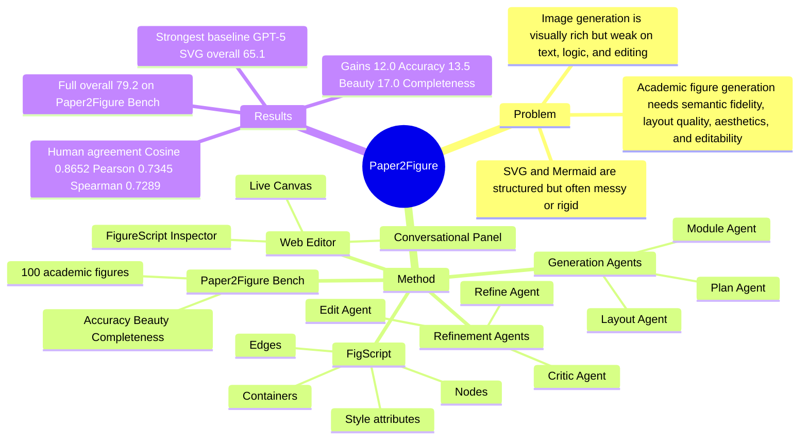

## Summary
Paper2Figure 解决从论文方法描述生成可编辑学术 figure 的问题：它用 FigScript 作为结构化中间表示，由 Generation Agents 生成初稿，再由 Refinement Agents 基于渲染图像迭代修改 FigScript，并接入 Web Editor 支持人工微调。作者构建 Paper2Figure Bench，用 100 个学术 figure-description pair 评测 Accuracy / Beauty / Completeness；full system overall average 为 79.2，高于最强 baseline GPT-5 SVG 的 65.1。

## Problem & Motivation
学术论文中的方法图、流程图、系统图需要同时满足 semantic fidelity、清晰结构、视觉美观和可编辑性。作者指出，LLM 直接生成 SVG / Mermaid 这类 code-based figure 时，语义结构和可编辑性较强，但布局容易凌乱、表达僵硬或美观性不足；GPT-Image-1、Nano Banana 等 image generation model 更容易生成风格化图像，但常出现文字渲染错误、逻辑结构不准、布局不可控且难以编辑。核心缺口是：现有路线难以同时保证 scientific figure 所需的 semantic precision、visual quality 和 flexible structure control。

## Method
Paper2Figure 是一个 dual multi-agent system，所有 agents 使用 GPT-4o 实现，通过 FigScript 这一中间语言把自然语言描述映射为可渲染、可编辑的 figure specification。FigScript 将 figure 表示为由 nodes、edges、containers、style attributes 构成的 hierarchical graph；它比 SVG 更抽象，避免低层绘图细节过多，又比 Mermaid 更灵活，支持颜色、字体、边框、箭头、padding、icon style 和多种 layout 参数。

系统分为两个阶段。Generation stage 包含 Plan Agent、Module Agent、Layout Agent：Plan Agent 从 user instruction 中抽取 entities、processes 和 logical relationships；Module Agent 将计划转成 FigScript 中的 visual modules；Layout Agent 调整 alignment、edge routing、spacing 和 grouping，生成可渲染的初始 FigScript。Refinement stage 包含 Critic Agent、Refine Agent、Edit Agent：Critic Agent 检查渲染图像中的 misplaced modules、text alignment、color imbalance、visual clutter 等问题；Refine Agent 形成 revision plan；Edit Agent 修改 FigScript 并重新渲染。论文设定 refinement iteration 默认值为 1，并分别报告 generation-only 与 full pipeline。

Paper2Figure Web Editor 将 agent workflow 和人工控制结合起来，由 Conversational Panel、Live Canvas、FigureScript Inspector 组成。用户可以用自然语言生成或编辑 figure，也可以在 Live Canvas 上直接调整元素；agent 接收当前 FigScript 状态后继续更新 specification。

Paper2Figure Bench 的构建流程是：作者收集约 500 篇近两年 arXiv 论文，筛选出 100 个较复杂且代表核心贡献的 main figures；每个 figure 与源论文交给 GPT-4o 生成 concise caption 和 detailed caption，再合并并由人工审阅标准化。评价维度为 Accuracy、Beauty、Completeness；Accuracy 包含 module coverage、relations/directions consistency、terminology/symbol alignment，Beauty 包含 layout/grouping、whitespace、line organization、text readability、color distinction、background boundaries，Completeness 通过从生成图像反推 caption 后与 reference caption 比较来评估。

## Key Results
- 在 Paper2Figure Bench 上，Paper2Figure (full) 的 Accuracy / Beauty / Completeness 分别为 78.7 / 81.5 / 77.5，overall average 为 79.2；最强 baseline GPT-5 SVG 的对应分数为 66.7 / 68.0 / 60.5，overall average 为 65.1。因此 full system 相比最强 baseline 分别提升 12.0 / 13.5 / 17.0 points，overall 提升 14.1 points。
- Refinement Agents 带来稳定增益：Paper2Figure (w/o Refinement) 在 Paper2Figure Bench 上为 74.3 Accuracy、79.1 Beauty、71.0 Completeness、74.8 overall；full system 为 78.7 / 81.5 / 77.5 / 79.2，overall 提升 4.4 points，Completeness 提升 6.5 points。
- 不同 baseline 的失败模式和分数差异明显：SVG baselines 中 GPT-o3 / GPT-4o / GPT-5 / Claude 4.5 Sonnet / Claude Opus 4 / Gemini 2.5 Flash / Gemini 2.5 Pro 的 overall average 分别为 57.5 / 59.2 / 65.1 / 63.8 / 63.0 / 55.1 / 60.5；Mermaid baselines 中 GPT-5 为 51.3、Claude 4.5 Sonnet 为 56.9；image generation baselines 中 GPT-Image-1 为 34.9、Nano Banana 为 45.0。
- 自动评价与人工评分的一致性实验使用 100 个 generated figures 和 2 名 annotators。Paper2Figure Bench metric 与 human judgments 的 Cosine / Pearson / Spearman 为 0.8652 / 0.7345 / 0.7289，高于 BERT 的 0.7863 / 0.6337 / 0.5758 和 F1 的 0.7847 / 0.5608 / 0.5955。

## Strengths & Weaknesses
**已知：**
- 论文的主要贡献不是新的 image model，而是把 structured intermediate representation、multi-agent planning/critique/editing 和 interactive editor 组合成一个可控的 text-to-figure workflow。这个设计对 research automation 有参考价值：最终状态是 FigScript，而不是一次性 raster image，因此更容易追踪、编辑和迭代。
- baseline 分析比较有信息量。作者指出 SVG models 常保留较多文本细节，但有 malformed arrowheads、text spilling、label/border/connector collisions 等问题；Mermaid outputs 更 rigid、配色和层次弱；GPT-Image-1 / Nano Banana 这类 image models 有 distorted text、spelling errors、missing modules、disordered arrow connections 和 logical errors。
- case study 给出了具体 failure cases：Gemini 2.5 Pro 留下 unconnected Example Prompt node；GPT-5 Mermaid 漏掉 DPO 由 preference pairs 训练的关系，并错误连接 RLHF endpoint 到 DPO Final LM；GPT-Image-1 出现 LM Policy 到 “Reinforcement Learning” 的 self-loop；Nano Banana 将 “Directly Optimize Final LM” 错画成 “Reparameterize Reward Model” 的输入。

**推测：**
- FigScript 和内置 layout/color templates 可能是结果稳定性的关键来源；论文也明确说部分优势来自 built-in layout and color templates。潜在风险是系统可能偏向模板可覆盖的 diagram style，对特别非标准的 scientific visualization 是否同样有效，论文没有直接证明。
- Paper2Figure Bench 的 caption construction 和 automatic judge 都依赖 GPT-4o，而系统 agents 也使用 GPT-4o；这可能带来 evaluator/model-family bias，但论文只用 100 个样本的人类评分相关性来支持 metric reliability，未进一步拆解这种偏差。

**不知道 / 未报告：**
- 论文没有报告 code link、DOI 或 arXiv id。
- 论文没有报告 latency、token/cost、Web Editor 的真实用户研究，也没有细粒度 ablation 分别去掉 Plan / Module / Layout / Critic / Refine / Edit Agent；唯一明确的系统 ablation 是 w/o Refinement vs full。
- 论文没有说明 Paper2Figure 在非方法图场景，如 plot-heavy figure、数学推导图、实验结果可视化或跨领域专业图示上的表现边界。

## Mind Map

## Notes
这篇论文和 GUI-agent / embodied-agent 的直接任务不同，但它的工程模式很接近可控 agent workflow：把自然语言目标转成结构化可执行状态，让 visual critic 在渲染结果上找错，再回写 state。对后续做 GUI agent 或 web/mobile agent 的启发是，中间状态如果可解释、可编辑、可渲染，agent 的自我修正和人类介入都会更容易落地。

一个值得追问的问题是：Paper2Figure 的能力究竟来自 multi-agent 分工，还是来自 FigScript schema + layout templates + GPT-4o 本身。现有实验只能说明 full pipeline 强于 generation-only，不能隔离每个 agent role 的边际贡献。
