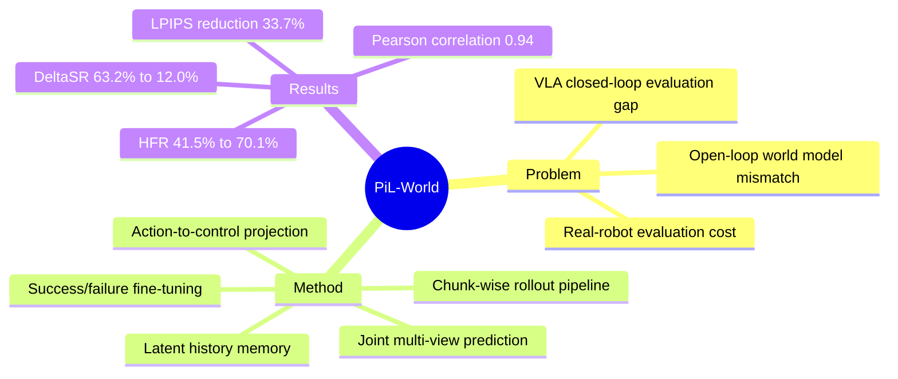

## Summary
提出了首个支持 **Policy-in-the-Loop** 闭环评估的 chunk-wise world model，通过 action-to-control projection、latent history memory 和 joint multi-view prediction，将 VLA success rate estimation error 从 63.2% 降到 12.0%。

## Problem & Motivation

VLA policy（如 pi_0、RT-2）在真实机器人部署时采用闭环执行：观察-行动-再观察。但现有 world model 仅支持**开环预测**——沿预收集轨迹预测，无法支持闭环评估中"每次 action chunk 需基于前一次执行结果生成"的核心需求。这导致 imagined rollout 与真实执行偏差大，无法作为有效的 policy evaluation proxy。

核心 gap：
1. **接口 mismatch**：现有方法无法将 VLA-predicted action chunks 映射到 future observations 并反馈给 policy
2. **过程不一致**：imagined rollout 可能偏离真实执行过程或出现多视角不一致

## Method

### 1. Chunk-wise Closed-Loop Rollout Pipeline

PiL-World 与 frozen VLA policy 交替执行：policy 预测 action chunk → world model 生成 stride-aligned future observations → terminal observation 反馈给 policy → 循环。每步预测 K=15 帧，stride Δ=3。

### 2. Action-to-Control Projection

将绝对关节空间动作映射到 head-view 视觉控制信号：
- 通过机器人运动学和相机投影，将 gripper position/state 转化为 head-view 上的 marker
- Marker 位置编码 gripper 投影位置，marker 大小编码 gripper state
- 确保视频生成与 VLA action chunks frame-aligned

### 3. Latent History Memory

维护最近多视角帧的 latent 编码作为历史上下文：
- 防止多轮预测时 drift away from preceding rollout history
- 训练时作为条件，推理时用于条件 future-latent generation
- Ablation 显示移除后 LPIPS 显著增加

### 4. Joint Multi-View Prediction

同时预测多视角同步帧，而非独立预测，确保多视角一致性。

### 5. Success/Failure Fine-Tuning Data

两阶段训练：
1. **Pretrain**: 在 RealSource World（14M frames, 35 tasks）学习通用机器人-环境动力学
2. **Fine-tune**: 目标任务轨迹，包含**成功演示 + 失败执行**，使 model 见识 goal-reaching 和 non-goal-reaching 轨迹分布

## Key Results

### Closed-Loop Rollout Agreement

| Task | SR_real | Ctrl-World ΔSR | PiL-World ΔSR | Ctrl-World HFR | PiL-World HFR |
|:-----|:--------|:---------------|:--------------|:---------------|:--------------|
| Sort Cubes | 83.3% | 71.8% | **15.0%** | 39.5% | **83.3%** |
| Stack Bowls | 96.7% | 72.6% | **4.2%** | 47.4% | **83.9%** |
| Stack Blocks | 50.0% | 45.1% | **16.7%** | 37.7% | **43.0%** |

- 平均 ΔSR 从 63.2% → 12.0%（**5x improvement**）
- 平均 HFR 从 41.5% → 70.1%
- Pearson correlation 0.94（real vs. imagined success rates across checkpoints）

### Single-Step Visual Prediction

Ground-truth action conditioning 下的 LPIPS：
- Sort Cubes: 0.1454 → 0.0965（**33.7% reduction**）
- Stack Bowls: 0.1366 → 0.1100（**19.5% reduction**）
- Stack Blocks: 0.1277 → 0.1208（**5.4% reduction**）

Head-view gain 最大（action-to-control 直接约束），wrist-view 在 occlusion/contact 场景仍 challenging。

## Strengths & Weaknesses

### Strengths

1. **问题定义精准**：首次明确区分 open-loop vs. closed-loop VLA evaluation，指出现有 world model 的接口 mismatch
2. **设计简洁有效**：action-to-control projection 用确定性几何映射而非学习，避免 action representation 的不确定性
3. **训练数据策略聪明**：加入 failed trajectories，让 model 见识失败场景，与真实 policy execution 分布更匹配
4. **HFR metric**：新提出的人类标注 metric，量化 dense rollout 可信度，比单纯 success rate 更 informative
5. **数字亮眼**：ΔSR reduction 从 63.2% → 12.0% 是实质性改进，Pearson 0.94 说明 imagined rollouts 能反映 relative policy performance

### Weaknesses

1. **任务覆盖有限**：仅 3 个 dual-arm manipulation tasks，更多任务类型、物体配置、机器人平台待验证
2. **Contact-rich 仍是难点**：Stack Blocks 的 HFR gain 最小（37.7% → 43.0%），小 pose error 快速放大
3. **Human annotation**：success 和 HFR 目前依赖人工标注，自动化评估方案缺失
4. **Head-view occlusion**：action-to-control projection 在严重遮挡或 wrist-camera 主导场景可能失效
5. **与 policy 的耦合**：需要知道 policy 的 chunk horizon 和 stride，对不同 policy architecture 可能需要调整

## Mind Map

## Notes

- **与 Ctrl-World 的本质区别**：Ctrl-World 是 policy-compatible world model，但仍是沿固定轨迹预测；PiL-World 强调"policy 在 loop 中"，每步生成 observation 反馈给 policy
- **Failed trajectories 的价值**：这是重要 insight——仅用成功演示训练的 world model 会 bias towards goal-reaching，而真实 policy execution 包含大量失败尝试
- **chunk-wise vs. frame-wise**：与 VLA 的 chunk prediction 对齐，stride Δ=3 意味着 policy 每 H_π 步重新 query，world model 在中间步不需重新预测
- **潜在应用场景**：VLA checkpoint selection、policy debugging、deployment risk estimation