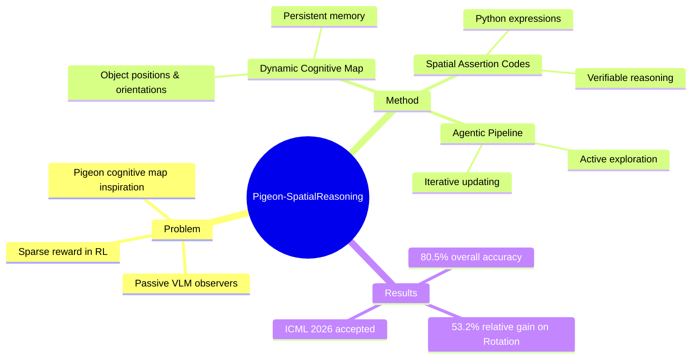

## Summary
提出一种受鸽子认知地图启发的 agentic spatial reasoning pipeline，通过动态认知地图和 Spatial Assertion Codes (SAC) 实现密集奖励信号的强化学习，在 MindCube benchmark 上达到 80.5% 整体准确率，Rotation 子集相对提升 53.2%。

## Problem & Motivation
现有 VLM 空间推理方法将模型视为被动观察者，提供所有视觉信息后直接推理，这在真实应用中效率低且 impractical。此外，现有 RL 方法（如 GRPO）依赖稀疏奖励（仅看最终正确性），难以有效优化复杂推理任务。关键洞察：鸽子能构建认知地图并利用其导航，作者借鉴此生物机制，提出 agentic pipeline 让 VLM 主动探索场景、构建动态认知地图，并通过可执行的 SAC 验证中间推理步骤，实现密集奖励。

## Method
核心架构包含三个关键组件：

**1. Dynamic Cognitive Map**
- 参数化场景布局为物体位置 `p_i` 和方向 `d_i`
- 持续整合新观测的可更新记忆结构
- 统一俯视坐标系下的全局表示

**2. Spatial Assertion Codes (SAC)**
- 将自然语言空间推理翻译为可执行的 Python 表达式
- 例：`obj1 in obj0.left(view=v4)` 对应 "从 view 4 看，物体 1 在物体 0 左侧"
- 与认知地图配合，可自动验证推理正确性（返回 True/False）

**3. Agentic Pipeline**
- (1) Active Exploration：基于当前认知地图和问题，检索相关视图
- (2) Cognitive Map Updating：整合观测更新认知地图
- (3) Iterative Process：重复直至决定回答或达到最大步数
- (4) Spatial Mental Reasoning：基于认知地图生成答案

**Training Process**
- **SFT 阶段**：合成数据集 `D_SFT = D_retrieval ∪ D_cogmap ∪ D_SAC`，初始化 agentic reasoning 能力
- **RFT 阶段**：设计密集奖励函数 `R = 1_correct * [1_correct + w * (R_retrieval + R_cogmap + R_SAC)]`
  - `R_retrieval`：检索视图的相关性
  - `R_cogmap`：认知地图正确性（与 GT 对比）
  - `R_SAC`：中间推理正确性（通过代码执行验证）

## Key Results
在 MindCube benchmark 上的表现：
- **Overall Accuracy**: 80.5%，相对提升 7.0% over best existing method
- **Rotation Subset**: 比最优方法高 29.5 accuracy points（相对提升 53.2%）——这是最难子集
- 在其他子集（Distance, Direction 等）均有稳定提升

**Ablation Studies**（从论文结构推断）：
- 验证了 SAC + cognitive map 组合的必要性
- 稀疏奖励 vs 密集奖励的对比实验

## Strengths & Weaknesses

**Strengths**
- **Novel insight**：鸽子认知地图的生物类比有趣且合理，"active perception" paradigm 区别于主流 passive approach
- **Executable verification**：SAC 将模糊的自然语言推理转化为可验证的代码，巧妙解决 RL 密集奖励难题
- **SOTA on Rotation**：53.2% relative improvement 在最难子集上说明方法确实学到 deeper spatial understanding
- **Clean formulation**：MDP formulation 清晰，pipeline 设计有层次

**Weaknesses**
- **Benchmark limitation**：MindCube 是 synthetic 3D 环境，真实场景的泛化性待验证
- **Code generation dependency**：SAC 要求 VLM 能准确生成 Python 代码，这对模型 code generation 能力有门槛
- **Ground truth cognitive map**：训练需要 GT cognitive map，真实应用中如何获取？数据依赖性可能限制实用性
- **Institute 未标注**：论文 HTML 中未明确作者单位信息

## Mind Map

## Notes
- 这篇与 MindCube (Yin et al. 2025) 直接对比，MindCube 用的是 static cognitive map，本文升级为 dynamic + agentic
- SAC 的设计思路类似 "code as verification" 在其他 reasoning task 中的应用（如数学推理用代码验证），但在 spatial domain 是新应用
- RL reward design 中 `1_correct` 前置条件防止 reward hacking 是个好设计
- 待思考：真实 embodied agent 场景中，认知地图的 GT 如何获取？是否可以用 SLAM 或 neural implicit representation 替代？