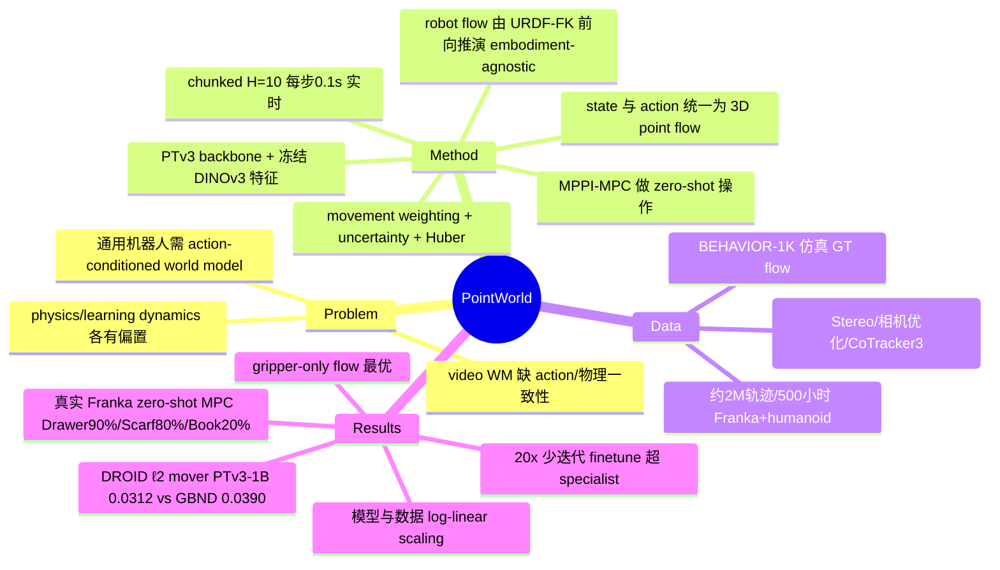

## Summary
PointWorld 把 state 与 action 统一表示为 3D point flow，用一个预训练的 3D world model 从单张（或少量）RGB-D 图像加一段 embodiment-agnostic 的机器人动作，预测 full-scene 的逐点 3D 位移；单一 checkpoint 无需 demonstration 或 post-training，即可通过 MPC 驱动真实 Franka 完成 in-the-wild 的推、变形物体、articulated 物体操作与工具使用。

## Problem & Motivation
通用机器人需要一个能"从看到的场景 + 打算做的动作预测世界如何演化"的 world model。作者指出三类现有路线各有短板：physics-based 模型受 sim-to-real gap 制约且需针对环境定制；learning-based dynamics model 依赖领域特定归纳偏置（full observability、objectness/material 先验）；在大规模视频上训练的 generative world model 虽逼真，却缺乏显式 action conditioning、物理一致性不足。核心 gap 在于：当前模型的预测与人类"看一眼 + 设想一个动作"就能预见的物理响应之间仍有差距。作者的哲学是 unification for scaling——把 state 与 action 放进同一个 3D 物理空间模态，从而跨 embodiment、跨任务统一学习并可扩展。

## Method
**统一表示**：state 用 full-scene 3D point cloud（由 RGB-D 反投影得到的 particle 集合，每点带位置 p 与时不变特征 f）；action 用 robot 自身几何按 forward kinematics（读 URDF，先验已知）前向推演出的 dense 3D point flow。这样 action 是"想象出来的、完整可见的" embodiment-agnostic 交互几何，即便接触发生在遮挡区域（如抱着大箱子）也能表达；为效率只采样 gripper 表面点（约 300–500 点/gripper）。于是 3D world modeling = 在 robot point 扰动下预测 full-scene 3D point flow。

**架构**：scene 点用冻结的 DINOv3 特征（投影到 2D 取多层特征），robot 点用 temporal embedding；把带时间戳的 robot 点与 scene 点拼接后送入 point cloud backbone（选定 PointTransformerV3 / PTv3），共享 MLP head 在一次前向里预测长度 H 的 chunk 内每点逐步位移。采用多步 chunked 形式 F_θ^H:(s_t, a_{t:t+H-1}) → s_{t+1:t+H}，H=10、每步 0.1s，兼顾时序一致性与摊销计算，实现 real-time（相较 diffusion 类需秒级推理）。

**训练目标**（Eq.1）：因为多数点静止、naïve L2 训练信号被淹没且真实数据噪声大，采用 (i) movement weighting（用 soft movement likelihood 对每点每步重加权，聚焦运动点）+ (ii) aleatoric uncertainty regularization（逐点标量 log-variance）+ 3D 残差上的 Huber loss。

**用于操作**（Sec.3.2）：把预训练 PointWorld 接入 sampling-based MPC（MPPI）。给定单张 RGB-D 建初始 state，采样 K 条 end-effector 轨迹 → 构造对应 robot point-flow action → PointWorld rollout scene flow → 累计 task cost（任务相关点到目标位置的 pointwise cost，可由人经 GUI 或 VLM 指定）+ control regularization，迭代精化标称轨迹（Eq.2）。

**数据**（Sec.4）：约 2M trajectories / 500 小时，覆盖 single-arm Franka 与 bimanual humanoid、真实 + 仿真。真实来自 DROID，用三阶段无标注管线打 3D 标注：FoundationStereo 立体深度 → VGGT 初始化相机位姿再对齐已知 robot mesh 优化外参（中位平移/旋转误差 1.8 cm / 1.9°）→ CoTracker3 做 2D point tracking 再 lift 到 3D，恢复 DROID 中 >60%（近 200 小时）的可靠 3D point flow。仿真来自 BEHAVIOR-1K（约 1100 小时，利用仿真状态取 GT flow，只保留有活跃接触与非零物体运动的轨迹）。作者称这是目前最大的 3D dynamics modeling 数据集并全部开源。

## Key Results
- **Backbone scaling（Table 1，DROID 测试集，ℓ2 mover / static，越低越好）**：GBND 0.0390 / 0.0066 → PTv3-50M 0.0331 → PTv3-1B **0.0312 / 0.0056**；PTv3-1B 参数达 GBND 的 **957.71×** 而内存/延迟仅温和增长，延迟 ≈0.12s。PTv3 的 serialization + U-net 层级使其在部分可观测下比 GBND 的局部 message passing 更能建模长程效应。
- **Scaling（Fig.5，Sec.5.1）**：在 DROID 上单轴扫描，模型 50M→1B、数据 5%→100%，log 空间下 ℓ2 mover 近似线性下降，两个轴都给出可预测的增益。
- **Ablation（Fig.6，Sec.5.2）**：gripper-only point flow 相比 whole-body point flow（同点数稀疏 / 2000 点）与 low-dim（6-DoF EEF pose、joint position）baseline，在真实 DROID 上取得最佳——真实数据里 whole-body flow 反而低于 low-dim，稀疏含噪信号被无关点稀释，gripper-only 兼顾接触推理与跨异构 embodiment 的正迁移。movement weighting + uncertainty head + Huber loss 一起相对纯 ℓ2 稳定并提升精度。
- **Generalization / Transfer（Table 2）**：zero-shot in-domain D→D 0.0315 / B→B 0.0087（B1K held-out 达 sub-cm mover）；cross-domain（sim↔real）zero-shot 仍难（D→B 0.1460）但用 1/20 训练迭代 finetune 后大幅缩小（D→B 0.0107）并超过 from-scratch specialist（0.0293）；real+sim 联合预训练略增强 zero-shot。
- **真实机器人 MPC（Fig.4，zero-shot、无 demo/post-training、单张 in-the-wild RGB-D）**：pushing—Tissue Box 70% / Book 20%；deformable—Scarf 80% / Pillow 40%；articulated—Microwave 30% / Drawer 90%；tool use—Duster 60% / Broom 60%。评测指标为一秒 horizon 上逐点逐步 ℓ2（约 4 万条轨迹、每条 1 万点，标准误 ≤1e-5 m）。

## Evidence Ledger
| Claim ID | Claim | Type | Source locator | Evidence excerpt | Status |
|:--|:--|:--|:--|:--|:--|
| C1 | 数据集约 2M trajectories / 500 小时，跨 Franka + bimanual humanoid、真实(DROID)+仿真(B1K) | number | Abstract, Sec.1/4 (p.20765-69) | "totaling about 2M trajectories and 500 hours across a single-arm Franka and a bimanual humanoid" | source-verified |
| C2 | DROID 测试集 ℓ2 mover：PTv3-1B 0.0312 vs GBND 0.0390 | number/comparison | Table 1 (p.20770) | "PTv3-1B ... 0.0312"; "GBND ... 0.0390" | source-verified |
| C3 | PTv3 扩到 GBND 的 957× 参数仍保持相近内存/高效推理，1B 延迟≈0.12s | number | Table 1 + caption (p.20770) | "retaining similar memory and efficient inference ... PTv3-1B ≈ 0.12 s" | source-verified |
| C4 | 实时推理：chunk H=10、每步 0.1s / 每次前向 0.1s | number | Sec.3.1/3 (p.20767-68) | "H = 10 steps and 0.1s per step"; "real-time latency (0.1 s per batched forward pass)" | source-verified |
| C5 | 标注管线恢复 DROID >60%（近 200 小时）可靠 3D point flow | number | Sec.4 (p.20769) | "reliable tracked 3D point flows for over 60% of DROID (nearly 200 hours...)" | source-verified |
| C6 | 真实 Franka zero-shot MPC 成功率：Drawer 90% / Scarf 80% / Tissue Box 70% / … / Book 20% | number | Fig.4 (p.20771) | "Drawer 90% ... Scarf 80% ... Tissue Box 70% ... Book 20%" | source-verified |
| C7 | 用 1/20 (20×少) 迭代 finetune 即超过 from-scratch specialist | comparison | Sec.5.3 / Table 2 (p.20771-72) | "surpasses specialists if finetuned with 20x fewer updates" | source-verified |
| C8 | ℓ2 mover 随模型(50M-1B)与数据(5%-100%)近似 log-linear 下降 | causal-mechanism | Sec.5.1 / Fig.5 (p.20771) | "In log space we observe approximately linear behavior for both axes" | source-verified |
| C9 | gripper-only point flow 在真实 DROID 上优于 whole-body flow 与 low-dim baseline | comparison | Sec.5.2 / Fig.6 (p.20771) | "Gripper-only flows ... attain the best performance" | source-verified |
| C10 | 号称最大 3D dynamics modeling 数据集且全部开源 | sota-novelty | Sec.4 / Abstract (p.20765-69) | "the largest 3D dynamics modeling dataset, which we fully open-source" | source-verified |
| C11 | action = 由 URDF 经 FK 生成的 embodiment-agnostic 3D point flow（~300-500 点/gripper）而非 joint 等特定动作空间 | causal-mechanism | Sec.3 (p.20767-68), Sec.5.2 | "robot point flows are generated by forecasting ... via forward kinematics using its URDF"; "300–500 points per gripper" | source-verified |
| C12 | B1K held-out 达 sub-centimeter mover 误差 | number | Sec.5.3 (p.20771) | "On B1K the model achieves sub-centimeter mover error on held-out trajectories" | source-verified |

## Strengths & Weaknesses
**亮点**：(1) 表示层面的 unification 是真正的 first-principles 选择——把 state 与 action 都落到 3D point flow，一举解决 action conditioning（视频 world model 的痛点）、跨 embodiment 迁移（不依赖 joint 空间）、以及遮挡下的接触表达（imagined robot flow 是完整可见的），比"给视频加 action token"更接近物理。(2) 系统性的 scaling recipe（backbone / objective / feature / model size / data 多轴 ablation）比单点 SOTA 更有信息量，log-linear scaling 曲线给出可预测的投资回报。(3) 无标注 3D 标注管线（Stereo + camera-pose 优化 + point tracking）把大规模真实数据变得可训，是让 3D world model "scale in the wild" 的关键工程，且承诺开源数据/代码/checkpoint。

**局限与需批判处**：(1) 评测主指标是一秒 horizon 的逐点 ℓ2 flow 误差，而非任务成功率——作者自己也承认"绝对误差差异可能很小但对应显著的 rollout 保真度差异"，即 ℓ2 与真实操作性能的映射并未量化，模型层面的强 scaling 结论不等于下游成功率同步 scaling。(2) 真实机器人成功率方差很大（Drawer 90% 但 Book 20%、Microwave 30%），样本为每类少量试验，且需人工（GUI 或 VLM）指定 task point 与 target，并非端到端自主；这更像"world model + MPC 的可行性演示"而非稳健策略。(3) cross-domain zero-shot（sim↔real）明显退化（D→B 0.1460），说明统一表示并未消除 sim-real gap，仍需 finetune。(4) 依赖精确 URDF/FK 与 RGB-D + FoundationStereo 深度质量；对无 URDF 的柔性/欠驱动 embodiment、或深度严重退化场景的适用性未验证。(5) "最大 3D dynamics 数据集""开源"为作者声明（截稿时 code/dataset 为 will be open-sourced 的未来式），需以实际放出为准。

**对领域的意义**：为"3D world model 作为 manipulation 基座"给出了一条不同于 video world model 的可扩展路线，其 point-flow 统一表示与 scaling 证据可能影响后续 world-model-based planning / policy pretraining 的表示选择。

## Mind Map


## Notes
- 直接关联：[[Papers/2602-DreamZero]] 已把 PointWorld 作为"3D point cloud world model"替代方案提及；本笔记补足其原始出处与数字。
- 对比坐标：与 [[Papers/2506-VJEPA2]]（latent/JEPA 视频 world model）、[[Papers/2501-RoboticWorldModel]] 及 [[Topics/WorldModel-Survey]] 中的 video/generative world model 形成表示层面的对照——PointWorld 走显式 3D point-flow 而非像素/latent。
- 归属：world model canonical 方向；建议并入 [[Topics/WorldModel-Survey]] 与 [[DomainMaps/WorldModel]] 的 "3D / point-based world model for manipulation" 分支。
- 待查（appendix 未在本次 15 页正文范围内展开）：chunked prediction 与 partial observability 的额外 ablation（Sec.A.2/A.3）在正式补充材料中，若后续需要 mechanism 级证据可再取 supplementary。
```