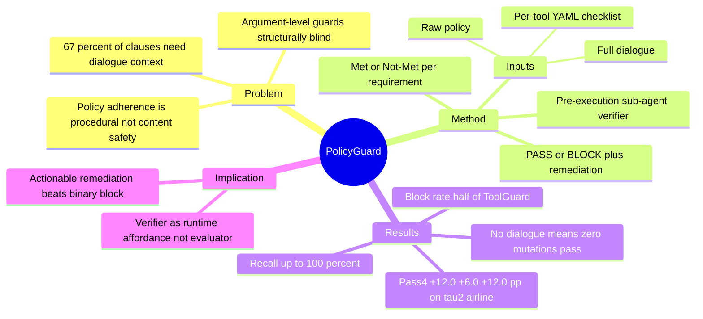

## Summary
PolicyGuard 把 policy adherence 从"对单个 tool argument 做安全检查"重新定义为"对整段对话做程序性合规验证"：在每个 mutating tool call 执行前，一个与 agent 同级的 sub-agent verifier 读取完整对话历史 + 原始 policy 文本 + LLM 生成的 per-tool checklist，逐项判定 Met/Not Met，输出 PASS 或 BLOCK + 面向下一轮对话的具体 remediation。在 τ²-bench airline 上对三家 vendor 的 agent 分别提升 Pass⁴ +12.0/+6.0/+12.0 pp，同时 block rate 只有 argument-level guard（ToolGuard）的一半左右。

## Problem & Motivation
现有 safeguard 工作把 policy adherence 当作 harmful-content 分类或 tool-argument 校验问题，但真实公司 policy 的核心是**程序性要求**：用户确认（explicit confirmation）、前置读取（prerequisite reads）、操作顺序约束——这些要求分布在多轮对话中，取决于对话内容而非任何单个参数值。作者统计 τ²-bench airline 的 policy 条款，约 67% 依赖对话上下文或先前 tool 结果，argument-level guard（ToolGuard、Solver-Aided、PCAS）结构上就看不到这些信息。

另一个观察是 frontier model 本身合规能力不足：GPT-5.4 baseline Pass⁴ 仅 46%、Sonnet 4.6 仅 72%。作者提出满足这个 bar 需要三种能力：(i) 完整对话上下文；(ii) 对开放 policy 文本 + 当前对话的 self-reasoning；(iii) 面向 agent 下一轮的 conversation-specific remediation——单纯"能看到对话"不够，还需要显式验证机制。

## Method
PolicyGuard 是插在 agent 和 environment 之间的 sub-agent verifier：

- **触发时机**：仅在 mutating tool call 执行前触发（read-only call 直接放行），pre-execution 拦截。
- **输入**：完整对话历史、待执行的 mutating tool call、原始 policy 文档、LLM 预生成的 per-tool YAML checklist（把 policy 编译成每个 tool 的条目化 requirement）。
- **过程**：verifier（与 agent 同 vendor 同 tier 配对，隔离方法贡献与基座强度）对每条 requirement 用 CoT 逐项判定 Met / Not Met。
- **输出**：PASS（放行执行）或 BLOCK + 指名缺失 prerequisite 的 conversation-specific remediation，反馈给 agent 用于下一轮。

四个 policy 输入变体做 ablation：PG-Raw（仅原始 policy 文本）、PG-Checklist（原文 + checklist，headline 配置）、PG-Raw-Traj（去掉对话历史）、PG-Checklist-Only（仅 checklist 无原文）。

## Key Results
- **主结果**（τ²-bench airline，50 tasks，n=4 trials，三 vendor）：PG-Checklist 将 Pass⁴ 从 0.460→0.580（GPT-5.4，+12.0pp）、0.720→0.780（Sonnet 4.6，+6.0pp）、0.480→0.600（Gemini 2.5 Pro，+12.0pp）。
- **Per-call 分析**：policy-violation recall 100%/100%/94.7%；block rate 44.1%/37.1%/57.8%，约为 ToolGuard（74%/79%/71%）的一半——更高 recall 且拦截次数减半。
- **Dialogue 是 load-bearing input**：去掉对话历史（PG-Raw-Traj）后，104 个 mutation simulation 中没有一个 mutation 能通过——完整对话上下文不是加分项而是必要条件。
- **Checklist vs 原文**：去掉原始 policy 文本（PG-Checklist-Only）Mut Pass¹ 掉 15.4pp——checklist 是增强项，原文仍需在场。
- **成本**：PG-Checklist 对 Mut 任务的 agent+user turn 膨胀比 ToolGuard 少 1.5–2.3×，因为 remediation 是定向的而非笼统拒绝。
- **弱 verifier / 弱 agent**：用 GPT-5.4-mini 做 verifier 损失 6pp Pass⁴ 但仍优于 baseline；agent 和 verifier 都用 mini 时提升反而更大（+16pp）——弱 agent 从外部验证中获益更多。
- **对抗探针**：authority claim / false precondition / indirect prompt injection 三种攻击下 PV Pass⁴ 从 24 降到 21–23/24，退化温和但设计上不面向 adversarial user。

## Strengths & Weaknesses
**亮点**：问题重构有第一性价值。它指出 argument-level guard 的结构性盲区（67% 条款不可见）不是实现问题而是信息问题——验证所需的证据在对话流里，不在参数里。PG-Raw-Traj ablation（无对话则零 mutation 通过）是这个 claim 的干净因果证据，这比 headline +12pp 更有信息量。

**亮点**：verifier 的输出是 actionable remediation 而非 binary block。这解释了为什么 block rate 减半的同时 recall 更高：verifier 不只是判罚，还把"缺什么 prerequisite"翻译给 agent，使 agent 下一轮能修复而非重试。这与 [[Papers/2606-Dockerless]] 的 evidence-grounded verdict 同构——verifier 价值在于生成可行动的中间证据，不在于最终 label。

**局限**：单 benchmark。只在 τ²-bench airline 上验证（retail/telecom 因饱和或 agent 控制面不足被排除，见其 Appendix K），50 tasks × 4 trials 的样本量对 +6pp 级别的差异统计功效有限。checklist 由 GPT-5.4 单一 vendor 生成后复用，作者自己承认 per-agent 重新生成可能让 Gemini 更好——headline 数字对 Gemini 可能低估。

**局限**：触发面只覆盖 mutating tool call。verbal commitment（agent 口头承诺了违规内容但没调 tool）和 read-only call 完全绕过验证；且是概率性 enforcement，作者明确说不适用于 safety-critical 域。

**局限**：verifier 与 agent 读同样的用户内容，prompt injection 面前二者同时暴露——对抗鲁棒性只是探针级验证。

## Mind Map

## Notes
- 对 Agent-Facing Environment Runtime 的直接启发：PolicyGuard 是"verifier 作为 agent-facing runtime affordance"的 dialogue/tool-call 域实例——verifier 不是事后判分（evaluator-only），而是执行期拦截 + 定向 remediation 反馈。这为 [[Ideas/HybridVerifier-GUIRuntime]] 提供了一个 non-GUI 域的 existence proof：cross-channel verifier（这里是 dialogue channel + policy channel）确实能在不训练 agent 的前提下提升合规执行。
- 与 [[Papers/2605-OpenComputer]] 的对照：OpenComputer 说 programmatic verifier 判分比 LLM judge 准（94.1% vs 79.2%）；PolicyGuard 则展示 LLM verifier 在"无法程序化验证的开放 policy 文本"域的用法。两者划出一个边界：可程序化的用 programmatic verifier，程序化不了的（对话语义、开放 policy）才交给 LLM sub-agent——AFE 的 verifier affordance 应该是这两层的组合。
- 与 [[Papers/2606-Dockerless]] 的共同 pattern：两者都把 verifier 做成"生成结构化中间证据（checklist 判定 / evidence QA）→ judge 聚合"，而非端到端打分。这是第三个独立数据点（加上 OpenComputer），支持 pattern："verifier 的可靠性来自 evidence decomposition，而非模型能力"。
- BLOCK + remediation 的机制与 [[Papers/2606-MobileForge]] 的 corrective hint 有微妙区别：MobileForge 把 hint 作为 RL state 条件，PolicyGuard 把 remediation 作为 inference-time 对话反馈——同一种信息（"哪里不对、缺什么"）在 training-time 和 inference-time 两条路径上都有效。
- 遗留问题：mutation-only 触发意味着"验证盲区"从 argument 移到了 verbal commitment——如果 GUI 域照搬（只在 destructive action 前验证），typing/navigation 等"软"动作的累积偏航仍然不可见。AFE-MiniSuite 的 verify affordance 设计需要考虑 step-level 与 milestone-level 两档触发。
