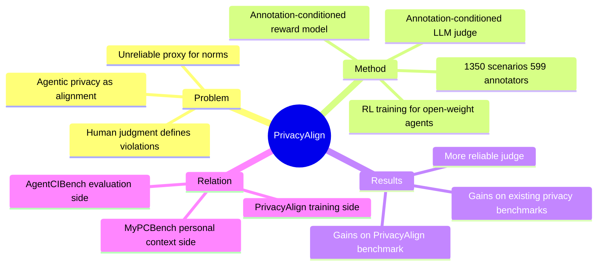

## Summary

> [未获取全文，仅基于 abstract]

PrivacyAlign 构建了一个以**人类标注为核心**的 agentic privacy alignment 框架：1,350 个场景 + 3,516 条详细注释，用来同时 ground alignment training（annotation-conditioned reward modeling + RL）和自动评估（annotation-conditioned LLM judge），让小型 open-weight agent 在 privacy norms 上显著对齐人类判断。

## Problem & Motivation

> [未获取全文，仅基于 abstract]

AI agent 代替用户发送消息、调用工具时，每个动作都是一次"什么信息、分享给谁、在什么条件下合适"的判断。这是一个 **contextual privacy alignment** 问题：正确的答案依赖社会规范，不是简单的敏感词过滤。

现有方法的问题是：训练和评估都依赖**不可靠的 proxy**（如规则匹配、是否包含敏感字段），而非人类对场景适宜性的真实判断。LLM judge 也因此不可靠——它们不知道人类对同一 prompt 如何标注。

核心 insight：**privacy violation 不仅是被标注的，更是被人类判断所定义的**。没有高质量的人类 annotation，训练信号和评估指标都是错的。

## Method

> [未获取全文，仅基于 abstract]

**PrivacyAlign 数据集**：1,350 个 agentic 场景，覆盖当前 LLM 实际会泄漏的情形；来自 599 个独立标注者，共 3,516 条详细 annotation（含解释）。

**Annotation-conditioned LLM judge**：把人类对 reference response 的 annotation 和解释注入 LLM judge 的 conditioning，提升 judge 评分可靠性。传统 LLM judge 看 prompt + response；这里 judge 额外看"人类对同一 prompt 的同类 response 是怎么判断的"。

**Annotation-conditioned reward modeling**：用这些 annotation 给 RL 训练中的新 response 打分，作为 reward signal。小型 open-weight agent 通过这个 reward 进行 RL 微调，对齐人类 privacy norm。

整个流程是：人类 annotation → 更可靠的 judge → 更好的 reward model → RL 训练对齐后的 agent。这是一个完整的 alignment pipeline，而非只做 benchmark。

## Key Results

> [未获取全文，仅基于 abstract]

- 经过 annotation-conditioned reward + RL 训练的小型 open-weight agent 在 PrivacyAlign 上取得显著提升。
- 在现有 privacy benchmarks for agents 上也有 strong gains（具体数字未获取）。
- Annotation-conditioned LLM judge 比 unconditioned judge 更可靠（方向明确，幅度未知）。

## Strengths & Weaknesses

> [未获取全文，仅基于 abstract]

**Strengths**：

- **问题定位准**：把 agentic privacy 定义为 alignment 问题（training + evaluation 都要对齐人类判断），而非单纯 benchmark 或 filter，思路更根本。
- **完整 pipeline**：数据集 + judge 改进 + reward modeling + RL 一套打通，是训练导向的工作，不只是评测。
- **annotation-conditioned reward 有新意**：把 human explanation 注入 reward signal，比 RLHF 里直接收集 preference 更信息量丰富。
- **场景选择针对性强**：只包含 LLM 实际会泄漏的场景，不在 trivially hard/easy case 上浪费标注预算。

**Weaknesses**（推测，受限于 abstract）：

- **与 contextual integrity 理论的关系不清晰**：abstract 没有明确引用 Contextual Integrity（Nissenbaum）框架，而 [[Papers/2606-AgentCIBench]] 以 CI 为核心 formulation——两者的理论基础是否一致，还是 PrivacyAlign 用的是 judgment-based 经验定义，不得而知。
- **泛化范围有疑问**：599 个标注者的 privacy norm 是否能代表跨文化、跨组织的多样人群？benchmark 内分布可能有人口偏差。
- **RL 实验规模未知**：abstract 说的是"small open-weight agents"，是否 scale 到 frontier model 仍不清楚，有可能结论只在 small-model regime 成立。
- **数据集本身的可重用性**：1,350 个样本是否足以作为通用的 privacy alignment 训练集，还是场景分布过于集中？

**Impact**：

在 [[Papers/2606-AgentCIBench]] 证明泄漏现象普遍之后，PrivacyAlign 填补了"怎么训练让 agent 不泄漏"的方法论空缺。两者一体两面：一个是评测哪里泄漏，一个是训练 agent 学会什么叫合适。

## Mind Map

## Notes

- **与 [[Papers/2606-AgentCIBench]] 的分工**：AgentCIBench 是 contextual-integrity-framed evaluation harness（offline benchmark，CI formulation 严格）；PrivacyAlign 是 training-oriented alignment dataset + pipeline（annotation-conditioned RL，CI 理论立场不明确）。前者更适合做诊断，后者更适合做 intervention。
- **与 [[Papers/2606-MyPCBench]] 的关系**：MyPCBench 证明 personal context 是任务能力短板；PrivacyAlign 直接攻击 privacy leakage 而非 task success。两者关注的是同一部署问题的不同侧面。
- **对 runtime intervention 思路的启示**：PrivacyAlign 是 training-time 方法（改变 agent 权重）。如果 agent 是 proprietary closed-weight model，training-time 方法无法使用，需要 prompt-level instruction 或 runtime guard——这正是 [[Ideas/PersonalizedSafety-CUA]] 中的核心 design choice。PrivacyAlign 没有对比这三条路的 trade-off。
- annotation-conditioned reward 的思路可以借鉴到 personal preference 对齐问题上：如果标注里包含用户偏好解释，reward model 就能学习"为什么某个信息流对此用户不适合"，而非只学 label。
