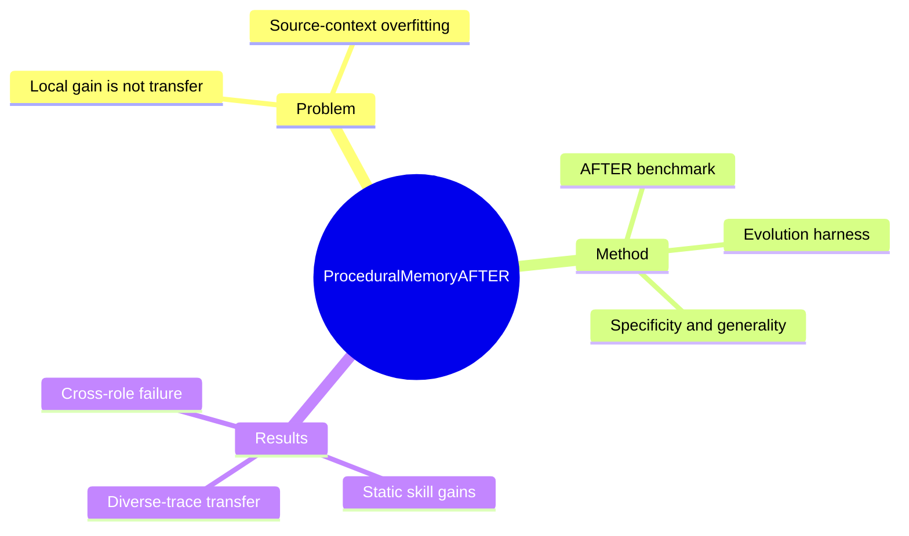

## Summary
论文提出 AFTER benchmark 与 Evolution harness，把 LLM agent 的 procedural memory 从静态 prompt 资产改写为可演化、可追踪且必须经受跨 task、role 与 model transfer 检验的 skill。

## Problem & Motivation
企业 agent 经常重复执行文档处理、数据分析、基础设施配置和软件工程流程，因此把过往 trajectory 蒸馏成可复用 procedure 很有吸引力。然而，已有 memory 系统常把同一环境内的局部提升等同于真正 generalization：从单一 model、task 或职业角色的经验中演化出的 skill，可能只记住了 source context 的偶然细节。论文要回答的核心问题不是“memory 能否提高原任务分数”，而是“哪些 procedural structure 能跨 context 复用，哪些会发生 specialization”。

## Method
作者构建 AFTER：382 个真实工作场景任务，覆盖 Data Engineer、Data Scientist、Generative AI Engineer、Infrastructure Engineer、Project Manager 与 Software Engineer 六类角色，以及 document processing、data operations、ML/AI、infrastructure、software engineering 五个能力域中的 22 种 skill。任务包含 318 个 single-skill 与 64 个 multi-skill workflow；skill 标注在 task definition 中固定，以把 skill quality 与 retrieval quality 分开。

每个 skill 都采用可版本化的 `SKILL.md` 表示，并提供 handcrafted baseline 与 LLM-generated body。评估同时测量 specificity（source-context gain）和 generality（held-out task、cross-role、cross-model transfer），以 partial test progress 的 M1 和 full-pass accuracy 的 M2 计分。Evolution harness 统一 trace collection、skill versioning、update execution、promotion/rollback 与 lineage tracking，并以 Collect–Diagnose–Revise–Promote 循环支持不同 procedural-memory framework 的受控比较。

## Key Results
- 静态 skill 在 AFTER 上平均使 full-pass accuracy 提升 2.8 个百分点；一次 LLM-guided refinement 在不同 model scale 上再带来 3.7–6.7 个百分点，平均增益为 5.2 个百分点。
- 汇总多种 model execution trace 演化的 skill 达到 73.1% cross-model test accuracy；single-model source 的范围为 36.0%–59.4%，因此至少领先最强单一来源 13.7 个百分点。
- 同一 pdf skill 在 role 内演化时，PM 与 DS 分别提升 11.7 和 6.2 个百分点；跨 role 迁移反而损失 4.8–7.5 个百分点，直接展示了 source-context overfitting。
- 在 Kafka Lag Anomaly Detection 案例中，evolved skill 相比 handcrafted skill 为 Claude 减少 326k tokens（62%），为 Hermes 减少 48k tokens（16%），说明 procedure 可以把运行时探索前置进 prompt。

## Strengths & Weaknesses
最大亮点是把“skill 有用”拆成 specificity 与 generality，并用 role–skill structure 让 transfer failure 可被直接观测；固定 task–skill annotation 也避免把 retrieval error 混入 skill quality。跨 model、跨 role 与 token efficiency 的结果共同说明，多样 experience 比单纯累积更多 trajectory 更重要。

局限也很清晰：AFTER 主要来自 technology-sector workflow，未覆盖 healthcare、legal、scientific research 及开放式 creative task；pytest verifier 关注 functional correctness，不能衡量 readability、test suite 外的 robustness 或 user preference。每次 evolution 的 trace budget 被固定，尚不知道更大规模 experience 是否继续改善 transfer；所测 model 与 memory framework 也并不穷尽当前系统。

## Mind Map

## Notes
这篇论文最值得复用的思想是：procedural memory 的更新目标不能只看 source task reward，至少还需要 held-out context 的 promotion gate。后续可追问如何在不穷举 target distribution 的前提下，用 skill complexity、trace diversity 或 counterfactual verifier 预测 transfer risk。
