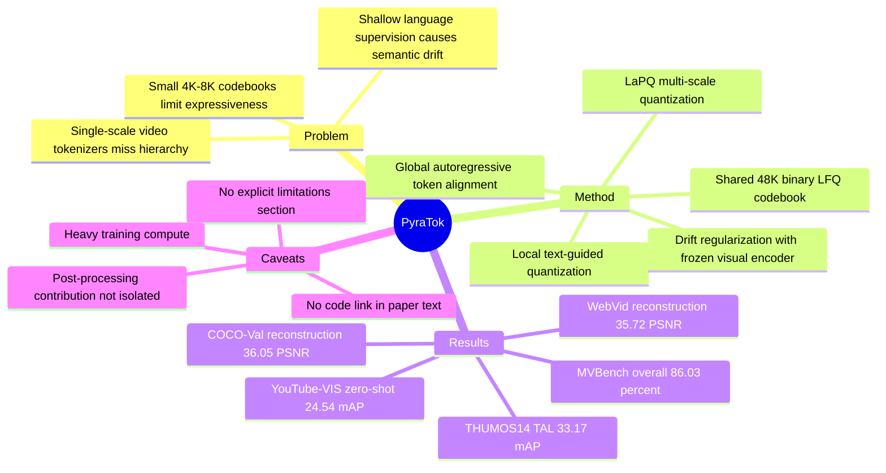

## Summary
PyraTok 是一个 language-aligned pyramidal video tokenizer，用多尺度 LaPQ quantization、共享大 binary codebook 和 autoregressive semantic alignment，把 video VAE 的离散 token 同语言语义对齐。论文的核心贡献不是单一任务模型，而是把同一套 video latent 同时用于 reconstruction、text-to-video generation、zero-shot segmentation、temporal action localization 和 video understanding。

## Problem & Motivation
现有 discrete video VAE/tokenizer 通常只在单一尺度学习视觉 codebook，且多依赖视觉重建目标，导致 token 与文本语义之间存在 semantic gap。论文指出三个具体瓶颈：第一，single-scale quantization 难以同时保留低层空间细节和高层语义；第二，常见 4K-8K token codebook 表达能力有限；第三，浅层或单点 language supervision 容易产生 semantic drift 和 temporal inconsistency。

这个问题对 video-language system 很重要：text-to-video generation 需要 prompt 与 latent 对齐，VideoQA / segmentation / action localization 又需要 token 对局部对象、动作边界和全局时序关系有语义可读性。PyraTok 的假设是：如果 tokenizer 本身就学习 language-aligned、multi-scale、semantically structured discrete latents，下游生成和理解模型可以少花代价去弥合视觉 latent 与语言输入之间的差距。

## Method
**Architecture.** PyraTok 构建在 pretrained video VAE 之上，引入 Language-aligned Pyramidal Quantization (LaPQ)。输入视频先经过 masking/shuffling 后由 encoder 提取多层 spatiotemporal features；每个 stage 的 Quantization Block 接收当前 encoder feature、上一层 quantized representation 和 text embedding，形成从 coarse 到 fine 的多尺度 token hierarchy。

**Local semantic alignment.** 每个 Quantization Block 用 text embedding 参与 attention/fusion，使 token assignment 在对应尺度上受语言条件约束。量化采用 Lookup-Free Quantization (LFQ)，用共享 binary codebook 替代传统高维 embedding lookup；论文报告 full LaPQ 使用 48K vocabulary / 16 dimension，目标是在较大 vocabulary 下保持可训练和可扩展。

**Global semantic alignment.** PyraTok 把来自不同 LaPQ stage 的 discrete tokens 拼接为 token sequence，并用 separator token 保留层级结构；给定 text query 后，VLM decoder 通过 autoregressive objective 预测视觉 token。这个全局目标用于约束 token hierarchy 的 sequence-level temporal/relational coherence，补足仅靠局部 quantization 可能产生的 semantic drift。

**Training losses.** 总目标包括 reconstruction loss、hierarchical semantic codebook loss、autoregressive alignment loss 和 drift regularization。重建项由 SSIM、L1、LPIPS 组成；codebook loss 包含 vision-commitment、entropy regularization、hierarchical consistency、text-conditioned alignment、text-codebook alignment；drift loss 用 frozen reference encoder 约束 LoRA-adapted encoder 不偏离 pretrained visual manifold。

**Implementation details.** 论文使用 Wan 2.2L video VAE 作为 backbone，并在 encoder block 中加入 LoRA rank 16 / alpha 32；text conditioning 使用 Qwen2.5-VL 3B。训练数据包括 Droplet-10M 的约 4-5M HD video subset、OpenVid-1M 的 300K HD video-caption pairs，以及 UltraVideo 的 40K 4K/8K videos with reconstructed captions；训练分三阶段，优化步数为 30K、60K、180K，使用 128x NVIDIA A100 80GB GPUs。

**Downstream use.** Zero-shot segmentation 使用最后一个 quantization block 的 text-aligned tokens，与 prompt semantic units 做相似度，再上采样并用 3D CRF refine masks。Temporal action localization 使用第一层 q(1) frame-level features，与文本 embedding 做 cosine similarity，并用 K=25 的 sliding window、threshold 和 connected-sequence decoding 生成 action segment。

## Key Results
- **Frame reconstruction / WebVid-10M and COCO-Val.** PyraTok 在 WebVid-10M 达到 35.72 PSNR / 0.879 SSIM / 0.066 LPIPS，在 COCO-Val 达到 36.05 PSNR / 0.885 SSIM / 0.071 LPIPS；对应强基线 LARP 为 WebVid-10M 33.03 / 0.851 / 0.091、COCO-Val 34.26 / 0.853 / 0.089。
- **Text-to-video generation / WebVid-10M.** 替换 tokenizer 后，MotionAura 的 FVD/TC 从 374/204 改善到 365/246，Open MAGVITv2 从 433/191 改善到 411/214，OmniGenV2 从 398/185 改善到 377/208；论文总结为 FVD 降低 9-22 points、TC 提升 20-27 points。
- **Zero-shot video semantic segmentation / YouTube-VIS 2021 and OVIS.** PyraTok 在 YouTube-VIS 2021 得到 24.54 mAP / 66.56 Jaccard，在 OVIS 得到 8.9 mAP / 49.44 Jaccard；作为对比，OmniTokenizer 为 14.54 / 51.12 和 2.8 / 33.27，LARP 为 10.52 / 49.37 和 1.7 / 28.45。
- **Temporal action localization / THUMOS14 and ActivityNet v1.3.** 在 50% seen / 50% unseen setting 下，PyraTok zero-shot Avg. mAP 为 THUMOS14 33.17、ActivityNet v1.3 29.11；前一 VAE-based zero-shot 强基线 LARP 为 27.42 和 25.53。
- **General video understanding and classification / MVBench and Kinetics.** PyraTok 在 MVBench overall accuracy 为 86.03%，在 Kinetics-400/600/700 分别为 78.43 / 77.11 / 74.08；LARP 对应为 83.21、69.27 / 68.52 / 66.89。
- **Compression and generation supplementary results.** 在 MCL-JCV 0.034 bitrate 下，PyraTok 为 29.82 PSNR / 0.942 SSIM / 0.068 LPIPS，LPIPS 低于 HEVC 0.199、VCC 0.153、3D-MBQ-VAE 0.089。UCF-101 class-guided video generation 中，PyraTok gFVD 为 51，低于 LARP-L 57 和 SweetTok 65。
- **Ablation / components and losses.** 去掉 LaPQ 后 COCO-Val/WebVid-10M 降到 31.41/0.831/0.101 和 31.47/0.799/0.118；full 4-block PyraTok 为 35.72/0.879/0.066 和 36.05/0.885/0.071。去掉 AR loss 后 MVBench 从 86.03 降到 79.45，去掉 text-conditioned alignment 后 THUMOS14/ActivityNet/MVBench 从 33.17/29.11/86.03 降到 30.22/27.55/83.56。

## Strengths & Weaknesses
**已知。** PyraTok 的 strongest evidence 来自跨任务一致收益：reconstruction、T2V、zero-shot segmentation、TAL、MVBench/Kinetics 都有具体指标提升，而不是只在生成或理解单侧优化。Ablation 也支持主要设计：LaPQ、4 个 quantization blocks、AR loss、drift loss、text-conditioned alignment、text-codebook alignment 都被逐项移除过，且移除后多数 benchmark 下降。

**已知。** 论文对 codebook scaling 给出较细分析：codebook utilization 随分辨率从 240p 的 55.23% 上升到 4320p 的 97.12%，1080p 已超过 79%，4K regime 超过 90%。这支持作者关于 large binary codebook 在高分辨率视频中被有效使用的 claim。

**推测。** 对 GUI-agent / embodied agent 来说，PyraTok 的潜在价值在于把长视频 observation 压成 language-aligned、multi-scale token sequence，可能有助于 grounding、temporal localization 和 memory compression。但论文没有评估 GUI screen recording、robot manipulation、navigation 或 action-conditioned world modeling，因此不能把其 video benchmark 收益直接外推到 agent control。

**局限。** 论文没有单独的 limitations section，也几乎没有展示 PyraTok 自身 failure cases；附录更多展示的是 baseline failure 或 PyraTok qualitative success。对于 segmentation 和 TAL，附录 pipeline 包含 3D CRF、semantic-unit decomposition、sliding-window thresholding 等 post-processing，但没有单独隔离这些 heuristic 对最终指标的贡献。

**局限。** 训练设置很重：约 4-5M Droplet-10M HD videos、300K OpenVid-1M、40K UltraVideo，并使用 128x A100 80GB GPUs 训练三阶段。即使论文称 baselines 在相同 dataset settings 下训练，复现成本和数据/compute scaling 对收益的贡献仍需要独立验证。

**不知道。** 正文只给出 project page，没有在论文文本中给出 GitHub code 链接或 DOI。main text 与 appendix 对 VAE 初始化/冻结的表述也需要进一步核对：main text 说 pretrained VAE encoder/decoder frozen，appendix 同时出现 LaPQ module and decoder randomly initialized 与 Wan 2.2L encoder/decoder kept frozen 的说法，具体实现边界不完全清晰。

## Mind Map

## Notes
- **我的判断**：rating=4。它与 GUI-agent 不直接相连，但对 VLM/video understanding 很相关；如果未来做 screen-video memory、video-grounded agent evaluation 或 long-horizon observation compression，language-aligned tokenizer 是值得跟踪的组件方向。
- **最有信息量的 ablation**：`w/o LaPQ` 的重建指标大幅下降，说明 multi-scale language-aligned quantization 不是装饰；`w/o AR` 在 MVBench 上掉 6.58 points，说明 sequence-level token modeling 对高层视频推理更关键。
- **需要进一步查证**：project page 是否释放 code / weights、CVPR camera-ready 是否修正 appendix 的实现表述、segmentation/TAL post-processing 是否有独立 ablation、在真实 GUI screen/video 或 embodied task 上是否仍能保持 token-language alignment。
- **Source version**：paper header 显示 arXiv:2601.16210v2 [cs.CV], 23 Feb 2026；venue 按 CVPR 2026 paper page 记录。
