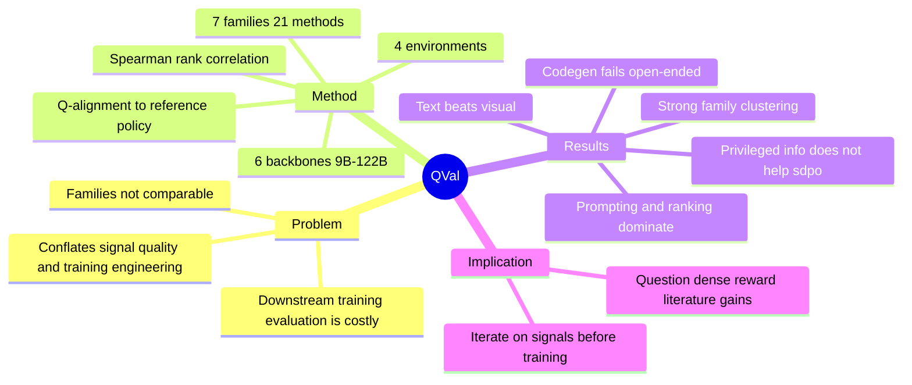

## Summary
QVal 提出一个 training-free 的 dense supervision signal 评测台：不跑下游 RL 训练，而是直接测量一个方法的打分是否与强 reference policy 的 Q-value 排序一致（Q-alignment，Spearman ρ）。在 4 个环境（FrozenLake/ALFWorld/OpenApps/TerminalBench）、7 个方法族 21 个方法、6 个 open-weight backbone（9B–122B）共 1.2K+ 实验中，核心发现是：simple direct prompting 与 ranking baseline 一致优于文献中的 recent dense supervision methods，且方法表现强烈按 family 聚类——复杂化很少改善 signal 质量。

## Problem & Motivation
Long-horizon agent 的轨迹可含成百上千个 action，outcome-only reward 太稀疏，因此涌现大量 dense supervision 方法（intrinsic confidence、self-distillation、embedding similarity、pre-trained value model、code generation 等）。但这些方法的标准评测方式是"接进完整训练 pipeline 看下游性能"，这有三个问题：贵；把 supervision quality 与训练工程 confounder（算法、优化细节）混在一起；不同方法族需要不同训练 setup，导致横向不可比。结果是 dense supervision 方法几乎从未在 common ground 上被 benchmark 过。QVal 的重构是：signal 质量可以在任何训练之前被直接测量——只要它能正确排序 action 的真实价值。

## Method
**Q-alignment 定义**：给定 (state, action) pair，用强 reference policy π 的 continuation 估计 Q^π(s,a)；一个 supervision 方法是 Q-aligned 的，当其打分对 action 的排序与 reference Q-value 排序一致。主指标 Spearman's ρ（辅以 Kendall's τ）；ranking 类方法用 state 内的 state-local Spearman。

**Reference policy 构造**：FrozenLake 与 OpenApps 用 scripted optimal policy；ALFWorld 用 expert planner；TerminalBench 用 GPT-5.5 的 Max-Value Monte Carlo rollouts（k=16，100% Pass@16 验证）。

**7 个方法族 21 个方法**：(1) direct prompting ×5（单点/批量/序列/多次平均）；(2) ranking ×1；(3) intrinsic scoring ×2（ΔBelief、LLM-as-a-Verifier rubric）；(4) self-distillation ×2（sdpo、sdpo-gt：给定 outcome 信息后 action 概率的提升）；(5) pre-trained value models ×4（VIP/LIV 变体）；(6) embedding similarity ×4（VLM-RM/VLM-SOR，CLIP/SigLIP goal similarity）；(7) code generation ×3（eureka/codegen：LLM 生成可执行打分函数）。

## Key Results
- **Prompting/ranking 全面领先**：direct prompting 与 ranking 两族在 Q-alignment 上一致最高，且最简单的 direct-single 与更复杂变体相当或更好——文献中的新方法族（self-distillation、embedding、value model）反而落后。
- **按 family 强聚类**：同族方法的 correlation 区间高度相似，跨 model size、环境、模态均保持——说明决定 signal 质量的是方法族的机制而非实现细节。
- **环境特异性**：direct 方法在最开放的 TerminalBench 上仍保持稳定正相关；code-generation 方法在 open-ended 环境显著变弱且方差最大；self-distillation 反而在复杂环境更强。
- **模态差距**：text observation 显著优于 visual，跨方法一致。
- **Negative results**：给 self-distillation 特权信息（sdpo-gt ground truth outcome）不改善表现；embedding-similarity 系整体 underperform。
- **鲁棒性**：方法相对排序在 state-value vs action-value target、GPT-5.5 vs Claude Opus 4.7 两种 reference policy 之间基本保持。

## Strengths & Weaknesses
**亮点**：问题重构干净利落——把 "dense supervision 方法好不好" 从昂贵且 confounded 的下游训练中剥离成 training-free 的排序对齐测量。这与 evaluation 领域 "先测 signal 再训练" 的 proxy metric 思路一脉相承，但做成了跨方法族的 common-ground testbed，可扩展新环境和新方法。1.2K+ 实验、6 backbone、双 reference policy 的鲁棒性检查诚意足。

**亮点**：负结果比正结果更有信息量。"simple prompting 一致优于 recent dense supervision methods" 对整个 PRM/dense-reward 文献是一次系统性拷问：许多方法报告的下游增益可能来自训练工程而非 signal 质量。特权信息不帮助 self-distillation、code-generation 在 open-ended 环境失效，都是给该子领域的具体警告。

**局限**：Q-alignment 是 signal 质量的必要非充分条件。作者自己承认 poorly-aligned signal 仍可能通过 exploration bonus 等机制帮助训练；且 ranking 对齐不等于 scale/校准合适——RL 训练对 advantage 的数值形状敏感，这一层 QVal 测不到。结论 "prompting baseline 够了" 是否传导到下游训练收益，仍需至少一次配对验证（论文未做 closing-the-loop 实验）。

**局限**：reference policy 即 ground truth 的循环性。TerminalBench 的 Q-value 来自 GPT-5.5 rollout——用 LLM 的行为分布定义"真值"再评测 LLM 打分方法，可能系统性偏向与 reference policy 分布相近的 prompting 方法。scripted/expert 环境无此问题，但恰好是简单环境。

**局限**：vision 方法拿到的输入信息量本身更少（作者承认 modality 与 abstraction quality 混淆）——"text 优于 visual" 的结论对 GUI/CUA 场景的 dense reward 设计只能作弱参考。

## Mind Map

## Notes
- **对 RL-based GUI Agent Training 方向（rule-based reward design 子方向）的直接影响**：QVal 的结论支持 agenda 中"转向更底层 reward design"的判断，但同时提出警告——如果 simple prompting 的 Q-alignment 已经最优，那么 reward design 的增量空间可能不在"更聪明的 signal"而在"signal 的使用方式"（触发时机、聚合、与 outcome reward 的组合）。这与 [[Papers/2606-MobileForge]]（hint 作为 state 条件而非 reward 项）的取向一致。
- **与 verifier 主线的关系**：QVal 测的是 dense supervision 的排序质量，[[Papers/2605-OpenComputer]] 测的是 outcome verifier 的判分准确率，[[Papers/2606-Dockerless]] 测的是 evidence-grounded verifier 的 AUC——三者合起来勾勒出"supervision signal 质量测量"这个 meta 问题的三个切面（process ranking / outcome judgment / evidence-based scoring）。AFE 的 verify affordance 若要暴露 step-level 信号，QVal 式的 Q-alignment 预检可以作为 affordance 质量的准入门槛。
- **与 [[Papers/2607-AgenticSTS]]、[[Papers/2606-AgenticAbstention]] 的组合**：QVal 说 prompting 已是最好的 step-level value 估计——那么 abstention（何时停）和 memory contract（存什么）可能比 dense reward 更值得投入，因为它们改变的是决策结构而非打分质量。
- **方法论借鉴**："先在 training-free testbed 上迭代 signal，再进昂贵训练"的工作流对 AFE-MiniSuite 同样适用——C0–C7 因果对照本质上就是在做 affordance 的 training-free 收益测量。
- code/data 公开：q-val.com + GitHub + HuggingFace datasets。
