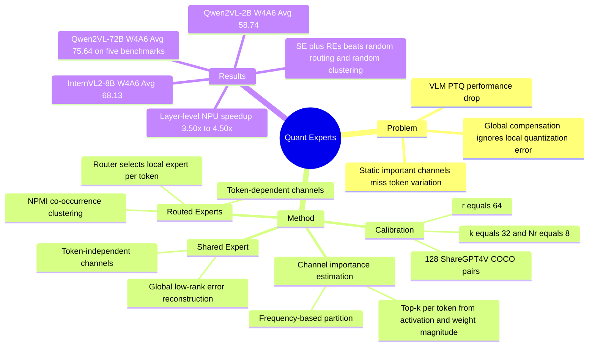

## Summary

Quant Experts (QE) 面向 large Vision-Language Models 的 post-training quantization，指出已有静态 channel importance 估计和全局 error compensation 忽略了 modality 与 token 之间的重要通道分布差异。方法把 important channels 划分为 token-independent 与 token-dependent 两类，用 shared low-rank expert 重建全局误差，并用 routed low-rank experts 对 token-specific local error 做自适应补偿。在 Qwen2VL / InternVL2 的 2B-72B 模型和 W4A6/W4A8/W3A16 设置上，QE 相比 RTN、SmoothQuant、AWQ、MBQ、LQER 更稳定；例如 Qwen2VL-72B W4A6 在 MMMU/OCRBench/ScienceQA/TextVQA/VizWiz 上平均 75.64，高于 MBQ 70.55，接近 FP16 77.98。

## Problem & Motivation

作者要解决的问题是 VLM 低比特 PTQ 中的性能退化。已有方法通常把重要通道看作 calibration set 上的静态集合：SmoothQuant / AWQ 做 channel-wise scaling，SpQR 做静态敏感通道保护，OBQ / GPTQ 用静态 Hessian 估计，LQER / ASER 用单个 global low-rank adapter 重建量化误差；MBQ 进一步考虑 modality-aware channel sensitivity，但仍不足以刻画 token 级变化。

论文的核心观察有两个。第一，同一层权重下，不同 modality 之间、同一 modality 内不同 tokens 之间，top-k important channels 的位置都会变化。第二，important channels 的出现频率高度不均：少数通道在多数 tokens 上反复出现，更多通道只对特定 tokens 重要，而且低频通道仍可能有较大的 outlier magnitude。因此，单一全局补偿会同时低估 token-independent global error 和 token-dependent local error。

这个问题对 VLM 部署重要，因为 Qwen2VL / InternVL2 这类模型覆盖 OCR、document QA、chart reasoning、general visual perception、science reasoning 等能力面；量化若破坏 token-level semantic fidelity，会直接影响这些下游能力。对 GUI-agent 方向来说，论文没有评估 GUI benchmark，但 screen understanding/OCR-heavy VLM pipeline 也可能面临类似的低比特保真问题。

## Method

QE 的第一步是 token-aware important channel partitioning。对第 `l` 层权重 `W_f^l`，先计算每个 input channel 的平均绝对权重 `w = Meanrow(|W_f|)`；对第 `t` 个 token，用 `Top-k(|x_t| * w)` 得到该 token 的 important channels。然后在 calibration data 上统计每个通道被选中的频率，按频率排序：前 `k` 个定义为 token-independent channels，后续 `N_r * k` 个定义为 token-dependent channels。

**Shared Expert (SE).** 对 token-independent channels，QE 用一个 shared low-rank adapter 重建主要来自全局重要通道的 quantization error。作者沿用 low-rank reconstruction 思路，把 layer quantization error `E_l = W_f^l - W_q^l` 分解出 shared expert 近似项；同时使用 channel-wise scaling 降低 activation magnitude 并相应放大 weight，以减轻 activation quantization 的 outlier 影响。SE 完成初始重建后，剩余误差再交给 routed experts 处理。

**Routed Experts (REs).** 对 token-dependent channels，QE 不是为每个 token 单独训练补偿器，而是用 co-occurrence 关系把通道聚成 `N_r` 个子组。具体做法是构造 token-dependent channels 的共现矩阵，用 NPMI 得到 similarity matrix，再对 normalized Laplacian 做 spectral clustering，并用 K-Means 分到 `N_r` 个 clusters。每个 cluster 对应一个 routed low-rank adapter；推理时 lightweight router 根据输入 token 估计各 expert 的剩余误差，选择预测误差最小的 routed expert。最终每个 token 同时使用固定 SE 和一个动态选择的 RE。

实验默认设置较克制：calibration set 是 ShareGPT4V enhanced COCO Caption 中随机采样的 128 个 image-caption pairs；总 SVD rank `r=64`，QE 将其平均分给 shared/routed 两类 experts；`k=32`，`N_r=8`。论文还提出 optional layer-wise refinement，只训练 routed experts 和 router，其余参数冻结；正文报告的 refinement 使用 AdamW、learning rate `1e-4`、16 epochs，每个 epoch 100 iterations。

## Key Results

- **Qwen2VL-2B / W4A6 weight-activation quantization**：FP16 平均准确率为 62.97；QE 达到 **58.74**，高于 RTN 53.62、SmoothQuant 50.27、LQER 55.92、MBQ 54.73，距离 FP16 下降 4.23 points。具体 benchmark 上，QE 在 OCRBench 为 68.20、TextVQA 73.18、ChartQA 64.60、DocVQA 82.75，均高于 MBQ 的 61.10、69.45、60.08、76.24。
- **Qwen2VL-2B / W4A8 与 W3A16**：W4A8 下 QE 平均 **61.14**，高于 RTN 57.75、LQER 59.03、MBQ 57.00；W3A16 weight-only 下 QE 平均 **59.29**，高于 AWQ 55.64、LQER 57.49、MBQ 55.54。W4A8 的 DocVQA 为 84.46、ChartQA 为 69.28，接近 FP16 的 87.28、72.04。
- **InternVL2-8B / multiple quantization settings**：FP16 平均为 70.60。W4A6 下 QE 平均 **68.13**，高于 RTN 62.94、SmoothQuant 63.47、LQER 65.29、MBQ 65.00；W4A8 下 QE 平均 **69.09**，高于 LQER 68.19、MBQ 66.94；W3A16 下 QE 平均 **68.94**，略高于 AWQ 68.39、MBQ 68.31、LQER 68.11。
- **Qwen2VL-72B / five-benchmark main table**：在 MMMU、OCRBench、ScienceQA、TextVQA、VizWiz 上，FP16 平均为 **77.98**。W4A6 下 QE 平均 **75.64**，高于 MBQ 70.55、LQER 67.82、SmoothQuant 67.87、RTN 66.47，论文报告的相对 MBQ 提升为 5.09 points；W4A8 下 QE 平均 **77.19**，高于 MBQ 74.58、LQER 74.36，距离 FP16 约 0.79 points。
- **Component ablation / Qwen2VL-2B**：W4A6 下，只有 REs 时 MMMU/ScienceQA 为 34.56/68.72，只有 SE 为 35.22/69.61，SE + random routing 为 35.89/70.00，SE + random clustering 为 35.33/69.71，完整 QE 为 **36.89/70.85**。W4A8 下完整 QE 为 **38.00/74.37**，同样高于 SE、REs、random routing、random clustering variants。
- **Refinement 与 routed expert 数量**：refinement 并非所有任务都提升；例如 Qwen2VL-2B W4A6 中 MMMU 从 33.78 到 36.89、OCRBench 从 68.20 到 69.60，但 ScienceQA 从 71.84 降到 70.85。`N_r` 从 2/4/8/16 增加时，在 OCRBench/TextVQA/VizWiz 上平均从 67.08 到 67.35、67.83、68.06，说明更多 routed experts 有收益但带来额外 memory overhead。
- **Kernel performance / Qwen2VL-7B linear layers**：作者基于 FlightLLM accelerator architecture 做 analytical performance model，在 prefill stage、sequence length 128 下，QE 的 layer-level speedup 为 3.50x-4.50x。三种 weight shape 中，`3584 x 3584` 在 W4A6/W4A8/W3A16 为 3.56x/3.50x/4.10x，`3584 x 18944` 为 3.60x/3.59x/4.50x，`18944 x 3584` 为 3.84x/3.77x/4.50x。

## Strengths & Weaknesses

**已知。** 论文最有价值的点是把 VLM PTQ 的误差来源从 coarse modality difference 推到 token-level channel dynamics：同一 modality 内 token 语义和上下文变化也会移动 important channels。SE/REs 的拆分与两个观察相互对应，component ablation、random routing、random clustering 都支持“共享全局补偿 + 动态局部补偿”比单一 low-rank reconstruction 更有效。实验覆盖 Qwen2VL 与 InternVL2、2B 到 72B、weight-activation 与 weight-only 设置，benchmark 包含 MMMU、OCRBench、ScienceQA、TextVQA、VizWiz、AI2D、ChartQA、DocVQA、InfoVQA、MMStar、MuriBench 等，证据面比较广。

**局限。** 论文没有报告 qualitative failure cases，也没有分析具体错误来自 OCR、visual grounding、chart/document reasoning 还是 language reasoning；因此只能从 benchmark 分数推断能力损失。硬件效率部分是 linear-layer / prefill-stage 的 analytical model 和 kernel speedup，不是完整 VLM 端到端 latency、throughput、memory footprint 或 energy measurement。QE 增加了 low-rank adapters 与 router，复杂度表中 memory 从 `d^2` 变为 `d^2 + rd(1 + N_r)`；`N_r` 增大虽提升 accuracy，但也提高 memory overhead。refinement 的结果也不是单调正收益：部分任务如 Qwen2VL-2B ScienceQA、Qwen2VL-7B MMMU 在 refinement 后下降。正文叙述中有一个小的不一致：Table 2 标题是 InternVL2-8B，但 W4A6 结果段落写成 “InternVL2-2B” gains 3.13%；需要结合 supplementary 或作者代码确认。

**推测。** 对 GUI-agent / computer-use agent 来说，QE 的直接价值不是 agent policy，而是可能降低 screen-understanding VLM 的部署成本。如果 GUI screenshots 中 OCR tokens、icon/layout regions、instruction tokens 的 channel importance 也呈现 token-dependent dynamics，那么 QE 的 co-occurrence clustering + routed error reconstruction 可能比纯 modality-aware quantization 更适合 GUI VLM；但这需要在 GUI grounding、screen QA、mobile/desktop agent benchmarks 上验证。

**不知道。** 论文正文没有给出 code repository、DOI 或 arXiv id。我们不知道 QE 在真实 GUI-agent 或 embodied closed-loop 任务中能否保持 success rate，也不知道 calibration set 的大小和分布变化会如何影响 channel partition 与 router 稳定性。QE 是否能与 rotation-based PTQ、KV cache quantization 或更低比特 activation quantization 稳定组合，正文也没有系统回答。

## Mind Map

## Notes

这篇论文应归为 VLM deployment / PTQ，而不是 GUI-agent 方法论文。它对当前研究兴趣的价值在于：如果 GUI / web / mobile agent 依赖大 VLM 做 screen understanding，那么低比特化不能只按 modality 或 global outlier 处理，token-level channel dynamics 可能是保持 OCR、document QA、chart reasoning 等细粒度能力的关键变量。后续值得追问：在 GUI screenshots 上，important channels 是否按 UI element type、text density、icon/layout region 或 instruction token 形成可聚类的 token-dependent patterns。
