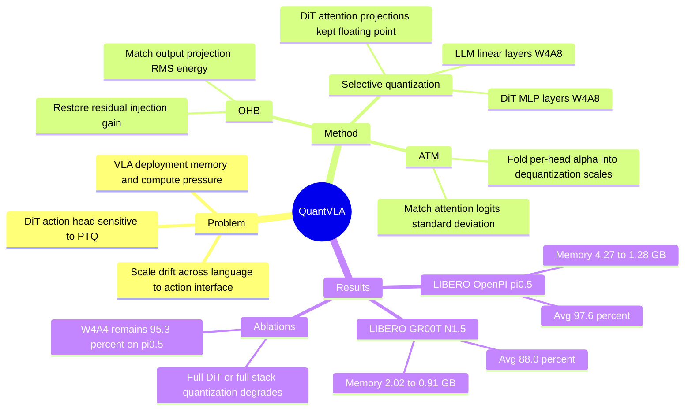

## Summary

QuantVLA 是一个面向 Vision-Language-Action models 的 training-free post-training quantization 框架，核心问题是低比特量化会在 language backbone 到 DiT action head 的接口处引入 attention logits temperature drift 和 residual-stream energy drift。方法采用 selective quantization：量化 LLM 的 linear layers 和 DiT 的 MLP layers，保留 DiT attention projections 为 floating point，并用 Attention Temperature Matching (ATM) 与 Output Head Balancing (OHB) 做尺度校准。在 LIBERO 上，QuantVLA W4A8 将 OpenPI π0.5 的 LLM+DiT memory 从 4.27 GB 降到 1.28 GB、Avg success 97.6% vs FP16 97.1%，并将 GR00T N1.5 从 2.02 GB 降到 0.91 GB、Avg success 88.0% vs FP16 86.5%。

## Problem & Motivation

VLA models 把视觉、语言和动作生成统一到一个 policy 中，但随着 language backbone 和 DiT-based action head 变大，部署瓶颈不只在 vision encoder，也在 downstream reasoning 与 control stack。论文指出，已有 VLA efficiency 方法多通过 compact architecture、layer pruning、routing、KV/token caching 或 action tokenization 降本，通常不直接处理 numerical precision，也很少量化 DiT action head。

作者要解决的问题是：能否在不 retraining、不改原始架构和 operator schedule 的情况下，对 VLA 的 language/action modules 做低比特 PTQ，同时保持 robotic manipulation success rate。关键动机来自一个失效模式：通用 LLM/VLM PTQ 方法（如 DuQuant、SmoothQuant）假设的尺度行为不适配 VLA 中 tightly coupled multimodal reasoning + diffusion action generation；上游 language quantization 的误差会进入 DiT conditioning，导致 attention logits 的有效 temperature 和 residual injection energy 偏移，进而在多层 DiT 中累积成控制误差。

## Method

QuantVLA 的对象是带 DiT action head 的 VLA policy：RGB frames 经 pretrained vision encoder 变成 image tokens，语言指令经 language backbone 编码，二者融合后 conditioning 一个 Diffusion Transformer policy head，后者通过 iterative refinement / flow matching 生成 action trajectory 或 action tokens。

方法从 DuQuant-style reparameterization 出发，用 per-channel smoothing、block-orthogonal rotations 和 channel permutation 重新分布 activation/weight outliers，使 linear layers 更适合低比特量化。但作者的分析认为，直接全量量化 DiT 会出现两个主要 drift：其一，Q/K variance 改变 attention logits scale，相当于改变 softmax temperature；其二，value/output projection 后的 amplitude 改变 residual injection gain 和 layer norm operating point。

QuantVLA 因此采用三部分设计：

1. **Selective Quantization Layout**：量化 LLM 中所有 linear layers；在 DiT action head 中只量化 MLP layers，保留 attention projections Q/K/V/O 为 floating point。这样牺牲一部分压缩空间，换取 DiT attention 和 residual interface 的稳定性。
2. **Attention Temperature Matching (ATM)**：用小型 unlabeled calibration buffer 估计 per-head scalar α，匹配 teacher 与 quantized student 的 logits standard deviation；α 经过 clipping 和 neutrality band 后 folded into dequantization scales，用于校正 attention temperature drift。
3. **Output Head Balancing (OHB)**：用 per-layer scalar β 匹配 teacher 与 quantized model 在 output projection 后的 RMS energy，恢复 residual stream 的注入幅度；β 同样来自 calibration buffer，并用于稳定 DiT residual path。

实现上，主实验采用 W4A8。Appendix D 报告了 block size 64、activation percentile 99.9、32 batches 估计 scales、per-channel smoothing coefficient 0.15，以及 α/β 从 unlabeled buffer 估计。论文强调 ATM/OHB 是 scalar folding，不引入额外 GEMM，也不改变原模型执行顺序。

## Key Results

- **LIBERO / OpenPI π0.5 main result**：FP16 baseline 在 Spatial/Object/Goal/Long 上为 98.5% / 99.0% / 97.5% / 93.5%，Avg 97.1%，LLM+DiT memory 4.27 GB。QuantVLA W4A8 为 98.5% / 98.0% / 98.0% / 96.0%，Avg 97.6%，memory 1.28 GB，relative savings 70.0%。
- **LIBERO / GR00T N1.5 main result**：FP16 baseline 为 92.0% / 92.0% / 86.0% / 76.0%，Avg 86.5%，memory 2.02 GB。QuantVLA W4A8 为 96.0% / 92.0% / 90.0% / 74.0%，Avg 88.0%，memory 0.91 GB，relative savings 55.0%。
- **DuQuant baseline failure**：在 OpenPI π0.5 上，DuQuant(LLM+DiT) W4A8 Avg 仅 76.3%，Long 从 FP16 93.5% 掉到 50.0%；在 GR00T N1.5 上 Avg 70.0%，Spatial/Object/Goal 分别为 66.0% / 70.0% / 68.0%。这支持作者关于 VLA/DiT action head 对直接 PTQ 敏感的论点。
- **Selective layout ablation / LIBERO**：不使用 ATM/OHB 时，OpenPI π0.5 只量化 DiT 得到 Avg 71.6%，全量 LLM+DiT 得到 76.3%，而 LLM+DiT(MLP) 得到 95.4%；GR00T N1.5 对应为 DiT 83.0%、LLM+DiT 70.0%、LLM+DiT(MLP) 82.5%。全量 action head 或 full stack 量化显著退化，尤其在 long-horizon task 上最明显。
- **更低比特 / denoising robustness**：OpenPI π0.5 在 LIBERO W4A4 下仍有 Avg 95.3%，低于 W4A8 的 97.6%，但高于大幅崩溃的直接 DiT/full-stack quantization。GR00T N1.5 在 denoising steps=8 时 QuantVLA Avg 88.0% vs FP16 86.5%，steps=16 时 Avg 88.5%。
- **额外 benchmark**：Pick-and-Can manipulation 上，GR00T FP16 为 31/50，SmoothQuant W4A8 为 16/50，QuantVLA W4A8 为 27/50；它缩小但没有完全消除与 FP16 的差距。OpenVLA 的 non-DiT action head 设置中，QuantVLA W8A16 在 LIBERO-Spatial 为 86.0% vs OpenVLA FP16 84.7%，但论文说明 DiT-specific ATM/OHB 不直接适用。

## Strengths & Weaknesses

**已知**

- 这篇论文的强点在于问题定位清楚：不是泛泛做 compression，而是把 VLA 中 language backbone 到 DiT action head 的 scale drift 作为 PTQ 失败原因来分析，并用 ATM/OHB 对应修正 logits temperature 与 residual energy。
- 实验覆盖两个代表性 VLA policy（OpenPI π0.5、GR00T N1.5）和 LIBERO 四个 suite，且有 DuQuant、SmoothQuant、selective layer choice、W4A4、denoising steps、Pick-and-Can、OpenVLA 等对比或扩展实验。
- 方法是 training-free，不改模型架构，不引入 routing/cache 等额外控制逻辑；对于已经训练好的 VLA policy，作为 deployment step 的工程吸引力较强。

**局限**

- 论文主要报告 success rate 和 LLM+DiT memory，缺少 wall-clock latency、power、throughput 或真实 integer-kernel deployment 的端到端数字；因此“部署效率”目前最强证据是 memory reduction，而不是实测控制频率提升。
- 评估以 simulation benchmark 为主；Pick-and-Can 额外实验也没有达到 FP16（27/50 vs 31/50），说明在更具体的 manipulation setting 下仍有性能差距。
- QuantVLA 为了稳定性保留 DiT attention projections Q/K/V/O 为 floating point，压缩/加速上限受到这个选择约束；它不是全模型全算子低比特化。
- OpenVLA non-DiT 实验只报告 LIBERO-Spatial 上 W8A16 86.0% vs FP16 84.7%，且作者明确说 DiT-specific ATM/OHB 不直接适用；因此不能据此推出该方法已经普遍适配所有 VLA action head。
- 实验没有报告统计置信区间或多随机种子的方差，success rate 的小幅超越 FP16（如 97.6% vs 97.1%、88.0% vs 86.5%）应谨慎解读为“至少不退化/可能略优”，而不是确定性的性能提升。

**推测**

- 如果真实机器人部署的主要瓶颈是 model memory residency 或 bandwidth，QuantVLA 的 LLM+DiT memory saving 可能很有价值；但论文没有给出实际机器人控制栈的 latency/power 数据，所以这个推测还需要工程验证。
- ATM/OHB 的思想可能迁移到其他 multimodal-to-action 接口：只要上游 quantization 改变了 downstream action module 的 scale statistics，就可以尝试用 teacher-student calibration 恢复关键尺度。

**不知道**

- Calibration buffer 的大小、任务覆盖和分布偏移会如何影响 ATM/OHB 稳定性，论文没有系统展开。
- 在真实机器人、长时间闭环 rollout、不同硬件 integer kernels 上，memory saving 能否稳定转化为更低延迟或更高控制频率，仍未知。
- Main text 写 α/β clipping safe range 为 ±0.4，而 Appendix D 写 clamp log α/log β limit 为 0.30；该超参数表述存在不一致，复现时需要核对作者代码或配置。

## Mind Map

## Notes

- 对 VLA 方向的启发：action head 不是普通 downstream head，而是控制稳定性的核心模块；低比特化时要看跨模块 interface 的 scale statistics，而不是只看每层 reconstruction error。
- 对 GUI / computer-use agent 的间接启发：如果未来 screen-to-action policy 有独立 action decoder 或 planner head，量化时也可能出现 upstream multimodal encoder 到 downstream action module 的 scale drift；但本文证据只覆盖 embodied VLA 和 DiT/non-DiT action head 的有限设置。
- 这篇更像 deployment-oriented systems paper：贡献不是新 policy 训练方法，而是给现有 VLA foundation policies 加一个可复用的 PTQ layer。rating 给 4，因为它与 VLA/embodied deployment 强相关、实验数字扎实，但缺少真实机器人端到端效率与长期闭环验证，暂不作为 5 分必读。
