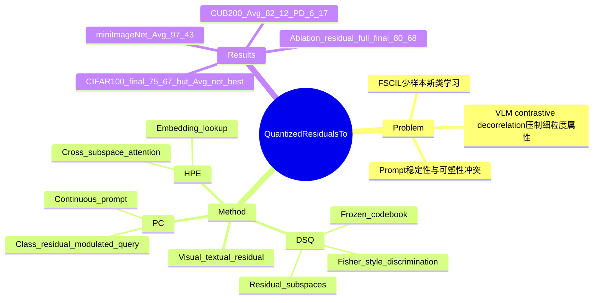

## Summary
QR-Prompt 解决 VLM 场景下的 Few-Shot Class-Incremental Learning：用 CLIP visual-textual residual 恢复 contrastive pretraining 中被压平的细粒度信息，再把 quantized residual subspaces 转成 class-adaptive continuous prompts。实验显示它在 CUB200 和 miniImageNet 的平均精度领先多数/所有主要 baseline，但 CIFAR100 的 Avg 并非表中最高，因此贡献更准确地说是「稳定的 residual-based prompt adaptation」而不是无条件全指标 SOTA。

## Problem & Motivation
Few-Shot Class-Incremental Learning (FSCIL) 要在每个 incremental session 只给少量样本的情况下学习新类，同时保留旧类决策边界。作者指出两类现有路线都有问题：vision-only FSCIL 容易 overfit 且 transferability 有限；VLM 虽有更强语义先验，但 CLIP 式 contrastive objective 会强化 feature decorrelation / uniformity，从而压制颜色、纹理、形状等细粒度 attribute dependency。Prompt-based continual learning 又处在稳定性/可塑性的两难：fully optimized prompts 容易 semantic drift，static 或 quantized prompts 更稳定但表达力不足。

本文的核心动机是：visual embedding 和 textual embedding 的 residual 可能保留了文本原型未覆盖的局部 manifold structure。作者用 Figure 1 做了两点经验观察：residual 的 cross-correlation 比 CLIP visual feature 更保留 inter-dimensional dependency；residual magnitude 与 visual feature 的 approximate Hessian term magnitude 有相关性。这里的已知结论是「作者观察到 residual 与 curvature-like signal 相关」；不知道的是这种相关性在其他 VLM/backbone、非分类任务或 GUI/embodied 场景中是否仍成立。

## Method
QR-Prompt 由三部分组成，全部围绕 CLIP visual-textual residual `r_i = x_i^v - x_i^t` 构建。

1. **Discriminative Subspace Quantization (DSQ)**：把 residual space 分成 `M` 个 subspaces，每个 subspace 有 `K` 个 codewords。不同于传统 PQ/OPQ 只追求低 reconstruction distortion，DSQ 学一个 orthogonal rotation `R`，并用 Fisher-style regularization 同时最小化 quantization fidelity loss、最大化 between-class / within-class separability。base session 训练好以后，DSQ codebook 在后续 incremental sessions 冻结，作为稳定的 residual subspace memory。

2. **Hierarchical Prompt Encoder (HPE)**：DSQ 输出离散 code index；HPE 为每个 subspace 维护独立 embedding table，把离散 code 映射到 continuous subspace embedding。随后用 cross-subspace multi-head attention 建模 subspace 间依赖，把粗粒度 attribute token（如颜色、纹理、局部部件）合成为更细粒度的 prompt features。

3. **Prompt Composer (PC)**：HPE 仍输出一组分散的 subspace embeddings，PC 用 learnable query-attention 聚合成单个 prompt vector。query 会被 class mean residual `μ_y` 调制，使 prompt 更关注该类有判别力的 subspaces；最终 prompt appended 到文本模板 `a photo of a [class]`，送入 frozen CLIP text encoder。HPE 和 PC 在 base session 及 incremental sessions 用 InfoNCE loss 训练/微调，DSQ codebook 不更新。

实现细节：所有方法使用 CLIP-pretrained、ImageNet-finetuned ViT-B/16；默认 DSQ 为 `M=32, K=32`，codebook 约 454K 参数，总 trainable parameters 表中为 0.45M。rotation matrix 与 codebook 优化 15 iterations，`λ=0.1`；HPE+PC base session 训练 50 iterations，incremental session 训练 20 iterations；CUB200 用 `τ=0.001`，CIFAR100/miniImageNet 用 `τ=0.07`，batch size 16。

## Key Results
- **CUB200**：QR-Prompt 的 Avg 为 **82.12%**、PD 为 **6.17%**，优于 BiMC 的 **80.49% / 7.00%** 和 FDR 的 **79.01% / 10.82%**；final session accuracy 为 **80.68%**，高于 BiMC **78.56%** 和 FDR **75.55%**。这是表中最清楚的优势场景。
- **CIFAR100**：QR-Prompt 的 final session accuracy 为 **75.67%**、PD 为 **7.88%**，优于 VQPrompt 的 final **73.90%**、PD **20.21%**；但 Avg 只有 **79.32%**，低于 VQPrompt **82.29%**、DualPrompt **81.17%** 和 CODAPrompt **79.87%**。因此论文正文里「consistently outperforms all baselines across the three datasets」的说法与 Table 1 的 Avg 指标不完全一致。
- **miniImageNet**：QR-Prompt Avg 为 **97.43%**，高于 VQPrompt **96.61%**、BiMC **96.41%**、FDR **95.56%**；final session accuracy **97.02%** 也高于 VQPrompt **95.85%**。但 PD 为 **1.64%**，不如 VQPrompt 的 **1.41%**，所以它是 Avg 最好但 retention-drop 并非最小。
- **Ablation on CUB200**：完整 Residual+DSQ+HPE+PC 最后一轮为 **80.68%**。去掉 DSQ rotation 降到 **78.46%**，去掉 HPE-Attention 降到 **78.42%**，去掉 PC 降到 **80.07%**；用 Visual feature 替代 Residual 虽然 base session 达 **86.63%**（略高于完整模型 **86.49%**），但 final session 只有 **78.59%**。这支持作者关于 residual 对 incremental adaptation 更有用的主张。
- **Quantization / λ 分析**：CUB200 上 `M` 从 8 增至 32 时准确率提升，超过 32 后下降；固定 `M=32` 时增加 `K` 收益较小，作者认为高维 CLIP 特征中 subspace decomposition 和 rotation 比单纯增大 codebook 更关键。`λ` 的最佳区域在 **[0.1, 0.2]**：太小偏 reconstruction、判别性不足；太大则过度 class separation，破坏 residual geometry。

## Strengths & Weaknesses
**Strengths**

- **已知**：方法把 VLM 的 visual-textual residual 当作 adaptation signal，而不是直接优化 visual feature 或 prompt token；这给 FSCIL 中的 stability-plasticity trade-off 提供了一个清晰的机制拆分：DSQ 负责稳定，HPE/PC 负责可塑性。
- **已知**：实验覆盖 CUB200、CIFAR100、miniImageNet 三个 FSCIL benchmark，并且包含 L2P、DualPrompt、CODAPrompt、VQPrompt、FeCAM、TEEN、BiMC、FDR 等强/近年 baseline；CUB200 ablation 能支持 DSQ、HPE、PC 和 residual feature 的互补性。
- **已知**：理论部分给出两个边界：一是新增 quantized codes 会扩大 generalization slack，因此冻结 base-session codebook 更稳；二是 quantization error 在 discriminative subspace 上的投影会影响 margin preservation。虽然证明细节在 supplementary，主文至少把设计选择和 bound 对齐起来。

**Weaknesses / Caveats**

- **已知**：Table 1 并不支持「所有数据集、所有核心指标都 SOTA」的强表述。CIFAR100 的 Avg 低于 VQPrompt / DualPrompt / CODAPrompt；miniImageNet 的 PD 低于 VQPrompt。更稳妥的 claim 是 QR-Prompt 在 CUB200 与 miniImageNet Avg 上强，在 later-session retention 上有优势。
- **已知**：作者在 conclusion 中承认当前 subspace memory 假设 base 和 novel classes 存在 partial attribute overlap；对于完全 unseen attribute distributions，QR-Prompt 的适应性仍是未来工作。
- **不知道**：论文主文没有报告跨 backbone、不同 CLIP variants、非 5-shot 设置、domain shift 或 open-vocabulary GUI/embodied 任务结果；因此不能把 residual quantization 的有效性直接外推到 GUI-agent grounding 或 embodied perception。
- **推测**：对 GUI-agent/VLM 方向有启发的地方不是 benchmark 本身，而是「把视觉-文本不一致当作可量化的 adaptation memory」。这可能适合研究 UI 元素的细粒度视觉差异、视觉证据依赖或 personalization，但需要重新设计任务和验证指标。

## Mind Map

## Notes
- 对当前 vault 的价值：这是一个 **VLM adaptation / continual prompt learning** 论文，不是 GUI-agent 或 embodied 论文；rating 给 3，是因为它提供了 residual-as-memory 的方法视角，但缺少直接面向 GUI grounding、computer-use 或 embodied action 的证据。
- 后续如果关注 GUI-agent 的视觉适应，可以借鉴其诊断方式：比较原始 visual feature 与 visual-textual residual 的 cross-correlation / curvature proxy，看 UI element、icon、small text、layout relation 的信息是否也主要藏在 residual 中。
- 精确发布日期在主文中未给出；这里只能从论文和用户给定 venue 确定为 CVPR 2026。正文未出现本文 arXiv id、DOI 或 code link。
