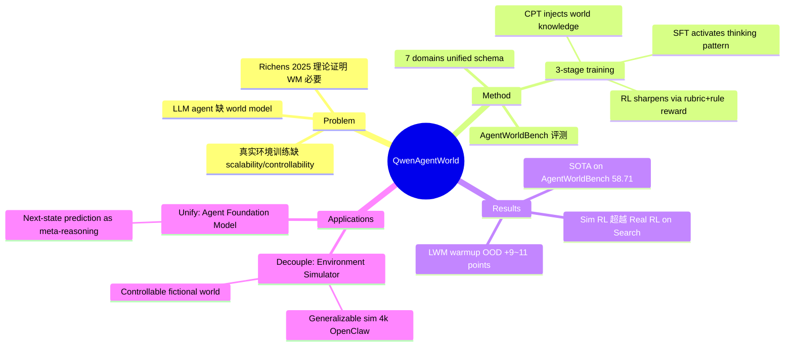

## Summary

用语言模型构建 agent 环境的 world model（Language World Model, LWM），通过 CPT→SFT→RL 三阶段训练得到 Qwen-AgentWorld（最大 397B-A17B），覆盖 MCP/Search/Terminal/SWE/Android/Web/OS 七个 domain；LWM 既可作为独立 simulator 支持 Sim RL，也可作为 agent warm-up 大幅提升下游 agentic 任务表现。

## Problem & Motivation

LLM agent 的研究几乎全部集中在 policy 侧（state → action），而 agent–environment 交互回路中的另一半——world model（(state, action) → next state）——几乎被忽视。现有 agent training 依赖真实环境执行，受限于基础设施成本、reproducibility、以及无法系统性覆盖 edge case。Richens et al. (2025) 理论上证明：能在足够广泛任务上泛化的 agent 必然已学到一个 world model，这使 LWM 不只"有用"而是"必要"。

论文同时指出 LWM 的两个互补价值：（1）解耦用作 simulator，实现 turn-level scalability 和 controllability；（2）统一为 agent foundation model，使 agent 在选择 action 前能够在心里模拟 next state。

## Method

### 整体框架

Qwen-AgentWorld 将七个 domain 的 agent-environment 交互统一为 Language World Model：给定 system prompt（task description + action space + initial state + demonstrations + simulation instruction）和历史 (action, observation) 序列，预测下一个 observation。

七个 domain 涵盖文本环境（MCP、Search、Terminal、SWE）和 GUI 环境（Android、Web、OS，observation 以 accessibility tree / UI view hierarchy 而非像素帧表示）。

### 三阶段训练（"CPT injects, SFT activates, RL sharpens"）

**Stage 1 — CPT**：在超过 10M 条 environment interaction trajectory（来自专属 agent 基础设施、开源 traces、内部 agentic 数据）及专业领域 corpora（法律、医疗、金融等）上做标准 next-token prediction。设计了 information-theoretic loss masking：根据 action-observation 对的 Overlap/Novelty/Jaccard/length ratio 将每个 turn 分为 7 类（retrieval/expansion/action/transform/boilerplate/echo/other），差异化 keep ratio（5%–100%），只在包含真实 world knowledge 的 turn 上计算 loss。

**Stage 2 — SFT**：从 CPT 转入 thinking 模式，用 rejection sampling 从 3 个 rollout 中选最优，保留 69.2% 的样本（共 7,094 条）。SFT 显式激活 next-state prediction 的推理 pattern，使模型在预测 observation 时先做 chain-of-thought reasoning。

**Stage 3 — RL**：用 GSPO，reward 结合 5 维 rubric judge（Format/Factuality/Consistency/Realism/Quality，range [5,25]）和 rule-based verifier（binary [0,25]），以 9:1 比例混合。针对三个 failure mode 设计了对应解法：
- 多 turn 展开导致 reward collapse → RL pool 每条 trajectory 只取一个 turn
- reward shaping 不稳定 → 对比 Reference-Reward 和 Turing-Test reward，最终确认 5 维 rubric + rule-based 最稳定
- self-praise reward hacking → strict tag extraction + deterministic content type classification + rule-based anchor

**System Prompt 自动优化**：通过 AutoResearch pipeline 自动迭代优化 prompt template（10 轮 propose-evaluate-refine），并行运行 12 个不同风格的 run，生成 v0–v11 共 12 个变体；CPT/SFT/RL 分别使用不同版本，最大化 prompt 多样性。

### AgentWorldBench

构建覆盖 7 个 domain 的 world model 评测 benchmark，2,170 个样本，来自 Claude Opus 4.6 等 5 个前沿 model 在 9 个已有 agent benchmark 上的真实环境 trajectory。5 维 rubric 打分，使用 GPT-5.2 作为 judge（Turing-test 校准后选择）。

### 两大应用

**Application I — Environment Simulator（解耦）**：
- 泛化模拟：用 Qwen-AgentWorld-397B 为完全 OOD 的 OpenClaw 生成 4k 环境，Sim RL 提升 Claw-Eval +4.3、QwenClawBench +7.1
- 可控模拟：通过 simulation instruction 注入 adversarial perturbations（paginated results、partial failures），MCPMark +12.3；构建 fictional world（完全虚构但内部一致的环境）训练 Search agent，WideSearch F1 Item +16.29（35B）；Sim RL 最终超过 Real RL（50.3% vs 45.6%）

**Application II — Agent Foundation Model（统一）**：
- LWM RL warm-up（单 turn、无 tool call 的 next-state prediction）直接迁移到多 turn tool-calling agentic 任务
- 在 7 个 benchmark 上均有提升，包括 3 个完全 OOD domain（Claw-Eval +11.3，QwenClawBench +9.7，BFCL v4 +9.0）
- 机理：agent 在推理 trace 中学会在执行 action 前先心理模拟 next state（"prediction-driven action refinement"）

## Key Results

**AgentWorldBench 主结果**：
- Qwen-AgentWorld-397B-A17B 整体均分 58.71，超过 GPT-5.4（58.25）、Claude Opus 4.8（56.59）等所有对比模型
- 相较同架构 base（Qwen3.5-397B-A17B，54.74），LWM 三阶段训练贡献 +3.97 点
- GUI domain 上 Claude Opus 4.8/4.6 仍领先（多模态 pretraining 优势），397B 排第 5

**跨 domain 泛化**：仅用 Terminal RL 数据，SWE +11.5、Search +11.8、MCP +5.0 均同步提升，证明 generalizable world knowledge 而非 domain-specific shortcuts。

**Sim RL vs Real RL（Search）**：controllable Sim RL 达 50.3% F1，超过真实 search engine Real RL 的 45.6%；行为分析显示 Sim RL agent 学会更多 web_extractor calls（adversarial snippet 设计的直接效果）。

**Agent Foundation Model warm-up**（35B，仅 LWM RL，无后续 fine-tuning）：
- Terminal-Bench 2.0: 33.25 → 39.55 (+6.30)
- SWE-Bench Verified: 64.47 → 67.86 (+3.39)
- WideSearch F1 Item: 33.38 → 46.17 (+12.79)
- BFCL v4 Avg: 62.29 → 71.25 (+8.96)

## Strengths & Weaknesses

**亮点**：
1. **理论动机清晰**：引用 Richens et al. (2025) 证明"world model 是泛化的必要条件"，不是 heuristic 而是有理论 grounding
2. **规模与系统性**：10M+ trajectory，7 个 domain，两款模型（35B-A3B 和 397B-A17B），benchmark + 两类应用全链路打通
3. **可控模拟的突破**：fictional world 训练 agent 不仅性能更好，还从根本上避免了"模型学到幻觉 facts"的 contamination 问题——这个 insight 很有价值
4. **information-theoretic loss masking**：boilerplate echo turn 会稀释梯度，这个工程细节在 document 里难得见到，并且有较严格的统计设计

**局限**：
1. **GUI domain 仍弱**：文本表示（accessibility tree）而非像素，导致 GUI domain 比多模态 pretrained 的 Claude/GPT 差，论文承认但未解决
2. **世界知识的天花板**：RL training dynamics 显示 Factuality 是最难提升的维度（最大相对提升仅 11.3%），search domain 整体最低分（~38），表明知识边界是硬约束
3. **成本与工程门槛极高**：专属 sandbox 基础设施、多 agent 清洗 pipeline、AutoResearch prompt 优化，这是 Qwen Team 级别的工程投入，学术可复现性接近于零
4. **实验缺乏 ablation 细节**：三阶段训练各 stage 的单独贡献没有完整 ablation；RL 的 cross-domain 泛化实验（Terminal→SWE/Search）虽然 compelling 但 sample size 偏小

## Mind Map

## Notes

- 这篇和 PiLWorld（2606-PiLWorld.md）、WALLWM（2606-WALLWM.md）方向相近，都是 language world model for agents，值得对比
- 最有趣的 claim 是"fictional world training transfers to real search"——这个 sim-to-real 范式对 data flywheel 的意义值得深入思考
- "prediction-driven action refinement"作为 agent 的推理 pattern，类似于 reflection 但面向未来而非过去，这个 framing 精准
- concurrent work: Shrivastava et al. (2026) 独立发现 auxiliary world-modeling objective 可 double Terminal-Bench 2.0 performance，互相印证
