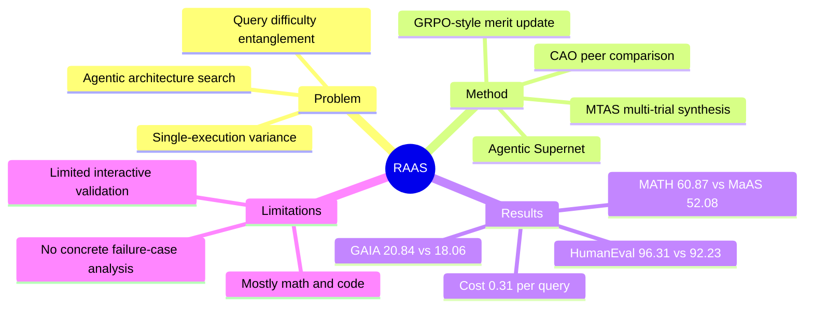

## Summary

RAAS 关注 LLM agentic system 的 architecture search：已有 Agentic Supernet / MaAS 用单次 absolute performance 更新架构分布，容易把 query difficulty 和 execution randomness 当成 architecture merit。论文提出 Contextual Architecture Orchestration (CAO) 和 Multi-Trial Assessment Synthesis (MTAS)，用同一 query 上的 peer comparison 与多次 trial 聚合来产生更稳定的 GRPO-style 更新信号。实验显示 RAAS 在 math/code benchmarks 和 GAIA tool-use benchmark 上超过 MaAS，但更丰富的 interactive multi-turn / GUI 场景仍未验证。

## Problem & Motivation

LLM agentic systems 的能力不只取决于底层 LLM，也取决于 agents 的角色、通信方式、决策协议和 workflow topology。手工设计这些 architecture 成本高，因此 MaAS 等 Agentic Supernet 方法把搜索目标从单个固定 workflow 转成 query-conditioned architecture distribution。

论文指出 MaAS 式优化信号有两个不稳定源：第一，absolute score 会混合 architecture quality 与 query difficulty，简单 query 会抬高弱 architecture，困难 query 会压低强 architecture；第二，single-execution evaluation 会把 stochastic sampling、intermediate agent interaction 和 transient failure 当成真实能力。RAAS 的动机是把 architecture search 的 reward / advantage 从“单个 architecture 在单个 query 上得了多少分”改成“同一 query 下相对 peer 的稳定表现”。

## Method

RAAS 建在 Agentic Supernet 上：supernet 由多层 operator distribution 组成，一个具体 multi-agent architecture `G` 是从这些 operator distributions 里采样出的 workflow。优化目标仍是学习 query-conditioned `P(G|q)`，但 RAAS 改变的是评估和更新信号。

**Contextual Architecture Orchestration (CAO)**：对每个 query `q`，RAAS 从 supernet 中采样 `N` 个 candidate architectures，构成 cohort `Cq = {G1, ..., GN}`。这些 architectures 处理同一个 query；系统先得到每个 `Gi` 的 robust capability estimate `R_hat(Gi, q)`，再用 cohort mean 构造 contextual baseline `R_bar_ctx(q)`。最终 contextual merit 为 `M_ctx(Gi, q) = R_hat(Gi, q) - R_bar_ctx(q)`。这个 zero-centered signal 的目标是把 query difficulty 从 reward 中消掉：高于 cohort baseline 的 architecture 强化其设计模式，低于 baseline 的 architecture 减弱影响。

**Multi-Trial Assessment Synthesis (MTAS)**：对每个 architecture 和 query，不只执行一次，而是运行 `K` 次 independent workflow executions。论文使用 trimmed mean aggregation，丢弃最高和最低的 `alpha` fraction trials 后取平均，得到 `R_hat(Gi, q)`。作者的主张是，随着有效样本数增加，估计方差按 `sigma^2 / K_eff` 下降，从而减少 single-trial artifacts。

**Merit-weighted adaptation**：RAAS 用 `M_ctx(Gi, q)` 乘以 architecture log-probability 的梯度，更新 operator distributions。由于同一 cohort 内 `M_ctx` 之和为 0，更新天然包含正负相对比较，形式上接近 GRPO / grouped comparison 的思想：不是学习一个全局 absolute reward，而是从同组候选的相对表现中提取 advantage。

**Cost / hyperparameter choice**：`N` 和 `K` 直接决定每个 query 的执行次数。论文把 `(N=5, K=5)` 作为 cost-effective 设置，即每个 query 运行 25 次；`(N=6, K=5)` 接近最优 accuracy，但收益开始变小。

## Key Results

**Main math/code results, gpt-4o-mini backbone**：

| Method | MATH | GSM8K | HumanEval | MBPP | Average |
|---|---:|---:|---:|---:|---:|
| MaAS | 52.08 | 91.84 | 92.23 | 78.71 | 78.72 |
| RAAS | 60.87 | 95.16 | 96.31 | 84.18 | 84.13 |
| Gain | +8.79 | +3.32 | +4.08 | +5.47 | +5.41 |

**Main math/code results, qwen-2.5-72b backbone**：

| Method | MATH | GSM8K | HumanEval | MBPP | Average |
|---|---:|---:|---:|---:|---:|
| MaAS | 51.49 | 91.42 | 91.91 | 78.27 | 78.27 |
| RAAS | 60.14 | 94.69 | 95.96 | 83.59 | 83.59 |
| Gain | +8.65 | +3.27 | +4.05 | +5.32 | +5.32 |

**GAIA tool-use benchmark**：

| Method | Level 1 | Level 2 | Level 3 | Average |
|---|---:|---:|---:|---:|
| MaAS | 25.91 | 22.01 | 6.25 | 18.06 |
| RAAS | 29.53 | 25.32 | 7.68 | 20.84 |
| Gain | +3.62 | +3.31 | +1.43 | +2.78 |

**Baselines**：论文比较了 single-agent methods（Vanilla, CoT, ComplexCoT, Self-Consistency）、hand-crafted multi-agent systems（MultiPersona, LLM-Debate, LLM-Blender, DyLAN, AgentVerse, MacNet）以及 automated systems（AutoAgents, GPTSwarm, ADAS, AgentSquare, AFlow, MaAS）。在 Table 1 的 gpt-4o-mini 和 qwen-2.5-72b 两个 backbone 设置下，RAAS 都超过最强 baseline MaAS。

**Convergence / sensitivity / cost**：

- Figure 3 报告 RAAS 在 2-3 个 checkpoints 内超过 MaAS，MATH 第 4 个点达到 57.8，并且 confidence band 更窄；这是作者用来支持 CAO+MTAS 稳定 search dynamics 的主要证据。
- MATH sensitivity 中，`K=5` 时随着 `N` 增加，accuracy 从 54.12 到 58.26、60.87、61.24；作者认为 `N` 增大提升 peer diversity，但 `N≈6` 后趋于饱和。
- 在 `N>=5` 时把 `K` 增加到 5 带来明显可靠性收益；`N=5` 处提升为 +4.45，但 `K>5` 后边际收益变小。
- Cost analysis 报告 RAAS 在 MATH 上以 `$0.31/query` 达到 60.87%，比 MaAS 高 8.8 points，同时 cost 低 6%。

**Ablation**：Figure 5 比较 MaAS、MaAS + entropy regularization、RAAS with CAO only、full RAAS (CAO+MTAS)。论文正文给出的可核验结论是：去掉 CAO 后性能接近 MaAS，去掉 MTAS 后 execution volatility 回来且 final accuracy 降低，full RAAS 在所有报告的 benchmarks 上最好；但正文没有给出每个 ablation bar 的精确数值表。

## Strengths & Weaknesses

**Strengths**：

- **问题 formulation 准**：论文没有把 agentic workflow search 的瓶颈简单归因于搜索算法不够强，而是定位到 evaluation signal 本身不稳定。query difficulty entanglement 和 single-execution variance 这两个 failure mode 对 multi-agent / tool-use 系统都很实际。
- **方法简洁**：CAO 是同题 peer-normalized baseline，MTAS 是多次 execution 的 robust aggregation；两者都不需要额外 critic 或 learned evaluator，容易接到已有 Agentic Supernet 框架里。
- **实验覆盖了强 baseline**：RAAS 不只比 CoT / Self-Consistency 高，也比 AFlow、AgentSquare、MaAS 等 automated agentic workflow / architecture search baselines 高。
- **成本意识明确**：论文没有只报告最高 accuracy，而是分析 `(N, K)` 和 `$0.31/query` 的 cost-performance trade-off。

**Weaknesses / Limitations**：

- **交互复杂度证据仍弱**：多数主结果来自 single-turn math reasoning 和 code generation；GAIA 是 multi-step tool-use benchmark，但还不是 browser / desktop / mobile GUI agent 的 long-horizon interactive setting。论文 conclusion 也明确把 richer multi-turn interactive scenarios 作为未来方向。
- **failure cases 不充分**：论文解释了 evaluation instability 的概念性 failure mode，但没有展示 RAAS 仍会失败的具体 query、architecture pattern 或 tool-use trajectory。
- **ablation 数字不完整**：正文报告 CAO 和 MTAS 都有贡献，但没有给出 ablation table 的具体数值，因此无法独立判断两个模块的边际贡献大小。
- **hyperparameter cost 不可忽略**：`N=5, K=5` 意味着 25 runs/query；虽然作者报告 cost 低于 MaAS，但这依赖当前 benchmark、LLM pricing 和 workflow execution cost。
- **理论仍是开放问题**：论文 future work 明确提到 merit-weighted adaptation 的 theoretical convergence guarantees 尚未建立。

**已知 / 推测 / 不知道**：

- **已知**：在论文报告的 MATH、GSM8K、HumanEval、MBPP 和 GAIA 设置里，RAAS 超过 MaAS，并且 CAO+MTAS 被 ablation 支持为必要组件。
- **推测**：peer-normalized evaluation 可能对 GUI-agent architecture search / runtime harness 也有价值，因为 GUI 任务同样有 task difficulty 和 execution randomness；但本文没有在 GUI benchmarks 上验证。
- **不知道**：RAAS 是否能迁移到 OSWorld、Mind2Web、mobile GUI 或真实 browser automation；也不知道它在 distribution shift、long-horizon recovery、tool failure 和 environment nondeterminism 下的稳定性。

**Impact**：

RAAS 对当前 agentic-RL / LLM-agent 方向的启发是：在复杂 agent 系统里，reward design 不一定要先变得更“聪明”，有时先把 evaluation context 和 execution variance 控住，就能显著改善 search signal。对 GUI-agent 研究而言，它更像一个可借鉴的 evaluation-and-search principle，而不是直接的 GUI agent 方法。

## Mind Map

## Notes

- 这篇论文和 GUI-agent 的直接关系不是 benchmark 或 interface，而是 search signal：如果未来做 GUI agent workflow / architecture search，不能只用 raw task success 更新 architecture，因为 OSWorld / browser / mobile 任务的 difficulty variance 和 stochastic failure 可能更严重。
- CAO 可以借鉴为“同一 GUI task 下多个 agent/workflow 的 relative evaluator”；MTAS 可以借鉴为“同一 workflow 多次 reset / rollout 的 stability estimate”。但这只是迁移假设，需要在真实 GUI 环境中验证。
- 论文 setup 提到 math reasoning 包含 GSM8K、MATH、MultiArith；但主结果表里可核验的具体数字只覆盖 MATH、GSM8K、HumanEval、MBPP 和 GAIA，因此这里不记录 MultiArith 结果。
