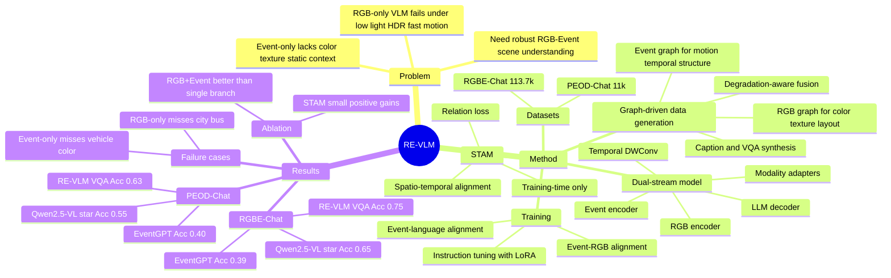

## Summary
RE-VLM 针对 RGB-only VLM 在 low light、HDR、fast motion 场景下退化，以及 event-only VLM 缺少 color/texture/static context 的问题，提出 RGB+Event dual-stream VLM。方法上，它用 graph-driven pipeline 生成 RGB-Event-Text supervision，并用 event encoder、RGB encoder、STAM alignment 和三阶段训练把两种 modality 对齐到 LLM。实验在 PEOD-Chat 和 RGBE-Chat 上显示，RE-VLM 的 caption 与 VQA 指标均高于 RGB-only 和 event-only baselines，尤其在 illumination-challenged PEOD-Chat 上收益更明显。

## Problem & Motivation
现有 VLM 主要依赖高质量 RGB image；论文指出在 extreme low light、over/under-exposure、high dynamic range 和 motion blur 中，RGB frame 会丢失关键视觉证据，导致描述和 VQA 不可靠。Event camera 以 asynchronous brightness changes 记录事件，具有 high temporal resolution 和 wide dynamic range，因此能保留 motion cues 和边缘结构；但 event stream 本身没有显式 color 信息，也缺少 rich texture 和 static scene context。

论文的核心问题是：如何让 VLM 同时利用 RGB 的 appearance cues 和 event 的 dynamic/HDR cues，在正常和困难成像条件下都做 scene understanding。这个问题对 embodied perception 和真实动态环境有直接意义；对 GUI-agent 不是直接任务，但对“感知输入退化时如何做 multimodal robust understanding”有方法论相关性。

## Method
**Data generation pipeline.** 作者提出 graph-driven degradation-adaptive pipeline 来缓解 RGB-Event-Text 数据稀缺。对每个 RGB keyframe，先取以其 timestamp 为中心的 event window，并用 event reconstruction network 还原成 N 个 grayscale frames；event graph 侧重 subject-motion-place-relation、temporal cues 和 dynamic cues，RGB graph 侧重 color、texture、shape、scene geometry 和 global layout。两张 graph 都会显式标注 low light、overexposure、glare、motion blur 等 degradation labels。

**Graph fusion and QA generation.** 融合时，motion cues、temporal ordering 和 topological structure 主要锚定到 event graph；light sources、color、readable text 等来自 RGB graph，但当 RGB graph 被判定为严重 degraded 时不能覆盖 event graph。counts 和 positions 若两种 graph 一致则采用 consensus，不一致时 RGB graph 优先、event graph 降为 secondary。最后 fused graph 被用于生成 caption 和最多 3 个 VQA items。

**Datasets.** PEOD-Chat 来自 PEOD，面向 challenging illumination scenes，共 11k samples；RGBE-Chat 覆盖 general scenes，来自 RGBE-ImageNet、DSEC、DDD17、RGBE-SEG、MVSEC、M3ED，总计 113.7k samples。作者还人工抽检 PEOD 上 N=855 个 instances：RGB VLM generation baseline 的 QA correction rate 是 54.2% / 463 条，graph-driven pipeline 是 18.1% / 155 条。

**Model architecture.** RE-VLM 基于 Qwen2.5-VL-3B，包含 RGB vision encoder、event vision encoder、training-time-only Spatio-Temporal Alignment Module (STAM)、两个 modality adapters 和 LLM decoder。Event stream 被切成 Nw=3 个 temporal slices，累积成 two-channel event images；event encoder 后用 multi-scale temporal DWConv 和 SE-style temporal weighting 建模 motion intervals，再投影到 LLM token space。

**STAM and training.** STAM 在训练时把 RGB feature 和 event feature 重采样到共同 spatio-temporal lattice，通过 dual self-attention 生成 token saliency map，再用 relation loss 对齐高权重区域的 RGB/Event features；总 loss 为 LLM loss 加上 λ=0.1 的 alignment regularizer。训练分三阶段：Event-Language alignment on 1,300K pairs、Event-RGB alignment on 600K pairs、instruction tuning on 120K samples；最后阶段冻结 visual branches 和 STAM，只训练 LLM 的 LoRA adapters。

## Key Results
**Main benchmark results.** 评价使用 LLM-as-a-judge protocol，GPT-3.5-Turbo 给 caption 的 CI / DO / CU 和 VQA 的 Ave / Acc 打分；PEOD-Chat test set 为 1,750 samples，RGBE-Chat test set 为 2,047 samples，并保证 sequence-level split。

| Benchmark | Model | Caption CI | Caption DO | Caption CU | VQA Ave | VQA Acc |
|---|---:|---:|---:|---:|---:|---:|
| PEOD-Chat | Qwen2.5-VL 3B | 2.47 | 2.03 | 3.04 | 3.47 | 0.52 |
| PEOD-Chat | EventGPT 7B | 2.51 | 2.06 | 2.65 | 3.04 | 0.40 |
| PEOD-Chat | Qwen2.5-VL* 3B RGB-only fine-tuned | 3.23 | 2.74 | 3.51 | 3.61 | 0.55 |
| PEOD-Chat | RE-VLM 4B | 3.68 | 3.12 | 3.95 | 3.82 | 0.63 |
| RGBE-Chat | Qwen2.5-VL 3B | 3.34 | 2.70 | 3.64 | 3.80 | 0.66 |
| RGBE-Chat | EventGPT 7B | 2.82 | 2.34 | 3.08 | 3.10 | 0.39 |
| RGBE-Chat | Qwen2.5-VL* 3B RGB-only fine-tuned | 3.91 | 3.41 | 4.27 | 3.86 | 0.65 |
| RGBE-Chat | RE-VLM 4B | 4.03 | 3.50 | 4.34 | 4.20 | 0.75 |

在 illumination-challenged PEOD-Chat 上，RE-VLM 相比 RGB-only fine-tuned Qwen2.5-VL* 的 VQA Ave 从 3.61 提升到 3.82，Acc 从 0.55 提升到 0.63；相比 EventGPT，VQA Ave 从 3.04 提升到 3.82，Acc 从 0.40 提升到 0.63。在 general RGBE-Chat 上，RE-VLM 相比 RGB-only fine-tuned Qwen2.5-VL* 的 VQA Ave 从 3.86 提升到 4.20，Acc 从 0.65 提升到 0.75。

**Ablation: modality and STAM.** PEOD-Chat 上，RE-VLM single-branch RGB-only 为 CI 3.05 / DO 2.51 / CU 3.32 / VQA Ave 3.63 / Acc 0.57，Event-only 为 2.82 / 2.57 / 3.09 / 3.40 / 0.48；RGB+Event without STAM 为 3.62 / 3.08 / 3.91 / 3.79 / 0.61，加入 STAM 后为 3.68 / 3.12 / 3.95 / 3.82 / 0.63。RGBE-Chat 上，RGB-only 为 3.97 / 3.46 / 4.32 / 4.10 / 0.73，Event-only 为 2.49 / 2.48 / 2.82 / 3.53 / 0.57，RGB+Event without STAM 为 4.01 / 3.47 / 4.35 / 4.19 / 0.74，加入 STAM 后为 4.03 / 3.50 / 4.34 / 4.20 / 0.75；注意 RGBE-Chat 的 CU 从 4.35 到 4.34 不是单调提升。

**Open-source judge cross-check.** 作者用 Qwen3-Omni-30B 替代 GPT-3.5-Turbo 在 PEOD-Chat 上复核趋势：RE-VLM 的 Caption CI/DO/CU 为 3.29/3.45/3.85，高于 Qwen2.5VL 的 2.17/1.82/2.71 和 EventGPT 的 1.99/1.89/2.50；VQA Ave/Acc 为 3.43/0.62，高于 Qwen2.5VL 的 2.78/0.48 和 EventGPT 的 2.38/0.40。

**Qualitative failure cases.** 论文 Figure 6 给出 overexposed traffic scene：RGB-only Qwen2.5-VL 误答没有 city bus；EventGPT 能利用 event cue 但把 center vehicle color 判为 black；RE-VLM 同时识别 city bus 和 white vehicle。这个 failure case 支持作者的核心论点：event stream 补 motion/structure，RGB image 补 color/texture。

## Strengths & Weaknesses
**已知 Strengths.** 这篇论文的问题设定清楚：RGB-only 和 event-only 各有物理传感层面的信息缺口，RGB+Event fusion 不是简单堆 modality，而是利用互补性。数据 pipeline 中用 graph 作为可审计中间表示，并在人审 PEOD sample 上把 correction rate 从 RGB VLM baseline 的 54.2% 降到 18.1%，这比直接让 VLM 自生成 caption 更有说服力。

**已知 Strengths.** 实验覆盖 external baselines、fine-tuned variants、single-modality ablation、STAM ablation 和 open-source judge cross-check。尤其 Table 4/5 能看出 joint RGB+Event 比 RGB-only/Event-only 都更稳，而 STAM 的增益是小幅但总体正向的，不是主结果唯一支撑。

**已知 Weaknesses / boundary.** 评价主要依赖 LLM-as-a-judge，主 judge 是 GPT-3.5-Turbo；虽然 Qwen3-Omni-30B cross-check 给出相同趋势，但绝对分数仍依赖 judge rubric。任务集中在 captioning 和 VQA，没有报告 closed-loop embodied task、driving decision、robot navigation 或 GUI-agent 上的最终任务成功率。

**已知 Weaknesses / boundary.** 数据 supervision 是 synthesized captions / VQA from fused graphs，再经过 manual screening；这适合扩大 RGB-Event-Text 数据，但也意味着 benchmark 和训练数据共享同一类 generation protocol，可能更偏向 graph-verifiable scene facts。论文没有给出一个独立的 Limitations section，也没有系统报告 graph fusion 失败时的 error taxonomy。

**推测.** 对 embodied / GUI-agent research 的启发在于：当视觉输入退化时，单纯扩大 RGB VLM 不一定解决问题，外部 sensor 或动态 cue 可以作为 perception fallback。但这是从 event-camera scene understanding 外推；论文没有验证 GUI screenshot、desktop interaction、mobile UI 或 agent planning。

**不知道.** 论文正文没有给出 DOI、code URL、model checkpoint URL、inference latency、event reconstruction 开销、STAM 训练开销或真实硬件部署成本。也不知道当 event stream 噪声很大、RGB 和 event 严重不同步，或 event reconstruction network 失败时，RE-VLM 会如何退化。

## Mind Map

## Notes
- 这篇论文对 GUI-agent 的直接相关性弱于 GUI grounding/desktop agent 论文，但对 VLM 鲁棒感知很相关：它提醒我们“看不清”不是纯 reasoning 问题，而可能需要新的 sensing modality 或动态证据。
- 最值得借鉴的是 graph as auditable intermediate representation。若后续做 GUI / embodied perception data synthesis，可以考虑先生成可校验的 scene/UI graph，再生成 caption/QA/action supervision，避免直接从 degraded RGB 让 VLM 编故事。
- 需要继续查的点：是否后续 release code/checkpoint、是否有 supplementary 展示 graph fusion errors、是否能把 RGB-Event dual stream 接入真实 driving / embodied benchmarks，而不是只做 caption/VQA。
