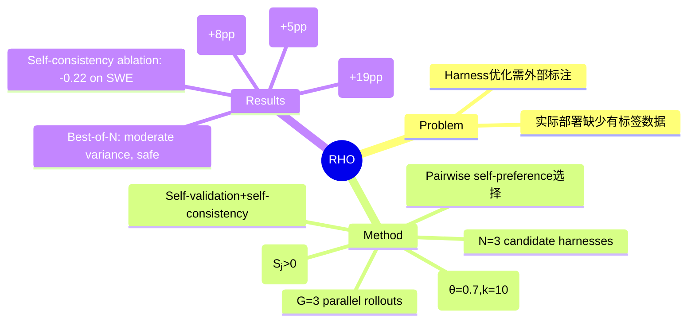

## Summary

RHO 提出无需外部标注的 self-supervised harness 优化方法：通过 DPP 选取多样+困难 coreset（G=3 parallel rollouts），agent 用 self-validation + self-consistency 生成诊断信号，N=3 个候选 harness 通过 pairwise self-preference 优胜。单轮优化 SWE-Bench Pro 59%→78%，Terminal-Bench 2 71%→76%，GAIA-2 29%→37%。

## Problem & Motivation

核心问题：agent 能否仅从历史 trajectory 优化 harness，无需有标签验证数据？

现有 harness 优化方法（OPRO、DSPy、TextGrad、GEPA、Meta-Harness）都需要 labeled validation metrics 来引导搜索。Labeled data 在实际部署中难以获取，限制了这些方法的应用范围。

## Method

**Harness 定义**：harness h = {tools, prompts, skills} 的持久集合。执行 produce trajectory τ = solve(h, t)。

**优化目标**：
h* = arg max_{h'} E_{t, τ~solve(h',t)} [U(t, τ)]
U 是 latent utility function，RHO 用 pairwise self-preference estimator 替代：rank(t, τ₁, τ₂, ..., τₘ) = (rank, rationale)

**Pipeline（3 阶段）**：

**Stage 1 — Coreset Selection（DPP）**：
- LM judge 分析每个 trajectory，提取 difficulty score rᵢ ∈ [0,10] + textual challenge description
- DPP kernel: K = diag(r̃) · S · diag(r̃)，其中 r̃ᵢ = (max(rᵢ, ε) / max_j max(rⱼ, ε))^α
- θ = 0.7（G = difficulty weighting, 1-θ = diversity weighting），k = 10

**Stage 2 — Group Rollout + Diagnosis**：
- 每个 coreset task 运行 G=3 parallel solves
- 两个诊断维度：
  - **Self-validation (rank_val)**：检查每个 trajectory 内的正确性——标记 incorrect tool invocations, false assumptions, premature stopping
  - **Self-consistency (rank_con)**：分析多个 trajectories 间的矛盾——识别 divergent plans, tool sequences, final answers
- 诊断结果合并为 improvement instruction Iₜ = rank_val ∪ rank_con

**Stage 3 — Best-of-N Harness Proposal**：
- N=3 个候选 harness 并行生成
- Preference score: Sⱼ = (1/|D_core|) Σ rank(t, τ_t^(j), τ_t^(0))
- **Strict acceptance**：仅当 Sⱼ > 0 时接受更新，否则保持原 harness

**Hyperparameters**：Model: Codex gpt-5.5, reasoning effort: high, k=10, G=3, N=3, DPP θ=0.7, 10 concurrent calls (cap 30)

## Key Results

**Table 1 — 与 Feedback-Free Baselines 比较（held-out test sets）**：

| Method | SWE-Bench Pro | Δ | Terminal-Bench 2 | Δ | GAIA-2 | Δ |
|---|---|---|---|---|---|---|
| Vanilla Codex | 0.59 | — | 0.71 | — | 0.29 | — |
| Dynamic Cheatsheet | 0.62 | +0.03 | 0.73 | +0.02 | 0.30 | +0.01 |
| ReasoningBank | 0.61 | +0.02 | 0.73 | +0.02 | 0.28 | −0.01 |
| Sleep-time Compute | 0.64 | +0.05 | 0.73 | +0.02 | 0.32 | +0.03 |
| **RHO** | **0.78** | **+0.19** | **0.76** | **+0.05** | **0.37** | **+0.08** |

**Table 2 — RHO vs Meta-Harness on SWE-Bench Pro**：

| Method | Val. labels | Agent calls | Pass Rate |
|---|---|---|---|
| RHO | none | 103 (1.0×) | **0.78** |
| Meta-Harness (1 round) | required | 41 (0.4×) | 0.62 |
| Meta-Harness (10 rounds) | required | 320 (3.1×) | 0.80 |

RHO 单轮在无标注的情况下超过 Meta-Harness 1 round（0.78 vs 0.62），且仅需 3.1× compute 即可达到 0.80。

**诊断信号 ablation（Table 4）**：

| Variant | SWE Pro | TB 2 | GAIA-2 |
|---|---|---|---|
| Full diagnosis | **0.78** | **0.76** | **0.37** |
| − self-consistency | 0.56 (−0.22) | 0.75 (−0.01) | 0.27 (−0.10) |
| − self-validation | 0.70 (−0.08) | 0.73 (−0.03) | 0.30 (−0.07) |
| Raw trajectory | 0.60 (−0.18) | 0.75 (−0.01) | 0.29 (−0.08) |

Self-consistency 是 SWE-Bench Pro 的关键信号（−0.22）；两者都不可缺少。

**Coreset selection ablation**：
Pure difficulty (θ=1) 无改善；Pure coverage (θ=0) 次优；DPP (θ=0.7) 最优。Difficulty 和 diversity 的平衡至关重要。

**Best-of-N consistency（Table 3）**：
Generated harnesses 表现 moderate variance，但 lowest-scoring candidate 仍优于 baseline。Chosen harness 稳定地避免最差候选。

**RHO 优化的 harness 内容（具体示例）**：
- SWE-Bench Pro：学会"Go toolchain 位于非标准路径"（需添加 $PATH）、"Python cache 目录在生成最终 diff 前必须清除"、新增 `check_build_and_lint` tool
- Terminal-Bench 2 / GAIA-2：新增工具以应对特定 domain 的 common failure modes

**改进主要来自**：
- Long-horizon tasks 的更高成功率
- 更频繁的 verification steps（尤其在 SWE-Bench Pro）
- 新工具的主动应用（尤其 Terminal-Bench 2 和 GAIA-2）

## Strengths & Weaknesses

**Strengths**：
- **无监督 + 高效**：59%→78% 单轮提升，SW 领域提升 +19pp（表内最大），且无需任何外部标注
- **Full harness 优化**：唯一满足 label-free + full harness + single pass 三个条件的方法（Table 5）
- **Self-consistency 的重要性**：揭示了 cross-trajectory 分析对 harness 优化的独特价值——这比 intra-trajectory self-validation 更难被伪造
- **跨 domain 泛化**：SWE/Terminal/GAIA 三个不同领域均有提升

**Weaknesses**：
- **Self-judgment 的可靠性**：Agent 的 self-preference 是否总是可靠？尤其是当 agent 对自己的 solution 产生 bias 时？Table 3 显示 moderate variance (std 0.03-0.06)，说明存在一定随机性
- **Coreset 依赖历史分布**：如果历史 trajectory 中从未出现过某个 failure mode，RHO 根本捕捉不到——这限制了方法的 novelty discovery 能力
- **不可逆任务不适用**：需要环境能够 clean reset 并容忍重复尝试——irreversible tasks 是硬性限制
- **SWE-Bench Pro 的 domain specificity**：学到的 harness（Go toolchain path、Python cache stripping）是非常 SW-specific 的，能否迁移到 GUI agent 场景存疑

**Impact**：Self-supervised harness 优化的范式证明，无需外部标注即可显著提升 harness 质量。方法论上有趣，但 GUI agent 场景的适用性需要验证——visual UI correctness 的 self-judgment 可能比代码更难可靠评估。

## Mind Map

