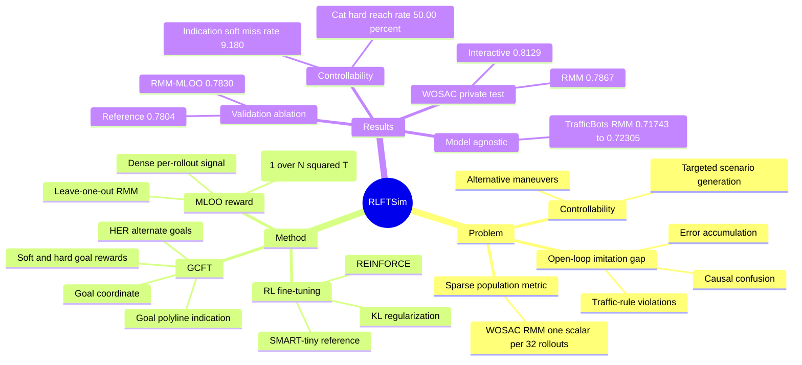

## Summary

RLFTSim 针对 multi-agent traffic simulation 中 open-loop imitation learning 在 closed-loop rollout 下会累积误差、违反物理/交通规则的问题，把 WOSAC Realism Meta-Metric (RMM) 通过 Meta-metric Leave-One-Out (MLOO) 改造成 dense、low-variance 的 RL fine-tuning reward。论文还用 goal conditioning + Hindsight Experience Replay 蒸馏可控性，在 WOMD/WOSAC 上提升 SMART-tiny 的 realism，并支持指定 U-turn、left turn 等目标行为。

## Problem & Motivation

自动驾驶需要可控仿真来覆盖真实道路难以大量采样的 rare/safety-critical scenarios，但 log replay 和 rule-based simulators 缺少 reactive multi-agent interaction，learning-based simulators 又大多依赖 open-loop imitation learning。作者的核心判断是：simulation model 要在 closed-loop deployment 下保持现实性，不能只优化逐步 imitation；需要直接对 rollout distribution 是否像真实交通进行 alignment。

现有困难在于 reward 设计。ADE/minADE 会把模型拉回单条 ground-truth trajectory，但多智能体仿真本来就是 stochastic 的；当 rollout 已经偏离专家轨迹时，最合理的行为不一定是突然回到记录轨迹。WOSAC 的 RMM 更接近作者想优化的 realism，但原始 RMM 是对同一场景 32 条 rollouts 聚合出的 population-level scalar，用作 RL reward 时过于 sparse、sample-inefficient。

另一个动机是 controllability。一个 realistic simulator 只能采样“可能发生”的行为还不够，安全测试还需要指定某些 agent 达到特定目标或执行替代 maneuver；因此作者把可控性也视为 simulation alignment 的一部分。

## Method

RLFTSim 把 multi-agent traffic simulation 写成 contextual MDP：状态包含最多 `Na` 个 agent 的有限历史，动作是 tokenized trajectory decision，context 包含 vectorized static/dynamic map，可选目标 `G` 给出部分 agent 的 goal coordinate。实验主模型基于 SMART-tiny：先用 WOMD 做 next-token prediction 预训练，再用 REINFORCE + KL regularization against reference model 做 post-training。

**MLOO reward** 是论文的核心。给定同一 seed scenario 的 `N` 条 rollouts，`RMM_-i` 表示去掉第 `i` 条 rollout 后计算的 RMM；第 `i` 条 rollout 的 reward 定义为所有 leave-one-out RMM 的均值减去 `RMM_-i`。直觉上，如果一条 rollout 对 realism 有正贡献，移除它会降低 RMM，因此它得到更高 reward；反之，不现实的 rollout 被移除后 RMM 会升高，reward 为负。作者证明在简化假设下，这个 estimator 对 `E[RMM(tau_1:N-1)]` 的 policy gradient 是 unbiased，并且方差缩放为 `O(1 / (N^2 T))`，而 per-rollout RLOO 形式为 `O(1 / T)`。

**Goal-conditioned fine-tuning (GCFT)** 用于 controllability。论文定义两类目标：hard goal 要求最终位置在 goal coordinate 的 2m 内，soft goal 要求 rollout 过程中曾经过 2m 内。goal representation 有两种：把连续 goal coordinate 直接 concat 到 agent token embedding，或在 agent-road relative positional encoding 中加入 goal polyline 的 binary indication。GCFT reward 为 `(1 - lambda) * RMM_MLOO + lambda * R_goal`，实验中 `lambda = 0.1`，以保持 realism 为主。

**Hindsight Experience Replay** 用来缓解 goal reward 稀疏：对同一 history 采样多条 stochastic rollouts，从中按 RMM 选出最佳 rollout，把它的 terminal states 当作 alternate goals 加入训练。这样模型能从自己已经能到达的目标开始学习 controllability，而不是只依赖 ground-truth final state。

## Key Results

- **WOSAC private test / WOMD（Table 1）**：RLFTSim 在 primary RMM 上达到 **0.7867**，高于 SMART-tiny reference 的 **0.7824**、SMART-tiny CAT-K 的 **0.7856**、TrajTok 的 **0.7861** 和 UniMM 的 **0.7839**；Interactive 为 **0.8129**，也高于 SMART-tiny CAT-K 的 **0.8106**。需要注意，RLFTSim 的 Kinematic **0.4927** 略低于 CAT-K 的 **0.4931**，Map-based **0.9210** 也低于 TrajTok 的 **0.9231**，所以最稳妥的说法是 primary RMM 和 Interactive 领先。
- **Reward ablation / full WOMD validation（Table 2）**：SMART-tiny reference 的 RMM 为 **0.7804**；minADE-RLOO 为 **0.7801**；RMM-RLOO 为 **0.7821**；RMM-MLOO 为 **0.7830**，同时 Kinematic / Interactive / Map-based 为 **0.4924 / 0.8070 / 0.9182**，是该表中最好的 realism reward。RMM-MLOO 的 minADE **1.3150m** 不如 reference 的 **1.3016m**，说明 realism alignment 不等于更贴近单条 ground-truth trajectory。
- **Heuristic reward 对比（Table S3/S4）**：在 20% WOMD validation subset 上，RMM-MLOO 的 RMM 为 **0.7818**；Collision+Offroad reward 的 collision/offroad 最低，为 **4.51% / 13.95%**，但 RMM 只有 **0.7769**；Collision+Offroad+ADE 的 ADE 最低，为 **2.39m**，但 RMM 为 **0.7788**。全 validation set 上基于 `N=44,097` scenarios 的 paired t-test 显示，RMM-MLOO 在 `alpha = 1e-3` 下显著优于其他 reward formulations。
- **Extended realism benchmarking（Table S2）**：同一 reference model 上，RLFTSim peak RMM 为 **0.78183**，高于重新训练的 SMART-tiny CAT-K peak **0.78101**；对较弱的 1-epoch SMART-tiny，RLFTSim 把 RMM 从 **0.75073** 提升到 **0.76421**（论文称约 +1.8%）。Ground-truth oracle RMM 为 **0.82925**，提示当前方法仍未达到 metric ceiling。
- **Goal controllability / full WOMD validation（Table 3）**：Goal-free RLFTSim 的 Passing Miss Rate 为 **16.631**、RMM 为 **0.7830**；Indication+Soft 的 Passing Miss Rate 最低，为 **9.180**，RMM **0.7819**；Indication+Hard 的 RMM **0.7827** 更接近 goal-free baseline，Passing Miss Rate **13.393**。Concatenation variants 的 passing miss rate 也下降到 **10.473 / 14.978**，但 RMM 降到 **0.7776 / 0.7774**。
- **Alternative maneuver benchmark（Table S5）**：在只选择非 ground-truth maneuver 的目标上，SMART-tiny reach/pass rate 为 **35.37% / 42.89%**；RLFTSim (cat, hard) reach rate 最高，为 **50.00%**，pass rate **68.37%**；RLFTSim (cat, soft) pass rate 最高，为 **75.34%**，reach rate **37.59%**。这说明 soft reward 更擅长“经过目标附近”，hard reward 更擅长最终停在目标附近。
- **Model-agnostic ablation（Table S6）**：在 TrafficBots V1.5 上，RLFTSim 把 RMM 从 **0.71743** 提升到 **0.72305**，Kinematic / Interactive / Map-based 从 **0.42712 / 0.73166 / 0.86502** 提升到 **0.43209 / 0.73773 / 0.87043**，说明方法不只依赖 SMART 的 discrete-token architecture。

## Strengths & Weaknesses

**已知**：
- 方法抓住了一个很实用的 reward interface：直接优化官方 population-level realism metric，而不是额外训练 reward model 或依赖 human preference。MLOO 让原本每 32 条 rollouts 才有一个 scalar 的 RMM 变成 per-rollout learning signal。
- ablation 比较完整：minADE reward、RMM-RLOO、MLOO、collision/offroad/ADE heuristic rewards、goal representation、soft/hard criterion、alternative maneuver、TrafficBots V1.5 迁移都有实验。
- 论文诚实地暴露了 trade-off：优化 RMM 不保证 minADE 最低，也不保证 collision/offroad 单项最优；controllability 提升会带来一定 realism drop，尤其是 concatenation representation。
- 质性案例主要展示 baseline SMART-tiny 的失败被 RLFTSim 修复，包括 off-road、vehicle-pedestrian collision、rear-end collision、right-of-way violation，以及 GCFT 后能生成 red-light right turn、stop-sign left/right turn、parking-lot movement 等不同目标行为。
- 论文给出的 limitations 明确：token-based representation 把轨迹切成 half-second segments，可能降低高度动态场景下的 responsiveness；GCFT controllability 仍不完美；RMM 是 realism proxy，metric saturation 可能反映 metric 本身不足，而非 simulator 质量真正收敛。

**推测**：
- MLOO 的思想可能比交通仿真本身更通用：任何只有 group-level / population-level metric 的 agent benchmark，如果能定义 leave-one-out contribution，都可能得到类似的 dense policy-gradient reward。但这是从论文方法外推，论文只在 traffic simulation/RMM 上验证。
- 对 GUI-agent 或 embodied-agent RL 的启发在于：当最终任务指标是 batch-level 或 scenario-level 的稀疏 score 时，直接 reward shaping 可能偏离目标，leave-one-out credit assignment 可能是更干净的 alignment 方式。
- RLFTSim 的收益可能依赖 base simulator 已经相当强；Table S2 显示弱模型提升更大，但主表中的强 SMART-tiny reference 已接近 oracle，绝对增幅自然有限。

**不知道**：
- 论文只提到 project page，没有在正文中给出明确 GitHub/code release 链接。
- 不知道 RLFTSim 生成的仿真是否会改善真实 AV planner 的 closed-loop safety 或 sim-to-real transfer；实验集中在 WOMD/WOSAC realism 和 goal completion。
- 不知道方法在更长 horizon、天气/传感器扰动、极端罕见事故、复杂交互密度更高的场景中是否保持稳定。
- 理论分析依赖 time-step independence、support condition 等简化假设；真实 multi-agent traffic features 有强时序和交互相关性，论文主要用经验方差曲线支撑实用性。

## Mind Map

## Notes

- 对 embodied/world-model 方向的价值：这篇不是提出更大 simulator backbone，而是给了一个 post-training recipe，把 evaluation metric 变成可优化的 closed-loop reward；这比单纯扩模型/数据更接近 alignment 问题本身。
- 对 agentic RL 的连接：如果 GUI/web/embodied agent 的评估指标需要多次 rollout 才可靠，例如 pass@k、diversity-aware success、scenario coverage，MLOO-style reward 可能能在不引入额外 reward model 的情况下提供 credit assignment。
- 需要避免 overclaim：论文没有证明“交通仿真真实可用”或“安全验证充分”，它证明的是在 WOMD/WOSAC 指标和若干 goal-completion benchmarks 上，RLFTSim 相比 SMART-tiny/CAT-K/heuristic reward 有更好的 metric alignment。
