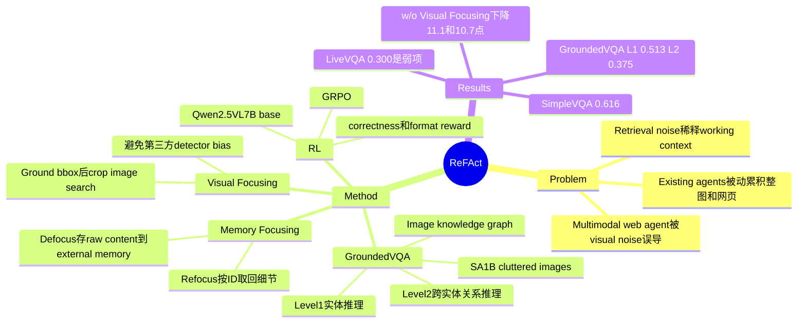

## Summary
ReFAct 针对 Multimodal Web Search Agent 在 cluttered images 和 noisy retrieval context 中容易被误导的问题，把 Grounding、Defocus、Refocus 作为显式 focusing actions 加入 Reasoning-Acting loop。作者同时构建了 GroundedVQA，用小目标、高噪声、必须外部检索的 VQA 来训练和评测 active focusing。

## Problem & Motivation
论文要解决的是 multimodal Web Search Agent 的 contextual noise：视觉输入中的 irrelevant background、complex textures 可能让 image search 先检索错实体，进而形成 false factual basis；网页检索结果中的 advertisements、navigation bars 等 retrieval noise 又会稀释关键证据。已有 text-centric Web Search Agent 如 Search-R1、R1-Searcher、DeepResearcher 主要处理文本检索，MMSearch-R1 和 WebWatcher 开始引入 image search、webpage access、OCR，但仍大多被动处理整图或完整网页。作者的核心判断是：agent 不能只把更多 multimodal context 塞进历史，而应能主动管理 visual attention 和 working memory。

这篇论文与 GUI agent 有相邻性但不是同一个任务范式。作者明确说 GUI-R1 关注 clicking/navigation 等 action execution，而 ReFAct 关注 retrieval and reasoning；因此它更直接属于 multimodal web search agent，而不是桌面/移动 GUI 操作 agent。

## Method
ReFAct 把 agent 与 multimodal web environment 的交互形式化为 sequential decision-making。标准 agent 被动累积 context history `H_t`，ReFAct 则扩展 action space，让 agent 显式选择 focusing actions 来管理视觉注意力和 memory load。

**Visual Focusing / Grounding**：在执行 image-based search 前，agent 预测 `Ground(I_t, bbox)`，其中 `bbox = [x1, y1, x2, y2]`，环境用 crop 后的 `I_t[bbox]` 作为 reverse image search 等检索工具的 query。作者没有接第三方 detection model，而是让 agent 自己预测 bbox，以避免外部 detector bias，并让 grounding 与 reasoning process 联合优化。

**Memory Focusing / Defocus-Refocus**：ReFAct 区分有限的 active working memory `H_t` 和无限 external memory `M_t`。`Defocus` 把当前信息密集但暂时非关键的 raw content 存到 `M_t`，在 `H_t` 里只保留 evidence-bearing summary 和 reference ID；`Refocus(id)` 在后续推理需要细节时用 ID 精确取回原始内容，避免 fuzzy retrieval。

**Integrated loop**：完整轨迹可交错 standard web actions 与 focusing operations，例如先 `Ground(bbox)`，再 `ImgSearch(I_crop)`，必要时 `Refocus(id)`，最后 answer。论文的设计目标不是让模型“看更多”，而是让每次外部 action 基于 noise-reduced inputs。

**GroundedVQA 构造**：数据来自 SA-1B 的高分辨率 clutter-rich images。pipeline 先用 Qwen3-VL-235B-A22B-Instruct 检测 candidate entities 并生成 visual descriptions，再用 Google Serper API 返回 top-10 image search results，用 Qwen3-VL 验证后保留 high-certainty Grounded Entities；随后用 Google Search 和 Jina Reader 解析 top-5 URLs，抽取 Retrieved Entities，构造 image-knowledge graph。QA generation 分 Level 1 和 Level 2：Level 1 是单个非显著实体的 grounding-retrieval-reasoning；Level 2 是多个实体的 multi-target grounding、sequential retrieval 和 associative reasoning。训练集用 Qwen-2.5VL-32B 做 rejection sampling，若无图也能答对就丢弃；测试集经人工检查，过滤 answerability 和 shortcut。

**Training**：ReFAct-7B 以 Qwen2.5-VL-7B-Instruct 为 base，用 GRPO 做 end-to-end RL。需要注意，虽然框架支持 visual focusing 和 memory focusing，但训练阶段主要优化 active visual grounding；作者解释说 Defocus/Refocus 带来的 highly dynamic context changes 会让 RL stability 更难，因此训练资源集中在 visual modality。reward 由 correctness reward 和 format reward 组成，correctness/evaluation 均用 Gemini-2.5-pro 做 LLM-as-a-judge；训练语料为 GroundedVQA training set 加 3,000 个 FVQA training items，训练 2 epochs，learning rate 2e-6，KL coefficient `β=0.01`，`λ=0.1`，group size `G=8`，使用 8 × A100 GPUs。

## Key Results
- **GroundedVQA 数据规模和难度**：GroundedVQA 共 1,817 个 VQA data points，其中训练集 1,200 Level-1 + 300 Level-2，测试集 261 Level-1 + 56 Level-2。目标实体面积占比大量低于 0.2；domain 分布为 Landmarks & Places 39.6%、Daily Products 23.6%、Cars 19.5%、Others 10.2%、Plants & Animals 7.0%。
- **主结果（pass@1, Table 2）**：在 GroundedVQA 上，ReFAct-7B 达到 Level-1 0.513 / Level-2 0.375，高于 MMSearch-R1 的 0.433 / 0.304、WebWatcher 的 0.372 / 0.232、DeepEyes 的 0.184 / 0.179，也高于 Gemini-2.5-flash 的 0.282 / 0.267。说明它在论文定义的 high visual noise + external knowledge retrieval 任务上优势明显。
- **跨 benchmark 不是全面胜出**：ReFAct-7B 在 SimpleVQA 为 0.616，高于 MMSearch-R1 0.574 和 WebWatcher 0.543；但在 MMSearch 为 0.497，低于 MMSearch-R1 0.538；在 LiveVQA 为 0.300，明显低于 WebWatcher 0.512 和 MMSearch-R1 0.484。总体 average 为 0.460，略低于 MMSearch-R1 0.467 和 Gemini-2.5-flash 0.473，因此不能解读成通用 web/VQA agent 全面 SOTA。
- **plug-and-play 架构验证**：不给 RL、只把 ReFAct framework 加到 Qwen2.5-VL-72B 上，GroundedVQA Level-1 从 ReAct 0.203 提到 0.314，即 +0.111 absolute gain；但 average 从 0.339 降到 0.334。对 GPT-5-mini 和 Gemini-2.5-flash，ReFAct framework 的 average 反而下降（GPT-5-mini 0.401→0.373，Gemini-2.5-flash 0.473→0.377），作者推测这依赖 base model intrinsic grounding ability。
- **visual noise robustness（Figure 5）**：按 target spatial ratio 分层后，ReFAct-7B 在 extreme noise regime（target ratio <5%）比 MMSearch-R1 高 +6.3% absolute accuracy。Qwen2.5-VL-7B baseline 在所有 bins 都低于 15%，MMSearch-R1 在 5%-10% 表现较好但到 <5% 也明显下降。
- **ablation（Accuracy %, Table 3）**：Full ReFAct-7B 在 GroundedVQA Level-1 / Level-2 为 51.3 / 37.5。去掉 GroundedVQA Data 后为 43.3 / 30.4（-8.0 / -7.1）；去掉 Memory Focusing 后为 49.4 / 33.9（-1.9 / -3.6）；去掉 Visual Focusing 后为 40.2 / 26.8（-11.1 / -10.7）。这说明论文实验中的最大收益来自 active visual grounding，其次才是 Defocus/Refocus。

## Strengths & Weaknesses
**已知的强点**：问题 formulation 很清楚，不是泛泛说 multimodal agent 需要更强 perception，而是把失败链条拆成 visual noise → wrong image retrieval → false factual basis，以及 retrieval noise → context dilution。ReFAct 的 Grounding action 很直接，Defocus/Refocus 也把 context management 做成 first-class operations；GroundedVQA 进一步把“必须先定位小目标再检索外部知识”固化成 benchmark，这比只在现有低噪声 VQA 上调 agent loop 更有信息量。Table 3 的 ablation 也比较有说服力：去掉 Visual Focusing 掉 11.1 / 10.7 点，是主要瓶颈。

**已知的边界 / 弱项**：论文没有单独的 limitations section，也没有系统 failure-case taxonomy。结果表已经暴露边界：ReFAct-7B 在 LiveVQA 只有 0.300，低于 WebWatcher 0.512 和 MMSearch-R1 0.484；作者解释为 LiveVQA 需要 holistic image comprehension，而 region-level Grounding 可能减少 search query richness。plug-and-play ReFAct 对 closed-source models 还会负增益，说明该 framework 并非“外接就提升”，而依赖模型本身能否正确使用 grounding tool。

**已知的训练限制**：ReFAct 框架名义上包含 visual focusing 和 memory focusing，但 RL 训练主要针对 active visual grounding；Defocus/Refocus 的动态上下文训练被作者视为仍未解决的稳定性挑战。因此 memory focusing 的收益更多来自 inference-time mechanism ablation，而不是同等强度的训练证明。

**推测**：GroundedVQA 上的优势可能主要来自 benchmark 与训练目标高度一致：小目标、高视觉噪声、必须 crop 后再检索。这不是坏事，因为论文明确要解决这个场景；但若迁移到需要全局视觉理解、页面结构理解或 long-horizon browser action 的任务，active cropping 可能与全局 context 相冲突。这个推测受到 LiveVQA 下滑和作者解释支持，但论文没有做 GUI/web navigation 类迁移实验来直接验证。

**不知道**：论文未提到代码 URL；只说 prompts available in Appendix，但 `/tmp/bf_0.txt` 提取文本中没有 Appendix 内容。也不知道 GroundedVQA 的 image search / text search 依赖外部搜索 API 时，结果随时间变化会带来多大 benchmark drift；论文没有报告不同 search backend、bbox 噪声、judge model 偏差或 external memory 容量策略的敏感性。

## Mind Map

## Notes
这篇的核心启发是：对 multimodal web agent 来说，context management 不只是 token compression，而是 evidence selection。视觉侧的“先看哪里”会决定后续 search query，从而决定事实链条是否一开始就跑偏；这和传统 ReAct agent 主要关心“下一步调用什么工具”不是同一层问题。

我会把它放在 web-agent / VLM / agentic-RL 交叉位置，而不是直接归到 GUI agent。它对 GUI research 的价值在于：GUI grounding 也可能需要把视觉 attention 管理做成 action，而不是只把屏幕整体编码给 MLLM；但论文没有评估 desktop/mobile UI 操作、clicking/navigation 或 browser task completion，所以这只是迁移启发，不是论文已证明结论。

date_publish 按 CVPR 2026 和目标文件名取 2026-06；论文首页本身没有给逐篇发布日期。code 字段留空，因为全文未提到具体 repository。
