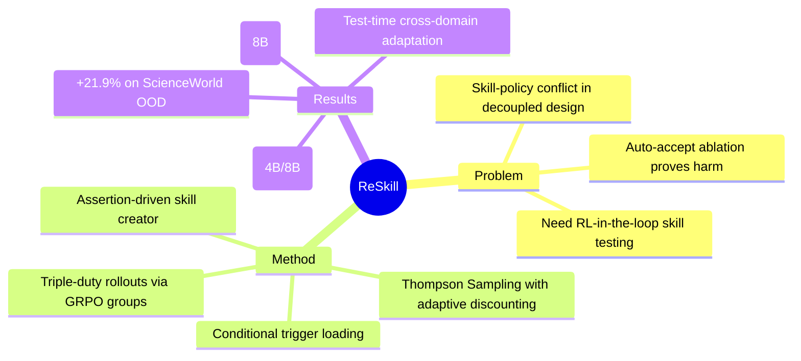

## Summary

ReSkill 提出 RL-in-the-loop 的 skill creation 框架，解决了现有 skill-augmented RL 方法将 skill 创建与 policy optimization 解耦导致的 skill-policy conflict 问题。核心创新是利用 GRPO 的 group-wise 结构，在同一训练步骤中同时完成 policy optimization、failure diagnosis 和 skill version testing，无需额外 rollout 成本。

## Problem & Motivation

Agentic RL 使 LLM agent 能够从环境 reward 中持续改进，但得到的 policy 无法系统性地积累可复用的策略。Modular skill 可以填补这一空白，但现有方法（如 MemRL、EvolveR、SkillRL）将 skill 创建与 policy training 分离处理——skill 在外部创建后注入 training loop，缺乏与 evolving policy 的对齐验证。

这种 decoupled design 的风险是 **skill-policy conflict**：外部创建的 skill 可能与当前 policy 的学习方向冲突。理想做法应是在 policy training 过程中实时测试 skill 是否真正有助于当前 policy 的学习。

Anthropic 的 Skill Creator 展示了 human-in-the-loop 的 skill creation 流程，但它是 static policy + human feedback 的 inference-time 工具。ReSkill 的目标是将这一流程嵌入 RL training loop，实现 skill-policy co-evolution。

## Method

ReSkill 的核心设计是利用 GRPO 的 group-wise 结构实现 **三合一 rollout**：

### 3.1 RL Training with Within-Group Skill Testing

GRPO 每次对同一 task 采样 G 个 rollout，这些 rollout 共享相同的 task q 和 policy θ，仅有 stochastic trajectory 差异。ReSkill 利用这一结构：

- 每个 rollout i 被分配一个 skill version v_i（通过 Thompson Sampling 从 Beta posterior 中采样）
- rollout 在对应的 skill bank S_{v_i} 下生成
- 因此同一 group 内形成 **controlled comparison**：唯一变量是 skill version

**Triple-Duty Rollouts**：每个 rollout 同时服务三个目的：
1. reward 提供 GRPO gradients → policy optimization
2. trajectory 加入 experience reservoir R → skill creator 的输入
3. outcome 更新 Thompson Sampling posterior → skill version accept/reject

总 rollout 数与 vanilla GRPO 相同，**零额外成本**。

### 3.2 RL-in-the-Loop Skill Creation

Skill creator pipeline 包含四个组件：

**Experience Reservoir R**：持续收集 training 过程中的 success-failure trajectory pairs，标注 skill version 和 reward。R 随 policy evolution 自动更新，反映当前 behavioral landscape。

**Conditional Skill Loading**：每个 skill S_k = (c_k, trig_k) 包含：
- content c_k：situational applicability、action guidance、counterexamples
- trigger trig_k：条件触发机制，仅在特定 state 下加载

**Assertion-Based Failure Grading**：
- 维护 assertion set A = {φ_j}，一组 rule-based predicates
- 计算 per-assertion pass rate r̂_j
- LLM analyzer 接收 pass rates + trajectory sample，输出：
  1. prevalence-ranked failure diagnosis（指导 skill revision）
  2. assertion set A 的更新（保持与当前 failure landscape 对齐）

**History-Informed Skill Revision**：Skill creator 综合当前 skill bank、failure diagnosis、历史 proposal 的 accept/reject outcome，提出 candidate version S_new（add/modify/delete 操作）。触发器 firing rate 在 reservoir 上验证以确保足够激活覆盖。

### 3.3 RL-Guided Skill Evolution with Thompson Sampling

Skill version assignment 采用 Thompson Sampling：

- 两个 arm：p_old ~ Beta(α_old, β_old), p_new ~ Beta(α_new, β_new)
- 初始化为 Beta(1,1)
- 每步估计 Pr(p_new > p_old)，通过 Monte Carlo sampling
- π_t(new) = Clip(Pr(p_new > p_old), ε_ts, 1-ε_ts)
- v_i ~ Categorical({new: π_t(new), old: π_t(old)})

**Policy-Aware Posterior Update with Adaptive Discounting**：

由于 policy 在 evaluation window 内 evolution，早期观测变得 stale。引入 discount factor w_t：

```
α_v ← w_t · α_v + m_t
β_v ← w_t · β_v + (n_t - m_t)
w_t = (1 + n_t / M)^{-1}
```

- M 是 memory parameter，通过 predictive-likelihood maximization 从数据估计
- 较少观测的 version 保留更多 prior evidence (w_t → 1)
- 较多观测的 version 可 aggressive discount 过去 (w_t → 0)

**Accept/Reject Decision**：cycle 结束时，若 E[p_new] > E[p_old]，则 S_new 成为新 baseline；否则 revert 到 S_old。

## Key Results

### Main Results (Table 1)

**ALFWorld (Qwen3-4B)**：
- Seen: ReSkill 90.0% vs SkillRL 85.7% (+4.3%)
- Unseen: ReSkill 89.6% vs SkillRL 82.1% (+7.5%)
- Overall: ReSkill 89.8% vs SkillRL 83.9% (+5.9%)

**ALFWorld (Qwen3-8B)**：
- Seen: ReSkill 90.2% vs SkillRL 89.0% (+1.2%)
- Unseen: ReSkill 95.3% vs SkillRL 82.6% (+12.7%)
- Overall: ReSkill 92.7% vs SkillRL 85.8% (+6.9%)

**Search (Qwen3-4B)**：
- Seen (NQ+HotpotQA): ReSkill 52.6% vs SkillRL 51.2% (+1.4%)
- Unseen (5 datasets avg): ReSkill 45.4% vs SkillRL 42.4% (+3.0%)
- Overall: ReSkill 47.6% vs SkillRL 45.1% (+2.5%)

**Search (Qwen3-8B)**：
- Seen: ReSkill 53.7% vs SkillRL 52.4% (+1.3%)
- Unseen: ReSkill 48.0% vs SkillRL 45.3% (+2.7%)
- Overall: ReSkill 49.8% vs SkillRL 47.5% (+2.3%)

### Extension Benchmarks (Figure 3)

- **ScienceWorld (OOD electricity tasks)**: ReSkill 48.8% vs SkillRL 26.9% (+21.9%)
- **InterCode-SQL (Extra-hard)**: ReSkill 63.6% vs SkillRL 55.3% (+8.3%)
- **WANDS (3-opt)**: ReSkill 86.6% vs SkillRL 82.1% (+4.5%)

**核心发现**：增益在 unseen/hard/OOD tasks 上显著放大。

### Ablation Study (Table 2)

关键 ablation：
- **Auto-accept (无 testing)**: ALFWorld 62.7% → 比 vanilla GRPO (75.3%) 还低 12.6%，**skill-policy conflict 确实存在**
- **Uniform allocation**: ALFWorld 73.2% vs ReSkill 89.8%，Thompson Sampling 的 adaptive allocation 有 16.6% gain
- **Skill-first then policy**: 79.4% (-10.4%)
- **Policy-first then skill**: 71.3% (-18.5%)
- **w/o assertion analyzer**: 84.7% (-5.1%)
- **Base-model skill creator**: 85.0% (-4.8%)

### Test-Time Cross-Domain Adaptation (Figure 5)

在 ALFWorld 训练的 policy，冻结后用 ReSkill pipeline 在 ScienceWorld 上 adaptation：
- ReSkill rapid adapts，达到 ~40%
- Baselines 几乎为 0

说明 reconciled training 发展出 **general capacity to follow and benefit from new skills**。

## Strengths & Weaknesses

### Strengths

1. **问题定位精准**：skill-policy conflict 是真实存在的——auto-accept ablation 显示注入 untested skill 比不注入还差（62.7% vs 75.3%），这证明了 decoupled design 的硬伤。

2. **Zero overhead design**：Triple-duty rollout 是 elegant 的 engineering，在 GRPO group 结构上自然嵌入 skill testing，不增加 rollout count。

3. **增益在 OOD 上放大**：unseen tasks 的 gain 明显大于 seen（ALFWorld 8B: unseen +12.7% vs seen +1.2%），说明 reconciled evolution 保留的是真正 generalizable 的 skill，而非 task-specific hacks。

4. **Test-time adaptation 能力**：冻结 policy 后在新 domain 上通过 skill creation alone 就能 adaptation，说明 policy 学到了 "如何利用 skill" 的 meta-capacity，而非仅仅是特定 skill 的执行。

5. **Adaptive discounting 的设计**：policy evolution 导致 early evidence stale，用 discount factor w_t 处理这点是合理的技术选择，且 M 通过 predictive-likelihood 自动估计避免了 manual tuning。

### Weaknesses

1. **Skill creator 依赖 Claude 4.5 Sonnet**：虽然 ablation 显示 base-model creator 仍有 85.0%（vs 89.8%），但这 4.8% gap 说明 skill creation 质量 still matters。整个框架的门槛是需要一个强的 skill creator LLM。

2. **Assertion set A 的维护成本**：论文提到 assertion set 需要随 failure landscape 更新，但这部分的 automation degree 不清楚。如果需要人工介入设计 assertion，则 scalability 受限。

3. **Skill bank size 固定为 8**：sensitivity analysis 在 Appendix C.7，但正文未讨论如何动态调整 bank size。复杂 domain 可能需要更多 skill，简单 domain 可能需要 pruning。

4. **Limited to GRPO**：method heavily exploits GRPO's group structure。对于其他 RL algorithm（如 PPO、DPO），如何适配不清楚。这是方法适用性上的 limitation。

5. **缺乏 failure case 分析**：论文展示 success 案例（skill lifecycle），但未深入分析在什么条件下 skill creation 会失败、skill-policy conflict 无法 reconcile。对 method 的 boundary 理解不完整。

6. **Comparison baseline 选择**：SkillRL 是最相关的 baseline，但它使用 teacher-model distilled skills。ReSkill 的 skill creator 是 online 的，这本身是更强 setting。更公平的比较可能是给 SkillRL 也用 Claude 4.5 Sonnet 作为 skill source。

## Mind Map



## Notes

- **与 SkillRL 的本质区别**：SkillRL 是 offline skill distillation + online RL training；ReSkill 是 online skill creation + online RL testing + online RL training。skill-policy reconcile 是核心增量。

- **Assertion-based diagnosis 的价值**：比起 per-episode diagnosis，aggregated failure profile across reservoir 更 stable 且能 capture systematic issues。这是从 individual failure 到 pattern failure 的提升。

- **启发**：如果 skill-policy conflict 真实存在，那么其他类似的外部注入组件（如 tool descriptions、prompt templates）是否也存在类似的 conflict？这个问题值得探索。

- **潜在 extension**：multi-skill composition testing？当前是 single skill version testing，如果 multiple skills 同时生效，interaction effect 如何处理？

- **代码链接**：论文提到 "Code" footnote 但未在 arXiv 页面看到明确 GitHub link，可能后续发布。