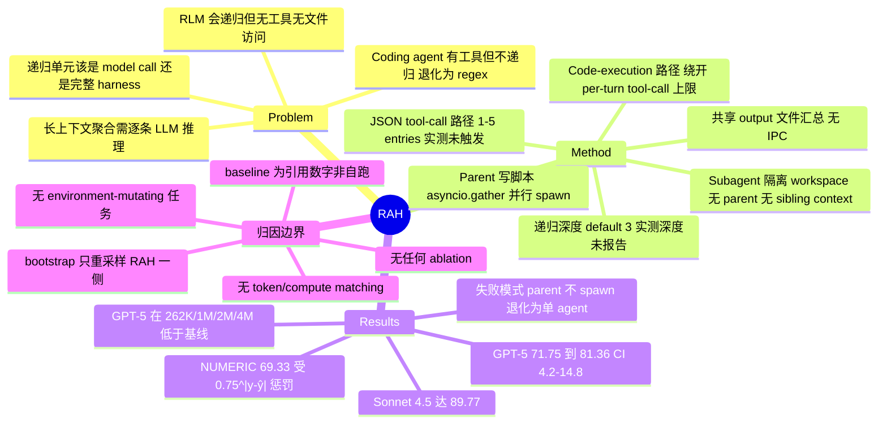

## Summary

提出 Recursive Agent Harness (RAH)：把递归的最小单元从「无工具的 model call」（RLM）升级为「带文件系统、shell、web search 与 planning 的完整 agent harness」，parent agent 现场写一段 Python 脚本，用 `asyncio.gather` 并行 spawn 出一批各自持有独立 context 与 workspace 的 subagent harness。在 backbone 固定为 GPT-5 的条件下，Oolong-Synthetic（199 samples，13 个 context bucket，1K–4M token）上把 Codex coding-agent 基线从 71.75% 提到 81.36%，换 Claude Sonnet 4.5 到 89.77%。作者据此主张增益「attributable to the harness rather than the model」，但全文没有任何 ablation、没有 token/compute matching，三个 baseline 全部是从 Cao et al. (2026) 引用的已发表数字而非自跑。

## Problem & Motivation

长上下文聚合任务（Oolong 这类：答案不在某一个 salient span，而要跨数千条独立 entry 做逐条推理再汇总）把两条现有路线同时逼到墙角。Coding agent 有完整 harness 但不递归——context window 装不下几千条 entry，只能退化成写一个 regex loop 扫全文，逐条的 LLM reasoning 直接被跳过。RLM（Zhang et al., 2026）反过来：能对长输入递归切片并对每片做 model call，但那些 call 没有文件访问、没有代码执行、没有外部工具。

作者提的问题因此是一个很干净的 design-space 问题：**当 agent 对长上下文任务递归时，递归单元应该是一次 model call，还是一整个 harness？** 论文明确说自己的贡献是「命名并测量这个 pattern，而不是发明其中的 primitive」——code execution 与 subagent spawning 都是既有组件（CodeAct、AutoGen、RLM），Anthropic 的 dynamic workflows 已经在生产里用同样的 code-driven spawning。

## Method

**递归单元 = 完整 harness。** Parent agent 拿到全任务，先探查文档规模，再在两条 spawning 路径中自动选择：

- **Code-execution spawning**（>5 entries）：parent 写一段自包含 Python 脚本，每个 subtask 实例化为一个 `Task()` 对象，全部收进一次 `asyncio.gather` 并行执行。关键点是这条路径绕开了 API 的 per-turn parallel tool-call 上限——并行度由 workload 决定而非 provider 协议决定。Parent 通过 shell tool 执行脚本，只在全部 subagent 完成后拿到聚合后的 stdout；中间的 subagent reasoning、tool call、文件写入对 parent 完全不可见。实现基于 LangChain。
- **JSON tool-call spawning**（1–5 entries）：直接发结构化 function call，省掉脚本生成开销。

**Subagent 的 context 隔离。** 每个 subagent 是一个完整 harness，工具集为 `read_file / write_file / ls / glob / grep / execute` 加 web search，外加一个执行前的 planning step。它跑在隔离 workspace 里，**既拿不到 parent 的 context，也拿不到任何 sibling subagent 的 context**，兄弟之间没有共享内存或通信通道。结果通过所有 subagent 往同一个 output 文件写结构化 JSON record 来汇总，parent 的脚本在全部 task resolve 后聚合。这一条是本文与 survey 关心的 fresh-context/context-reset 机制最直接对应的地方：所谓「fresh sub-context」在这里就是 per-entry 的独立 bounded context + 独立 workspace。

**真·递归（设计上）。** 每个 subagent 携带与 parent 相同的 spawning 能力，遇到复杂 entry 可以自己写脚本 spawn grandchild harness，深度由可配置上限约束（default 3）。论文强调这使分解「genuinely recursive rather than one level of fan-out」——但这是架构可用性陈述，不是实测（见 C20）。

**Prompt 层面无任务特异性。** Appendix A 的 parent prompt 是通用 harness prompt，不含 benchmark-specific 指令，不告诉 agent 抽什么、怎么打分、spawn 几个。Appendix B 给出三类 subagent system prompt（general / fast read-only / shell）。Appendix C 是一个额外的 answer-extraction call，把 subagent 原始输出映射成答案格式，带 regex fallback。

## Key Results

**主表（Table 1，Oolong-Synthetic，199 samples，13 buckets，backbone 均为 GPT-5）：**

| Method | Oolong Score |
|:--|:--|
| Full-context baseline | 59.22% |
| RLM (Zhang et al., 2026) | 64.38% |
| Codex, No Retriever (Cao et al., 2026) | 71.75% |
| **RAH, GPT-5 (ours)** | **81.36%** |
| RAH, Sonnet 4.5 (ours) | 89.77% |

前三行全部是 Cao et al. (2026) 测量并发表的数字，作者未复跑（Table 1 caption 明确）。

**不确定性。** 增益 +9.61 pts，95% CI [4.2, 14.8]；对 RLM +16.98，CI [11.5, 22.0]；RAH 总分 81.36%，CI [76.0, 86.5]。bootstrap 用 10,000 次 resample——但**只重采样了 199 个 RAH per-instance score**，把已发表 baseline 当作固定常数处理，理由是作者拿不到 baseline 的 per-instance 分数。这意味着 CI 只吸收了 RAH 一侧的抽样误差，baseline 一侧的抽样误差完全没进区间。

**分答案类型（Table 2）：** USER 87.27% (n=55)、COMPARISON 89.29% (n=28)、LABEL 86.54% (n=52)、NUMERIC 69.33% (n=59)、DATE 60.00% (n=5, CI [20.0, 100.0])。语义类（USER/COMPARISON/LABEL）都过 86%；NUMERIC 低是因为 Oolong 的 $0.75^{|y-\hat{y}|}$ 打分对 off-by-k 计数复利惩罚（差 1 得 0.75，差 2 得 0.5625），作者认为它低估了推理质量。

**分上下文长度（Table 3，每 bucket n=14–16）：** Sonnet 4.5 在 524K 以内保持 86%+，4M 仍有 76.7%；GPT-5 在 262K (57.1%)、1M (53.3%)、2M (66.7%)、4M (66.7%) 四个 bucket **低于** 71.75% 的 Codex 基线。作者自己承认 bucket 级估计区间很宽（1M 的 CI 是 [26.7, 80.0]），应当读作趋势而非精确点。

**Failure modes（§4.6）：** 最主要的一类是 parent 干脆不写 spawning 脚本、直接自己作答，RAH 退化为单个 coding agent；这类 case 集中在长 context——即恰好在机制最该起作用的地方最容易失效。

## Evidence Ledger

> 全部 20 条 claim 由独立 verifier 对 primary source（arXiv:2606.13643 全文 HTML）逐条定位核查，结论均为 `source-verified`。source-verified 仅表示原文确实包含该信息，不表示结果已被独立复现。

| Claim ID | Claim | Type | Source locator | Evidence excerpt | Status |
|:--|:--|:--|:--|:--|:--|
| C1 | Backbone 固定为 GPT-5 (gpt-5-2025-08-07)，parent、每个 subagent、answer-extraction call 全用同一模型，temperature 0 | benchmark-setting | §4.1 | "RAH uses GPT-5 (gpt-5-2025-08-07) for the parent agent, every subagent, and the answer-extraction call … All runs use temperature zero." | source-verified |
| C2 | RAH (GPT-5) 81.36% vs Codex, No Retriever 71.75%，Oolong-Synthetic 199 samples | number | Table 1 / §4.2 | "RAH improves the strongest prior result, the Codex coding agent, from 71.75% to 81.36%" | source-verified |
| C3 | 59.22% / 64.38% / 71.75% 三个 baseline 均引自 Cao et al. (2026)，非本文复跑 | benchmark-setting | Table 1 caption | "The full-context, RLM (Zhang et al., 2026), and Codex baseline scores are all as measured and reported by Cao et al." | source-verified |
| C4 | +9.61 pts / CI [4.2, 14.8] 只 bootstrap 了 199 个 RAH per-instance 分数，baseline 被当作固定参考点（作者无其 per-instance 分数） | number | §4.2 | "since we do not have their per-instance scores, a bootstrap over the 199 RAH scores places the gain at +9.61 points (95% CI [4.2,14.8])" | source-verified |
| C5 | 论文没有做任何设计选择的 ablation，明确点名 recursion depth、entries-per-subagent、code-execution vs tool-call path 三项均未 ablate | benchmark-setting | §5 | "We do not ablate individual design choices such as recursion depth, the number of entries per subagent, or the code-execution versus tool-call spawning path." | source-verified |
| C6 | GPT-5 配置的 token 与 wall-clock 均未 instrument，全文无 compute-matched / token-matched 对照 | benchmark-setting | §4.5 / §5 | "We did not instrument exact token and wall-clock profiles for the GPT-5 configuration and leave precise cost characterization to future work." | source-verified |
| C7 | 每个 subagent 在隔离 workspace 中运行，无 parent context、无 peer 访问；结果经共享 output 文件汇总 | causal-mechanism | §3.2 / §3.4 | "operates inside an isolated workspace with no access to the parent context or to peer subagents … collects results by reading a shared output file" | source-verified |
| C8 | 设计上支持多层递归：subagent 可 spawn grandchild harness，深度上限可配置，default 3 | causal-mechanism | §3.4 | "can write its own script and spawn grandchild harnesses … Recursion depth is bounded by a configurable limit (default 3)" | source-verified |
| C9 | 评测中 199 个实例全部走 code-execution 路径，JSON tool-call 路径在本 benchmark 上从未被触发 | number | §4.2 | "Every RAH instance produced a Task() script, so all samples followed the code-execution path" | source-verified |
| C10 | §1 称增益「consistent across all context-length buckets including 4M」，但 Table 3 中 GPT-5 在 13 个 bucket 里有 4 个低于 71.75% 基线（262K 57.1%、1M 53.3%、2M 66.7%、4M 66.7%） | comparison | §1 vs Table 3 | "Gains are consistent across all context-length buckets including 4M tokens" | source-verified |
| C11 | 每条答案额外经过一次 answer-extraction LLM call（固定 prompt + regex fallback），199/199 成功，作者未做人工验证 | benchmark-setting | §4.1 / Appendix C | "the extraction step succeeded on every instance"; "We did not run a separate human validation of the extraction step" | source-verified |
| C12 | 唯一 benchmark 是 Oolong-Synthetic（长上下文聚合 QA，13 buckets 1K–4M，平均 629K token/instance），无任何 environment-mutating / agentic-action benchmark | benchmark-setting | §4.1 / §5 | "199 samples drawn from the Oolong-Synthetic validation split, stratified across all 13 context-length buckets ranging from 1K to 4M tokens" | source-verified |
| C13 | 实现基于 LangChain agent framework；同一设计换 Claude Sonnet 4.5 (claude-sonnet-4-5-20250929) 达 89.77% | number | §3.2 / Table 1 | "RAH is implemented with the LangChain agent framework package"; "RAH, Sonnet 4.5 (ours) 89.77%" | source-verified |
| C14 | 代码与评测脚本尚未发布，仅承诺 "will be released shortly"，无仓库 URL | license-code | Code and Data Availability | "The Recursive Agent Harness implementation and the evaluation and scoring scripts will be released shortly." | source-verified |
| C15 | 分类型分数 USER 87.27% (n=55) / COMPARISON 89.29% (n=28) / LABEL 86.54% (n=52) / DATE 60.00% (n=5, CI [20.0,100.0]) / NUMERIC 69.33% (n=59) | number | Table 2 | "USER 87.27% [78.2, 94.5] 55 … DATE 60.00% [20.0, 100.0] 5 NUMERIC 69.33% [57.9, 80.1] 59" | source-verified |
| C16 | 每个 context bucket 仅 14–16 个实例；1M bucket 为 53.3%，CI [26.7, 80.0]，作者要求把 bucket 级数字读作趋势 | number | Table 3 caption / §4.4 | "Per-bucket estimates rest on 14 to 16 instances … The 1M bucket, for example, is 53.3% with a 95% CI of [26.7,80.0]" | source-verified |
| C17 | 论文称 "All prior results evaluate on the same 199-sample protocol"，同时把自己的集合描述为「199 randomly sampled instances」，未明言复用了 Cao et al. 的同一批实例 | benchmark-setting | §4.1 / §1 | "All prior results evaluate on the same 199-sample protocol."; "RAH is evaluated on 199 randomly sampled instances from Oolong-Synthetic" | source-verified |
| C18 | Subagent 除文件系统与 shell 外还配有 web search，而被比较的 baseline 名为 "Codex, No Retriever" | benchmark-setting | §3.2 / Table 1 | "equipped with read_file, write_file, ls, glob, grep, execute, and web search"; "Codex, No Retriever (Cao et al., 2026) 71.75%" | source-verified |
| C19 | 失败模式之一是 parent 直接作答、不写 spawning 脚本，使 RAH 退化为单个 coding agent，且集中在长 context | causal-mechanism | §4.6 | "the parent answered directly without writing a spawning script, which collapses RAH to a single coding agent … concentrate at longer context lengths" | source-verified |
| C20 | 全文未报告评测中实际达到的 recursion depth（即是否真的 spawn 过 grandchild subagent 无任何数据） | benchmark-setting | §4.2–§4.6（缺失） | 唯一深度提及在 §3.4 "bounded by a configurable limit (default 3)"；§4 无 realized-depth 统计 | source-verified |

**两处 source-internal 矛盾**（由 verifier 独立指出，两侧文字均逐字属实，论文未加调和）：

1. **C9 ↔ C19**：§4.2 说「Every RAH instance produced a Task() script」，§4.6 却说「on a small number of instances the parent answered directly without writing a spawning script」。这两句不可能同时为真。这直接影响 §4.2 那句「所有样本都走了 code-execution 路径」——如果 §4.6 属实，则有一部分样本根本没有递归，81.36% 是「RAH + 若干次退化为 coding agent」的混合分数。
2. **C10 的 §4.4 版本**：§4.4 写「Both configurations exceed the 71.75% Codex baseline at the majority of context lengths including 4M tokens」，但 Table 3 中 GPT-5 的 4M bucket 是 66.7%，低于基线；只有 Sonnet 4.5 (76.7%) 在 4M 超过基线。"Both … including 4M" 与自己的表冲突。

## Strengths & Weaknesses

**Strengths.**

- 问题 formulation 是干净的：「递归单元该是 model call 还是完整 harness」是一个可以真正做实验的 design-space 轴，比「我们又搭了一个 multi-agent framework」有信息量。Table 4 按「递归单元」把 coding agent / RLM / dynamic workflows / RAH 四种策略排开，是这篇最有复用价值的一页。
- Backbone pinning 做得比多数同类论文彻底：parent、每个 subagent、连 answer-extraction call 全部锁死同一个 model snapshot，temperature 0（C1）。作者也主动披露了 extractor 与被测系统同属 GPT-5 家族这一潜在污染。
- Parent prompt 不含 benchmark-specific 指令（Appendix A），spawn 多少、怎么分解全由 agent 自己决定——这让「harness 提供能力、agent 自行使用」的说法比硬编码流水线可信。
- Limitations 节写得诚实：主动点名没有 ablation、没有 cost instrumentation、没有 human validation、只在一个 benchmark 上评。这些自曝极大降低了被误读的风险（也正是本笔记能精确定位其边界的原因）。

**Weaknesses——针对「gain attributable to the harness」这一核心 claim。**

论文对该 claim 的**全部**支撑就是「两边 backbone 都是 GPT-5」这一条论证，没有任何 ablation（C5）。而固定 backbone 只排除了「模型变强」这一个替代解释，被 harness 这个词捆在一起的至少还有五个同时变动的因素：

1. **regex-per-entry → LLM-per-entry**。论文自己在 §6 把机制总结为「The same model that scores 71.75% with a regex loop scores 81.36% when the recursive unit is a full harness」。这句话恰恰说明主导变量很可能是「逐条推理从正则换成了 LLM」，而不是 context reset 或递归本身。这是我读下来最可能的真实归因，但论文无法区分。
2. **算力**。RAH 对一份含 1,772 条 entry 的文档要发出量级为千的 subagent 调用（每个还要重读共享文档前缀），baseline 是单 harness 的一个 regex loop。作者连自己这边的 token 都没测（C6），谈不上 matched control。在算力差出两三个数量级的前提下，「架构带来的增益」和「花更多 token 带来的增益」无法分离。
3. **额外的 extraction pass**（C11）。每条 RAH 答案多过一次 GPT-5 调用做格式映射，论文没有说明 Codex baseline 是否有等价步骤，也没做人工验证。作者用「原始输出通常已是目标格式」来论证影响有限，这是合理但未经测量的辩护。
4. **工具面不同**（C18）：subagent 有 web search，baseline 叫 "No Retriever"。在合成 key–value 聚合任务上这大概率不重要，但它仍是一处未被控制的能力差。
5. **样本可比性**（C17）：「same 199-sample protocol」与「199 randomly sampled instances」并存，论文没有明确说复用了同一批实例。若是各自独立抽样，baseline 侧的抽样噪声还要再加一层——而 CI 的构造（C4）已经把 baseline 当成了零方差常数。

**递归本身可能根本没被测到。** 深度上限 default 3 是架构参数，论文没有报告评测中实际达到的深度、也没报告是否 spawn 过 grandchild（C20）。加上 C9/C19 的自相矛盾，一个完全兼容全部已报告证据的解读是：实测系统其实是**一层 fan-out**（外加若干次退化为单 agent），"recursive" 三个字在实验上没有被验证。这对一篇以「naming and measuring the pattern」为唯一贡献的论文是要害——被命名的那个 pattern 的定义性特征（递归而非单层扇出）恰恰没有测量。

**Benchmark 的限制。** 只有 Oolong-Synthetic，是对静态文档做聚合式 QA（C12）。整个任务没有环境状态变更、没有不可逆动作、没有副作用需要核验。因此本文对 survey 关心的三件套只覆盖了两件：externalized state（隔离 workspace + 共享 output 文件）与 fresh-context execution（per-entry 独立 context），**independent verification 这一环完全不存在**——answer-extraction 是格式映射器不是 verifier，评分是确定性的 exact-match / $0.75^{|y-\hat{y}|}$，不含 model judge。作者自己也承认对 Oolong-Real、对「per-entry 证据更含糊或不字面存在」的域能否泛化是 open question。合成数据里「每条 entry 的答案字面存在于上下文中」这一性质，正是让 per-entry 独立 subagent 免于协调的前提；一旦证据需要跨 entry 拼接，sibling 之间零通信（C7）就从优点变成结构性限制。

**统计基础薄。** n=199，总体 CI [76.0, 86.5] 已经不窄；bucket 级 n=14–16，1M bucket 的 CI 宽到 [26.7, 80.0]（C16）；DATE 只有 5 个样本（C15）。在这个样本量下，Table 3 里那些「262K 反超 131K」「64K 达到 100%」的模式基本读不出信号，作者自己也提醒按趋势读。

**对领域的意义。** 我认为这篇的价值不在结论而在**它是「fixed-backbone ⇒ 增益归于 harness」这一论证模式的典型样本**：论证形式正确（确实排除了模型变量），但结论的粒度被过度放大——从「不是模型」跳到了「是 harness 这个整体」，再被摘要压缩成一个单一因果句。对 component attribution 的调研来说，这篇正好界定了 fixed-backbone 控制的能力上限：**它是一个必要的控制，但只能否定一个替代假设，不能在 harness 内部做归因。** 要把 gain 分配到具体组件，最少需要两个它没做的对照——(a) 单层 fan-out vs 多层递归（隔离 recursion）；(b) 同一 token 预算下的单 agent 分块 LLM 推理 vs 多 subagent（隔离 context reset 与算力）。可以对照 [[Papers/2607-HarnessEvolution]]：那篇同样固定 LLM 只变 harness，但结论相反（35 个 release 的 harness 演进没带来 resolve rate 提升，只把 token 推高 70%）——两篇放在一起说明「固定 backbone」这个设计本身既能产出正增益也能产出零增益，真正决定结论的是被变动的 harness 里到底混了什么。

## Mind Map

## Notes

- **对 component-attribution survey 的直接用处**：本文可作为「fixed-backbone controlled evaluation」这一论证模式的 canonical case，用于说明该控制的确切效力边界——排除模型变量 ≠ 定位到组件。它同时是「survey 三件套里缺 independent verification」的一个纯净样本：只有 externalized state + fresh-context execution，没有 verifier，因此不能用来论证 verification 组件的贡献。
- **与 [[Papers/2608-LongHorizonHarness]] 的对照值得写进 survey**：那篇是 Manage-Execute-Audit，把 fresh-context executor 与 read-only auditor 都放进循环，机制主张是「executor 的完成声明不进 state，只有 auditor 从环境取到的证据才进」；同样**没有 role-level ablation**，且 OSWorld 上的增益还叠加了工具面变更。两篇独立地在不同任务域重复了同一个方法学缺口：把多组件 harness 的整体增益归给某一个机制叙事，而不做组件隔离。这个 pattern 本身就是 survey 的一个可写论点。
- **与 [[Papers/2607-HarnessEvolution]] 构成矛盾对**：同样固定 LLM 只变 harness，那篇得到零增益 + 成本 +70%。矛盾是最有价值的信号——两篇的差别在于「变动的 harness 内容」不同（RAH 换的是逐条推理方式，HarnessEvolution 换的是同一 CLI 的连续 release），这提示 harness 增益不是 harness 这个抽象层的属性，而取决于被改动的具体机制。
- 上位背景可挂 [[Papers/2604-Externalization]]（externalization 三维度 + harness 统一协调）与 [[Papers/2605-CodeAgentHarness]]（code-as-harness 分类法）；方法学近邻是 [[Papers/2604-RecursiveMAS]]（把 RLM 递归思路推到 multi-agent，但走 latent space 而非 code）。
- **待跟踪**：代码「will be released shortly」但未给 URL（C14）。若发布，值得对 `Task()` 的实际实现与 realized recursion depth 做一次 repo-digest，这是唯一能回答 C20 的途径。
- **一个可做的实验**（若要沿这条线推进）：在 Oolong-Synthetic 上加两条对照——(a) 固定单层 fan-out、禁 grandchild，与 default depth 3 对比，隔离递归；(b) 给单 agent baseline 与 RAH 匹配总 token 预算（单 agent 允许分块多轮 LLM 调用），隔离 context reset 与算力。这两条对照的成本远低于原实验，却是把 +9.61 分配到组件上的最小充分条件。
