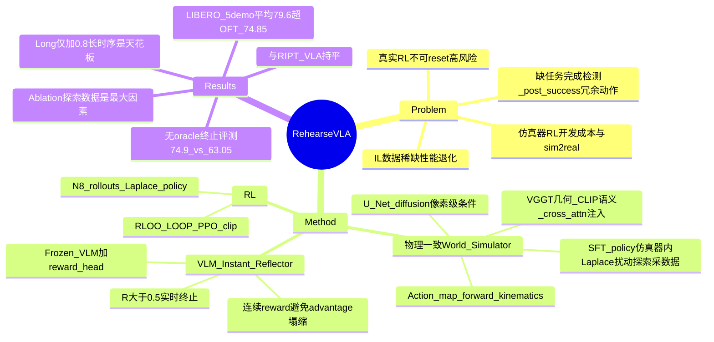

## Summary
RehearseVLA 用一个 action-conditioned video world model 替代物理环境 / 仿真器，对 OpenVLA-OFT 做 RL post-training：world model 生成想象 rollout，一个 VLM-guided instant reflector 输出连续 reward 并实时判定任务完成以终止动作序列。在每任务仅 5 条 demo 的 LIBERO 设定下平均成功率 79.6%（SFT baseline OpenVLA-OFT 74.85%），且在无 oracle 终止信号的评测下优势扩大到 +11.85。

## Problem & Motivation
VLA 靠 imitation learning 训练，在 data-scarce 场景性能显著退化。RL post-training 是已被验证的解法，但两条现有路线都有实际障碍：(1) 真实环境 RL——交互不可 reset、试错成本高、在工业自动化等高风险场景不可接受；(2) 仿真器 RL——开发成本高、sim-to-real gap、难以适配新物体和动态场景。此外作者指出一个被忽视的部署问题：VLA 缺少可靠的任务完成检测机制，达成目标后继续执行冗余动作会破坏已完成的状态（Fig. 8 的 "put the wine bottle" 例子：成功放置后继续动作把瓶子碰倒）。核心问题是：能否有一个"理想试验场"，既避免真实风险，又比传统仿真器更灵活、语义更丰富？作者的答案是 video world model。

## Method
框架 = 物理一致 world simulator + VLM-guided instant reflector + RLOO/LOOP RL，policy 为 OpenVLA-OFT（LoRA rank 32 微调 VLM backbone，action head 与 scale head 全参训练）。

**1. Physically-Consistent World Simulator（action-conditioned 未来帧预测）**
- 输入：VLA 输出的连续 action → 经 forward kinematics 得到下一步 proprioceptive state（6D end-effector pose + gripper），投影到图像平面生成 **action map**（黑底上的前景 pose marker，pixel-level condition）；再叠加从 memory bank 采样的历史观测，一起注入 U-Net denoising diffusion network。
- **Geometry-aware feature injection**：从两个冻结预训练编码器抽特征做多分辨率 cross-attention 注入——VGGT（细粒度几何结构 / 空间布局）+ CLIP（高层语义）。这是 "physically-consistent" 声称的来源。
- **训练数据策略**：只用 LIBERO expert demo 训练的 WM 对未见 state-action 泛化差。因此部署 SFT 后的 OpenVLA-OFT 在 **LIBERO 仿真器内自主探索**收集额外 transition：训练一个 scale head 预测 Laplace 分布的 log-scale β，从 Laplace(μ, β) 采样扰动动作执行，收集含失败模式的多样化数据，与 expert demo 合并训练 WM。WM 训好后在 RL 期间冻结。

**2. VLM-Guided Instant Reflector（连续 reward + 实时终止）**
- 架构：frozen vision encoder + frozen LLM + 轻量 reward head，对想象轨迹 o_{1:t} 与指令 g 输出 step-wise reward R∈[0,1]（任务在 t 时刻前完成的概率），BCE 训练，标签来自 LIBERO expert 轨迹（任务判据）+ policy 在仿真器生成的轨迹的 per-frame binary success 标注。
- R > η=0.5 触发终止信号；RL 时 reward 稀疏使用——只取终止时刻（或 T 时刻）的单个标量。
- 动机：先前方法（RIPT-VLA、VLA-RL）用 binary 成败 reward，batch 内全成/全败时 empirical advantage 塌缩为零、无学习信号；连续 reward 反映细粒度任务进度，保证非平凡 advantage，也免去平衡成功/失败 rollout 的采样负担。

**3. RL 优化**：Leave-One-Out PPO（LOOP）= RLOO baseline（N=8 rollouts，b_n 取其余轨迹平均 reward）+ PPO clipping（ε=0.1），advantage 广播到全时间步；policy 分布为 action head（location μ）+ scale head（β）诱导的独立 Laplace 乘积。8×H20（96GB）训练约 48h。

## Key Results
- **LIBERO（每任务仅 5 demo 训练，全测试集评测）**：Ours（OpenVLA-OFT + post-training）Goal 86.4 / Object 86.6 / Spatial 87.6 / Long 57.8，平均 **79.6**；对比 OpenVLA-OFT 74.85、UniVLA 74.75、π0 61.1、OpenVLA 60.7、π0+FAST 55.0（所有 baseline 同样只用 5 demo 重训）。
- **vs 仿真器 RL（RIPT-VLA）**：86.4/86.6/87.6/57.8 vs 86.2/83.4/88.6/58.4——总体持平（仅 Object +3.2，Spatial -1.0、Long -0.6），卖点是不依赖仿真器可直接部署到真实场景。
- **无 oracle 终止信号评测（Table 4，所有方法跑满 horizon，Ours 用 reflector 自主终止）**：Ours 平均 **74.9** vs OpenVLA-OFT 63.05、UniVLA 65.4、π0 54.9——OpenVLA-OFT 从 74.85 掉到 63.05（-11.8），证明 post-success 冗余动作破坏任务状态是真实且被普遍忽视的问题，而 reflector 终止把这部分损失基本救回。
- **真实世界（4 任务，每任务收 10 条轨迹做 policy SFT + WM 微调）**：clean table 30 vs 20、put green toy 50 vs 30、put red toy 40 vs 30、put orange toy 50 vs 20（% 成功率，Ours vs OpenVLA-OFT）。
- **Ablation（Table 5）**：base 68.4/75.2/73.2/42.2；仅 +探索数据 79.8/81.8/78.4/44.6；仅 +reward head 68.8/76.4/74.4/43.8；两者兼有 86.4/86.6/87.6/57.8。探索数据是最大单因素；reward head 单独用几乎无增益，须与高保真 WM 配合。off-the-shelf VLM 做 prompt-based binary 判分效果差且在复杂任务上有害。
- **收敛速度（Fig. 5）**：multi-goal 任务上 20 个 training step 内即明显超过 SFT。
- **Limitations（作者自述）**：WM 与 reflector 的保真度依赖多样训练数据；policy optimization 因 simulator-based 轨迹生成的计算瓶颈比并行方法慢。

## Strengths & Weaknesses
**已知亮点**：
- **Instant reflector 是全文最扎实的贡献**：连续 reward 解决 RLOO 在 binary reward 下 advantage 塌缩的问题，动机清晰；Table 4 的无 oracle 终止评测暴露了整个 VLA 社区靠 benchmark 提供 ground-truth 终止信号的隐性依赖，OpenVLA-OFT 掉 11.8 个点的数字很有说服力，这是真实部署必须面对的问题。
- Ablation 干净：四行组合把两个组件的贡献和交互讲清楚了，"reward head 单独用无效、必须配高保真 WM" 是诚实的负结果。
- Action map + forward kinematics 的 pixel-level 条件注入设计简单直接；用探索数据（含失败）增强 WM 训练与 World-VLA-Loop 的 SANS 结论互相印证——失败/次优数据是 video WM 用作 RL simulator 的关键 ingredient。

**已知局限**：
- **循环依赖削弱核心 claim**："eliminating the need for real-world interaction / 不依赖仿真器" 只在 RL 阶段成立——WM 的训练数据靠 SFT policy 在 **LIBERO 仿真器内** rollout 采集，而 ablation 显示去掉这些探索数据后 Goal 从 86.4 崩到 68.4。也就是说要摆脱仿真器，得先有一个仿真器（或真实交互）来喂 WM。真实实验里也是靠额外采集 10 条真实轨迹微调 WM。
- **与 RIPT-VLA 打平**：性能上无优势（79.6 vs ~79.2 平均），价值主张完全落在"部署无需仿真器"上，而这一点又被上一条打了折扣。
- LIBERO-Long 仅 +0.8（57.0→57.8），增益集中在短任务，暗示 diffusion WM 的长时序 rollout 一致性仍是天花板（与 World-VLA-Loop 放弃 LIBERO-Long 的观察一致）。
- WM 在 RL 期间冻结，论文完全没有讨论 policy 利用 WM 误差做 reward hacking / model exploitation 的风险——World-VLA-Loop 已实证这种 hacking 会发生并需要 co-evolution 修补。
- 真实实验规模小（4 任务、成功率均为 10 的倍数、无置信区间），绝对成功率 30-50% 不高。
- "Physically-consistent" 名不副实：本质是 VGGT 几何特征注入带来的视觉/几何一致性，主文未报告任何物理一致性度量。

**推测**：
- 正文未说明 WM 与 reflector 的训练是否也被限制在每任务 5 条 demo（原文写 "expert demonstrations from the LIBERO benchmark"），若二者用了完整 LIBERO 数据，"5 demos per task" 的数据稀缺对比对 baseline 并不完全公平——policy 的模仿数据稀缺，但 pipeline 整体的数据预算并不稀缺。
- 8×H20×48h 训练一个 LIBERO 级别的 post-training，换到更复杂场景成本可能不可控。

**不知道**：
- WM 对相机视角、新物体、新场景布局的泛化能力（真实实验是同分布微调后评测）；reflector 的误终止率（false positive 提前终止）未报告。

## Mind Map

## Notes
- 与 [[2602-WorldVLALoop]] 是同一范式（video world model 替代仿真器做 VLA RL）的并行工作：两者都发现"失败/次优数据是 WM 训练关键"；但 World-VLA-Loop 用 co-evolving loop 应对 reward hacking，RehearseVLA 冻结 WM 且不讨论该风险——这是本文相对薄弱处。本文的差异化贡献在 instant reflector 的连续 reward + 实时终止。
- Base policy 为 [[2502-OpenVLA-OFT]]；对比的 RIPT-VLA（arXiv 2505.17016）与 VLA-RL（arXiv 2505.18719）是 binary-reward RL post-training 路线。
- Table 4 的评测协议（禁用 ground-truth 终止信号）值得在其他 VLA 评测中推广——它衡量的是部署时的真实性能而非 benchmark 性能。
- date_publish 按 CVPR 2026 会期记为 2026-06；无 arXiv 页，doi 主文未给。
