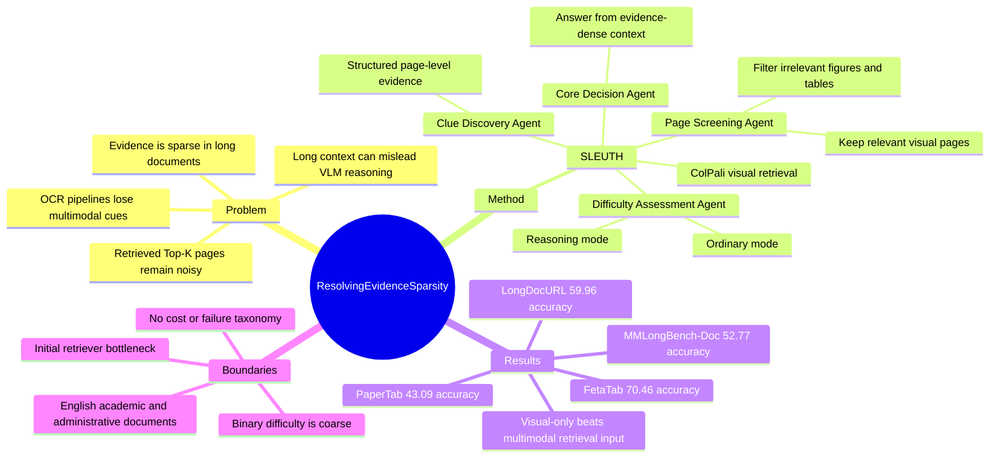

## Summary
SLEUTH 针对 long-document understanding 中 evidence sparse、retrieved pages 仍然高度冗余的问题，用 training-free multi-agent context engineering 把 Top-K pages 转换成更 compact、evidence-dense 的 multimodal context。它不训练新 backbone，而是在 ColPali retrieval 后用 Clue Discovery、Page Screening、Difficulty Assessment、Core Decision 四个 agents 做 page-wise evidence extraction、visual filtering 和 difficulty-aware reasoning，并在 MMLongBench-Doc、LongDocURL、PaperTab、FetaTab 上报告一致提升。

## Problem & Motivation
已知：VLM 在 single-page document tasks 上表现较好，但 long documents 会引入大量冗余 context，关键证据又常常稀疏地分布在多页、多模态元素中。OCR-based LLM pipeline 容易丢失 charts、layout、tables、fonts 等 multimodal cues；RAG 能缩小搜索范围，但 Top-K retrieved pages 里仍然有大量无关内容。作者的核心动机不是继续扩大 context window 或单纯提高 retrieval recall，而是把 long-document QA 重新 formulation 为“如何构造 concise、trustworthy、evidence-dense context”。这个问题和 VLM / document agent 相关，因为最终错误常来自 evidence selection 和 context organization，而不只是 final answer model 的推理能力不足。

## Method
SLEUTH 是一个 training-free、plug-and-play 的 coarse-to-fine framework。

**Coarse-grained Visual Retrieval.** 给定 question `Q` 和 document pages `D = {p1, ..., pN}`，系统先用 ColPali-v1.3 做 page-level visual retrieval：把 question 编成 textual embeddings，把每页图像编成 visual embeddings，通过 late-interaction relevance score 选出 Top-K candidate pages。默认实验中 Top-K 为 5。

**Clue Discovery Agent.** 该 agent 以 page 为最小处理单元，顺序读取 candidate pages，抽取 query-relevant evidence。每条 evidence unit 记录 page、region、content、insight、rationale，目标是把 page image 中的 text lines、table cells、chart areas 等转成可追溯的 structured clues。

**Page Screening Agent.** 该 agent 并行检查 candidate pages 的整体视觉内容，重点判断 tables、charts、figures、diagrams 是否和问题相关，并输出 `CR / R / IR` 三类 relevance label。被判为 Completely Relevant 或 Relevant 的页面会保留为 visual context；在 LongDocURL 的 Top-5 setting 下，论文报告平均只保留 2.1 个 relevant visual pages。

**Difficulty Assessment Agent + Core Decision Agent.** Difficulty Assessment Agent 根据 question 和 structured context 判断 `d in {0, 1}`：`d=0` 用 ordinary / instruct mode，`d=1` 用 reasoning / thinking mode，并生成 instruction set `Gamma_d`。Core Decision Agent 再基于 refined context 和 instructions 生成最终答案，同时产生 evidence reference table。若视觉页面全被过滤，系统会切换 prompt template，避免在没有 visual inputs 时仍给出视觉指令。

## Key Results
- **MMLongBench-Doc accuracy**：SLEUTH 平均 **52.77%**，高于 MoLoRAG 的 **48.75%**（+4.02 pp）、MDocAgent 的 **47.82%**、M3DocRAG 的 **45.90%**、Base 的 **46.76%** 和 Direct 的 **42.71%**。分项上，SLEUTH 在 Table / Pure-text / Figure / None 分别为 **47.55 / 59.26 / 50.27 / 67.38**；但 Chart 为 **53.27**，低于 MoLoRAG 的 **54.85**，Layout 为 **53.52**，低于 MDocAgent 的 **56.39**，所以不是所有类型都最佳。
- **LongDocURL accuracy**：SLEUTH 平均 **59.96%**，高于 MoLoRAG **57.57%**、M3DocRAG **54.59%**、MDocAgent **53.11%** 和 Base **55.18%**。三个子任务上，Locating / Understanding / Reasoning 分别为 **53.63 / 65.67 / 52.99**。
- **PaperTab / FetaTab accuracy**：SLEUTH 在 PaperTab 达到 **43.09%**，略高于 MoLoRAG 的 **42.59%** 和 Base 的 **38.88%**；在 FetaTab 达到 **70.46%**，高于 MoLoRAG **69.41%**、MDocAgent **66.55%** 和 Base **64.16%**。
- **Closed-source comparison on MMLongBench-Doc**：Figure 3 报告 SLEUTH(Qwen3VL-8B) 为 **52.8**，高于 Gemini 2.5 Pro **51.2**、Seed1.5VL **50.1**、Claude Opus 4.1 **48.1** 和 GPT-5 **42.4**；这些 closed-source models 是 direct long-document processing setting。
- **Component ablation with Qwen3-VL-8B**：Base 在 MMLongBench-Doc / LongDocURL 上为 **46.76 / 55.18**；只加 Clue Discovery 为 **48.61 / 57.15**；再加 Page Screening 为 **51.29 / 59.49**；完整 Top-5 SLEUTH 为 **52.77 / 59.96**。这支持 clue recording、visual filtering、difficulty-aware reasoning 都有边际贡献。
- **Top-K ablation**：Qwen3-VL-8B 下，SLEUTH Top-1 / Top-3 / Top-5 在 MMLongBench-Doc 上为 **44.92 / 49.65 / 52.77**，在 LongDocURL 上为 **52.88 / 58.38 / 59.96**。作者解释为：agents 的有效 context length 固定，增大 K 主要提高 recall，而不是把更多噪声直接塞给 final VLM。
- **Visual vs. multimodal retrieval input**：visual-only input 在 MMLongBench-Doc / LongDocURL 上为 **52.77 / 59.96**，multimodal retrieval input 为 **50.19 / 57.62**。作者据此认为 visual pages 作为统一表示能保留 layout relations，并减少 OCR/text stream 带来的 duplication 和 noise。
- **Additional comparison with Qwen2.5-VL-7B-Instruct backbone**：Supplementary Figure 6 报告 SLEUTH 为 **45.1**，高于 MACT **43.7**、MoLoRAG **40.5** 和 VRAG-RL **35.9**。

## Strengths & Weaknesses
**已知 Strengths.**
- 论文把 long-document understanding 的瓶颈明确指向 context quality：关键不是把更长 documents 直接喂给 VLM，而是在 retrieval 后继续做 evidence distillation 和 visual noise filtering。
- 框架是 training-free 且 model-agnostic；主实验使用 Qwen3VL-8B，ablation 还覆盖 GLM-4.1V-Thinking-8B 和 Gemini-2.5-Flash，三类 backbones 在 Top-K 增大时都呈现类似上升趋势。
- Ablation 信息较完整：拆了 Clue Discovery、Page Screening、Difficulty Assessment、Top-K、backbone、visual-only vs multimodal retrieval input，并给出一个 case study 展示 redundant numerical context 如何诱发 hallucination。
- 对 unanswerable / None category 的处理有价值：Supplementary B.1 明确说如果两阶段 evidence construction 找不到有效支持，系统按协议输出 “No answers found!”，这解释了 MMLongBench-Doc None 从 Base **52.68%** 到 SLEUTH **67.38%** 的提升。

**已知 Weaknesses / limitations.**
- 论文自己承认框架 heavily relies on initial retriever；如果 critical pages 在早期 retrieval 中被漏掉，下游 agents 无法恢复。
- Difficulty Assessment 是 binary `d in {0, 1}`，作者在 limitation 中也指出这可能过于粗糙，难以覆盖 intermediate reasoning cases。
- 当前实验主要集中在 English administrative and academic documents；cross-lingual、handwritten、legal、medical 等 domain-specific documents 仍未验证。
- 系统完全 prompt-driven、training-free，解释性较好，但缺少通过 experience self-evolve 的能力；作者把 RL 和 external toolkits 作为 future work。

**推测.**
- 对 GUI / web agent 的启发在于：screen 或 webpage 任务里也存在 evidence sparsity，大量可见元素对当前 goal 无关，直接把完整 screenshot 或 DOM context 交给 agent 可能造成类似 hallucination / distraction。SLEUTH 的 page-wise clue logging + visual screening 可以类比为 GUI state 的 region-wise evidence distillation，但论文没有在 GUI-agent 或 computer-use benchmark 上验证。
- visual-only retrieval 优于 multimodal retrieval 的结果可能说明，layout-preserving representation 对复杂文档更关键；但这不一定推广到所有文档类型，尤其是需要 exact text normalization 或 OCR 精确字符串匹配的任务。

**不知道 / 未报告.**
- 没有看到 code link、DOI 或完整可复现实验配置仓库。
- 论文没有系统报告 latency、token cost、agent 调用次数分布，因而无法判断 SLEUTH 相比更大模型或更强 retriever 的 cost-normalized advantage。
- 没有看到 Page Screening Agent 的 false discard rate，尤其是把含关键证据的页面误判为 irrelevant 时的失败分布。
- Case study 说明了一个 numerical table hallucination 例子，但论文没有提供更系统的 failure taxonomy。

## Mind Map

## Notes
这篇和同为 CVPR 2026 的 MACT 都把 document understanding 从“单体 VLM 读长上下文”转成“agentic process”，但切入点不同：MACT 侧重 procedural reasoning 和 test-time scaling，SLEUTH 侧重 retrieval 后的 context construction。对后续阅读更有价值的问题是：long-document agent 到底应该优先优化 retriever recall、context density、reasoning verifier，还是三者联合；这篇给出的证据更支持“retrieval 后仍需要二次 evidence refinement”。
