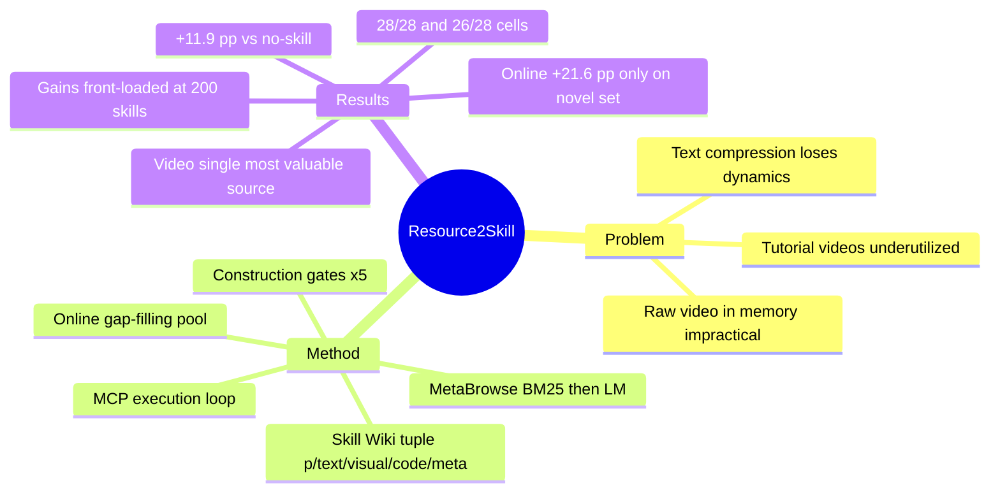

## Summary

Resource2Skill 把 tutorial video、源码仓库、文章、参考 artifact 四类 human-created multimodal resources 自动蒸馏为可执行 agent skill，组织成带 domain taxonomy 的分层 Skill Wiki（text + visual + code + metadata），供软件创作 agent 经 MCP 检索、组合与调用。在 PPT/Excel/Web/Blender/Reaper/CAD/UE5 七个 authoring domains、四个 GPT-5.x backend 上，带 skill 的 agent 平均 overall score 56.8% 对 no-skill 45.0%（论文口径 +11.9 pp），28/28 model-domain cells 全胜 no-skill，26/28 cells 胜过 ClaudeCode-H / Codex-H 现成 harness。ablation 显示 video 是单一最有价值且不可替代的资源来源，hierarchy-then-LM 的 MetaBrowse 检索显著优于 BM25 与 dense retrieval。

## Problem & Motivation

现有软件 agent 的 skill library 多为手写、纯文本、或从 agent 自身 trace 蒸馏，而人类学习复杂软件操作时大量依赖 tutorial video 等多模态资源——这部分资源在 agent 系统中严重未被利用。直接把原始视频塞进 agent memory 昂贵、冗余且不实用；但把视频压缩成纯文本又恰好丢掉了视频最有价值的信息：动态操作过程、before-after 视觉变化、动画质量、空间布局、时序与工具交互顺序。论文的核心问题是：能否自动从多模态人类资源（尤其 tutorial video）蒸馏 skill，构建可扩展的软件 agent skill library。

## Method

**Skill Wiki 结构（§3.1）**。每个 skill 是五元组 s = (p, x_text, x_visual, x_code, m)：p 为 domain taxonomy 中的路径，x_text 含名称/机制/适用条件/输入/预期效果，x_visual 为缩略图、截图、示意图（可空），x_code 为可执行或可改写的代码片段（可空），m 为过滤与 provenance 元数据。

**Resource-to-Skill 构建（§3.2, Appendix D）**。资源池含四类：tutorial videos、source repositories、articles、reference artifacts。构建算子 f_θ(r, D) 按 domain query 检索资源、抽取各模态证据（关键帧、代码区、段落、图片），经 vision-capable LM 蒸馏进 wiki schema 后归一化。acceptance predicate 强制五道 deterministic gates：completeness（schema 字段齐全、最短篇幅、模态在场）、traceable provenance、SHA1 去重、modality consistency（声明的模态能解析到文件）、structural executability（代码过 sandbox smoke test，否则标 reference-only）。七个 domain 共建成 4,893 个 skill。

**检索与组合（§3.3, MetaBrowse）**。两阶段：先用 BM25 在 name ⊕ tags ⊕ applicability ⊕ taxonomy path 上取 K=20 shortlist（把 taxonomy path 纳入检索键使拓扑相关子树被优先命中）；再由 LM 读取候选的结构化证据选出 n=5 个 skill 组合（fit 差时可选零个）。

**执行与在线获取（§3.4）**。经 MCP 暴露两组 tool surface（wiki 侧：列目录/读 skill/BM25 搜索；domain 侧：apply 工具，带结构化 not-applicable 返回），所有 domain 走同一四段循环 plan → MetaBrowse → apply → render。domain 执行后端均为 programmatic 接口（PPT 走 SVG 渲染 .pptx、Excel 走 openpyxl、Blender 走 bpy headless、Reaper 走 ReaScript、UE5 走 UE5-MCP bridge 等）。当 shortlist 覆盖不足时，同一 (f_θ, A_D) 算子在线触发：定向资源检索 → 蒸馏 → 校验 → 存入独立 online pool，不回灌离线库。

## Key Results

评测：七个 domain 各 80 条 wiki-blind briefs（与资源语料零重叠；ablation 用 N=40 子集），GPT-5.4 vision judge 按五轴 rubric 打 0-100 分（Reaper 用 audio-capable GPT-4o judge）；backend 为 GPT-5.5 / GPT-5.4 / GPT-5.4 Mini / GPT-5.4 Nano，temperature 0。

- **主对比（Table 1, §4.2）**：w Skills 全模型全域平均 56.8% vs w/o Skills 45.0%，论文口径 +11.9 pp；28/28 main-aggregate model-domain cells 全部胜过 w/o Skills，26/28 cells 胜过两个 harness baseline（ClaudeCode-H、Codex-H）中较强者。per-backend 平均（w/wo）：GPT-5.5 65.8/51.9、GPT-5.4 66.9/51.9、Mini 51.9/41.4、Nano 42.8/34.7——弱模型增益绝对值更小。UE5 增益最大、Reaper 最小（作者归因于 no-skill prior 已较强）。Wilcoxon 配对检验在所有 reported cells p<10⁻³，88/99 cells 达 p<10⁻⁸（Appendix G）。
- **人评（Appendix K）**：5 名盲评者、200 条 A/B ratings，w Skills 非平局胜率 85.5%（136 胜/41 平/23 负）；judge-human 一致性 Spearman ρ=0.71、ICC(2,1)=0.66（Appendix F）。
- **来源 ablation（Table 3, §4.4.2）**：从全量库中去掉 video 源，平均从 68.9% 跌到 59.4%（−9.5 pp）；仅用 video 单源即达 66.8%。video 是单一最有价值资源，Excel（时序操作）与 Web（视觉编排）受损最重。
- **结构 ablation（Fig. 3b, §4.4.1）**：no-skill 57.3% → flat 纯文本 skill 列表 65.0% → 全多模态分层 wiki 68.9%；即多模态+层级结构在纯文本 skill 之上再贡献 +3.9 pp。
- **检索 ablation（Table 5, §4.4.3）**：MetaBrowse 68.9% vs BM25-only 66.0%、dense embedding 60.0%、BM25+Embed rerank 64.2%、Random 58.0%——dense retrieval 在此设置下甚至大幅劣于词法检索。
- **在线获取（Table 2, §4.3.2）**：标准任务集上 online 仅 +0.7 pp（作者自称 essentially noise）；针对缺失能力的 stress-test 集 T_novel 上 41.2% → 62.8%（+21.6 pp），说明 online 是 coverage gap-filler 而非普适增强。
- **规模曲线（Fig. 3a, §4.3.1）**：性能随库规模单调上升，0→200 skills 增益最大（+3.1 Reaper 至 +14.2 Excel），400→Full 每域至多 +0.8 pp——收益高度前置。

## Evidence Ledger

| Claim ID | Claim | Type | Source locator | Evidence excerpt | Status |
|:--|:--|:--|:--|:--|:--|
| C1 | 相对 no-skill agents 平均 overall score 提升 +11.9 pp | number | Abstract; §4.2/Table 1 | "improves average overall score by +11.9 percentage points over no-skill agents" | source-verified |
| C2 | 26/28 main-aggregate cells 胜过较强 harness baseline（ClaudeCode-H/Codex-H） | comparison | Abstract; §4.2 | "beats the stronger of the two in 26 of 28 cells" | source-verified |
| C3 | w Skills 在全部 28 cells 胜 w/o Skills，平均 56.8% vs 45.0% | comparison | §4.2/Table 1 | "beats w/o Skills in all 28 main-aggregate model-domain cells, averaging 56.8% versus 45.0%" | source-verified |
| C4 | 七个 authoring domains，每域 N=80 wiki-blind briefs，ablation 用 N=40 子集 | benchmark-setting | §4; Appendix A/B | "fixed matched N=80 subset per domain; ablations use matched N=40 subsets" | source-verified |
| C5 | 离线库共 4,893 skills：PPT 996/Web 941/Reaper 934/Blender 661/Excel 632/UE5 417/CAD 312 | number | Appendix A | "PPT 996, Excel 632, Web 941, Blender 661, Reaper 934, CAD 312, UE5 417" | source-verified |
| C6 | skill 为五元组 (p, x_text, x_visual, x_code, m)，acceptance 含五道 deterministic gates | causal-mechanism | §3.1; Appendix D | "s = (p, x_text, x_visual, x_code, m)"; gates incl. SHA1 dedup, sandboxed executability | source-verified |
| C7 | 四个 backend：GPT-5.5/GPT-5.4/Mini/Nano，temperature 0 | benchmark-setting | §4/Table 1 | "All agent and judge calls use temperature 0 and reasoning effort low" | source-verified |
| C8 | 去掉 video 源库均分 68.9%→59.4%；video-only 库 66.8% | number | Table 3/§4.4.2 | "Holding it out drops the average from 68.9% to 59.4%" | source-verified |
| C9 | 结构 ablation：no-skill 57.3% / flat 纯文本 65.0% / 全 wiki 68.9% | number | Figure 3b/§4.4.1 | no-skill 57.3%, flat 65.0%, full wiki 68.9% | source-verified |
| C10 | 检索 ablation：MetaBrowse 68.9% vs BM25 66.0% / Embed 60.0% / BM25+Embed 64.2% / Random 58.0% | number | Table 5/§4.4.3 | MetaBrowse 68.9%, BM25 66.0%, dense embed 60.0%, Random 58.0% | source-verified |
| C11 | online acquisition：T_novel 41.2%→62.8%（+21.6 pp），T_standard 仅 +0.7 pp | number | Table 2/§4.3.2 | "on T_standard, online acquisition adds +0.7 pp—essentially noise" | source-verified |
| C12 | 规模曲线单调上升；0→200 增益最大（+3.1 至 +14.2 pp）；400→Full ≤+0.8 pp/域 | number | Figure 3a/§4.3.1 | "first 0-200 slice carries the largest gains"; "400-Full step adds at most +0.8 pp" | source-verified |
| C13 | GPT-5.4 vision judge（Reaper 用 audio GPT-4o）；ρ=0.71、ICC(2,1)=0.66；human A/B 非平局胜率 85.5% | benchmark-setting | Appendix B/F/K | "excluding ties, w Skills's win rate is 85.5%" (5 raters, 200 ratings) | source-verified |
| C14 | Wilcoxon：所有 reported cells p<10⁻³，88/99 cells p<10⁻⁸ | number | Appendix G | "significant in every reported cell at p<10^-3, with 88 of 99 cells at p<10^-8" | source-verified |
| C15 | code 链接 aka.ms/Resource2Skill；机构为 Microsoft Research / UCSC / SJTU | license-code | title page | "Code: https://aka.ms/Resource2Skill" | source-verified |

## Strengths & Weaknesses

**亮点**

- **Ablation 程序完整且四轴正交**：资源来源（Table 3）、wiki 结构（Fig. 3b）、检索策略（Table 5）、库规模（Fig. 3a）各控一变量，且 brief 生成 wiki-blind、四条件共享 brief ID/judge/seed，实验卫生在同类 skill-library 论文中少见。
- **"video 不可替代"有直接证据而非口号**：held-out video 掉 9.5 pp、video 单源即近全量库水平，且受损最重的恰是时序/视觉编排型 domain（Excel、Web），机制解释与数据自洽。
- **库的可审计性**：deterministic acceptance gates + provenance manifest + sandbox smoke test，使 4,893 个 skill 可追溯可复查；online pool 与离线库隔离，避免把 test-time context expansion 混进主对比——这是很多 memory/skill 论文会犯的混淆。
- **收益前置的 scaling 结论有实用价值**：200 个 skill 拿到大部分收益，说明中小团队不需要海量蒸馏即可受益。

**局限与边界**

- **评测几乎全押在 LLM judge 上**：ρ=0.71 / ICC 0.66 只是中等一致性，五轴 rubric（layout、polish 等）本身主观；且 judge（GPT-5.4）与被测 agent（GPT-5.x 家族）同源，存在 self-family 偏好风险，人评仅 200 条 rating 做方向性校验。
- **"蒸馏优于原始资源"未被直接证明**：retrieval baselines 都在蒸馏后的 skill 上运行；matched token budget 下直接 RAG 原始 transcript/代码块的对照被作者明确留作 future work（Appendix M）。这是全文最关键的缺失对照——skill 蒸馏的净价值仍待定。
- **domain 边界**：七个 domain 全部有 programmatic 接口（openpyxl、bpy、ReaScript…），agent 不做 screenshot 观察与 GUI 操作；结论对 screenshot-based computer-use agent、无 API 软件能否成立完全未验证。
- **失败模式提示了机制上限**：Appendix J 的 partial grounding（表面模式借自 skill 但参数绑定失败）与 conservative composition（用 skill 后输出多样性收窄）说明 skill 注入不是免费午餐，binding cost 真实存在。
- **dense retrieval 大幅劣于 BM25（60.0 vs 66.0）** 是反常识信号，作者未深挖原因（embedding 模型选择？skill 文本分布？），该结论外推需谨慎。

**领域影响**：与从 agent trace 自蒸馏技能的路线（SkillWeaver 一系）互补，把 skill 的来源从"agent 自己的经验"扩展到"人类既有多模态知识资产"，且给出了工程上可复制的 gate/检索/在线补库设计。

## Mind Map

## Notes

- **数字口径**：abstract 与 §4.2 均报 +11.9 pp，但 Table 1 打印平均 56.8−45.0=11.8；per-backend deltas（13.9/15.0/10.5/8.1）均值 11.875，+11.9 应来自未舍入底层值。引用时建议同时给出 56.8% vs 45.0%。
- ablation 数字（68.9% 等）均为 GPT-5.4 backend、N=40 子集口径，与主对比的 N=80 全量口径不同，跨表比较需注意。
- 与 vault 的关联：[[2504-SkillWeaver]]（agent trace 自蒸馏 web skills）、[[2604-SkillClaw]]（skill 集体演化）、[[2606-LatentSkill]]（in-context skill 转 in-weight）、[[2606-ProceduralMemoryAFTER]]（procedural memory 的 transfer 检验）。本文的差异化在 skill 的**来源**（human-created multimodal resources）而非 skill 的演化/内化；AFTER 的跨 context transfer 检验恰是本文缺的维度——Resource2Skill 的库是否跨 backend family（非 GPT）依然有效未测。
- 可挖的 gap：matched-budget raw-resource RAG 对照缺失（作者自认）；dense retrieval 反常劣势未解释；screenshot-based GUI agent 上的迁移。
