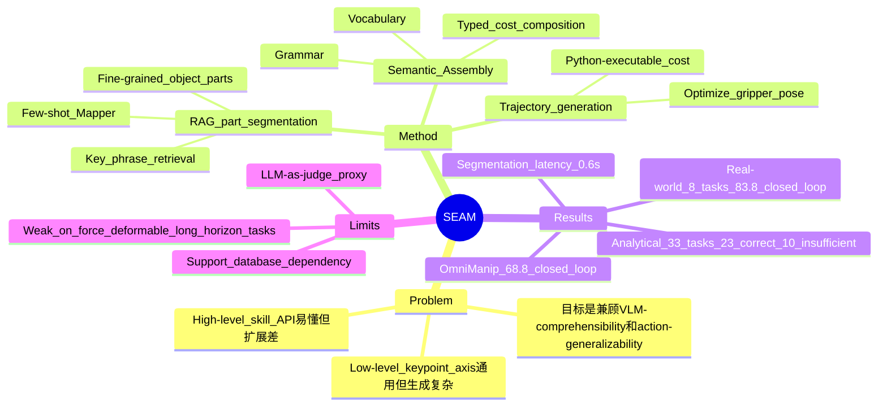

## Summary
本文重新审视 VLM-based robot manipulation 中的 intermediate representation，指出 high-level skill API 与 low-level keypoint/axis constraint 分别卡在 action-generalizability 与 VLM-comprehensibility 上。作者提出 SEAM（Semantic Assembly），用语义化 vocabulary + grammar 把 VLM 生成从自由 code generation 改成受类型约束的组合式表示，并配套 RAG-based few-shot open-vocabulary part segmentation 来定位细粒度 object parts。实验证明 SEAM 在 8 个真实机器人任务上高于 VoxPoser、CoPa、ReKep、OmniManip，但其 33-task 分析仍依赖 LLM-as-judge，且复杂工具/可变形/力控任务仍暴露不足。

## Problem & Motivation
VLM 可以把人类 instruction 翻译成 action-resolvable intermediate representation，再交给 solver 生成机器人动作，这比端到端 VLA 少一些大规模 action annotation 负担。已有 high-level representation（如 predefined skill words）语义清楚、VLM 容易生成，但每遇到新任务就要手工加 skill，扩展性差；low-level representation（keypoint、axis、geometric constraints）动作表达更通用，却要求 VLM 生成复杂约束和 cost，容易出错。本文的核心问题是：能否设计一种既让 VLM 容易理解/生成，又能覆盖多样 unseen manipulation tasks 的中间表示。

## Method
SEAM 的设计借鉴 context-free grammar，但作者明确为了可读性牺牲严格形式化：把 intermediate representation 表示为 vocabulary `V` 与 grammar `G`，其中 vocabulary 是语义化操作，grammar 是类型化组合规则。核心 vocabulary 包括 `get_axis`、`get_centroid`、`get_height`、`move_cost`、`parallel_cost`、`perpendicular_cost`、`rotate_cost`、`orbit_cost`、`gripper_close`、`gripper_open`、`get_gripper_pos` 等；grammar 用 `pt`、`vec`、`cost` 等类型约束组合，目标是减少 VLM 输出无效表达。

系统 pipeline 是：输入视觉 observation 与 task instruction，VLM 先按 SEAM vocabulary/grammar 生成 intermediate representation；随后通过 RAG database 检索目标 object part 的 support image/mask，用 few-shot segmentation network Mapper 将 support mask 映射到 query image；最后把 SEAM 表达式执行成 numerical cost，并优化 gripper target rotation/translation 来最小化该 cost，同时用平移与旋转 regularization 鼓励较小动作。

开放词汇 part segmentation 是方法里的关键补丁。数据库 `D={(K_i, P_i)}` 中，`K_i` 是 object-part key phrases（如 cup opening / cup rim / cup edge），`P_i` 是 support image 与 binary support mask；检索时用 Levenshtein distance 匹配 instruction description 与 key phrase，再由 Mapper 做 few-shot mask prediction。作者用 Qwen3-VL-30B-A22B 作为 VLM，在 A100 上部署；机器人平台是 UR5 + gripper，视觉由两台 Intel RealSense D435 提供。

## Key Results
**Real-world 8-task manipulation benchmark:** 每个任务 10 次随机初始化 trials，SEAM closed-loop 平均成功率 **83.8%**，open-loop **63.8%**；最强 baseline OmniManip 为 closed-loop **68.8%**、open-loop **52.5%**，所以 closed-loop 总体提升为 **+15.0 percentage points**。其他 baseline 总体结果为 VoxPoser **18.6%**、CoPa **28.8%**；ReKep 因部分 articulated/non-prehensile 任务未报告，总表中未给 total。

**Per-task examples:** SEAM closed-loop 在 `Press the red button` 达到 **10/10**，在 `Pick up cup/bowl onto the dish` 与 `Close the drawer` 达到 **9/10**，在 `Fit the lid onto the teapot`、`Open the drawer`、`Open the jar` 等需要 part localization 或 articulation 的任务上分别为 **7/10**、**8/10**、**8/10**。这些结果支持作者的主张：SEAM + fine-grained part segmentation 对 teapot opening、drawer handle、button 等局部目标更有帮助。

**Open-vocabulary part segmentation comparison:** 在作者的 segmentation latency comparison 中，SEAM 用时 **0.6 sec.**，快于 LISA **0.9 sec.**、OV-Seg **10.2 sec.**、Grounded SAM **0.88 sec.**。定性结果显示 LISA、OV-Seg、Grounded SAM2 经常分到 whole object、背景或粗粒度区域，而 SEAM 的 RAG+few-shot segmentation 更能定位 button、doorbell、hammer cap、key ring、pen cap 等 manipulation-relevant parts。

**33-task Action-Generalizability / VLM-Comprehensibility analytical benchmark:** 作者定义 `AG = 1 - |V|/T`，其中 `T=33`，并用 DeepSeek 判断 Qwen3-VL 生成的 intermediate representation 是否足以完成任务。论文正文 Figure 8 给出趋势但未在正文文字中列出具体图上数值；appendix 中 SEAM 的 DeepSeek evaluation 显示 **23/33 CORRECT**、**10/33 INSUFFICIENT**，不足集中在 LEGO 精细对齐、flip pancake、scoop rice、stir soup、hammer nail、screw lightbulb、pour water、uncoil rope、fold washcloth、route cable。

## Strengths & Weaknesses
**已知 Strengths**
- 问题 formulation 有价值：把中间表示拆成 VLM-comprehensibility 与 action-generalizability，比单纯比较 robot success rate 更接近机制解释。
- SEAM 的 representation bias 简洁：不是继续扩 high-level skill list，也不是让 VLM 写任意 low-level code，而是让 VLM 在少量语义化 primitive 上组合，适合我们关注的 VLM/embodied reasoning。
- 实验覆盖了真实机器人 8 个任务、part segmentation 对比、以及 33-task analytical study；real-world main result 的 **83.8% vs 68.8%** 是有实际信号的。
- 作者没有只报成功案例，appendix 中的 LLM-as-judge 输出暴露了 SEAM 对可变形物体、连续轨迹、力/接触丰富任务的不足。

**已知 Weaknesses / Caveats**
- 33-task VLM-comprehensibility 不是物理仿真或真实执行，而是 DeepSeek 对生成 representation 的判定；这可以作为 proxy，但不能等价于 robot success。
- 真实机器人 benchmark 规模仍小：8 个任务、每任务 10 trials，且主要是 single-arm、non-tactile、non-force-feedback 设置；复杂双臂、力控、长时程任务没有被充分验证。
- RAG-based part segmentation 依赖预建 support image/mask database；若目标 part 没有合适 support，或 language phrase 与 key phrase mismatch，系统边界还不清楚。
- 论文声称 SEAM balancing AG/VC，但正文没有给 Figure 8 的可复核数值表；可读结论强于可复算证据。

**推测**
- 这条路线对 GUI agent 也有类比价值：GUI action representation 也在 high-level API（稳定但封闭）与 low-level coordinate/click constraint（通用但难生成）之间摇摆，SEAM 的 typed semantic assembly 可能启发 GUI 操作 DSL 设计。
- 对 embodied agent 来说，真正的难点可能不在 vocabulary 数量，而在 primitive 是否有足够好的 perceptual grounding 与 closed-loop execution feedback；SEAM 的成功部分很大程度上来自 representation 与 part segmentation 的共同作用。

**不知道**
- 不知道 SEAM 在未见 object category、support database 缺失、强遮挡、多物体相似部件时的 degradation 曲线。
- 不知道不同 VLM backbone 对 SEAM 的敏感性；论文使用 Qwen3-VL-30B-A22B，但没有系统展示小模型或闭源模型上的表示生成稳定性。

## Mind Map

## Notes
- 这篇值得放进“representation for action”脉络：VLA 是直接 action token，VLM-planner 是 high-level API，ReKep/OmniManip 是 low-level spatial constraint，SEAM 则把 DSL 设计本身作为研究对象。
- 对 GUI-agent 的启发不是“照搬机器人 primitive”，而是追问 GUI DSL 的 primitive 应该落在什么抽象层：`click(button)` 太封闭，`click(x,y)` 太低级，可能需要 typed semantic primitives + grounding operators。
- 后续若做 related work，可把它与 ReKep、OmniManip、VoxPoser、Instruct2Act 并列，用“VLM 生成难度 vs action expressivity”作为比较轴。
